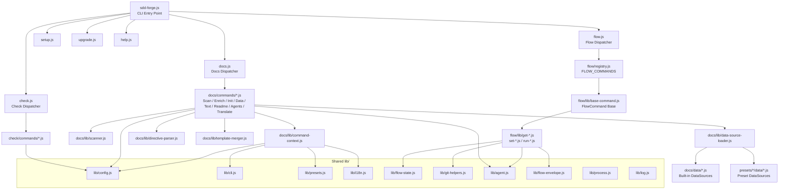

<!-- {{data("base.docs.langSwitcher", {labels: "relative"})}} -->
[日本語](ja/internal_design.md) | **English**
<!-- {{/data}} -->

# Internal Design

## Description

<!-- {{text({prompt: "Write a 1-2 sentence overview of this chapter. Include the project structure, module dependency direction, and key processing flows."})}} -->

The sdd-forge codebase follows a three-tier architecture — entry point → namespace dispatcher → command handler — with dependencies flowing strictly from outer CLI layers inward toward shared `lib/` utilities. The two primary subsystems, `docs/` and `flow/`, each implement a self-contained pipeline that converges on a common set of core helpers for configuration, AI invocation, and process management.
<!-- {{/text}} -->

## Content

### Project Structure

<!-- {{text({prompt: "Describe the project's directory structure as a tree-format code block. Include role comments for key directories and files. Generate from the actual source code structure.", mode: "deep"})}} -->

```
src/
├── sdd-forge.js              # Main CLI entry point; routes to namespace dispatchers
├── docs.js                   # Docs namespace dispatcher
├── flow.js                   # Flow namespace dispatcher (context resolution + hooks)
├── check.js                  # Check namespace dispatcher
├── setup.js                  # Interactive project setup wizard
├── upgrade.js                # Template/skill upgrade command
├── presets-cmd.js            # List available presets
├── help.js                   # Help output with LAYOUT registry
│
├── lib/                      # Shared utilities (used by all modules)
│   ├── cli.js                # PKG_DIR, repoRoot(), parseArgs(), isInsideWorktree()
│   ├── config.js             # Config loading, .sdd-forge path helpers, validateConfig()
│   ├── entrypoint.js         # isDirectRun(), runIfDirect() pattern
│   ├── exit-codes.js         # EXIT_ERROR / EXIT_SUCCESS constants
│   ├── agent.js              # AI agent invocation with stdio control
│   ├── flow-state.js         # Flow state persistence and phase derivation
│   ├── flow-envelope.js      # ok() / fail() JSON envelope helpers
│   ├── git-helpers.js        # git and gh command wrappers
│   ├── i18n.js               # 3-tier domain-namespaced i18n resolver
│   ├── log.js                # Logger singleton
│   ├── presets.js            # Preset discovery and parent-chain resolution
│   ├── types.js              # Config and output type validation
│   ├── skills.js             # Skill file deployment helpers
│   ├── process.js            # runCmd(), assertOk() subprocess helpers
│   ├── progress.js           # Progress bar and structured logging
│   └── json-parse.js         # Safe JSON parsing utility
│
├── docs/                     # Documentation generation subsystem
│   ├── commands/             # One file per docs subcommand
│   │   ├── scan.js           # Analyse source → analysis.json
│   │   ├── enrich.js         # AI-enrich analysis (summary, chapter, role)
│   │   ├── init.js           # Template inheritance merge → docs/
│   │   ├── data.js           # Expand {{data}} directives
│   │   ├── text.js           # AI text generation for {{text}} directives
│   │   ├── readme.js         # Generate README.md
│   │   ├── agents.js         # Generate AGENTS.md
│   │   ├── translate.js      # Multi-language translation
│   │   ├── changelog.js      # Generate CHANGELOG.md
│   │   └── review.js         # AI review of generated docs
│   ├── data/                 # Built-in DataSource implementations
│   │   ├── project.js        # Project metadata
│   │   ├── docs.js           # Docs structure
│   │   ├── agents.js         # Agent definitions
│   │   └── lang.js           # Language link utilities
│   └── lib/                  # Docs engine internals
│       ├── command-context.js # Shared context resolution for all docs commands
│       ├── scanner.js        # File collection and chunking
│       ├── data-source.js    # DataSource base class
│       ├── data-source-loader.js # Load DataSources from preset chain
│       ├── directive-parser.js   # Parse {{}} template directives
│       ├── template-merger.js    # Merge templates via preset inheritance
│       ├── chapter-resolver.js   # Map analysis entries to chapters
│       └── lang/             # Language-specific AST handlers (JS, PHP, Python, YAML)
│
├── flow/                     # SDD workflow subsystem
│   ├── flow.js               # Internal flow dispatcher
│   ├── registry.js           # FLOW_COMMANDS: centralised command metadata
│   ├── lib/                  # Flow action implementations
│   │   ├── base-command.js   # FlowCommand base class with lifecycle hooks
│   │   ├── phases.js         # VALID_PHASES constants
│   │   ├── get-*.js          # Read-only flow state queries
│   │   ├── set-*.js          # Flow state mutation commands
│   │   └── run-*.js          # Complex multi-step actions
│   └── commands/             # Higher-level flow entry points (merge, review, report)
│
├── check/
│   └── commands/             # Config, freshness, and scan-result checks
│
├── presets/                  # Framework-specific preset library (50+ presets)
│   ├── base/                 # Root preset; all others inherit from here
│   ├── webapp/, js-webapp/   # Web application preset chain
│   ├── cli/, node-cli/       # CLI preset chain
│   ├── library/, database/   # Library and database preset chains
│   └── [hono, nextjs, laravel, drizzle, …]  # Leaf presets
│
├── locale/
│   ├── en/                   # English UI strings
│   └── ja/                   # Japanese UI strings
│
└── templates/
    └── partials/             # Reusable template include fragments
```
<!-- {{/text}} -->

### Module Composition

<!-- {{text({prompt: "List the major modules in table format. Include module name, file path, and responsibility. Extract from import/require relationships and exports in each file.", mode: "deep"})}} -->

| Module | File Path | Responsibility |
|---|---|---|
| CLI Entry Point | `src/sdd-forge.js` | Parses top-level command, initialises logger, dispatches to namespace modules |
| Docs Dispatcher | `src/docs.js` | Routes `docs <subcommand>` to individual command scripts; executes the full pipeline for `docs build` |
| Flow Dispatcher | `src/flow.js` | Resolves flow context, parses CLI arguments, invokes registry entries with pre/post hooks |
| Check Dispatcher | `src/check.js` | Routes `check <subcommand>` to config/freshness/scan check scripts |
| Flow Registry | `src/flow/registry.js` | Central `FLOW_COMMANDS` object; declares args schema, lazy command imports, and lifecycle hooks for every flow action |
| FlowCommand Base | `src/flow/lib/base-command.js` | Abstract base class providing `async run()` with validation and error handling for all flow actions |
| Command Context | `src/docs/lib/command-context.js` | Resolves and validates the shared context object (root, config, lang, agent) consumed by every docs command |
| Config Loader | `src/lib/config.js` | Reads and validates `.sdd-forge/config.json`; provides path helpers for the `.sdd-forge/` directory |
| CLI Utilities | `src/lib/cli.js` | Exports `PKG_DIR`, `repoRoot()`, `parseArgs()`, and `isInsideWorktree()` |
| Entrypoint Helper | `src/lib/entrypoint.js` | Provides `runIfDirect()` so command files can serve as both importable modules and standalone executables |
| AI Agent | `src/lib/agent.js` | Spawns AI agent processes with controlled stdio; used by enrich, text, review, and flow actions |
| Flow State | `src/lib/flow-state.js` | Reads and writes `flow.json`; derives the current phase from step statuses |
| Flow Envelope | `src/lib/flow-envelope.js` | Produces consistent `ok()` / `fail()` JSON output consumed by the flow dispatcher |
| Preset Resolver | `src/lib/presets.js` | Auto-discovers presets under `src/presets/` and resolves the full parent-chain for a given type |
| i18n | `src/lib/i18n.js` | 3-tier domain-namespaced localisation; resolves strings from locale files with fallback |
| Scanner | `src/docs/lib/scanner.js` | Collects source files by extension and preset rules; chunks large files for AI processing |
| DataSource Loader | `src/docs/lib/data-source-loader.js` | Loads and merges DataSource implementations from the full preset inheritance chain |
| Directive Parser | `src/docs/lib/directive-parser.js` | Parses `{{data}}` and `{{text}}` template directives from markdown documents |
| Template Merger | `src/docs/lib/template-merger.js` | Merges chapter templates from the preset chain via the `parent` relationship |
| Git Helpers | `src/lib/git-helpers.js` | Wraps `git` and `gh` CLI calls used by flow commands for branch, commit, and PR operations |
<!-- {{/text}} -->

### Module Dependencies

<!-- {{text({prompt: "Generate a mermaid graph showing inter-module dependencies. Analyze import/require statements in the source code and show the layer structure and dependency direction. Output only the mermaid code block.", mode: "deep"})}} -->


<!-- {{/text}} -->

### Key Processing Flows

<!-- {{text({prompt: "Describe the inter-module data and control flow when running a representative command in numbered steps. Include the flow from entry point to final output.", mode: "deep"})}} -->

The following steps trace the execution of `sdd-forge docs text`, which generates AI-written prose for `{{text}}` directives in documentation templates.

1. **`src/sdd-forge.js`** receives `["docs", "text", ...flags]` from `process.argv`. It matches the `docs` namespace and delegates the remaining arguments to `src/docs.js`.
2. **`src/docs.js`** looks up `"text"` in its subcommand map, resolves the absolute path to `src/docs/commands/text.js`, patches `process.argv`, and dynamically imports the file.
3. **`src/docs/commands/text.js`** calls `resolveCommandContext()` from `src/docs/lib/command-context.js`, which reads `.sdd-forge/config.json` via `lib/config.js`, loads the preset chain via `lib/presets.js`, resolves the output language, and constructs the shared `ctx` object.
4. **`text.js`** reads the target documentation directory and collects all markdown files containing unresolved `{{text}}` directives. `src/docs/lib/directive-parser.js` parses each directive to extract the prompt string and generation mode (`deep` or `light`).
5. For each directive, **`text.js`** calls `src/docs/lib/text-prompts.js` to assemble an AI prompt that includes the directive's instruction, surrounding document context, and relevant analysis data loaded by `src/docs/lib/data-source-loader.js`.
6. **`src/lib/agent.js`** spawns the configured AI agent process, streams the assembled prompt, and captures the JSON response.
7. The generated text is written back into the markdown file at the exact position of the `{{text}}` directive, replacing only the content between the opening and closing tags while preserving the surrounding document structure.
8. Progress is reported throughout via `src/lib/progress.js`, and any errors cause a non-zero exit via `src/lib/exit-codes.js`.
<!-- {{/text}} -->

### Extension Points

<!-- {{text({prompt: "Describe the locations that need changes and extension patterns when adding new commands or features. Derive from plugin points and dispatch registration patterns in the source code.", mode: "deep"})}} -->

**Adding a new `docs` subcommand**

Create a new file in `src/docs/commands/<name>.js` following the existing command pattern: import `resolveCommandContext` from `docs/lib/command-context.js`, define an `async function main(ctx)`, export it, and call `runIfDirect(import.meta.url, main)` at module level. Then register the subcommand name → file path mapping in `src/docs.js`'s subcommand table. If the command needs a new DataSource, add a file under `src/docs/data/` or the appropriate preset's `data/` directory and export a class extending `DataSource`.

**Adding a new `flow` action**

Create a new file in `src/flow/lib/<group>-<action>.js` that exports a default class extending `FlowCommand` and implements the `execute(ctx)` method. Register the action in `src/flow/registry.js` under the correct group key, providing `helpKey`, the lazy import (`command: () => import(...)`), the `args` schema (positionals, flags, and options), and any lifecycle hooks (`pre`, `post`, `onError`, `finally`). No changes to the dispatcher (`src/flow.js`) are required because it reads the registry dynamically.

**Adding a new top-level command**

Create `src/<name>.js` with the standard `main` + `runIfDirect` pattern. Add a new `case` branch in `src/sdd-forge.js`'s dispatch block and a corresponding entry in the `LAYOUT` array in `src/help.js` so the command appears in help output.

**Adding a new preset**

Create a directory under `src/presets/<name>/` containing `preset.json` (with a `parent` field pointing to an existing preset), and optionally `data/`, `scan/`, and `templates/` subdirectories. The preset is auto-discovered by `src/lib/presets.js` at runtime — no manual registration is needed.
<!-- {{/text}} -->

---

<!-- {{data("base.docs.nav")}} -->
[← Configuration and Customization](configuration.md)
<!-- {{/data}} -->
