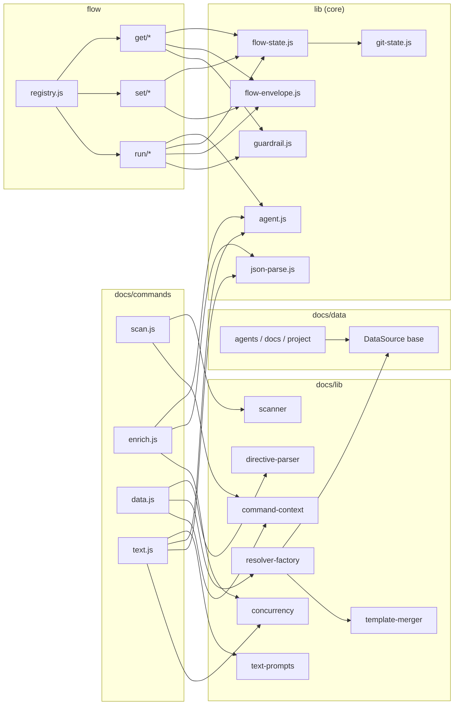

<!-- {{data("base.docs.langSwitcher", {labels: "relative"})}} -->
**English** | [日本語](ja/internal_design.md)
<!-- {{/data}} -->

# Internal Design

## Description

<!-- {{text({prompt: "Write a 1-2 sentence overview of this chapter. Include the project structure, module dependency direction, and key processing flows."})}} -->

This chapter documents the internal structure of sdd-forge, organized into three layers: CLI entry-point commands, domain-specific processing libraries, and shared core utilities. Dependencies flow strictly downward — commands depend on libraries, libraries depend on core utilities — with two main pipelines: a documentation build pipeline (`scan → enrich → data → text`) and a Spec-Driven Development flow pipeline dispatched through a central registry in `src/flow/registry.js`.
<!-- {{/text}} -->

## Content

### Project Structure

<!-- {{text({prompt: "Describe the project's directory structure as a tree-format code block. Include role comments for key directories and files. Generate from the actual source code structure.", mode: "deep"})}} -->

```
src/
├── docs/
│   ├── commands/              # CLI entry points for each doc pipeline step
│   │   ├── scan.js            # Scans source files, writes analysis.json
│   │   ├── enrich.js          # AI-powered annotation of analysis entries
│   │   ├── data.js            # Resolves {{data}} directives in chapter files
│   │   └── text.js            # Fills {{text}} directives via AI agent
│   ├── data/                  # DataSource implementations for {{data}} directives
│   │   ├── agents.js          # SDD template and agent config metadata
│   │   ├── docs.js            # Chapter list, nav links, language switcher
│   │   ├── lang.js            # Language navigation links
│   │   ├── project.js         # Project name, description, version from package.json
│   │   └── text.js            # Placeholder DataSource stub
│   └── lib/                   # Shared doc-generation utilities
│       ├── directive-parser.js    # Parses and resolves {{data}}/{{text}} directives
│       ├── resolver-factory.js    # Builds DataSource resolver from preset chain
│       ├── data-source.js         # Base class for all DataSource implementations
│       ├── data-source-loader.js  # Dynamically imports DataSource modules from disk
│       ├── scanner.js             # File traversal, glob matching, hash computation
│       ├── template-merger.js     # Merges templates across preset inheritance chains
│       ├── text-prompts.js        # AI prompt builders for {{text}} directives
│       ├── minify.js              # Source code minification for AI context window
│       ├── lang-factory.js        # Maps file extensions to language handlers
│       ├── lang/                  # Per-language parsers: js.js, php.js, py.js, yaml.js
│       ├── command-context.js     # Resolves shared context (root, config, agent, lang)
│       ├── concurrency.js         # Bounded async concurrency pool
│       ├── analysis-entry.js      # AnalysisEntry base class and category utilities
│       ├── analysis-filter.js     # Filters entries by docs.exclude patterns
│       └── chapter-resolver.js    # Maps analysis categories to chapter files
├── flow/
│   ├── registry.js            # Dispatch table mapping command names to handler modules
│   ├── get/                   # Read-only flow query commands
│   │   ├── check.js           # Prerequisite checks (impl, dirty, gh)
│   │   ├── context.js         # File retrieval and keyword-based entry search
│   │   ├── guardrail.js       # Loads guardrail articles filtered by phase
│   │   ├── prompt.js          # Returns built-in prompt/choice definitions
│   │   ├── qa-count.js        # Returns QA question count from flow state
│   │   └── resolve-context.js # Full flow context envelope for skill scripts
│   ├── set/                   # Flow state mutation commands
│   │   ├── step.js            # Sets a step's lifecycle status
│   │   ├── req.js             # Updates a requirement's status by index
│   │   ├── metric.js          # Increments named counters in flow metrics
│   │   ├── note.js            # Appends a timestamped note to flow state
│   │   ├── redo.js            # Manages redo log (redolog.json)
│   │   ├── request.js         # Stores the original feature request text
│   │   └── summary.js         # Persists requirements array from JSON input
│   └── run/                   # Stateful flow execution commands
│       ├── gate.js            # Spec quality gate (heuristic rules + AI guardrail)
│       ├── impl-confirm.js    # Confirms implementation readiness against requirements
│       └── retro.js           # AI retrospective comparing diff to requirements
└── lib/                       # Core shared utilities (used by both docs and flow)
    ├── agent.js               # Claude CLI invocation: sync, async, retry, stdin fallback
    ├── flow-envelope.js       # ok/fail/warn JSON envelope factory for flow output
    ├── flow-state.js          # flow.json read/write, active flow tracking, step lifecycle
    ├── guardrail.js           # Article parsing, phase/scope filtering, preset merging
    ├── git-state.js           # Dirty check, branch, ahead count, last commit helpers
    ├── i18n.js                # Locale loading, deep merge, namespaced key translation
    ├── json-parse.js          # Lenient JSON repair for malformed AI output
    ├── lint.js                # Guardrail lint phase runner against changed files
    ├── progress.js            # ANSI spinner/progress bar and prefixed logger factory
    ├── include.js             # Template include directive processor with path security
    ├── skills.js              # Deploys SKILL.md files to .agents/ and .claude/
    └── process.js             # Thin spawnSync wrapper with uniform result shape
```
<!-- {{/text}} -->

### Module Composition

<!-- {{text({prompt: "List the major modules in table format. Include module name, file path, and responsibility. Extract from import/require relationships and exports in each file.", mode: "deep"})}} -->

| Module | File Path | Responsibility |
| --- | --- | --- |
| scan | `src/docs/commands/scan.js` | Loads DataSources from preset chain, collects and hashes source files, writes `analysis.json` |
| enrich | `src/docs/commands/enrich.js` | Batches analysis entries, calls AI to annotate each with summary, detail, chapter, and keywords |
| data | `src/docs/commands/data.js` | Resolves `{{data(...)}}` directives in chapter files using a DataSource resolver |
| text | `src/docs/commands/text.js` | Fills `{{text(...)}}` directives by building batch AI prompts and applying JSON responses |
| DataSource (base) | `src/docs/lib/data-source.js` | Base class providing `toMarkdownTable()`, `desc()`, and override-merge helpers |
| resolver-factory | `src/docs/lib/resolver-factory.js` | Instantiates per-preset DataSource chains and exposes a unified `resolve()` interface |
| directive-parser | `src/docs/lib/directive-parser.js` | Parses `{{data}}`, `{{text}}`, and block directives; replaces content ranges in chapter files |
| template-merger | `src/docs/lib/template-merger.js` | Resolves chapter templates across the preset inheritance chain with block-merge semantics |
| scanner | `src/docs/lib/scanner.js` | File traversal, glob-to-regex matching, MD5 hashing, and per-language parse dispatch |
| text-prompts | `src/docs/lib/text-prompts.js` | Builds system prompts, per-directive prompts, and multi-directive batch prompts for AI calls |
| flow/registry | `src/flow/registry.js` | Central dispatch table mapping `group/subcommand` strings to lazy-loaded handler modules |
| flow-state | `src/lib/flow-state.js` | Reads/writes `flow.json`, tracks active flows in `.sdd-forge/.active-flow`, and manages step lifecycle |
| flow-envelope | `src/lib/flow-envelope.js` | Constructs structured `ok`/`fail`/`warn` envelopes serialized to stdout by all flow commands |
| agent | `src/lib/agent.js` | Invokes the Claude CLI synchronously or asynchronously with configurable retry and stdin fallback |
| guardrail | `src/lib/guardrail.js` | Parses, filters by phase/scope, and merges guardrail articles from preset and project sources |
| i18n | `src/lib/i18n.js` | Loads and deep-merges locale JSON files from package, preset, and project tiers; interpolates `{{param}}` |
| json-parse | `src/lib/json-parse.js` | Character-level repair of malformed AI JSON (trailing commas, single quotes, Markdown fences) |
<!-- {{/text}} -->

### Module Dependencies

<!-- {{text({prompt: "Generate a mermaid graph showing inter-module dependencies. Analyze import/require statements in the source code and show the layer structure and dependency direction. Output only the mermaid code block.", mode: "deep"})}} -->


<!-- {{/text}} -->

### Key Processing Flows

<!-- {{text({prompt: "Describe the inter-module data and control flow when running a representative command in numbered steps. Include the flow from entry point to final output.", mode: "deep"})}} -->

The following steps trace a `sdd-forge docs build` invocation from entry point to final output:

1. **Dispatch** — `sdd-forge.js` reads `.sdd-forge/config.json` to determine project type, source root, and agent configuration, then delegates to the `docs build` subcommand.
2. **scan** — `docs/commands/scan.js` resolves the preset chain for the configured type, loads DataSource modules from each preset's `data/` directory via `data-source-loader.js`, and calls `collectFiles()` in `scanner.js` to enumerate matching source files. MD5 hashes are compared against an existing `analysis.json` to skip unchanged entries, and the merged result is written to `.sdd-forge/output/analysis.json`.
3. **enrich** — `docs/commands/enrich.js` reads `analysis.json`, groups entries by category, and splits them into token-limited batches. Each batch is sent to the AI agent via `agent.js` using `mapWithConcurrency()` from `concurrency.js`. Responses are repaired with `json-parse.js` and merged back, adding `summary`, `detail`, `chapter`, `role`, and `keywords` fields to each entry. Progress is saved incrementally after each batch.
4. **data** — `docs/commands/data.js` calls `createResolver()` in `resolver-factory.js`, which instantiates DataSource classes from the full preset chain. For every chapter file returned by `getChapterFiles()`, `directive-parser.js` locates each `{{data(...)}}` block, invokes the matching DataSource method, and replaces the block content with the rendered Markdown output. Changed files are written back to disk.
5. **text** — `docs/commands/text.js` calls `getEnrichedContext()` in `text-prompts.js` to extract the analysis entries assigned to the current chapter. It constructs a single batch prompt listing all unfilled `{{text(...)}}` directives, submits it to the AI agent, parses the JSON response via `parseBatchJsonResponse()`, and applies fills with `applyBatchJsonToFile()`, validating against shrinkage thresholds before saving.
6. **readme** — The `readme` command reads all completed chapter files, assembles navigation and language-switcher data via the `docs` and `lang` DataSources, and renders the final `README.md`.
<!-- {{/text}} -->

### Extension Points

<!-- {{text({prompt: "Describe the locations that need changes and extension patterns when adding new commands or features. Derive from plugin points and dispatch registration patterns in the source code.", mode: "deep"})}} -->

**Adding a new documentation pipeline command:**
Create a module in `src/docs/commands/` that exports a `main(ctx)` function. Use `resolveCommandContext()` from `docs/lib/command-context.js` to obtain the standardized context object (root, config, agent, lang, docsDir). Call `runIfDirect(import.meta.url, main)` at the bottom for direct execution support. Register the new command in the top-level `docs.js` dispatcher alongside the existing `scan`, `enrich`, `data`, `text`, and `forge` entries.

**Adding a new DataSource:**
Create a class in `src/docs/data/` (or a preset-specific `data/` subdirectory) that extends `DataSource` from `docs/lib/data-source.js`. Each public method receives `(analysis, labels)` and should return a string or `null`. The `data-source-loader.js` discovers and instantiates any `.js` file in those directories automatically — no registration is required. Use `toMarkdownTable(rows, headers)` for consistent Markdown table output.

**Adding a new flow command:**
Add a handler module under `src/flow/get/`, `src/flow/set/`, or `src/flow/run/` exporting an `execute(ctx)` function. Register it in `src/flow/registry.js` under the appropriate group key, providing `helpKey`, `requiresFlow`, optional `before`/`after` lifecycle hooks, and a lazy `execute: () => import('./path')` dynamic import. Use `ok()`/`fail()` from `lib/flow-envelope.js` for all output, and `mutateFlowState()` or `loadFlowState()` from `lib/flow-state.js` for state access.

**Adding a new preset:**
Create a directory under `src/presets/` containing a `preset.json` with `parent`, `chapters`, and `scan` fields. Add DataSource modules to `data/` and chapter templates to `templates/<lang>/`. The preset chain resolver in `lib/presets.js` walks the `parent` hierarchy automatically when `config.type` matches the new preset's leaf name, so all existing pipeline commands inherit the new preset's data sources and templates without further changes.
<!-- {{/text}} -->

---

<!-- {{data("base.docs.nav")}} -->
[← Configuration and Customization](configuration.md)
<!-- {{/data}} -->
