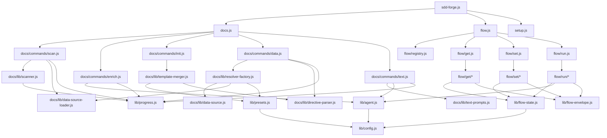

<!-- {{data("base.docs.langSwitcher", {labels: "relative"})}} -->
**English** | [日本語](ja/internal_design.md)
<!-- {{/data}} -->

# Internal Design

## Description

<!-- {{text({prompt: "Write a 1-2 sentence overview of this chapter. Include the project structure, module dependency direction, and key processing flows."})}} -->

This chapter describes the internal architecture of sdd-forge: a layered CLI package whose entry points (`sdd-forge.js`, `docs.js`, `flow.js`) dispatch to domain-specific command modules in `docs/commands/` and `flow/get|set|run/`, all of which depend on shared infrastructure in `src/lib/` — but never the reverse. The primary processing flows are the docs build pipeline (`scan → enrich → init → data → text → readme`) and the SDD workflow state machine managed through `flow-state.js` and the `flow/` dispatcher hierarchy.
<!-- {{/text}} -->

## Content

### Project Structure

<!-- {{text({prompt: "Describe the project's directory structure as a tree-format code block. Include role comments for key directories and files. Generate from the actual source code structure.", mode: "deep"})}} -->

```
src/
├── sdd-forge.js          # Main CLI entry point; routes to docs/spec/flow sub-dispatchers
├── docs.js               # `sdd-forge docs` pipeline dispatcher
├── flow.js               # `sdd-forge flow` dispatcher (→ get/set/run)
├── help.js               # Built-in help text output
├── setup.js              # Project initialization command
├── upgrade.js            # Skill and template upgrade command
├── presets-cmd.js        # `sdd-forge default` preset management
├── lib/                  # Shared infrastructure (no domain knowledge)
│   ├── agent.js          # AI agent invocation (sync + async, stdin fallback)
│   ├── cli.js            # Argument parsing, PKG_DIR, repoRoot(), sourceRoot()
│   ├── config.js         # Config loading, sddDir/sddOutputDir path helpers
│   ├── entrypoint.js     # runIfDirect() ES module direct-run guard
│   ├── flow-envelope.js  # ok/fail/warn JSON response schema for flow commands
│   ├── flow-state.js     # flow.json read/write, active-flow pointer, step mutators
│   ├── git-state.js      # Read-only git query helpers (branch, ahead count, status)
│   ├── guardrail.js      # Guardrail article parsing, phase filtering, preset loading
│   ├── i18n.js           # 3-layer locale merge (pkg → preset → project)
│   ├── include.js        # <!-- include() --> directive resolver for templates
│   ├── json-parse.js     # AI response JSON repair (recursive descent)
│   ├── lint.js           # Guardrail lint pipeline (regex vs. git diff)
│   ├── multi-select.js   # Interactive terminal select widget
│   ├── presets.js        # Preset chain resolution (leaf → base)
│   ├── process.js        # spawnSync wrapper returning normalized result
│   ├── progress.js       # ANSI progress bar, spinner, createLogger()
│   ├── skills.js         # SKILL.md deployment to .agents/skills/ + .claude/skills/
│   └── types.js          # Config schema validation
├── docs/
│   ├── commands/         # CLI commands: scan, enrich, init, data, text, forge, ...
│   ├── data/             # Built-in DataSources: agents, docs, lang, project, text
│   └── lib/
│       ├── data-source.js         # DataSource base class (toMarkdownTable, desc)
│       ├── data-source-loader.js  # Dynamic DataSource importer from data/ dirs
│       ├── directive-parser.js    # {{data()}}/{{text()}}/ template parser
│       ├── resolver-factory.js    # Resolver wiring for the data pipeline
│       ├── scanner.js             # File collection, getFileStats(), globToRegex()
│       ├── template-merger.js     # Preset template inheritance merge engine
│       ├── text-prompts.js        # LLM prompt builders for text.js
│       ├── analysis-entry.js      # Base class and utilities for analysis entries
│       ├── analysis-filter.js     # docs.exclude glob filtering for analysis data
│       ├── chapter-resolver.js    # Chapter ordering and category-to-chapter mapping
│       ├── lang/                  # Language-specific parsers (js, php, py, yaml)
│       └── ...                    # concurrency, forge-prompts, scan-source, etc.
├── flow/
│   ├── registry.js       # Central metadata map for all get/set/run subcommands
│   ├── get.js            # `flow get` dispatcher
│   ├── set.js            # `flow set` dispatcher
│   ├── run.js            # `flow run` dispatcher
│   ├── get/              # Read accessors: context, prompt, guardrail, resolve-context
│   ├── set/              # State mutators: step, req, note, metric, redo, request
│   ├── run/              # Action runners: review, sync, retro, finalize, gate
│   └── commands/         # High-level orchestration scripts called by run/*
├── presets/              # Preset definitions (base, node, php, laravel, hono, ...)
│   └── <name>/
│       ├── preset.json   # parent, scan globs, chapters order
│       ├── data/         # Preset-specific DataSource classes
│       └── templates/    # Markdown chapter templates per language
├── templates/
│   └── skills/           # SKILL.md sources deployed to .agents/skills/
└── locale/               # i18n message files (en/, ja/, ...)
```
<!-- {{/text}} -->

### Module Composition

<!-- {{text({prompt: "List the major modules in table format. Include module name, file path, and responsibility. Extract from import/require relationships and exports in each file.", mode: "deep"})}} -->

| Module | File Path | Responsibility |
| --- | --- | --- |
| Main entry | `src/sdd-forge.js` | Top-level CLI; routes `docs`, `flow`, `spec`, `setup`, `help` subcommands |
| Docs dispatcher | `src/docs.js` | Sequences the docs build pipeline and routes individual doc commands |
| Flow dispatcher | `src/flow.js` | Routes `sdd-forge flow` to `get.js`, `set.js`, or `run.js` |
| agent | `src/lib/agent.js` | Sync (`callAgent`) and async (`callAgentAsync`) AI invocation; stdin fallback for large prompts |
| cli | `src/lib/cli.js` | `parseArgs`, `repoRoot`, `sourceRoot`, `PKG_DIR`; shared by every entry point |
| config | `src/lib/config.js` | Loads `.sdd-forge/config.json`; provides `sddDir`, `sddOutputDir`, `DEFAULT_LANG` |
| entrypoint | `src/lib/entrypoint.js` | `runIfDirect()` guard replacing CommonJS `require.main === module` for ES modules |
| flow-envelope | `src/lib/flow-envelope.js` | `ok`/`fail`/`warn` factory functions and `output()` for consistent JSON API responses |
| flow-state | `src/lib/flow-state.js` | Persists `flow.json` and `.active-flow`; provides step/requirement/note mutators |
| guardrail | `src/lib/guardrail.js` | Parses guardrail articles, filters by phase, loads preset chain files |
| i18n | `src/lib/i18n.js` | 3-layer locale merge (package → preset → project); `translate()` and `createI18n()` |
| presets | `src/lib/presets.js` | `resolveChainSafe` walks the `parent` chain; `resolveMultiChains` for multi-type configs |
| progress | `src/lib/progress.js` | ANSI progress bar with animated spinner; `createLogger(prefix)` for pipeline steps |
| skills | `src/lib/skills.js` | Reads SKILL.md templates, resolves includes, deploys to `.agents/skills/` and `.claude/skills/` |
| scan | `src/docs/commands/scan.js` | Collects source files, dispatches to Scannable DataSources, writes `analysis.json` |
| enrich | `src/docs/commands/enrich.js` | Batch AI enrichment adding `summary`, `detail`, `chapter`, `role`, `keywords` to entries |
| init | `src/docs/commands/init.js` | Resolves template inheritance, optionally AI-filters chapters, writes `docs/` files |
| data | `src/docs/commands/data.js` | Replaces `{{data()}}` directives in chapter files using DataSource resolver |
| text | `src/docs/commands/text.js` | Fills `{{text()}}` directives via batch or per-directive LLM calls |
| DataSource | `src/docs/lib/data-source.js` | Base class for all `{{data}}` resolvers; `toMarkdownTable`, `desc`, `mergeDesc` helpers |
| data-source-loader | `src/docs/lib/data-source-loader.js` | Dynamically imports `.js` files from a `data/` directory and instantiates DataSources |
| directive-parser | `src/docs/lib/directive-parser.js` | Parses `{{data()}}`, `{{text()}}`, and `` directives from Markdown templates |
| resolver-factory | `src/docs/lib/resolver-factory.js` | Loads the DataSource chain for a preset type and returns a `resolve()` dispatcher |
| template-merger | `src/docs/lib/template-merger.js` | Bottom-up template merge using ``/`` with multi-chain additive mode |
| scanner | `src/docs/lib/scanner.js` | `collectFiles()` with glob matching; `getFileStats()` for MD5/line count/mtime |
| text-prompts | `src/docs/lib/text-prompts.js` | Builds system prompts, batch prompts, and enriched context for `{{text}}` generation |
| flow/registry | `src/flow/registry.js` | Single source of truth mapping all `get`/`set`/`run` keys to script paths and descriptions |
| flow/get/* | `src/flow/get/` | Read-only accessors: `context`, `prompt`, `guardrail`, `qa-count`, `resolve-context` |
| flow/set/* | `src/flow/set/` | State mutators: `step`, `req`, `note`, `metric`, `redo`, `request`, `issue`, `auto` |
| flow/run/* | `src/flow/run/` | Action runners: `review`, `sync`, `retro`, `gate`, `finalize`, `prepare-spec` |
<!-- {{/text}} -->

### Module Dependencies

<!-- {{text({prompt: "Generate a mermaid graph showing inter-module dependencies. Analyze import/require statements in the source code and show the layer structure and dependency direction. Output only the mermaid code block.", mode: "deep"})}} -->


<!-- {{/text}} -->

### Key Processing Flows

<!-- {{text({prompt: "Describe the inter-module data and control flow when running a representative command in numbered steps. Include the flow from entry point to final output.", mode: "deep"})}} -->

The following describes the control and data flow for `sdd-forge docs build`, the most representative multi-step command.

1. **Entry** — `sdd-forge.js` receives `docs build`; it resolves `SDD_WORK_ROOT` / `SDD_SOURCE_ROOT` environment variables and delegates to `docs.js`.
2. **Pipeline dispatch** — `docs.js` reads `.sdd-forge/config.json` via `lib/config.js`, then sequentially invokes the sub-commands `scan → enrich → init → data → text → readme`, passing a shared `CommandContext` object.
3. **scan** — `docs/commands/scan.js` calls `presets.js#resolveMultiChains()` to build the preset inheritance chain, dynamically imports Scannable DataSources via `data-source-loader.js`, walks source files with `scanner.js#collectFiles()`, calls `ds.parse(absPath)` per matching file, computes MD5 hashes for incremental caching, and writes `.sdd-forge/output/analysis.json`.
4. **enrich** — `docs/commands/enrich.js` reads `analysis.json`, groups un-enriched entries into line-count-bounded batches, builds an LLM prompt via `buildEnrichPrompt()`, calls `lib/agent.js#callAgentAsync()` for each batch, and merges AI-returned JSON back into entries using `mergeEnrichment()` — saving incrementally after each batch as a resume checkpoint.
5. **init** — `docs/commands/init.js` calls `template-merger.js#resolveTemplates()` to walk the preset chain bottom-up, merge `` overrides, and optionally run `aiFilterChapters()` (one LLM call) to select relevant chapters; output files are written to `docs/`.
6. **data** — `docs/commands/data.js` creates a resolver via `resolver-factory.js#createResolver()`, which loads DataSource instances for each preset in the chain and initializes them with `ctx`. For each chapter file, `resolveDataDirectives()` in `directive-parser.js` locates `{{data()}}` blocks, invokes the matching `DataSource` method, and splices the rendered Markdown in-place.
7. **text** — `docs/commands/text.js` reads chapter files, strips existing fill content with `stripFillContent()`, builds a single JSON-mode batch prompt per file via `text-prompts.js#buildBatchPrompt()` (prepending enriched context from `getEnrichedContext()`), calls `agent.js#callAgentAsync()`, parses the JSON response with `repairJson()`, and applies fills via `applyBatchJsonToFile()`.
8. **Output** — Final chapter files in `docs/` contain rendered data tables and AI-generated prose. `readme.js` then regenerates `README.md` from the chapter index.
<!-- {{/text}} -->

### Extension Points

<!-- {{text({prompt: "Describe the locations that need changes and extension patterns when adding new commands or features. Derive from plugin points and dispatch registration patterns in the source code.", mode: "deep"})}} -->

**Adding a new `sdd-forge docs` subcommand:**
- Create `src/docs/commands/<name>.js` using the `resolveCommandContext(cli)` pattern and export `main`. Guard direct execution with `runIfDirect(import.meta.url, main)` at the bottom.
- Register the command name in the dispatch table in `src/docs.js` and add a `cmdHelp.<name>` entry to `src/locale/en/ui.json`.

**Adding a new DataSource for `{{data}}` directives:**
- Create a class that extends `DataSource` and export it as `default` from a file in any preset's `data/` directory (e.g., `src/presets/<preset>/data/<name>.js`).
- No manual registration is needed: `data-source-loader.js` auto-discovers all `.js` files in `data/` directories at runtime. Methods become callable as `{{data("<preset>.<name>.<method>")}}` in Markdown templates.
- To make the source available to the common data pipeline (all presets), place it in `src/docs/data/` instead.

**Adding a new flow subcommand:**
- Create the script in `src/flow/get/<name>.js`, `src/flow/set/<name>.js`, or `src/flow/run/<name>.js`. Use `ok`/`fail` from `lib/flow-envelope.js` for output and `runIfDirect` for direct-run guarding.
- Add the entry to `src/flow/registry.js` under the corresponding `get.keys`, `set.keys`, or `run.keys` map with `script` and bilingual `desc` fields. The dispatchers (`get.js`, `set.js`, `run.js`) read this registry to build routing tables automatically.

**Adding a new preset:**
- Create `src/presets/<name>/` with a `preset.json` declaring `parent`, `scan.include`/`scan.exclude` globs, and a `chapters` array.
- Add a `data/` subdirectory for preset-specific DataSources and a `templates/<lang>/` directory for Markdown chapter templates.
- `presets.js#resolveChainSafe()` picks up the new preset automatically when `config.json` references it by leaf name.
<!-- {{/text}} -->

---

<!-- {{data("base.docs.nav")}} -->
[← Configuration and Customization](configuration.md)
<!-- {{/data}} -->
