<!-- {{data("base.docs.langSwitcher", {labels: "relative"})}} -->
**English** | [日本語](ja/internal_design.md)
<!-- {{/data}} -->

# Internal Design

## Description

<!-- {{text({prompt: "Write a 1-2 sentence overview of this chapter. Include the project structure, module dependency direction, and key processing flows."})}} -->

sdd-forge is a Node.js CLI tool (ES modules, no external dependencies) for Spec-Driven Development and automated documentation generation. It is structured around three dispatch layers — `sdd-forge.js` routes to `docs.js`, `flow.js`, or independent commands; each dispatcher routes to command modules under `docs/commands/` or `flow/get|set|run/`; and all commands share utilities from `lib/`. The primary processing flows are the docs build pipeline (`scan → enrich → init → data → text → readme → agents`) and the SDD workflow pipeline (`prepare-spec → gate → implement → review → finalize`).
<!-- {{/text}} -->

## Content

### Project Structure

<!-- {{text({prompt: "Describe the project's directory structure as a tree-format code block. Include role comments for key directories and files. Generate from the actual source code structure.", mode: "deep"})}} -->

```
src/
├── sdd-forge.js              # CLI entry point; top-level dispatcher
├── docs.js                   # docs subcommand dispatcher; orchestrates build pipeline
├── flow.js                   # flow dispatcher; routes get/set/run via registry.js
├── setup.js                  # first-time project setup wizard
├── upgrade.js                # upgrades skills and templates in place
├── lib/                      # shared utilities (used by all layers)
│   ├── cli.js                # PKG_DIR, repoRoot(), sourceRoot(), parseArgs()
│   ├── config.js             # .sdd-forge/config.json loader; path helpers
│   ├── agent.js              # AI agent invocation (spawn-based, stdin fallback)
│   ├── presets.js            # preset auto-discovery; resolveChain(); resolveMultiChains()
│   ├── flow-state.js         # flow.json persistence; FLOW_STEPS; derivePhase()
│   ├── flow-envelope.js      # ok()/fail()/warn()/output() JSON envelope
│   ├── git-state.js          # read-only git/gh state helpers
│   ├── guardrail.js          # loads and merges guardrail.json rules
│   ├── i18n.js               # 3-domain i18n (ui, messages, prompts)
│   ├── include.js            # {{include}} directive expansion
│   ├── json-parse.js         # repairJson() — tolerant JSON parser
│   ├── lint.js               # spec lint runner
│   ├── process.js            # runSync() wrapper around spawnSync
│   ├── progress.js           # pipeline progress bar; createLogger(prefix)
│   └── skills.js             # skill template deployment to .agents/skills/ and .claude/skills/
├── docs/
│   ├── commands/             # individual docs subcommand implementations
│   │   ├── scan.js           # scans source files; writes analysis.json
│   │   ├── enrich.js         # AI batch-enriches analysis entries (summary/chapter/role)
│   │   ├── init.js           # merges preset templates into docs/ chapter files
│   │   ├── data.js           # resolves {{data}} directives from analysis.json
│   │   ├── text.js           # resolves {{text}} directives via AI agent
│   │   ├── readme.js         # generates docs/README.md index
│   │   ├── forge.js          # single-shot full-pipeline runner
│   │   ├── review.js         # AI review of generated docs
│   │   ├── changelog.js      # generates CHANGELOG from git log
│   │   ├── agents.js         # generates AGENTS.md
│   │   └── translate.js      # translates docs/ to non-default languages
│   ├── data/                 # common (non-preset) DataSource implementations
│   │   ├── agents.js         # agent configuration and SDD template data
│   │   ├── docs.js           # docs directory metadata, nav, lang switcher
│   │   ├── lang.js           # language link generation
│   │   ├── project.js        # project-level metadata from package.json
│   │   └── text.js           # text generation placeholder DataSource
│   └── lib/                  # docs engine internals
│       ├── command-context.js # resolveCommandContext(); getChapterFiles()
│       ├── scanner.js        # collectFiles(); getFileStats(); parseFile()
│       ├── data-source.js    # DataSource base class; toMarkdownTable()
│       ├── data-source-loader.js # dynamically loads DataSource classes from a directory
│       ├── scan-source.js    # Scannable(Base) mixin
│       ├── resolver-factory.js # createResolver(); loads DataSources per preset chain
│       ├── directive-parser.js # parses {{data}}/{{text}}/ directives
│       ├── template-merger.js # block-level template merge;  resolution
│       ├── lang-factory.js   # getLangHandler() — extension → handler dispatch
│       ├── lang/             # language-specific handlers (js, php, py, yaml)
│       ├── minify.js         # minify() — dispatches to lang handler
│       ├── text-prompts.js   # prompt builders for {{text}} directives
│       ├── concurrency.js    # mapWithConcurrency() for parallel AI calls
│       ├── analysis-entry.js # AnalysisEntry base class; buildSummary()
│       ├── analysis-filter.js# filterAnalysisByDocsExclude()
│       └── chapter-resolver.js # category-to-chapter mapping
├── flow/
│   ├── registry.js           # FLOW_COMMANDS — dispatch table with pre/post hooks
│   ├── get/                  # read-only flow state queries
│   │   ├── check.js          # pre-flight prerequisite checks
│   │   ├── context.js        # analysis context search; increments docsRead/srcRead
│   │   ├── guardrail.js      # returns merged guardrails for current phase
│   │   ├── qa-count.js       # returns current QA question count
│   │   └── resolve-context.js# returns full flow context as JSON envelope
│   ├── set/                  # flow state mutations
│   │   ├── step.js           # updates a step status
│   │   ├── metric.js         # increments phase metrics
│   │   ├── req.js            # updates requirement status by index
│   │   ├── note.js           # appends a timestamped note
│   │   ├── redo.js           # records a redo log entry
│   │   └── summary.js        # sets requirements from JSON array
│   └── run/                  # flow action executors
│       ├── prepare-spec.js   # creates branch/worktree; initializes spec directory
│       ├── gate.js           # runs spec guardrail checks
│       ├── impl-confirm.js   # confirms implementation readiness
│       ├── lint.js           # runs lint checks against changed files
│       ├── retro.js          # post-implementation retrospective
│       └── review.js         # delegates to flow/commands/review.js via subprocess
├── presets/                  # preset packages (one directory per preset type)
│   └── <key>/
│       ├── preset.json       # parent chain, label, scan patterns, chapters order
│       ├── data/             # DataSource classes for this preset
│       ├── scan/             # scan parsers (Scannable implementations)
│       └── templates/        # chapter templates per language (en/, ja/)
├── locale/                   # i18n JSON files per domain and language
│   ├── en/                   # ui.json, messages.json, prompts.json
│   └── ja/
└── templates/
    ├── skills/               # skill SKILL.md templates (one directory per skill)
    └── partials/             # shared include fragments
```
<!-- {{/text}} -->

### Module Composition

<!-- {{text({prompt: "List the major modules in table format. Include module name, file path, and responsibility. Extract from import/require relationships and exports in each file.", mode: "deep"})}} -->

| Module | File Path | Responsibility |
| --- | --- | --- |
| CLI entry point | `src/sdd-forge.js` | Parses top-level subcommand; routes to `docs.js`, `flow.js`, or independent command scripts |
| Docs dispatcher | `src/docs.js` | Routes `docs` subcommands; orchestrates the full `build` pipeline in sequence |
| Flow dispatcher | `src/flow.js` | Resolves project context and flow state; dispatches to entries in `flow/registry.js` |
| Flow registry | `src/flow/registry.js` | Declarative map of all `flow get/set/run` commands with `execute`, `pre`, `post` hooks |
| CLI utilities | `src/lib/cli.js` | `PKG_DIR`, `repoRoot()`, `sourceRoot()`, `parseArgs()`, worktree detection |
| Config loader | `src/lib/config.js` | Loads `.sdd-forge/config.json`; provides `.sdd-forge/` path helpers |
| Agent invocation | `src/lib/agent.js` | Calls AI agents via `spawn`; handles stdin fallback for large prompts; async retry |
| Preset resolver | `src/lib/presets.js` | Auto-discovers presets from `src/presets/`; `resolveChain()`, `resolveMultiChains()` |
| Flow state | `src/lib/flow-state.js` | Persists `flow.json` under `specs/NNN/`; manages `.active-flow`; `derivePhase()` |
| Flow envelope | `src/lib/flow-envelope.js` | `ok()`, `fail()`, `warn()`, `output()` — standard JSON envelope for flow commands |
| Git state | `src/lib/git-state.js` | Read-only helpers: `getWorktreeStatus()`, `getCurrentBranch()`, `isGhAvailable()` |
| Guardrail | `src/lib/guardrail.js` | Loads and merges `guardrail.json` from preset chain and project; hydrates lint RegExp |
| i18n | `src/lib/i18n.js` | 3-domain namespace i18n (`ui`, `messages`, `prompts`); `translate()` and `createI18n()` |
| Progress logger | `src/lib/progress.js` | ANSI pipeline progress bar; `createLogger(prefix)` scoped to command name |
| Skills deployer | `src/lib/skills.js` | Resolves include directives in SKILL.md templates and writes to `.agents/skills/` and `.claude/skills/` |
| Command context | `src/docs/lib/command-context.js` | `resolveCommandContext()` — resolves root, lang, type, docsDir, agent for all docs commands |
| Scanner | `src/docs/lib/scanner.js` | `collectFiles()`, `getFileStats()`, `parseFile()`; glob-to-regex conversion |
| DataSource base | `src/docs/lib/data-source.js` | Base class for all DataSources; `toMarkdownTable()`, `mergeDesc()` |
| Scannable mixin | `src/docs/lib/scan-source.js` | `Scannable(Base)` mixin adding `match()`, `parse()`, `scan()` lifecycle methods |
| DataSource loader | `src/docs/lib/data-source-loader.js` | Dynamically imports and instantiates DataSource classes from a directory |
| Resolver factory | `src/docs/lib/resolver-factory.js` | `createResolver()` — builds per-chain DataSource maps; dispatches `preset.source.method` calls |
| Directive parser | `src/docs/lib/directive-parser.js` | Parses `{{data}}`, `{{text}}`, ``, `` directives from Markdown templates |
| Template merger | `src/docs/lib/template-merger.js` | `buildLayers()` — constructs template resolution order; block-level merge with `` |
| Lang factory | `src/docs/lib/lang-factory.js` | `getLangHandler(filePath)` — maps file extension to language handler module |
| Minify | `src/docs/lib/minify.js` | `minify()` — dispatches to lang handler; applies blank-line and trailing-whitespace removal |
| Concurrency | `src/docs/lib/concurrency.js` | `mapWithConcurrency()` — controlled parallel execution pool for AI calls |
| Text prompts | `src/docs/lib/text-prompts.js` | Builds system prompts, per-directive prompts, and batch prompts for `{{text}}` processing |
| Analysis entry | `src/docs/lib/analysis-entry.js` | `AnalysisEntry` base class; `buildSummary()`; `ANALYSIS_META_KEYS` exclusion set |
| Chapter resolver | `src/docs/lib/chapter-resolver.js` | Maps analysis categories to chapter files; `mergeChapters()` for config override |
| scan command | `src/docs/commands/scan.js` | Collects source files; runs Scannable DataSources; saves `analysis.json` with ID stability |
| enrich command | `src/docs/commands/enrich.js` | Batch-calls AI to annotate each analysis entry with `summary`, `detail`, `chapter`, `role`, `keywords` |
| data command | `src/docs/commands/data.js` | Reads `analysis.json`; resolves `{{data}}` directives via `createResolver()` |
| text command | `src/docs/commands/text.js` | Calls AI agent per `{{text}}` directive; validates result quality via shrinkage check |
| prepare-spec | `src/flow/run/prepare-spec.js` | Creates feature branch or git worktree; initializes `specs/NNN/spec.md` and flow state |
| gate | `src/flow/run/gate.js` | Validates spec against structural rules and AI guardrail checks |
| lint | `src/flow/run/lint.js` | Checks changed files against lint-phase guardrail regex patterns |
<!-- {{/text}} -->

### Module Dependencies

```mermaid
graph TD
  subgraph Entry
    CLI[sdd-forge.js]
  end

  subgraph Dispatchers
    DOCS[docs.js]
    FLOW[flow.js]
  end

  subgraph SharedLib[lib/]
    AG[agent.js]
    PS[presets.js]
    FS[flow-state.js]
    FE[flow-envelope.js]
    GR[guardrail.js]
    I18[i18n.js]
    CFG[config.js]
    PROC[process.js]
    PROG[progress.js]
  end

  subgraph DocsCommands[docs/commands/]
    SCAN[scan.js]
    ENR[enrich.js]
    INIT[init.js]
    DATA[data.js]
    TEXT[text.js]
  end

  subgraph DocsLib[docs/lib/]
    CTX[command-context.js]
    SCN[scanner.js]
    DSL[data-source-loader.js]
    DSB[data-source.js]
    RF[resolver-factory.js]
    DP[directive-parser.js]
    TM[template-merger.js]
    LF[lang-factory.js]
    MN[minify.js]
    TP[text-prompts.js]
    CC[concurrency.js]
    AE[analysis-entry.js]
  end

  subgraph Presets[presets/key/]
    PJ[preset.json]
    PDR[data/DataSource.js]
    PSC[scan/Parser.js]
    PTM[templates/]
  end

  subgraph FlowRegistry
    REG[flow/registry.js]
  end

  subgraph FlowGet[flow/get/]
    FGC[check.js]
    FGX[context.js]
    FGG[guardrail.js]
    FGR[resolve-context.js]
  end

  subgraph FlowSet[flow/set/]
    FSS[step.js]
    FSM[metric.js]
    FSQ[req.js]
  end

  subgraph FlowRun[flow/run/]
    FRP[prepare-spec.js]
    FRG[gate.js]
    FRL[lint.js]
    FRR[review.js]
  end

  CLI --> DOCS
  CLI --> FLOW
  CLI --> CFG

  DOCS --> CTX
  DOCS --> SCAN
  DOCS --> ENR
  DOCS --> INIT
  DOCS --> DATA
  DOCS --> TEXT
  DOCS --> PROG

  FLOW --> REG
  FLOW --> FS
  FLOW --> FE
  REG --> FGC
  REG --> FGX
  REG --> FGG
  REG --> FGR
  REG --> FSS
  REG --> FSM
  REG --> FSQ
  REG --> FRP
  REG --> FRG
  REG --> FRL
  REG --> FRR
  REG --> FS

  SCAN --> SCN
  SCAN --> DSL
  SCAN --> AE
  SCAN --> PS
  ENR --> AG
  ENR --> CC
  ENR --> MN
  INIT --> TM
  INIT --> PS
  DATA --> DP
  DATA --> RF
  DATA --> CTX
  TEXT --> DP
  TEXT --> TP
  TEXT --> AG
  TEXT --> CC

  CTX --> CFG
  CTX --> AG
  CTX --> I18
  SCN --> LF
  LF --> MN
  DSL --> DSB
  RF --> DSL
  RF --> PS
  RF --> DSB
  TM --> DP
  TM --> PS

  PS --> PJ
  RF --> PDR
  SCAN --> PSC
  INIT --> PTM

  FGC --> FS
  FGX --> FS
  FGR --> FS
  FSS --> FS
  FSM --> FS
  FSQ --> FS
  FRG --> GR
  FRL --> GR
  FRP --> PROC
  GR --> PS
  AG --> PROC
```

<!-- {{text({prompt: "Generate a mermaid graph showing inter-module dependencies. Analyze import/require statements in the source code and show the layer structure and dependency direction. Output only the mermaid code block.", mode: "deep"})}} -->


<!-- {{/text}} -->

### Key Processing Flows

<!-- {{text({prompt: "Describe the inter-module data and control flow when running a representative command in numbered steps. Include the flow from entry point to final output.", mode: "deep"})}} -->

The following steps trace the control and data flow for `sdd-forge docs build`, the primary documentation generation command.

1. **Entry**: `sdd-forge.js` reads `process.argv`, identifies `docs build`, and dynamically imports `docs.js`.
2. **Context resolution**: `docs.js` calls `resolveCommandContext()` from `command-context.js`. This calls `repoRoot()` (checking `SDD_WORK_ROOT` / `SDD_SOURCE_ROOT` env vars), loads `.sdd-forge/config.json` via `loadJsonFile()` and `validateConfig()`, resolves the AI agent config via `resolveAgent()`, and returns a `CommandContext` object (`root`, `srcRoot`, `config`, `lang`, `type`, `docsDir`, `agent`).
3. **Scan** (`scan.js`): `collectFiles()` walks the source tree using glob patterns from `preset.json` `scan.include`/`scan.exclude`. `resolveMultiChains()` builds the preset inheritance chain and `loadDataSources()` dynamically imports all DataSource classes from each preset's `data/` directory. For each file, the matching DataSource's `parse(absPath)` produces an `AnalysisEntry`. Changed files are detected via MD5 hash comparison against the existing `analysis.json`. Results are written to `.sdd-forge/output/analysis.json`.
4. **Enrich** (`enrich.js`): `analysis.json` is loaded. Entries without `summary`/`chapter`/`role` are collected via `collectEntries()` and split into token-limited batches by `splitIntoBatches()`. Each batch is submitted to the AI agent asynchronously via `callAgentAsync()` through `mapWithConcurrency()`. The JSON response is repaired with `repairJson()` and validated against known chapter names. Enriched fields are merged back into the in-memory analysis object and saved incrementally to disk after each batch.
5. **Init** (`init.js`): `buildLayers()` constructs a priority-ordered array of template directories (project-local → leaf preset → parent presets → base). For each chapter file, `` declarations are followed and `` regions are merged bottom-up. The resulting Markdown is written to `docs/`.
6. **Data** (`data.js`): `analysis.json` is loaded and filtered by `docs.exclude` config. `createResolver(type, root)` builds a `Map<presetKey, Map<sourceName, DataSourceInstance>>` by calling `loadDataSources()` for each link in the preset chain. `resolveDataDirectives()` scans each chapter file for `<!-- {{data(...)}} -->` HTML-comment directives, calls `resolver.resolve(preset, source, method, analysis, labels)` which invokes the DataSource method, and replaces the directive body with the returned Markdown. `{{text}}` directives are skipped at this stage.
7. **Text** (`text.js`): Each chapter file is scanned for `{{text}}` directives via `parseDirectives()`. `getEnrichedContext()` from `text-prompts.js` reads enriched analysis entries for the current chapter and optionally reads and minifies source files for deep mode. `buildBatchPrompt()` assembles a single JSON-structured prompt covering all directives in the file. `callAgentAsync()` is called in parallel across files via `mapWithConcurrency()`. Responses are parsed, validated against a shrinkage threshold, and written back to the chapter files.
8. **Readme and Agents** (`readme.js`, `agents.js`): `docs/README.md` is generated as a chapter index. `AGENTS.md` is written from the `agents.project` DataSource method using metadata from `analysis.json` and `package.json`.
9. **Output**: All `docs/*.md` chapter files, `docs/README.md`, and `AGENTS.md` contain fully resolved content ready for commit.
<!-- {{/text}} -->

### Extension Points

<!-- {{text({prompt: "Describe the locations that need changes and extension patterns when adding new commands or features. Derive from plugin points and dispatch registration patterns in the source code.", mode: "deep"})}} -->

**Adding a new `docs` subcommand**

Create `src/docs/commands/<name>.js` exporting a `main(ctx)` function and calling `runIfDirect(import.meta.url, main)` at the bottom. Use `resolveCommandContext()` for project context. Register the subcommand name in the `SCRIPTS` dispatch map in `src/docs.js`. To include the command in the `build` pipeline, add a step entry in the `pipelineSteps` array in `docs.js` at the desired position.

**Adding a new `flow` subcommand**

Create `src/flow/get/<name>.js`, `src/flow/set/<name>.js`, or `src/flow/run/<name>.js` exporting `async execute(ctx)`. Return a JSON envelope via `ok()` or `fail()` from `src/lib/flow-envelope.js`. Register the entry in `FLOW_COMMANDS` in `src/flow/registry.js` under the appropriate group, providing `execute: () => import(...)` and optionally `pre`, `post` hooks. The `flow.js` dispatcher picks up the new command automatically. `pre`/`post` hooks receive `ctx` and the return value of `execute`, making them suitable for `updateStepStatus()` or `incrementMetric()` calls.

**Adding a new preset**

Create `src/presets/<key>/preset.json` with `parent`, `label`, `scan`, and `chapters` fields. The preset is auto-discovered by `discoverPresets()` in `presets.js` — no central registration is required. Add chapter templates under `templates/<lang>/`. Implement DataSource classes in `data/` extending `DataSource` or `Scannable(DataSource)`. Implement scan parsers in `scan/` extending `Scannable`. `resolveChain()` will walk the `parent` pointer to build the inheritance chain automatically.

**Adding a new language file handler**

Create `src/docs/lib/lang/<ext>.js` exporting any subset of `parse`, `minify`, `extractImports`, `extractExports`, `extractEssential`. Add the extension-to-handler mapping entry to the `EXT_MAP` object in `src/docs/lib/lang-factory.js`. The handler is then available to `scanner.js` via `parseFile()` and to `minify.js` via `minify()` without any further changes.

**Adding a new DataSource method**

Add the method to the relevant DataSource class in `src/docs/data/<name>.js` or `src/presets/<key>/data/<name>.js`. The method signature is `method(analysis, labels)` where `analysis` is the full `analysis.json` object and `labels` is a `string[]` for column headers. Reference it in a template directive as `{{data("<key>.<source>.<method>")}}`. Use `this.toMarkdownTable(rows, labels)` for tabular output.

**Adding new guardrail rules**

Add entries to `src/presets/<key>/templates/<lang>/guardrail.json` for preset-level rules, or to `.sdd-forge/guardrail.json` for project-level rules. `loadMergedGuardrails()` in `src/lib/guardrail.js` merges both sources automatically by `id` field, with project-level entries overriding preset entries. Rules with `meta.lint` set to a regex string are picked up by `flow/run/lint.js`; rules with `meta.phase: ["spec"]` are checked by `flow/run/gate.js`.
<!-- {{/text}} -->

---

<!-- {{data("base.docs.nav")}} -->
[← Configuration and Customization](configuration.md)
<!-- {{/data}} -->
