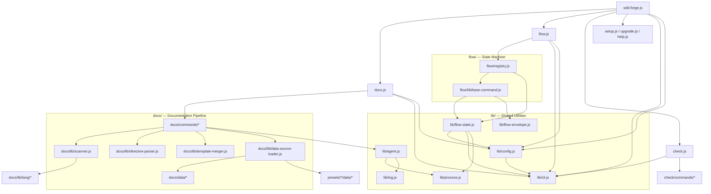

<!-- {{data("base.docs.langSwitcher", {labels: "relative"})}} -->
[日本語](ja/internal_design.md) | **English**
<!-- {{/data}} -->

# Internal Design

## Description

<!-- {{text({prompt: "Write a 1-2 sentence overview of this chapter. Include the project structure, module dependency direction, and key processing flows."})}} -->

sdd-forge follows a layered CLI architecture in which top-level dispatcher modules (`sdd-forge.js`, `docs.js`, `flow.js`) route commands inward to domain-specific subsystems in `docs/`, `flow/`, and `check/`, all backed by a shared `lib/` utility layer with dependencies flowing strictly from dispatchers toward `lib/` and never in reverse. The two primary processing paths are the documentation pipeline (`scan → enrich → init → data → text → readme → agents`) and the SDD flow state machine, whose commands are declared entirely in a single registry and executed by a generic dispatcher.
<!-- {{/text}} -->

## Content

### Project Structure

<!-- {{text({prompt: "Describe the project's directory structure as a tree-format code block. Include role comments for key directories and files. Generate from the actual source code structure.", mode: "deep"})}} -->

```
src/
├── sdd-forge.js           # Main CLI entry point; routes subcommands to dispatchers
├── docs.js                # docs subcommand dispatcher and build-pipeline orchestrator
├── flow.js                # flow subcommand dispatcher; resolves and executes registry entries
├── check.js               # check subcommand dispatcher
├── setup.js               # Interactive project setup wizard
├── upgrade.js             # Skill and template upgrade command
├── help.js                # Help display
├── presets-cmd.js         # Preset listing command
│
├── lib/                   # Shared utilities consumed by all dispatchers and subsystems
│   ├── cli.js             # repoRoot, sourceRoot, PKG_DIR, parseArgs, worktree detection
│   ├── config.js          # Load and validate .sdd-forge/config.json; path helpers
│   ├── flow-state.js      # Read/write specs/NNN/flow.json; phase derivation
│   ├── flow-envelope.js   # Structured JSON output (ok / fail / warn envelopes)
│   ├── agent.js           # Spawn AI agent process with retry and timeout
│   ├── process.js         # Low-level process execution helpers
│   ├── types.js           # SddConfig type definitions and validation
│   ├── presets.js         # Preset discovery and parent-chain resolution
│   ├── i18n.js            # Three-layer internationalization (en/ja)
│   ├── guardrail.js       # Guardrail rule validation
│   ├── git-helpers.js     # Git and gh CLI wrappers
│   ├── skills.js          # Claude Code skill deployment
│   ├── log.js             # JSONL logger singleton
│   └── ...                # (exit-codes, formatter, progress, include, json-parse, …)
│
├── docs/                  # Documentation generation subsystem
│   ├── commands/          # 11 pipeline commands: scan, enrich, init, data, text,
│   │                      #   readme, forge, review, agents, translate, changelog
│   ├── data/              # Built-in DataSources: project.js, docs.js, lang.js, agents.js
│   └── lib/               # Engine: scanner, directive-parser, template-merger,
│                          #   data-source, lang handlers (js/php/py/yaml), and more
│
├── flow/                  # SDD flow state machine
│   ├── registry.js        # Single source of truth for all flow command metadata and hooks
│   ├── lib/               # get-*, set-*, run-* subcommand implementations + base-command.js
│   └── commands/          # Composite operations: merge.js, review.js, report.js
│
├── check/
│   └── commands/          # Health-check commands: config.js, freshness.js, scan.js
│
├── presets/               # 38 framework-specific preset directories
│   └── <name>/            #   Each contains preset.json, data/, scan/, templates/
│
├── templates/             # Global skill and partial templates
└── locale/                # i18n message bundles (en/, ja/)
```
<!-- {{/text}} -->

### Module Composition

<!-- {{text({prompt: "List the major modules in table format. Include module name, file path, and responsibility. Extract from import/require relationships and exports in each file.", mode: "deep"})}} -->

| Module | File Path | Responsibility |
|---|---|---|
| CLI Entry Point | `src/sdd-forge.js` | Parses the top-level subcommand and routes to the correct dispatcher or independent command |
| Docs Dispatcher | `src/docs.js` | Routes `docs <cmd>`; orchestrates the full build pipeline with a progress bar |
| Flow Dispatcher | `src/flow.js` | Resolves flow registry entries, executes pre/post hooks, and wraps output in JSON envelopes |
| Check Dispatcher | `src/check.js` | Routes `check <cmd>` to health-check command modules |
| Flow Registry | `src/flow/registry.js` | Declares all flow commands: metadata, args spec, lazy-import reference, and lifecycle hooks |
| Flow Base Command | `src/flow/lib/base-command.js` | Abstract base class providing the `run(ctx)` interface for all flow subcommands |
| CLI Utilities | `src/lib/cli.js` | Resolves `repoRoot`, `sourceRoot`, and `PKG_DIR`; provides `parseArgs` and worktree detection |
| Config Loader | `src/lib/config.js` | Loads and validates `.sdd-forge/config.json`; exposes path helpers (`sddDir`, `sddOutputDir`) |
| Flow State | `src/lib/flow-state.js` | Reads and writes `specs/NNN/flow.json`; derives the current phase from step statuses |
| Flow Envelope | `src/lib/flow-envelope.js` | Produces structured JSON output (`ok`, `fail`, `warn`) and sets the process exit code |
| Agent Runner | `src/lib/agent.js` | Spawns the AI agent process (Claude CLI or custom provider) with retry and timeout handling |
| Type System | `src/lib/types.js` | Defines and validates the `SddConfig` schema; resolves language output settings |
| Preset Resolver | `src/lib/presets.js` | Discovers preset directories and resolves the full parent-chain for a given project type |
| Scanner | `src/docs/lib/scanner.js` | Orchestrates source-code parsing; applies preset patterns and collects analysis entries |
| Directive Parser | `src/docs/lib/directive-parser.js` | Parses `{{data}}` and `{{text}}` directives in Markdown templates |
| Template Merger | `src/docs/lib/template-merger.js` | Merges template blocks across the preset inheritance chain |
| DataSource Base | `src/docs/lib/data-source.js` | Base class defining the scanning and data-generation interface for all DataSources |
| DataSource Loader | `src/docs/lib/data-source-loader.js` | Dynamically loads the correct DataSource class for a given namespace and preset |
| Scan Command | `src/docs/commands/scan.js` | Entry point for the scan step; parses source files and writes `analysis.json` |
| Data Command | `src/docs/commands/data.js` | Expands `{{data}}` directives by invoking DataSource methods with analysis context |
| Text Command | `src/docs/commands/text.js` | Expands `{{text}}` directives by calling the AI agent for each unfilled section |
| Git Helpers | `src/lib/git-helpers.js` | Wraps `git` and `gh` CLI calls used across flow commands |
| i18n | `src/lib/i18n.js` | Three-layer message resolution: project config → CLI lang → English fallback |
| Logger | `src/lib/log.js` | Singleton that writes structured JSONL entries to disk |
<!-- {{/text}} -->

### Module Dependencies

<!-- {{text({prompt: "Generate a mermaid graph showing inter-module dependencies. Analyze import/require statements in the source code and show the layer structure and dependency direction. Output only the mermaid code block.", mode: "deep"})}} -->


<!-- {{/text}} -->

### Key Processing Flows

<!-- {{text({prompt: "Describe the inter-module data and control flow when running a representative command in numbered steps. Include the flow from entry point to final output.", mode: "deep"})}} -->

The following steps trace a `sdd-forge docs build` execution from entry point to final output.

1. `sdd-forge.js` receives the `docs` subcommand and dynamically imports `docs.js`.
2. `docs.js` calls `loadConfig(root)` via `lib/config.js` and assembles a shared `CommandContext` (via `docs/lib/command-context.js`) containing `sourceRoot`, `docsDir`, `config`, `preset`, and active language.
3. `lib/presets.js` resolves the full preset parent chain (e.g., `laravel → php-webapp → webapp → base`), merging scan patterns, DataSource registrations, and template block overrides.
4. **scan** — `docs/commands/scan.js` initialises `docs/lib/scanner.js`, routes each matching source file through the appropriate language handler (`docs/lib/lang/js.js`, `php.js`, etc.), and writes the resulting entries to `.sdd-forge/data/analysis.json`.
5. **init** — `docs/commands/init.js` runs `docs/lib/template-merger.js` to resolve and merge template blocks from the preset chain, writing skeleton chapter files into `docs/`.
6. **data** — `docs/commands/data.js` uses `docs/lib/directive-parser.js` to locate `{{data(...)}}` directives, loads the correct DataSource via `docs/lib/data-source-loader.js`, and replaces each directive with generated Markdown.
7. **text** — `docs/commands/text.js` finds unfilled `{{text(...)}}` directives and calls `lib/agent.js` for each; `agent.js` spawns the AI agent process using `stdio: ["ignore", "pipe", "pipe"]` and inserts the response back into the document.
8. **readme** — `docs/commands/readme.js` generates the top-level `docs/README.md` with chapter navigation links.
9. **agents** — `docs/commands/agents.js` generates `AGENTS.md` from agent-metadata entries in `analysis.json`.
10. Throughout the pipeline, `lib/progress.js` updates a terminal progress bar after each step and prints a completion summary on exit.
<!-- {{/text}} -->

### Extension Points

<!-- {{text({prompt: "Describe the locations that need changes and extension patterns when adding new commands or features. Derive from plugin points and dispatch registration patterns in the source code.", mode: "deep"})}} -->

**Adding a new docs pipeline command** — Create `src/docs/commands/<name>.js` exporting a `main(ctx)` function. Register the command name in the dispatch map in `src/docs.js`. To include the command as a build step, append it to the `BUILD_PIPELINE` array in `docs.js`; no other files require changes.

**Adding a new flow subcommand** — Create `src/flow/lib/<group>-<name>.js` extending `BaseCommand` (`src/flow/lib/base-command.js`) and exporting a default class with a `run(ctx)` method. Add a corresponding entry to `FLOW_COMMANDS.<group>` in `src/flow/registry.js`, specifying `helpKey`, `args`, a lazy-import `command` function (`() => import("./lib/<group>-<name>.js")`), and any `pre`, `post`, or `onError` lifecycle hooks. The dispatcher `flow.js` requires no changes; it is entirely registry-driven.

**Adding a new DataSource** — Create a class extending `DataSource` (or `ScanSource` for a combined scan and data role) in `src/presets/<preset>/data/<source>.js`. Register it in the preset's `preset.json` under the `dataSources` array. `docs/lib/data-source-loader.js` discovers and loads it automatically via the resolved preset chain.

**Adding a new preset** — Create a directory under `src/presets/<name>/` containing a `preset.json` that declares `parent`, `chapters`, `dataSources`, and scan patterns. Shared behaviour is inherited through the `parent` field; only the blocks or DataSources that differ from the parent need to be defined in the child.

**Adding a new top-level command** — Create `src/<name>.js` as a self-contained module and register it in the `INDEPENDENT` or `NAMESPACE_DISPATCHERS` map in `src/sdd-forge.js`.
<!-- {{/text}} -->

---

<!-- {{data("base.docs.nav")}} -->
[← Configuration and Customization](configuration.md)
<!-- {{/data}} -->
