# 04. Internal Design

## Description

<!-- {{text: Write a 1-2 sentence overview of this chapter. Include the project structure, module dependency direction, and key processing flows.}} -->

This chapter explains the internal architecture of sdd-forge, covering the three-layer dispatch model (`sdd-forge.js` → domain dispatchers → command implementations), the module dependency structure flowing from CLI entry points through shared libraries to preset-specific DataSources, and the key processing flows such as the `docs build` pipeline (`scan → enrich → init → data → text → readme → agents`) and the SDD workflow state machine.

<!-- {{/text}} -->

## Content

### Project Structure

<!-- {{text[mode=deep]: Describe the project's directory structure as a tree-format code block. Include role comments for key directories and files. Generate from the actual source code structure.}} -->

```
sdd-forge/
├── package.json                          # Package manifest (ES Modules, no external deps)
├── src/
│   ├── sdd-forge.js                      # CLI entry point & top-level router
│   ├── docs.js                           # docs subcommand dispatcher (build pipeline)
│   ├── spec.js                           # spec subcommand dispatcher
│   ├── flow.js                           # flow subcommand dispatcher (direct command)
│   ├── setup.js                          # Interactive project setup
│   ├── upgrade.js                        # Config migration on version upgrade
│   ├── presets-cmd.js                    # Preset listing command
│   ├── help.js                           # Help text output
│   │
│   ├── lib/                              # Shared utilities (all layers)
│   │   ├── cli.js                        # repoRoot, sourceRoot, parseArgs, PKG_DIR
│   │   ├── config.js                     # .sdd-forge/config.json loader & validators
│   │   ├── agent.js                      # AI agent invocation (sync/async, stdin fallback)
│   │   ├── presets.js                    # Preset auto-discovery & parent-chain resolution
│   │   ├── flow-state.js                # SDD flow state persistence (flow.json)
│   │   ├── i18n.js                       # 3-layer i18n (default → preset → project)
│   │   ├── types.js                      # Type alias resolution & config validation
│   │   ├── entrypoint.js                # ES Module direct-run guard (runIfDirect)
│   │   ├── process.js                    # spawnSync wrapper
│   │   ├── progress.js                  # Progress bar & logging for build pipeline
│   │   └── agents-md.js                 # AGENTS.md SDD template loader
│   │
│   ├── docs/
│   │   ├── commands/                     # Individual doc commands
│   │   │   ├── scan.js                   # Source code scanning
│   │   │   ├── enrich.js                # AI-powered analysis enrichment
│   │   │   ├── init.js                   # Template initialization from presets
│   │   │   ├── data.js                   # {{data}} directive resolution
│   │   │   ├── text.js                   # {{text}} directive resolution (LLM)
│   │   │   ├── readme.js                # README.md generation
│   │   │   ├── forge.js                  # AI-driven doc generation (multi-round)
│   │   │   ├── review.js                # Doc quality review
│   │   │   ├── changelog.js             # Changelog generation
│   │   │   ├── agents.js                # AGENTS.md generation
│   │   │   └── translate.js             # Multi-language translation
│   │   ├── data/                         # Common DataSources (all project types)
│   │   │   ├── project.js               # package.json metadata
│   │   │   ├── docs.js                   # Chapter listing & language switcher
│   │   │   ├── lang.js                   # Language navigation links
│   │   │   └── agents.js                # AGENTS.md section generation
│   │   └── lib/                          # Doc generation engine
│   │       ├── directive-parser.js       # {{data}}/{{text}} directive parser
│   │       ├── template-merger.js        # Preset template inheritance & block merge
│   │       ├── resolver-factory.js       # DataSource loader & resolve() factory
│   │       ├── data-source.js            # DataSource base class
│   │       ├── data-source-loader.js     # Dynamic DataSource module loader
│   │       ├── scan-source.js            # ScanSource base & Scannable mixin
│   │       ├── scanner.js                # File discovery, PHP/JS parsers, glob
│   │       ├── command-context.js        # Shared command context resolution
│   │       ├── concurrency.js            # Parallel execution queue
│   │       ├── text-prompts.js           # {{text}} prompt construction
│   │       ├── forge-prompts.js          # forge command prompt construction
│   │       ├── review-parser.js          # Review output parser
│   │       └── php-array-parser.js       # CakePHP array syntax parser
│   │
│   ├── spec/commands/                    # Spec commands
│   │   ├── init.js                       # Spec file scaffolding
│   │   ├── gate.js                       # Spec quality gate check
│   │   └── guardrail.js                 # Implementation guardrail validation
│   │
│   ├── flow/commands/                    # Flow commands
│   │   ├── start.js                      # SDD flow initialization
│   │   ├── status.js                     # Flow status display
│   │   ├── review.js                     # Flow review
│   │   ├── merge.js                      # Branch merge & cleanup
│   │   ├── resume.js                     # Context-recovery after compaction
│   │   └── cleanup.js                   # Worktree & branch cleanup
│   │
│   ├── presets/                          # Preset definitions
│   │   ├── base/                         # Base preset (inherited by all)
│   │   │   ├── preset.json
│   │   │   ├── data/                     # Base DataSources (package.js)
│   │   │   └── templates/{lang}/         # Base chapter templates
│   │   ├── webapp/                       # Web application arch preset
│   │   │   └── data/                     # controllers, models, tables, shells, routes
│   │   ├── cli/                          # CLI arch preset
│   │   │   └── data/                     # modules DataSource
│   │   ├── cakephp2/                     # CakePHP 2.x leaf preset
│   │   │   ├── data/                     # CakePHP-specific DataSources
│   │   │   └── scan/                     # CakePHP-specific scanners
│   │   ├── laravel/                      # Laravel leaf preset
│   │   ├── symfony/                      # Symfony leaf preset
│   │   ├── node-cli/                     # Node.js CLI leaf preset
│   │   ├── node/                         # Node.js lang preset
│   │   ├── php/                          # PHP lang preset
│   │   └── library/                      # Library arch preset
│   │
│   ├── locale/                           # i18n message files
│   │   ├── en/                           # ui.json, messages.json, prompts.json
│   │   └── ja/
│   │
│   └── templates/                        # Scaffold templates (setup)
│
└── tests/                                # Test suite
```

<!-- {{/text}} -->

### Module Composition

<!-- {{text[mode=deep]: List the major modules in table format. Include module name, file path, and responsibility. Extract from import/require relationships and exports in each file.}} -->

| Module | Path | Responsibility |
| --- | --- | --- |
| CLI Router | `src/sdd-forge.js` | Top-level command dispatch to `docs.js`, `spec.js`, `flow.js`, or standalone commands |
| Docs Dispatcher | `src/docs.js` | Orchestrates the `docs build` pipeline and routes individual doc subcommands |
| Spec Dispatcher | `src/spec.js` | Routes spec subcommands (`init`, `gate`, `guardrail`) |
| Flow Dispatcher | `src/flow.js` | Routes flow subcommands (`start`, `status`, `review`, `merge`, `resume`, `cleanup`) |
| Command Context | `src/docs/lib/command-context.js` | Resolves shared context (root, config, type, agent, i18n) for all doc commands |
| Directive Parser | `src/docs/lib/directive-parser.js` | Parses `{{data}}` / `{{text}}` directives and `@block` / `@extends` template inheritance syntax |
| Resolver Factory | `src/docs/lib/resolver-factory.js` | Loads DataSources along the preset parent chain and creates the `resolve(source, method)` interface |
| DataSource Base | `src/docs/lib/data-source.js` | Base class for `{{data}}` resolvers; provides `desc()`, `mergeDesc()`, `toMarkdownTable()` |
| Scannable Mixin | `src/docs/lib/scan-source.js` | Adds `match(file)` and `scan(files)` capabilities to DataSource classes |
| DataSource Loader | `src/docs/lib/data-source-loader.js` | Dynamically imports and instantiates DataSource classes from a directory |
| Template Merger | `src/docs/lib/template-merger.js` | Resolves template files bottom-up through preset layers with block-level merge support |
| Scanner Utilities | `src/docs/lib/scanner.js` | File discovery (`collectFiles`, `findFiles`), PHP/JS parsers, glob-to-regex conversion |
| Text Prompts | `src/docs/lib/text-prompts.js` | Builds system and per-directive prompts for `{{text}}` LLM processing |
| Forge Prompts | `src/docs/lib/forge-prompts.js` | Constructs system and file prompts for the `forge` AI doc-generation command |
| Concurrency | `src/docs/lib/concurrency.js` | `mapWithConcurrency()` — bounded parallel execution queue with error isolation |
| Agent | `src/lib/agent.js` | AI agent invocation (sync/async), stdin fallback for large prompts, per-command agent resolution |
| Presets | `src/lib/presets.js` | Auto-discovers `src/presets/*/preset.json`, resolves parent chains, provides type aliases |
| Config | `src/lib/config.js` | Loads and validates `.sdd-forge/config.json`, provides path helpers (`sddDir`, `sddOutputDir`) |
| Types | `src/lib/types.js` | `SddConfig` validation, type alias resolution (`cakephp2` → `webapp/cakephp2`) |
| i18n | `src/lib/i18n.js` | 3-layer message merge (default → preset → project) with `domain:key` namespacing |
| Flow State | `src/lib/flow-state.js` | Persists SDD workflow state to `.sdd-forge/flow.json` with step/requirement tracking |
| CLI Utilities | `src/lib/cli.js` | `repoRoot()`, `sourceRoot()`, `parseArgs()`, worktree detection, version/timestamp helpers |
| Progress | `src/lib/progress.js` | TTY progress bar with weighted steps, spinner animation, and scoped logging |
| Entrypoint | `src/lib/entrypoint.js` | `runIfDirect()` guard for ES Module direct execution with error handling |

<!-- {{/text}} -->

### Module Dependencies

```mermaid
graph TD
    subgraph "CLI Layer"
        SDD[sdd-forge.js]
        DOCS[docs.js]
        SPEC[spec.js]
        FLOW[flow.js]
        SETUP[setup.js]
    end

    subgraph "Doc Commands"
        SCAN[commands/scan.js]
        ENRICH[commands/enrich.js]
        INIT[commands/init.js]
        DATA[commands/data.js]
        TEXT[commands/text.js]
        README[commands/readme.js]
        FORGE[commands/forge.js]
        AGENTS_CMD[commands/agents.js]
    end

    subgraph "Doc Engine"
        CTX[command-context.js]
        DP[directive-parser.js]
        RF[resolver-factory.js]
        TM[template-merger.js]
        DSL[data-source-loader.js]
        DS[data-source.js]
        SS[scan-source.js]
        SC[scanner.js]
        CC[concurrency.js]
        TP[text-prompts.js]
        FP[forge-prompts.js]
    end

    subgraph "Shared Libraries"
        CLI[lib/cli.js]
        CFG[lib/config.js]
        AGT[lib/agent.js]
        PRE[lib/presets.js]
        I18N[lib/i18n.js]
        TYP[lib/types.js]
        FS_[lib/flow-state.js]
        PGR[lib/progress.js]
        ENT[lib/entrypoint.js]
    end

    subgraph "Presets & DataSources"
        BASE[base/data/package.js]
        WEB_DS[webapp/data/*]
        CK_DS[cakephp2/data/*]
        LR_DS[laravel/data/*]
        SF_DS[symfony/data/*]
        CLI_DS[cli/data/modules.js]
    end

    SDD --> DOCS
    SDD --> SPEC
    SDD --> FLOW
    SDD --> SETUP

    DOCS --> SCAN
    DOCS --> ENRICH
    DOCS --> INIT
    DOCS --> DATA
    DOCS --> TEXT
    DOCS --> README
    DOCS --> AGENTS_CMD

    SCAN --> CTX
    DATA --> CTX
    DATA --> DP
    DATA --> RF
    TEXT --> CTX
    TEXT --> DP
    TEXT --> TP
    TEXT --> AGT
    INIT --> CTX
    INIT --> TM
    README --> CTX
    README --> DP
    FORGE --> FP
    FORGE --> AGT
    FORGE --> CC

    CTX --> CLI
    CTX --> CFG
    CTX --> TYP
    CTX --> AGT
    CTX --> I18N
    CTX --> TM

    RF --> DSL
    RF --> PRE
    RF --> CFG
    DSL --> DS

    TM --> DP
    TM --> PRE
    TM --> AGT

    CK_DS --> WEB_DS
    LR_DS --> WEB_DS
    SF_DS --> WEB_DS
    WEB_DS --> DS
    WEB_DS --> SS
    CLI_DS --> DS
    CLI_DS --> SS
    BASE --> DS
    BASE --> SS

    SS --> DS
    SC -.-> SC

    TYP --> PRE
    I18N --> CFG
    I18N --> PRE
    FS_ --> CFG

    FLOW --> FS_
    FLOW --> CLI
```

<!-- {{text[mode=deep]: Generate a mermaid graph showing inter-module dependencies. Analyze import/require statements in the source code and show the layer structure and dependency direction. Output only the mermaid code block.}} -->



<!-- {{/text}} -->

### Key Processing Flows

<!-- {{text[mode=deep]: Describe the inter-module data and control flow when running a representative command in numbered steps. Include the flow from entry point to final output.}} -->

The following describes the processing flow for `sdd-forge docs build`, the most representative command that exercises the full pipeline.

1. **Entry (`sdd-forge.js`)** — Parses `process.argv` and identifies the top-level subcommand `docs`. Delegates to `docs.js`.

2. **Pipeline orchestration (`docs.js`)** — Recognizes `build` as a pipeline alias. Creates a `createProgress()` instance with weighted steps and executes each stage sequentially: `scan → enrich → init → data → text → readme → agents → [translate]`.

3. **Scan (`commands/scan.js`)** — Calls `resolveCommandContext()` to obtain root, config, and type. Uses `collectFiles()` from `scanner.js` with include/exclude glob patterns from config and preset. For each collected file, dispatches to matching DataSources via `Scannable.match()` and aggregates `scan()` results. Writes the combined output to `.sdd-forge/output/analysis.json`.

4. **Enrich (`commands/enrich.js`)** — Reads `analysis.json`, batches entries by configurable size, and sends each batch to the AI agent via `callAgentAsync()`. The agent assigns `role`, `summary`, `detail`, and `chapter` classification to each entry. Writes enriched data back to `analysis.json` with an `enrichedAt` timestamp.

5. **Init (`commands/init.js`)** — Calls `resolveTemplates()` from `template-merger.js`, which builds layers bottom-up (project-local → leaf preset → arch preset → base preset → lang preset) for the target language. For each chapter file, resolves `@extends`/`@block` inheritance and writes the merged template to the `docs/` directory. Files requiring translation are processed via `translateTemplate()`.

6. **Data (`commands/data.js`)** — Creates a resolver via `createResolver()` in `resolver-factory.js`, which loads DataSources along the preset parent chain. Reads each chapter file and passes it to `resolveDataDirectives()` in `directive-parser.js`. For each `{{data: source.method("labels")}}` directive, calls `resolver.resolve()` to obtain rendered Markdown and replaces the directive content. `{{text}}` directives are skipped and logged.

7. **Text (`commands/text.js`)** — Parses `{{text}}` directives from each chapter file. In batch mode, calls `stripFillContent()` to clear existing generated content, builds a prompt with `buildBatchPrompt()` including enriched analysis context from `getEnrichedContext()`, and sends the entire file to the AI agent. Validates the result with `validateBatchResult()` (shrinkage check, fill-rate check) before writing. In per-directive mode, uses `mapWithConcurrency()` to process directives in parallel.

8. **README (`commands/readme.js`)** — Resolves `{{data}}` directives in `README.md` (chapter table via `docs.chapters()`, language switcher via `docs.langSwitcher()`). Processes `{{text}}` directives for the project description section.

9. **Agents (`commands/agents.js`)** — Generates or updates `AGENTS.md` with SDD section (from base preset template via `agents.sdd()`) and PROJECT section (from `agents.project()` which synthesizes analysis data into structured Markdown).

10. **Output** — The `docs/` directory now contains fully populated chapter files with all `{{data}}` directives resolved from analysis data and all `{{text}}` directives filled by the AI agent. Progress bar shows completion status and elapsed time for each step.

<!-- {{/text}} -->

### Extension Points

<!-- {{text[mode=deep]: Describe the locations that need changes and extension patterns when adding new commands or features. Derive from plugin points and dispatch registration patterns in the source code.}} -->

**Adding a new preset (project type)**

Create a new directory under `src/presets/{name}/` with a `preset.json` manifest declaring `parent` (e.g., `"webapp"` or `"cli"`), `lang` (e.g., `"php"` or `"node"`), `scan` patterns, and `chapters` ordering. Place framework-specific DataSource classes in `data/` and scanner modules in `scan/`. The preset is automatically discovered by `discoverPresets()` in `presets.js` at module load time — no registration code is needed. DataSources inherit from the parent preset chain and override only the methods that differ.

**Adding a new DataSource**

Create a `.js` file in the appropriate `data/` directory (common: `src/docs/data/`, preset-specific: `src/presets/{name}/data/`). Export a default class extending `DataSource` (for resolve-only) or `Scannable(DataSource)` (for scan + resolve). Implement `match(file)` to filter relevant source files and `scan(files)` to extract data. Add resolve methods (e.g., `list(analysis, labels)`) that return Markdown strings. The `data-source-loader.js` auto-discovers and instantiates all `.js` files in the directory, and `resolver-factory.js` makes them available via `{{data: name.method("labels")}}` directives in templates.

**Adding a new docs command**

Create a new command file in `src/docs/commands/{name}.js` exporting a `main(ctx)` function. Use `resolveCommandContext()` to obtain the shared context. Register the command name in the dispatcher routing table within `docs.js`. If the command should be part of the `build` pipeline, add it to the pipeline step array with an appropriate weight for progress tracking.

**Adding a new flow command**

Create a new command file in `src/flow/commands/{name}.js`. Register it in the `flow.js` dispatcher. If the command represents a new workflow step, add the step ID to `FLOW_STEPS` in `flow-state.js` and assign it to the correct phase in `PHASE_MAP`.

**Adding a new locale or i18n domain**

Create locale files under `src/locale/{lang}/{domain}.json`. The three standard domains are `ui` (CLI messages), `messages` (command output), and `prompts` (AI prompt templates). For preset-specific overrides, place files in `src/presets/{name}/locale/{lang}/`. For project-specific overrides, place files in `.sdd-forge/locale/{lang}/`. The 3-layer merge in `i18n.js` automatically picks them up, with later layers taking precedence.

**Adding template chapters**

Add `.md` template files to `src/presets/{name}/templates/{lang}/`. Use `{{data: source.method("labels")}}` for data-driven sections and `{{text: instruction}}` for AI-generated content. Use `<!-- @extends -->` and `<!-- @block: name -->` directives to inherit and selectively override parent preset templates. Register the chapter filename in the `chapters` array of `preset.json` to control ordering.

<!-- {{/text}} -->
