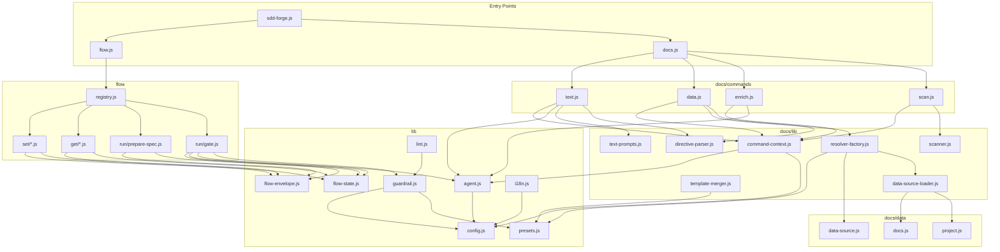

<!-- {{data("base.docs.langSwitcher", {labels: "relative"})}} -->
**English** | [日本語](ja/internal_design.md)
<!-- {{/data}} -->

# Internal Design

## Description

<!-- {{text({prompt: "Write a 1-2 sentence overview of this chapter. Include the project structure, module dependency direction, and key processing flows."})}} -->

This chapter describes the internal architecture of sdd-forge, which is organized into three primary layers: `src/lib/` (core utilities), `src/docs/` (documentation pipeline), and `src/flow/` (SDD workflow). Dependencies flow inward toward `lib/`—commands depend on libraries, never the reverse—and key processing paths include the docs pipeline (`scan → enrich → data → text`) and the flow lifecycle routed through `flow/registry.js` using a pre/execute/post hook pattern.
<!-- {{/text}} -->

## Content

### Project Structure

<!-- {{text({prompt: "Describe the project's directory structure as a tree-format code block. Include role comments for key directories and files. Generate from the actual source code structure.", mode: "deep"})}} -->

```
src/
├── sdd-forge.js              # CLI entry point; routes to docs.js, flow.js, or standalone commands
├── docs.js                   # Docs subcommand dispatcher; orchestrates the build pipeline
├── flow.js                   # Flow subcommand dispatcher; resolves context and invokes registry
├── setup.js                  # Interactive project setup wizard
├── upgrade.js                # Syncs skills and templates after package updates
├── help.js                   # Prints command reference
├── lib/                      # Core utilities shared across all layers
│   ├── agent.js              # AI agent invocation (sync/async, retry, stdin fallback)
│   ├── flow-state.js         # Persistent flow.json CRUD and active-flow tracking
│   ├── flow-envelope.js      # Structured JSON output protocol (ok/fail/warn)
│   ├── guardrail.js          # Loads, hydrates, and merges guardrail definitions
│   ├── i18n.js               # Three-tier locale loading with namespaced key lookup
│   ├── config.js             # Config loading and project path resolution
│   ├── presets.js            # Preset chain discovery and parent resolution
│   ├── git-state.js          # Git state queries (dirty, branch, ahead count)
│   ├── lint.js               # Lint guardrail validation pipeline
│   ├── include.js            # Template include directive processor
│   ├── skills.js             # Skill deployment to .agents/ and .claude/ directories
│   ├── json-parse.js         # Lenient JSON repair for AI-generated output
│   ├── process.js            # spawnSync wrapper with uniform result shape
│   └── progress.js           # ANSI progress bar and prefixed logger
├── docs/
│   ├── commands/             # CLI entry points for each doc pipeline step
│   │   ├── scan.js           # Traverses source files; writes analysis.json
│   │   ├── enrich.js         # AI-powered annotation of analysis entries
│   │   ├── data.js           # Resolves {{data}} directives in chapter files
│   │   └── text.js           # Fills {{text}} directives via AI agent calls
│   ├── data/                 # DataSource implementations for {{data}} directives
│   │   ├── agents.js         # SDD template content and agent configuration metadata
│   │   ├── docs.js           # Chapter listings, navigation links, language switcher
│   │   ├── lang.js           # Language navigation link generation
│   │   ├── project.js        # Project identity from package.json
│   │   └── text.js           # Placeholder DataSource stub
│   └── lib/                  # Doc-pipeline shared libraries
│       ├── directive-parser.js    # Parses {{data}}, {{text}}, and block directives
│       ├── resolver-factory.js    # Wires DataSource objects for a preset chain
│       ├── template-merger.js     # Resolves and merges preset template inheritance
│       ├── command-context.js     # Shared context resolution (root, config, agent)
│       ├── text-prompts.js        # Builds AI prompts for text directive generation
│       ├── forge-prompts.js       # Builds AI prompts for the forge command
│       ├── scanner.js             # File traversal, glob matching, and hashing
│       ├── chapter-resolver.js    # Maps analysis categories to chapter files
│       ├── analysis-entry.js      # AnalysisEntry base class and summary utilities
│       ├── analysis-filter.js     # Filters entries by docs.exclude glob patterns
│       ├── concurrency.js         # Bounded async concurrency pool
│       ├── minify.js              # Language-aware source minification dispatcher
│       ├── data-source.js         # DataSource base class with Markdown table helpers
│       ├── data-source-loader.js  # Dynamically discovers and instantiates DataSources
│       └── lang/                  # Per-language parse/minify/extract handlers
│           ├── js.js
│           ├── php.js
│           ├── py.js
│           └── yaml.js
├── flow/
│   ├── registry.js           # FLOW_COMMANDS map with pre/execute/post hooks
│   ├── get/                  # Read-only flow state queries
│   │   ├── check.js          # Prerequisite and environment readiness checks
│   │   ├── context.js        # Analysis entry search and source file reading
│   │   ├── guardrail.js      # Phase-filtered guardrail retrieval
│   │   ├── resolve-context.js # Full flow context for skill consumption
│   │   └── qa-count.js       # Returns QA question counter from state
│   ├── run/                  # Stateful flow execution steps
│   │   ├── prepare-spec.js   # Creates spec directory, branch, and flow state
│   │   ├── gate.js           # Validates spec structure and AI guardrail compliance
│   │   ├── lint.js           # Runs lint guardrail checks on changed files
│   │   ├── impl-confirm.js   # Confirms implementation readiness
│   │   ├── retro.js          # Post-implementation spec accuracy evaluation
│   │   └── review.js         # Delegates to flow/commands/review.js subprocess
│   ├── set/                  # Flow state mutation commands
│   │   ├── step.js           # Sets named step status
│   │   ├── metric.js         # Increments phase metric counters
│   │   ├── req.js            # Updates requirement status by index
│   │   ├── summary.js        # Initializes requirements from JSON array
│   │   ├── note.js           # Appends timestamped note to flow state
│   │   └── redo.js           # Appends redo log entry to redolog.json
│   └── commands/
│       └── review.js         # AI code review and test-gap analysis pipeline
├── presets/                  # Preset ecosystem (base, php, node, webapp, …)
├── locale/                   # en/ and ja/ i18n message files
└── templates/                # Skill SKILL.md templates and shared partials
```
<!-- {{/text}} -->

### Module Composition

<!-- {{text({prompt: "List the major modules in table format. Include module name, file path, and responsibility. Extract from import/require relationships and exports in each file.", mode: "deep"})}} -->

| Module | File Path | Responsibility |
| --- | --- | --- |
| sdd-forge | `src/sdd-forge.js` | Top-level CLI dispatcher; routes to docs.js, flow.js, or standalone commands |
| docs dispatcher | `src/docs.js` | Docs subcommand router; orchestrates the full `scan → enrich → data → text → readme` build pipeline |
| flow dispatcher | `src/flow.js` | Flow subcommand router; resolves project context and dispatches via `FLOW_COMMANDS` registry |
| scan | `src/docs/commands/scan.js` | Traverses source files using preset DataSources; writes structured `analysis.json` |
| enrich | `src/docs/commands/enrich.js` | Annotates each analysis entry with AI-generated summary, detail, chapter classification, and keywords |
| data | `src/docs/commands/data.js` | Resolves `{{data}}` directives in chapter files by calling DataSource resolver methods |
| text | `src/docs/commands/text.js` | Fills `{{text}}` directives in chapter files via batched AI agent calls |
| directive-parser | `src/docs/lib/directive-parser.js` | Parses and processes `{{data}}`, `{{text}}`, and block inheritance directives from Markdown templates |
| resolver-factory | `src/docs/lib/resolver-factory.js` | Creates resolver instances that combine preset DataSources, overrides, and desc helpers |
| template-merger | `src/docs/lib/template-merger.js` | Resolves chapter template files across preset inheritance chains with language fallback |
| command-context | `src/docs/lib/command-context.js` | Centralises resolution of shared command context (root, config, agent, lang, docsDir) |
| text-prompts | `src/docs/lib/text-prompts.js` | Builds AI system prompts, per-directive prompts, and batch prompts for text generation |
| scanner | `src/docs/lib/scanner.js` | File traversal, glob-to-regex conversion, MD5 hashing, and per-language file parsing |
| data-source-loader | `src/docs/lib/data-source-loader.js` | Dynamically discovers `.js` files in a `data/` directory and instantiates DataSource classes |
| DataSource base | `src/docs/lib/data-source.js` | Base class providing `desc()`, `mergeDesc()`, `toMarkdownTable()`, and override helpers |
| flow registry | `src/flow/registry.js` | Single source of truth mapping flow step IDs to execute imports and pre/post lifecycle hooks |
| flow-state | `src/lib/flow-state.js` | Manages `specs/<id>/flow.json` with atomic mutations, active-flow tracking, and worktree support |
| flow-envelope | `src/lib/flow-envelope.js` | Provides `ok`/`fail`/`warn` constructors and `output()` for machine-readable JSON communication |
| agent | `src/lib/agent.js` | Wraps AI agent CLI invocation with sync/async modes, retry logic, and stdin prompt delivery |
| guardrail | `src/lib/guardrail.js` | Loads guardrail definitions from preset chains, hydrates regex patterns, and merges with project overrides |
| i18n | `src/lib/i18n.js` | Three-tier locale loading (package → preset → project) with namespaced key lookup and interpolation |
| lint | `src/lib/lint.js` | Runs lint guardrail regex checks against git-changed files |
| git-state | `src/lib/git-state.js` | Queries git for dirty status, current branch, ahead count, and gh CLI availability |
<!-- {{/text}} -->

### Module Dependencies

<!-- {{text({prompt: "Generate a mermaid graph showing inter-module dependencies. Analyze import/require statements in the source code and show the layer structure and dependency direction. Output only the mermaid code block.", mode: "deep"})}} -->


<!-- {{/text}} -->

### Key Processing Flows

<!-- {{text({prompt: "Describe the inter-module data and control flow when running a representative command in numbered steps. Include the flow from entry point to final output.", mode: "deep"})}} -->

The following steps trace execution of `sdd-forge text`, which fills AI-generated content into all `{{text}}` directives in the project's documentation chapter files.

1. `sdd-forge.js` receives the `text` argument, identifies it as a `docs` namespace command, and delegates to `docs.js` with the remaining arguments.
2. `docs.js` resolves `text` to `docs/commands/text.js` and imports it dynamically, then calls its `main()` function.
3. `text.js` calls `resolveCommandContext()` in `docs/lib/command-context.js`, which reads `config.json`, resolves the project root, language, agent configuration, and `docsDir` path.
4. `loadFullAnalysis()` reads `analysis.json` from `.sdd-forge/output/`; if enrichment has been run, the entries carry `summary`, `detail`, and `chapter` fields.
5. `getChapterFiles()` returns an ordered list of chapter `.md` files from `docs/` based on the preset's `chapters` array or a sorted directory listing.
6. For each chapter file, `parseDirectives()` in `docs/lib/directive-parser.js` scans line-by-line for `{{text({prompt: …})}}` open tags and their matching `{{/text}}` close tags, returning a structured directive list.
7. `getEnrichedContext()` in `docs/lib/text-prompts.js` filters `analysis.json` for entries whose `chapter` field matches the current file name and formats them as context, optionally reading and minifying source files in `deep` mode.
8. `buildBatchPrompt()` assembles a single prompt containing the chapter template (with prior fill content stripped by `stripFillContent()`) and all directive instructions keyed by ID.
9. `callAgentAsync()` in `lib/agent.js` spawns the configured AI agent process; if the combined argument size exceeds `ARGV_SIZE_THRESHOLD` (100 KB), the prompt is delivered via stdin instead of a CLI argument.
10. The agent's JSON response is repaired by `repairJson()` in `lib/json-parse.js` and applied to the file by `applyBatchJsonToFile()`, which splices generated content between each open/close tag pair working backwards through the file to preserve line offsets.
11. Files with at least one filled directive are written back to disk; a completion summary is emitted via `createLogger` from `lib/progress.js`.
<!-- {{/text}} -->

### Extension Points

<!-- {{text({prompt: "Describe the locations that need changes and extension patterns when adding new commands or features. Derive from plugin points and dispatch registration patterns in the source code.", mode: "deep"})}} -->

**Adding a new `docs` subcommand**
Create a module in `src/docs/commands/` that exports a `main(ctx)` function and calls `runIfDirect(import.meta.url, main)` at the bottom. Register the command name and script path in the `SCRIPTS` map inside `src/docs.js`. Add help text to the corresponding locale file under `src/locale/<lang>/ui.json` at `help.cmdHelp.<name>`.

**Adding a new DataSource method for `{{data}}` directives**
Add a method to an existing class in `src/docs/data/` that extends `DataSource`, or create a new file in that directory. No manual registration is needed — `data-source-loader.js` discovers all `.js` files in a `data/` directory at runtime and instantiates them automatically. The method becomes callable via `{{data("<preset>.<sourceName>.<methodName>")}}` in chapter templates.

**Adding a new flow step**
Declare the step ID in the `FLOW_STEPS` array and assign it a phase in `PHASE_MAP` inside `src/lib/flow-state.js`. Create a handler module in `src/flow/run/`, `src/flow/set/`, or `src/flow/get/` that exports an `execute(ctx)` function and uses `output(ok(…))` / `output(fail(…))` for responses. Wire it into `FLOW_COMMANDS` in `src/flow/registry.js` with an `execute` dynamic import and optional `pre` / `post` hook functions.

**Adding project-level guardrail rules**
Create or extend `.sdd-forge/guardrail.json` with entries following the guardrail schema. The `loadMergedGuardrails()` function in `src/lib/guardrail.js` automatically merges project-level entries with preset-level entries, giving project definitions precedence by ID. Assign the `lint` regex field and include `"lint"` in `meta.phase` to activate pattern matching on changed files.

**Adding a new preset**
Create a directory under `src/presets/<name>/` containing a `preset.json` that declares the `parent` key pointing to an existing preset. Add `templates/<lang>/` for chapter templates and optionally `data/` for DataSource extensions. The `resolveChainSafe()` function in `src/lib/presets.js` resolves the full ancestor chain at runtime, requiring no changes to the dispatch layer.
<!-- {{/text}} -->

---

<!-- {{data("base.docs.nav")}} -->
[← Configuration and Customization](configuration.md)
<!-- {{/data}} -->
