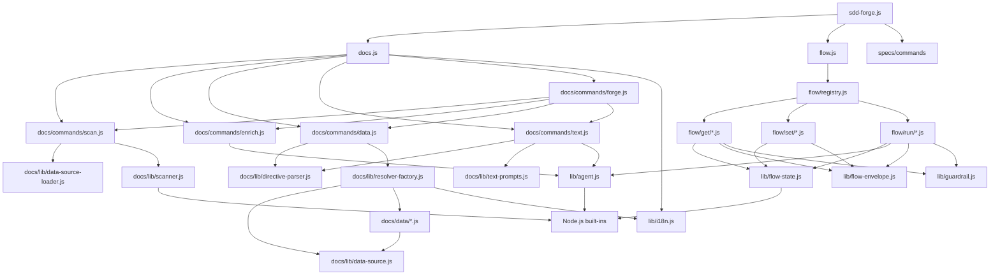

<!-- {{data("base.docs.langSwitcher", {labels: "relative"})}} -->
**English** | [日本語](ja/internal_design.md)
<!-- {{/data}} -->

# Internal Design

## Description

<!-- {{text({prompt: "Write a 1-2 sentence overview of this chapter. Include the project structure, module dependency direction, and key processing flows."})}} -->

This chapter describes the internal architecture of sdd-forge, a CLI tool organized as a three-level dispatcher (`sdd-forge.js` → subsystem dispatchers → command modules) with two primary subsystems: `docs/` for documentation generation and `flow/` for Spec-Driven Development workflows. Dependencies flow inward from CLI entry points through command modules into a shared `lib/` layer, with no circular dependencies between subsystems.
<!-- {{/text}} -->

## Content

### Project Structure

<!-- {{text({prompt: "Describe the project's directory structure as a tree-format code block. Include role comments for key directories and files. Generate from the actual source code structure.", mode: "deep"})}} -->

```
src/
├── sdd-forge.js            # Top-level CLI entry point and subcommand dispatcher
├── docs.js                 # docs subcommand dispatcher
├── flow.js                 # flow subcommand dispatcher
├── help.js                 # Help text renderer
├── lib/                    # Shared core libraries (no subsystem dependencies)
│   ├── agent.js            # Claude CLI invocation (sync and async, stdin/argv)
│   ├── cli.js              # Argument parsing and project root resolution
│   ├── config.js           # Config loading, path helpers, sddDir/sddOutputDir
│   ├── flow-envelope.js    # Structured JSON output protocol (ok/fail/warn)
│   ├── flow-state.js       # flow.json persistence, step/metric mutation helpers
│   ├── git-state.js        # Git worktree status, branch, ahead-count queries
│   ├── guardrail.js        # Guardrail loading, phase filtering, lint matching
│   ├── i18n.js             # Locale message loading with three-tier merge
│   ├── include.js          # Template include directive processor
│   ├── json-parse.js       # Lenient JSON repair for AI-generated output
│   ├── lint.js             # Lint guardrail validation against changed files
│   ├── process.js          # spawnSync wrapper with uniform return shape
│   ├── progress.js         # ANSI progress bar and spinner renderer
│   └── skills.js           # SKILL.md template deployment to .agents/ and .claude/
├── docs/
│   ├── commands/           # Documentation pipeline CLI commands
│   │   ├── scan.js         # Source scanning → analysis.json
│   │   ├── enrich.js       # AI annotation of analysis entries (batch LLM)
│   │   ├── data.js         # {{data}} directive resolution from analysis.json
│   │   ├── text.js         # {{text}} directive AI generation (batch/per-directive)
│   │   ├── forge.js        # Full build pipeline orchestrator
│   │   └── ...             # readme, review, changelog, translate, agents, init
│   ├── data/               # DataSource implementations (one class per source key)
│   │   ├── agents.js       # SDD template content and project metadata
│   │   ├── docs.js         # Chapter list, navigation, language switcher
│   │   ├── lang.js         # Language navigation links
│   │   ├── project.js      # package.json name, version, description, scripts
│   │   └── text.js         # Stub DataSource placeholder
│   └── lib/                # Documentation subsystem libraries
│       ├── directive-parser.js   # {{data}}/{{text}}/ parser
│       ├── resolver-factory.js   # DataSource resolver from preset chain
│       ├── scanner.js            # File collection, hashing, glob matching
│       ├── template-merger.js    # Preset template inheritance and merging
│       ├── text-prompts.js       # AI prompt builders for text commands
│       ├── chapter-resolver.js   # Category-to-chapter mapping
│       ├── minify.js             # Language-aware code minification dispatcher
│       └── lang/                 # Per-language parse/minify handlers
│           ├── js.js, php.js, py.js, yaml.js
├── flow/
│   ├── registry.js         # FLOW_COMMANDS dispatch table with pre/post hooks
│   ├── commands/           # Higher-level flow orchestration scripts
│   ├── get/                # Read-only flow query handlers
│   │   ├── context.js      # Analysis entry search (ngram, keyword, AI-assisted)
│   │   ├── resolve-context.js  # Full flow context for skill scripts
│   │   ├── check.js        # Prerequisite and dirty-state checks
│   │   └── guardrail.js, status.js, prompt.js, qa-count.js, issue.js
│   ├── set/                # Flow state mutation handlers
│   │   ├── step.js, req.js, metric.js, note.js, summary.js, redo.js, ...
│   └── run/                # Flow execution handlers
│       ├── prepare-spec.js # Spec directory and branch initialization
│       ├── gate.js         # Spec structural and guardrail validation
│       ├── review.js       # AI code review orchestration
│       ├── retro.js        # Post-implementation retrospective
│       └── finalize.js, lint.js, impl-confirm.js, sync.js, retro.js
├── presets/                # Preset chain definitions (base, node, php, cli, ...)
│   └── <preset>/
│       ├── preset.json     # parent chain and chapter order
│       ├── data/           # Preset-specific DataSource modules
│       └── templates/      # Per-language Markdown chapter templates
├── locale/                 # i18n JSON files
│   └── <lang>/ui.json, messages.json, prompts.json
└── templates/
    └── skills/             # SKILL.md templates deployed to .claude/skills/
```
<!-- {{/text}} -->

### Module Composition

<!-- {{text({prompt: "List the major modules in table format. Include module name, file path, and responsibility. Extract from import/require relationships and exports in each file.", mode: "deep"})}} -->

| Module | File Path | Responsibility |
| --- | --- | --- |
| Top-level dispatcher | `src/sdd-forge.js` | Parses the first CLI argument and delegates to the docs, flow, or spec subsystem |
| docs dispatcher | `src/docs.js` | Routes doc subcommands (scan, enrich, data, text, forge, readme, …) to their command modules |
| flow dispatcher | `src/flow.js` | Loads `FLOW_COMMANDS` from registry.js and dispatches to get/set/run handlers via dynamic import |
| flow registry | `src/flow/registry.js` | Central dispatch table mapping command paths to execute modules and pre/post lifecycle hooks |
| scan | `src/docs/commands/scan.js` | Traverses source files with preset DataSources, assigns stable IDs, writes `analysis.json` |
| enrich | `src/docs/commands/enrich.js` | Batches analysis entries, calls AI agent, merges summary/detail/chapter annotations back into analysis |
| data | `src/docs/commands/data.js` | Resolves `{{data}}` directives in chapter files using DataSource resolver, writes updated Markdown |
| text | `src/docs/commands/text.js` | Fills `{{text}}` directives by calling the AI agent in batch or per-directive mode |
| directive-parser | `src/docs/lib/directive-parser.js` | Parses `{{data(…)}}`, `{{text(…)}}`, and `` directives from Markdown text |
| resolver-factory | `src/docs/lib/resolver-factory.js` | Instantiates DataSource classes from the preset chain and exposes a unified `resolve()` method |
| DataSource base | `src/docs/lib/data-source.js` | Base class providing `toMarkdownTable()`, `desc()`, and override-merge helpers for all DataSources |
| template-merger | `src/docs/lib/template-merger.js` | Resolves and merges preset-chain chapter templates using block inheritance |
| scanner | `src/docs/lib/scanner.js` | File traversal, MD5 hashing, glob-to-regex conversion, and language handler dispatch |
| text-prompts | `src/docs/lib/text-prompts.js` | Builds AI system prompts and per-directive prompts for the text command |
| agent | `src/lib/agent.js` | Wraps Claude CLI calls (sync via `execFileSync`, async via `spawn`) with retry and stdin fallback |
| flow-state | `src/lib/flow-state.js` | Reads and writes `flow.json`, tracks active flows in `.active-flow`, and provides atomic mutators |
| flow-envelope | `src/lib/flow-envelope.js` | Constructs `ok`/`fail`/`warn` envelope objects and serializes them to stdout as JSON |
| guardrail | `src/lib/guardrail.js` | Loads, hydrates, and merges guardrail definitions from preset chain and project overrides |
| i18n | `src/lib/i18n.js` | Loads and merges locale JSON from package, preset, and project tiers with interpolation support |
| progress | `src/lib/progress.js` | ANSI progress bar and spinner for TTY output with step-weight tracking |
| context search | `src/flow/get/context.js` | Searches analysis entries using ngram, keyword, or AI-assisted keyword selection modes |
<!-- {{/text}} -->

### Module Dependencies

<!-- {{text({prompt: "Generate a mermaid graph showing inter-module dependencies. Analyze import/require statements in the source code and show the layer structure and dependency direction. Output only the mermaid code block.", mode: "deep"})}} -->


<!-- {{/text}} -->

### Key Processing Flows

<!-- {{text({prompt: "Describe the inter-module data and control flow when running a representative command in numbered steps. Include the flow from entry point to final output.", mode: "deep"})}} -->

The following steps describe the data and control flow when running `sdd-forge build`, which executes the full documentation pipeline:

1. **Entry** — `sdd-forge.js` parses the `build` subcommand and delegates to `docs.js`, which resolves the project root via `repoRoot()` and loads `config.json` to determine the preset type and language.
2. **scan** — `docs/commands/scan.js` loads DataSource modules from the preset chain directories via `loadDataSources()`. For each source file matched by the preset's include/exclude globs, the corresponding language handler (`lang/js.js`, `lang/php.js`, etc.) parses the file. Results are merged with the existing `analysis.json`, preserving stable IDs and enriched fields. The updated file is written to `.sdd-forge/output/analysis.json`.
3. **enrich** — `docs/commands/enrich.js` reads `analysis.json`, splits entries into token-limited batches, and sends each batch to the configured AI agent via `callAgentAsync()`. The JSON response is repaired with `repairJson()` and merged back into the analysis entries, adding `summary`, `detail`, `chapter`, `role`, and `keywords` fields. Progress is saved incrementally to disk.
4. **data** — `docs/commands/data.js` calls `createResolver()` from `resolver-factory.js` to build a resolver backed by all preset-chain DataSource instances. It then iterates each chapter file, calls `resolveDataDirectives()` from `directive-parser.js` for each `{{data(…)}}` block, and writes the filled content back to `docs/*.md`.
5. **text** — `docs/commands/text.js` reads each chapter file, calls `getEnrichedContext()` from `text-prompts.js` to assemble analysis context for the chapter, then submits all `{{text(…)}}` directives as a single batch JSON request to the AI agent via `callAgentAsync()`. The response is parsed by `parseBatchJsonResponse()` and inserted into the file via `applyBatchJsonToFile()`.
6. **Output** — Each updated `docs/*.md` file is written to disk. The progress bar in `progress.js` updates at each pipeline step, and a summary of changed files is logged to stderr.
<!-- {{/text}} -->

### Extension Points

<!-- {{text({prompt: "Describe the locations that need changes and extension patterns when adding new commands or features. Derive from plugin points and dispatch registration patterns in the source code.", mode: "deep"})}} -->

**Adding a new DataSource method**
Create or extend a class in `src/docs/data/` (or in a preset's `data/` directory) that extends `DataSource`. Expose a new method named after the directive method key. No registration step is required — `data-source-loader.js` discovers all `.js` files in the data directory by scanning at runtime. The new method becomes available in `{{data("<preset>.<source>.<method>")}}` directives immediately.

**Adding a new preset**
Create a directory under `src/presets/<name>/` containing a `preset.json` with a `parent` field pointing to the base preset, a `chapters` array defining doc order, and optional `data/` and `templates/<lang>/` subdirectories. The preset chain is resolved automatically by `resolveChainSafe()` in `presets.js`.

**Adding a new `docs` subcommand**
Add a command module to `src/docs/commands/` following the `main(ctx)` + `runIfDirect()` pattern. Register it in `src/docs.js` under the appropriate subcommand key in the dispatch table.

**Adding a new `flow get/set/run` handler**
Create a module in `src/flow/get/`, `src/flow/set/`, or `src/flow/run/` exporting an `async execute(ctx)` function. Register it in `src/flow/registry.js` under `FLOW_COMMANDS.get`, `.set`, or `.run` with an optional `pre` and `post` hook for step lifecycle management. The `ctx` object provides `root`, `flowState`, `config`, and `args`.

**Adding guardrail rules**
Add entries to `src/presets/<preset>/templates/<lang>/guardrail.json` for preset-scoped rules, or to `.sdd-forge/guardrail.json` for project-specific overrides. Each entry with a `meta.lint` regex is automatically applied by the `flow run lint` command against changed files.

**Adding a new skill**
Create a directory under `src/templates/skills/<name>/` containing a `SKILL.md` file. The `deploySkills()` function in `skills.js` discovers it automatically during `sdd-forge upgrade` and writes it to both `.agents/skills/` and `.claude/skills/` in the target project. Use `<!-- include("path") -->` directives within the template to compose shared content blocks.
<!-- {{/text}} -->

---

<!-- {{data("base.docs.nav")}} -->
[← Configuration and Customization](configuration.md)
<!-- {{/data}} -->
