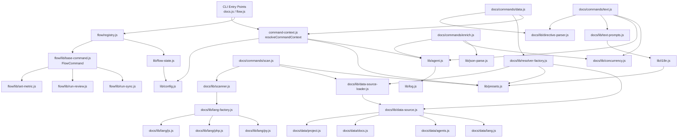

<!-- {{data("base.docs.langSwitcher", {labels: "relative"})}} -->
[日本語](ja/internal_design.md) | **English**
<!-- {{/data}} -->

# Internal Design

## Description

<!-- {{text({prompt: "Write a 1-2 sentence overview of this chapter. Include the project structure, module dependency direction, and key processing flows."})}} -->

This chapter describes the internal architecture of sdd-forge, which is organized into three primary layers — `src/lib/` (shared core utilities), `src/docs/` (documentation pipeline commands and processing), and `src/flow/` (Spec-Driven Development workflow engine). Dependencies flow inward: command modules depend on core utilities, and DataSource plugins depend on the resolver infrastructure, with no circular references between layers.
<!-- {{/text}} -->

## Content

### Project Structure

<!-- {{text({prompt: "Describe the project's directory structure as a tree-format code block. Include role comments for key directories and files. Generate from the actual source code structure.", mode: "deep"})}} -->

```
src/
├── lib/                      # Core shared utilities (no external deps)
│   ├── agent.js              # AI agent invocation (sync/async, retry, logging)
│   ├── cli.js                # CLI arg parsing, repo/source root detection
│   ├── config.js             # Config loading and path resolution
│   ├── flow-state.js         # Flow state persistence (flow.json read/write)
│   ├── flow-envelope.js      # Structured output envelope (ok/fail/warn)
│   ├── guardrail.js          # Guardrail rule loading and phase filtering
│   ├── i18n.js               # Multi-domain i18n with preset locale merging
│   ├── json-parse.js         # Tolerant JSON repair for LLM output
│   ├── log.js                # Structured JSONL logging (agent, git, event)
│   ├── presets.js            # Preset chain resolution
│   ├── process.js            # Child process execution utilities
│   └── progress.js           # TTY progress bar and logger factory
├── docs/
│   ├── commands/             # docs subcommand entry points
│   │   ├── scan.js           # Source file traversal → analysis.json
│   │   ├── enrich.js         # AI enrichment of analysis.json entries
│   │   ├── data.js           # {{data}} directive substitution
│   │   └── text.js           # {{text}} directive AI generation
│   ├── lib/                  # Docs pipeline internals
│   │   ├── directive-parser.js   # Parses {{data}}/{{text}} directives
│   │   ├── resolver-factory.js   # Builds DataSource resolver from preset chain
│   │   ├── scanner.js            # File glob/hash/collect utilities
│   │   ├── template-merger.js    # Block-inheritance template merging
│   │   ├── text-prompts.js       # Prompt assembly for text directives
│   │   ├── chapter-resolver.js   # Chapter ordering and category mapping
│   │   ├── analysis-entry.js     # AnalysisEntry base class and helpers
│   │   ├── data-source.js        # DataSource base class
│   │   ├── data-source-loader.js # Dynamic DataSource module loader
│   │   ├── minify.js             # Language-aware code minification
│   │   └── lang/                 # Per-language handlers (js, php, py, yaml)
│   └── data/                 # Built-in DataSource implementations
│       ├── project.js        # name, description, version from package.json
│       ├── docs.js           # Chapter navigation and lang switcher
│       ├── agents.js         # AGENTS.md template and project metadata
│       ├── lang.js           # Language link generation
│       └── text.js           # Stub for text source category
├── flow/
│   ├── registry.js           # Central command/hook registry
│   └── lib/                  # Flow command implementations
│       ├── base-command.js   # FlowCommand abstract base class
│       ├── phases.js         # VALID_PHASES constant
│       ├── run-review.js     # Review command with retry logic
│       ├── run-sync.js       # Docs sync command
│       ├── set-metric.js     # Metric counter increment
│       ├── set-issue-log.js  # Issue log persistence
│       └── ...               # Other get-*/set-*/run-* commands
└── presets/                  # Preset definitions (base + language-specific)
    └── base/
        ├── templates/        # Chapter Markdown templates by language
        ├── data/             # Preset-scoped DataSource overrides
        └── guardrail.json    # Default guardrail rules
```
<!-- {{/text}} -->

### Module Composition

<!-- {{text({prompt: "List the major modules in table format. Include module name, file path, and responsibility. Extract from import/require relationships and exports in each file.", mode: "deep"})}} -->

| Module | File | Responsibility |
| --- | --- | --- |
| Agent Invocation | `src/lib/agent.js` | Executes AI agents (Claude/Codex) synchronously or asynchronously, handles stdin routing, JSON output parsing, and structured request logging |
| Config Loader | `src/lib/config.js` | Loads `.sdd-forge/config.json`, resolves output/data paths, validates required fields |
| Flow State | `src/lib/flow-state.js` | Reads and mutates `flow.json` for the active spec; manages step status, metrics, requirements, and active-flow tracking across worktrees |
| Preset Chain | `src/lib/presets.js` | Resolves preset inheritance chains (`parent` field); provides `resolveChainSafe` and `resolveMultiChains` used by both docs and flow |
| i18n | `src/lib/i18n.js` | Loads locale JSON from default, preset, and project directories; supports namespaced domain keys and parameter interpolation |
| Guardrail | `src/lib/guardrail.js` | Merges preset and project `guardrail.json` files; filters rules by phase and file scope |
| Directive Parser | `src/docs/lib/directive-parser.js` | Parses `{{data(...)}}` and `{{text(...)}}` comment directives from Markdown; supports inline and block variants |
| Resolver Factory | `src/docs/lib/resolver-factory.js` | Instantiates DataSource chain from preset directories and project data dir; returns a `resolve(preset, source, method, analysis, labels)` function |
| Scanner | `src/docs/lib/scanner.js` | Walks source trees using glob include/exclude patterns; computes MD5 hashes and line counts; dispatches to language handlers for parsing |
| Template Merger | `src/docs/lib/template-merger.js` | Resolves chapter templates through preset chain with block-inheritance semantics; supports multi-language fallback and additive merging |
| DataSource Base | `src/docs/lib/data-source.js` | Abstract base class defining `init(ctx)`, `desc()`, `toMarkdownTable()`, and override loading contract for all DataSource subclasses |
| Text Prompts | `src/docs/lib/text-prompts.js` | Assembles system prompts, file prompts, and batch prompts for `{{text}}` directive generation using enriched analysis context |
| Flow Registry | `src/flow/registry.js` | Maps all flow subcommand keys to command class factories, arg schemas, help text, and pre/post hook functions |
| FlowCommand Base | `src/flow/lib/base-command.js` | Abstract base for flow commands; enforces active-flow precondition check before delegating to `execute(ctx)` |
| Flow Envelope | `src/lib/flow-envelope.js` | Produces typed `ok`/`fail`/`warn` envelope objects; serializes to stdout and sets `process.exitCode` |
| Logger | `src/lib/log.js` | Singleton structured logger; appends JSONL records for agent calls, git operations, and events; writes per-request prompt files |
<!-- {{/text}} -->

### Module Dependencies

<!-- {{text({prompt: "Generate a mermaid graph showing inter-module dependencies. Analyze import/require statements in the source code and show the layer structure and dependency direction. Output only the mermaid code block.", mode: "deep"})}} -->


<!-- {{/text}} -->

### Key Processing Flows

<!-- {{text({prompt: "Describe the inter-module data and control flow when running a representative command in numbered steps. Include the flow from entry point to final output.", mode: "deep"})}} -->

The following steps trace the control and data flow for `sdd-forge docs data`, which substitutes `{{data}}` directives in chapter files with rendered content from `analysis.json`.

1. **CLI entry** — `docs.js` receives `data` as the subcommand and calls `main()` in `src/docs/commands/data.js`.
2. **Context resolution** — `resolveCommandContext()` in `command-context.js` loads `.sdd-forge/config.json`, detects `type`, resolves the docs directory path, and constructs the translation function `t`.
3. **Analysis loading** — `analysis.json` is read from `.sdd-forge/output/`. If absent, an error is thrown instructing the user to run `docs scan` first.
4. **Exclude filtering** — `filterAnalysisByDocsExclude()` removes entries whose `file` matches any pattern in `config.docs.exclude`, returning a filtered analysis object.
5. **Resolver creation** — `createResolver(type, root, opts)` in `resolver-factory.js` walks the preset chain via `resolveMultiChains`, dynamically imports each DataSource `.js` file from `preset/data/` and the project data directory, calls `instance.init(ctx)` on each, and returns a `resolve(preset, source, method, analysis, labels)` function backed by the assembled source map.
6. **Chapter enumeration** — `getChapterFiles(docsDir, opts)` reads the ordered chapter list from the preset chain or config, returning only files that exist on disk.
7. **Directive processing** — For each chapter file, the raw text is read and passed to `processTemplate()`. Inside, `resolveDataDirectives()` from `directive-parser.js` scans for `{{data(...)}}` comment blocks and calls the wrapped resolver function for each one.
8. **DataSource dispatch** — The resolver looks up the named DataSource instance (e.g., `project`, `docs`, `agents`) and calls the specified method (e.g., `project.name`, `docs.chapters`) with the filtered analysis and label arguments. The method returns a Markdown string or `null`.
9. **Directive replacement** — `replaceBlockDirective()` splices the rendered string back into the line array between the opening and closing directive comments. Inline directives are handled via string replacement.
10. **File write** — If any directives were replaced, the modified text is written back to the chapter file with `fs.writeFileSync`. A summary log message reports the count of updated files, replaced directives, and skipped `{{text}}` directives.
<!-- {{/text}} -->

### Extension Points

<!-- {{text({prompt: "Describe the locations that need changes and extension patterns when adding new commands or features. Derive from plugin points and dispatch registration patterns in the source code.", mode: "deep"})}} -->

**Adding a new `docs` DataSource**
Create a new file in `src/docs/data/` (for built-in sources) or in the project's `.sdd-forge/data/` directory (for project-specific sources). The file must export a default class extending `DataSource` from `docs/lib/data-source.js`, implementing `init(ctx)` and one or more data methods. The method name becomes the third segment in the `{{data("preset.sourceName.methodName")}}` directive. No registration step is required; `data-source-loader.js` discovers all `.js` files in the data directory automatically on startup.

**Adding a new preset**
Create a directory under `src/presets/` with a `preset.json` file specifying `key`, `label`, optional `parent`, and `chapters`. Add per-language templates under `templates/<lang>/` and optional DataSource overrides in `data/`. The preset becomes available immediately via `resolveChainSafe` and `resolveMultiChains` once the directory exists.

**Adding a new `flow` command**
Define a new entry in the `FLOW_COMMANDS` map in `src/flow/registry.js`. Set the `command` property to a dynamic `import()` of the implementation module, specify `args` for positional/flag/option parsing, and optionally add `pre` and `post` hook functions for step status updates or metric increments. The implementation module should export a default class extending `FlowCommand` from `flow/lib/base-command.js` with an `execute(ctx)` method that returns a plain result object and throws `Error` on failure.

**Adding a new `docs` subcommand**
Create the command module in `src/docs/commands/`, export a `main(ctx)` function, and register it in the docs command dispatcher (`docs.js`). Use `resolveCommandContext()` to obtain the standard context object and follow the existing pattern of reading from `sddOutputDir` and writing only on content change.
<!-- {{/text}} -->

---

<!-- {{data("base.docs.nav")}} -->
[← Configuration and Customization](configuration.md)
<!-- {{/data}} -->
