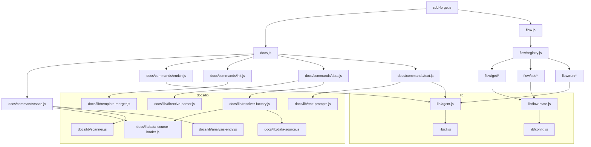

<!-- {{data("base.docs.langSwitcher", {labels: "relative"})}} -->
**English** | [日本語](ja/internal_design.md)
<!-- {{/data}} -->

# Internal Design

## Description

<!-- {{text({prompt: "Write a 1-2 sentence overview of this chapter. Include the project structure, module dependency direction, and key processing flows."})}} -->

sdd-forge is organized into three layers: top-level CLI dispatchers (`sdd-forge.js`, `docs.js`, `flow.js`), feature-domain modules in `docs/`, `flow/`, and `specs/`, and a shared `lib/` layer of reusable utilities. Dependencies flow strictly inward — entry points import command handlers, which import `lib/` utilities — while DataSource plugins and preset templates are resolved dynamically at runtime through chain-based inheritance.
<!-- {{/text}} -->

## Content

### Project Structure

<!-- {{text({prompt: "Describe the project's directory structure as a tree-format code block. Include role comments for key directories and files. Generate from the actual source code structure.", mode: "deep"})}} -->

```
src/
├── sdd-forge.js          # Top-level CLI entry point and subcommand dispatcher
├── docs.js               # docs subcommand dispatcher
├── flow.js               # flow subcommand dispatcher
├── docs/
│   ├── commands/         # docs pipeline step implementations
│   │   ├── scan.js       # Source file scanning → analysis.json
│   │   ├── enrich.js     # AI batch enrichment of analysis entries
│   │   ├── init.js       # docs/ initialization from preset templates
│   │   ├── data.js       # {{data}} directive resolution
│   │   ├── text.js       # {{text}} directive LLM fill
│   │   └── forge.js      # Full pipeline orchestration
│   ├── data/             # DataSource implementations
│   │   ├── agents.js     # AGENTS.md content (SDD section + project skeleton)
│   │   ├── docs.js       # Chapter listing, navigation, language switcher
│   │   ├── project.js    # package.json metadata (name, version, scripts)
│   │   └── text.js       # {{text}} delegation stub (always returns null)
│   └── lib/              # Shared pipeline utilities
│       ├── directive-parser.js    # {{data}}/{{text}}/block directive parser
│       ├── template-merger.js     # / inheritance merger
│       ├── resolver-factory.js    # DataSource chain loader and router
│       ├── data-source.js         # DataSource base class
│       ├── data-source-loader.js  # Dynamic DataSource importer
│       ├── scan-source.js         # Scannable DataSource mixin
│       ├── scanner.js             # File collection and glob matching
│       ├── analysis-entry.js      # AnalysisEntry base class and aggregation
│       ├── text-prompts.js        # LLM prompt builders for {{text}}
│       ├── forge-prompts.js       # LLM prompt builders for forge command
│       ├── concurrency.js         # Bounded parallel execution
│       ├── minify.js              # Source code minifier for prompt context
│       ├── lang-factory.js        # Language handler dispatcher
│       └── lang/                  # Per-language parse/minify handlers (js, php, py, yaml)
├── flow/
│   ├── registry.js       # Command routing table for all flow subcommands
│   ├── get.js / set.js / run.js  # Second-level dispatchers
│   ├── get/              # flow get handlers (status, context, prompt, guardrail, ...)
│   ├── set/              # flow set handlers (step, req, metric, note, auto, ...)
│   └── run/              # flow run handlers (review, finalize, sync, retro, ...)
├── presets/
│   ├── base/             # Base preset with universal templates and guardrail
│   └── <name>/           # Language/framework presets (node, php, node-cli, ...)
│       ├── preset.json   # Scan globs, chapter order, parent reference
│       ├── templates/    # Chapter .md templates with directives
│       └── data/         # Preset-specific DataSource classes
└── lib/
    ├── agent.js          # AI agent invocation (sync/async, stdin fallback, retry)
    ├── cli.js            # Arg parsing, PKG_DIR, repoRoot, sourceRoot
    ├── config.js         # Config loading, sddDir/sddOutputDir path helpers
    ├── flow-state.js     # Flow state persistence (.active-flow + flow.json)
    ├── flow-envelope.js  # ok/fail/warn JSON envelope for flow commands
    ├── guardrail.js      # Guardrail article parsing, filtering, scope matching
    ├── i18n.js           # 3-layer locale merge with domain namespacing
    ├── git-state.js      # Read-only git/GitHub CLI helpers
    ├── process.js        # spawnSync wrapper (runSync)
    ├── progress.js       # ANSI progress bar for pipeline steps
    ├── include.js        # Template include directive resolver
    ├── json-parse.js     # AI response JSON repair
    └── entrypoint.js     # runIfDirect guard for ES modules
```
<!-- {{/text}} -->

### Module Composition

<!-- {{text({prompt: "List the major modules in table format. Include module name, file path, and responsibility. Extract from import/require relationships and exports in each file.", mode: "deep"})}} -->

| Module | File Path | Responsibility |
| --- | --- | --- |
| CLI Dispatcher | `src/sdd-forge.js` | Top-level entry point; routes subcommands to docs.js, flow.js, or built-in commands |
| Docs Dispatcher | `src/docs.js` | Routes `docs` subcommands to the appropriate pipeline command in `docs/commands/` |
| Flow Registry | `src/flow/registry.js` | Single source of truth mapping all `flow get/set/run` keys to script paths and bilingual descriptions |
| Scan Command | `src/docs/commands/scan.js` | Collects source files, runs DataSource parsers, writes `analysis.json` with hash-based incremental caching |
| Enrich Command | `src/docs/commands/enrich.js` | Sends batched analysis entries to AI for structured metadata enrichment (summary, detail, chapter, role, keywords) |
| Init Command | `src/docs/commands/init.js` | Initializes `docs/` chapter files from preset template inheritance chains with optional AI chapter filtering |
| Data Command | `src/docs/commands/data.js` | Resolves `{{data(...)}}` directives in chapter files using DataSource methods and `analysis.json` |
| Text Command | `src/docs/commands/text.js` | Fills `{{text(...)}}` directives with LLM-generated content in batch mode (one call per file) or per-directive mode |
| Directive Parser | `src/docs/lib/directive-parser.js` | Parses and resolves `{{data}}`, `{{text}}`, and `` directives from Markdown template files |
| Template Merger | `src/docs/lib/template-merger.js` | Resolves ``/`` preset inheritance chains and merges multi-chain chapter templates |
| Resolver Factory | `src/docs/lib/resolver-factory.js` | Loads DataSource classes for a preset chain and routes `preset.source.method` calls at runtime |
| DataSource Base | `src/docs/lib/data-source.js` | Base class providing `desc()`, `mergeDesc()`, and `toMarkdownTable()` helpers to all DataSource subclasses |
| DataSource Loader | `src/docs/lib/data-source-loader.js` | Dynamically imports DataSource `.js` files from a directory into a name-keyed Map with optional filter callback |
| Scanner | `src/docs/lib/scanner.js` | File discovery with glob matching, per-file hash/stat computation, and language-specific parse dispatch |
| Text Prompts | `src/docs/lib/text-prompts.js` | Builds system prompts, enriched analysis context, and batch JSON prompts for `{{text}}` directive generation |
| Agent Library | `src/lib/agent.js` | Core AI invocation with sync/async modes, large-prompt stdin fallback, and configurable retry support |
| Flow State | `src/lib/flow-state.js` | Persists SDD flow state via `.active-flow` registry pointer and per-spec `flow.json` files across worktrees |
| Flow Envelope | `src/lib/flow-envelope.js` | Provides `ok/fail/warn` JSON response factories and `output()` consumed by all `flow get/set/run` commands |
| i18n | `src/lib/i18n.js` | 3-layer locale merge (package → preset → project) with domain-namespaced key lookup and `{{placeholder}}` interpolation |
| Guardrail | `src/lib/guardrail.js` | Parses guardrail articles from Markdown, filters by phase, matches file scope for lint and spec enforcement |
<!-- {{/text}} -->

### Module Dependencies

<!-- {{text({prompt: "Generate a mermaid graph showing inter-module dependencies. Analyze import/require statements in the source code and show the layer structure and dependency direction. Output only the mermaid code block.", mode: "deep"})}} -->


<!-- {{/text}} -->

### Key Processing Flows

<!-- {{text({prompt: "Describe the inter-module data and control flow when running a representative command in numbered steps. Include the flow from entry point to final output.", mode: "deep"})}} -->

The following steps trace the data and control flow for `sdd-forge docs build`:

1. `sdd-forge.js` parses `process.argv`, identifies the `docs` subcommand, and dynamically imports `docs.js`.
2. `docs.js` maps the `build` argument to `docs/commands/forge.js` and invokes `main()`.
3. `forge.js` calls `resolveCommandContext()` to load `.sdd-forge/config.json`, resolving `type`, `lang`, `docsDir`, and the configured AI agent profile.
4. **scan** — `scan.js` calls `collectFiles()` to walk the source tree using preset glob patterns, then loads Scannable DataSource classes via `loadDataSources()`. Each file's MD5 hash is compared against the existing `analysis.json`; changed files are re-parsed and results are saved to `.sdd-forge/output/analysis.json`.
5. **enrich** — `enrich.js` reads `analysis.json`, collects unenriched entries, splits them into batches by total line count, and sends each batch to the AI agent via `callAgentAsync()`. The JSON response is merged back, adding `summary`, `detail`, `chapter`, `role`, and `keywords` to each entry. `enrichedAt` is recorded on the analysis root.
6. **init** (first run) — `init.js` calls `resolveTemplates()`, which walks the preset chain bottom-up collecting and merging chapter `.md` templates through `/` inheritance via `template-merger.js`, then writes resolved files to `docs/`.
7. **data** — `forge.js` calls `populateFromAnalysis()`; `directive-parser.js` locates every `{{data(...)}}` block in each chapter file, `resolver-factory.js` routes each call to the matching DataSource method using the preset chain, and the rendered Markdown table replaces the block in place.
8. **text** — `forge.js` calls `textFillFromAnalysis()`; `text.js` strips existing fill content, builds one batch prompt per file via `buildBatchPrompt()` together with the chapter's enriched context from `getEnrichedContext()`, sends it to the AI agent, parses the JSON response keyed by directive ID, and inserts generated text into each `{{text}}` block.
9. All `docs/*.md` files now contain fully resolved `{{data}}` tables and AI-generated `{{text}}` prose, ready for review or commit.
<!-- {{/text}} -->

### Extension Points

<!-- {{text({prompt: "Describe the locations that need changes and extension patterns when adding new commands or features. Derive from plugin points and dispatch registration patterns in the source code.", mode: "deep"})}} -->

**Adding a new docs pipeline step:** Create a file in `src/docs/commands/` implementing and exporting `main(ctx)`. Register the step in `src/docs/commands/forge.js` within the pipeline sequence at the desired position. The `ctx` object from `resolveCommandContext()` provides `root`, `type`, `docsDir`, `agent`, `config`, and `t` (i18n).

**Adding a new `{{data}}` directive source:** Create a class extending `DataSource` in a preset's `data/` directory (e.g., `src/presets/<preset>/data/mysource.js`) or in `src/docs/data/` for a source available to all presets. Each public method becomes callable as `{{data("<preset>.mysource.<methodName>")}}`. The class is auto-discovered by `loadDataSources()` at runtime — no registration step is required.

**Extending the scan pipeline with a new file type:** Create a class using the `Scannable(DataSource)` mixin, implement `match(relPath)` returning `true` for handled files, and `parse(absPath)` returning a populated `AnalysisEntry` subclass instance. Place it in any preset's `data/` directory; `scan.js` auto-discovers and invokes it.

**Adding a new `flow get/set/run` subcommand:** Create the handler script in `src/flow/get/`, `src/flow/set/`, or `src/flow/run/`, implementing `main()` and emitting a JSON envelope via `output(ok(...))` or `output(fail(...))`. Add an entry to `src/flow/registry.js` under the corresponding `keys` map with `script` and `desc.en`/`desc.ja` fields. The sub-dispatchers (`get.js`, `set.js`, `run.js`) route to the new command automatically.

**Adding a new preset:** Create `src/presets/<name>/preset.json` with `parent`, `scan.include`, and `chapters` fields. Add `templates/<lang>/` for chapter templates using `` directives and optionally a `data/` directory for DataSource classes. The preset is available immediately as a `config.type` value in any project's `.sdd-forge/config.json`.
<!-- {{/text}} -->

---

<!-- {{data("base.docs.nav")}} -->
[← Configuration and Customization](configuration.md) | [Development, Testing, and Distribution →](development_testing.md)
<!-- {{/data}} -->
