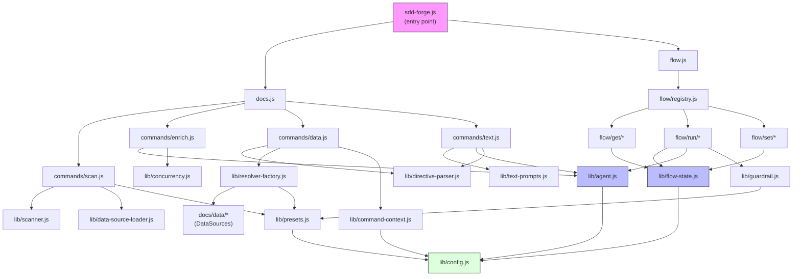

<!-- {{data("base.docs.langSwitcher", {labels: "relative"})}} -->
**English** | [日本語](ja/internal_design.md)
<!-- {{/data}} -->

# Internal Design

## Description

<!-- {{text({prompt: "Write a 1-2 sentence overview of this chapter. Include the project structure, module dependency direction, and key processing flows."})}} -->

This chapter describes the internal architecture of sdd-forge, covering two primary subsystems — the documentation generation pipeline (`src/docs/`) and the SDD flow engine (`src/flow/`) — along with the shared core library layer (`src/lib/`) that both depend on. Dependencies flow strictly downward from CLI entry points through command handlers into library modules, with AI agent invocations isolated in `lib/agent.js` and flow state persistence centralized in `lib/flow-state.js`.
<!-- {{/text}} -->

## Content

### Project Structure

<!-- {{text({prompt: "Describe the project's directory structure as a tree-format code block. Include role comments for key directories and files. Generate from the actual source code structure.", mode: "deep"})}} -->

```
src/
├── docs/                         # Documentation generation subsystem
│   ├── commands/                 # CLI command handlers
│   │   ├── scan.js               # Source file scanning → analysis.json
│   │   ├── enrich.js             # AI enrichment of analysis entries
│   │   ├── data.js               # {{data}} directive population
│   │   └── text.js               # {{text}} directive AI generation
│   ├── data/                     # DataSource implementations
│   │   ├── agents.js             # Agent metadata (SDD template, scripts)
│   │   ├── docs.js               # Chapter listings, navigation, lang switcher
│   │   ├── lang.js               # Language navigation links
│   │   ├── project.js            # package.json metadata
│   │   └── text.js               # Text stub DataSource
│   └── lib/                      # Shared docs pipeline libraries
│       ├── directive-parser.js   # {{data}}/{{text}} directive parsing and resolution
│       ├── resolver-factory.js   # DataSource resolver instantiation
│       ├── scanner.js            # File traversal and glob matching
│       ├── template-merger.js    # Preset template layer merging
│       ├── text-prompts.js       # AI prompt construction for text directives
│       ├── minify.js             # Language-agnostic minification dispatcher
│       ├── chapter-resolver.js   # Category-to-chapter mapping
│       ├── command-context.js    # Shared command context and chapter file resolution
│       ├── analysis-filter.js    # docs.exclude glob filtering
│       ├── concurrency.js        # Bounded async concurrency pool
│       └── lang/                 # Language-specific parsers (js, php, py, yaml)
├── flow/                         # SDD workflow engine
│   ├── commands/                 # Complex multi-step operations
│   │   └── review.js             # AI code review pipeline
│   ├── get/                      # Read-only query handlers
│   │   ├── check.js              # Prerequisite and git state validation
│   │   ├── context.js            # Analysis entry search (ngram / AI / fallback)
│   │   ├── guardrail.js          # Phase-filtered guardrail retrieval
│   │   ├── resolve-context.js    # Full flow context assembly for skills
│   │   └── qa-count.js           # QA question metric query
│   ├── run/                      # Step execution handlers
│   │   ├── gate.js               # Spec gate and guardrail compliance check
│   │   ├── prepare-spec.js       # Spec directory + git branch initialization
│   │   ├── retro.js              # Post-implementation retrospective
│   │   ├── review.js             # Code review executor (delegates to commands/)
│   │   ├── impl-confirm.js       # Implementation readiness check
│   │   └── lint.js               # Guardrail lint check on changed files
│   ├── set/                      # State mutation handlers
│   │   ├── step.js               # Step status update
│   │   ├── req.js                # Requirement status update
│   │   ├── metric.js             # Phase metric counter increment
│   │   ├── note.js               # Timestamped note append
│   │   ├── summary.js            # Requirements array initialization
│   │   ├── request.js            # User request text persistence
│   │   └── redo.js               # Redo log management
│   └── registry.js               # Command dispatch table with pre/post hooks
├── lib/                          # Core shared libraries
│   ├── agent.js                  # Claude CLI invocation (sync and async with retry)
│   ├── flow-state.js             # Flow state persistence, mutation, and worktree resolution
│   ├── flow-envelope.js          # Structured JSON output protocol (ok/fail/warn)
│   ├── guardrail.js              # Guardrail loading, merging, and filtering
│   ├── i18n.js                   # Multilingual message loading with deep merge
│   ├── config.js                 # Config loading and SDD path helpers
│   ├── presets.js                # Preset chain resolution and directory lookup
│   ├── skills.js                 # Skill file deployment to .agents/ and .claude/
│   ├── git-state.js              # Git worktree status utilities
│   ├── lint.js                   # Lint guardrail execution against changed files
│   ├── json-parse.js             # Lenient JSON repair for AI output
│   └── process.js                # spawnSync thin wrapper
├── presets/                      # Preset chain definitions, templates, and guardrails
└── locale/                       # i18n JSON message files (en, ja, ...)
```
<!-- {{/text}} -->

### Module Composition

<!-- {{text({prompt: "List the major modules in table format. Include module name, file path, and responsibility. Extract from import/require relationships and exports in each file.", mode: "deep"})}} -->

| Module | File Path | Responsibility |
| --- | --- | --- |
| scan | `src/docs/commands/scan.js` | Loads preset DataSources, walks source files, computes hashes, writes `analysis.json` |
| enrich | `src/docs/commands/enrich.js` | Batches analysis entries and calls AI to annotate each with summary, detail, chapter, role, and keywords |
| data | `src/docs/commands/data.js` | Resolves `{{data}}` directives in chapter files using DataSource resolvers against `analysis.json` |
| text | `src/docs/commands/text.js` | Fills `{{text}}` directives in chapter files by sending enriched context to the AI agent in batch or per-directive mode |
| directive-parser | `src/docs/lib/directive-parser.js` | Parses `{{data}}`, `{{text}}`, and block directives from Markdown; applies resolved values in-place |
| resolver-factory | `src/docs/lib/resolver-factory.js` | Instantiates DataSource classes from preset chain `data/` directories and exposes a unified `resolve()` interface |
| template-merger | `src/docs/lib/template-merger.js` | Merges preset-chain template layers using block inheritance and additive multi-chain merging |
| text-prompts | `src/docs/lib/text-prompts.js` | Builds AI system prompts, per-directive prompts, and batch JSON prompts from enriched analysis context |
| scanner | `src/docs/lib/scanner.js` | Provides file traversal, glob-to-regex conversion, hash computation, and language handler dispatch |
| command-context | `src/docs/lib/command-context.js` | Resolves shared command context (root, config, agent, lang, docsDir) and chapter file ordering |
| flow/registry | `src/flow/registry.js` | Central dispatch table mapping flow command paths to execute functions with optional pre/post lifecycle hooks |
| flow/get/context | `src/flow/get/context.js` | Searches analysis entries by query using ngram similarity, fallback keyword, or AI-assisted keyword selection |
| flow/get/resolve-context | `src/flow/get/resolve-context.js` | Assembles full flow context (git state, spec sections, step progress, worktree) for skill consumption |
| flow/run/gate | `src/flow/run/gate.js` | Validates spec files structurally and via AI guardrail compliance checks |
| flow/run/prepare-spec | `src/flow/run/prepare-spec.js` | Initializes spec directory, writes spec.md and qa.md templates, creates git branch or worktree, saves flow state |
| lib/agent | `src/lib/agent.js` | Invokes the Claude CLI synchronously or asynchronously; handles stdin delivery for large prompts and retry logic |
| lib/flow-state | `src/lib/flow-state.js` | Reads, writes, and atomically mutates `flow.json`; tracks active flows and resolves worktree vs main-repo paths |
| lib/flow-envelope | `src/lib/flow-envelope.js` | Provides `ok`, `fail`, and `warn` envelope constructors and serializes output to stdout as structured JSON |
| lib/guardrail | `src/lib/guardrail.js` | Loads and merges guardrail definitions from preset chains and project overrides; filters by phase and lint scope |
| lib/i18n | `src/lib/i18n.js` | Loads and deep-merges locale JSON from package, preset, and project tiers; supports namespaced key lookup and interpolation |
| lib/presets | `src/lib/presets.js` | Resolves preset parent chains and returns ordered directory lists for template and DataSource loading |
<!-- {{/text}} -->

### Module Dependencies

<!-- {{text({prompt: "Generate a mermaid graph showing inter-module dependencies. Analyze import/require statements in the source code and show the layer structure and dependency direction. Output only the mermaid code block.", mode: "deep"})}} -->


<!-- {{/text}} -->

### Key Processing Flows

<!-- {{text({prompt: "Describe the inter-module data and control flow when running a representative command in numbered steps. Include the flow from entry point to final output.", mode: "deep"})}} -->

The following steps trace a `sdd-forge build` invocation, which exercises the full documentation generation pipeline:

1. **Entry** — `sdd-forge.js` parses the subcommand and delegates to `docs.js`, which reads `config.json` via `lib/config.js` and resolves the preset type.
2. **scan** — `commands/scan.js` calls `resolveMultiChains()` from `lib/presets.js` to obtain the preset directory chain, then loads DataSource modules from each `data/` subdirectory via `lib/data-source-loader.js`. It walks source files using glob patterns from `lib/scanner.js`, computes MD5 hashes, and writes structured category entries to `.sdd-forge/output/analysis.json`, preserving previously enriched fields for unchanged files.
3. **enrich** — `commands/enrich.js` reads `analysis.json` and collects all entries across every category. Entries are split into token-limited batches via `splitIntoBatches()`, then processed in parallel using `mapWithConcurrency()`. Each batch is sent to the AI agent via `lib/agent.js` with a prompt built by `buildEnrichPrompt()` referencing the available chapter list. JSON responses are repaired by `lib/json-parse.js`, merged back into `analysis.json`, and saved after each batch for incremental progress.
4. **data** — `commands/data.js` creates a resolver via `lib/resolver-factory.js`, which instantiates all DataSource classes from the preset chain and the project's `.sdd-forge/data/` directory. For each chapter file, `resolveDataDirectives()` from `lib/directive-parser.js` iterates `{{data}}` blocks, calls the appropriate `DataSource` method, and replaces block content in place. File-context rules ensure navigation and lang-switcher methods receive the correct relative path.
5. **text** — `commands/text.js` reads each chapter file, parses `{{text}}` directives, and retrieves enriched context for the chapter from `getEnrichedContext()` in `lib/text-prompts.js`. In batch mode (the default), all directives are submitted in a single JSON-structured AI call via `lib/agent.js`. The JSON response is parsed and applied by `applyBatchJsonToFile()`. A shrinkage guard rejects responses that reduce file length by more than 50%.
6. **Output** — Each command writes its results to disk and logs a summary line to stderr via `lib/progress.js`. The caller receives exit code 0 on success.
<!-- {{/text}} -->

### Extension Points

<!-- {{text({prompt: "Describe the locations that need changes and extension patterns when adding new commands or features. Derive from plugin points and dispatch registration patterns in the source code.", mode: "deep"})}} -->

**Adding a new docs command**: Create a handler file in `src/docs/commands/`, export a `main(ctx)` function, and register it in `src/docs.js` alongside the existing scan/enrich/data/text entries. The command context object is standardized by `lib/command-context.js`, so the new command receives `root`, `config`, `agent`, `type`, and `docsDir` without additional wiring.

**Adding a new DataSource**: Create a class extending `DataSource` (from `src/docs/lib/data-source.js`) in `src/docs/data/` or in a preset's `data/` subdirectory. The file is auto-discovered by `lib/data-source-loader.js` at startup. Public methods on the class become callable from `{{data("preset.sourceName.methodName")}}` directives in chapter templates with no additional registration.

**Adding a new preset**: Create a directory under `src/presets/<name>/` with a `preset.json` that declares `parent`, `scan` glob patterns, `chapters` order, and optional `label`. Add template files under `templates/<lang>/` — they are automatically merged with parent templates by `lib/template-merger.js` using the block inheritance system. Guardrail rules go in `templates/<lang>/guardrail.json`.

**Adding a new flow step**: Append a step ID to `FLOW_STEPS` in `src/lib/flow-state.js` and add the corresponding `PHASE_MAP` entry. Register the step in `src/flow/registry.js` under the appropriate sub-namespace (`get`, `run`, or `set`) with an `execute` dynamic import and optional `pre`/`post` lifecycle hooks using the `stepPre`/`stepPost` factory functions already present in the file.

**Adding project-level guardrails**: Create or update `.sdd-forge/guardrail.json` in the target project. Entries with matching `id` fields override preset guardrails; new entries are appended. Phase assignment (`meta.phase`) and optional lint regex (`meta.lint`) require no code changes — `lib/guardrail.js` handles loading and merging automatically.
<!-- {{/text}} -->

---

<!-- {{data("base.docs.nav")}} -->
[← Configuration and Customization](configuration.md)
<!-- {{/data}} -->
