<!-- {{data("base.docs.langSwitcher", {labels: "relative"})}} -->
**English** | [日本語](ja/internal_design.md)
<!-- {{/data}} -->

# Internal Design

## Description

<!-- {{text({prompt: "Write a 1-2 sentence overview of this chapter. Include the project structure, module dependency direction, and key processing flows."})}} -->

sdd-forge is a CLI tool organized around two entry points (`docs.js` for documentation commands and `flow.js` for SDD flow commands), where source scanning and AI enrichment feed into a directive-based chapter population pipeline, and flow commands orchestrate spec-driven development steps through a registry-dispatched, flow-state-backed execution model with preset chain inheritance running from leaf to base throughout all data resolution.
<!-- {{/text}} -->

## Content

### Project Structure

<!-- {{text({prompt: "Describe the project's directory structure as a tree-format code block. Include role comments for key directories and files. Generate from the actual source code structure.", mode: "deep"})}} -->

```
src/
├── docs.js                  # Entry point: documentation subcommand dispatcher
├── flow.js                  # Entry point: SDD flow subcommand dispatcher
├── docs/
│   ├── commands/
│   │   ├── scan.js          # Scans source files, writes analysis.json with stable IDs and MD5 hashes
│   │   ├── enrich.js        # AI-powered batch annotation of analysis entries
│   │   ├── data.js          # Populates {{data}} directives from analysis.json
│   │   └── text.js          # Fills {{text}} directives via AI; supports incremental rebuild
│   ├── data/
│   │   ├── agents.js        # DataSource: agent configuration
│   │   ├── docs.js          # DataSource: documentation metadata
│   │   ├── lang.js          # DataSource: language statistics
│   │   ├── project.js       # DataSource: project-level info
│   │   └── text.js          # DataSource: text directive content
│   └── lib/
│       ├── directive-parser.js    # Parses and resolves {{data}}/{{text}} directives in-place
│       ├── resolver-factory.js    # createResolver(): loads preset chain, instantiates DataSources
│       ├── data-source.js         # Base class for all DataSources
│       ├── data-source-loader.js  # Dynamic import of data/ files; calls init(ctx) on each
│       ├── scanner.js             # File collection, glob matching, stat and parse utilities
│       ├── lang-factory.js        # EXT_MAP: maps file extensions to language handlers
│       ├── minify.js              # Unified dispatcher: getLangHandler → minify/extractEssential
│       ├── template-merger.js     # Preset template inheritance: buildLayers, resolveTemplates
│       ├── text-prompts.js        # Prompt builders for text generation
│       ├── forge-prompts.js       # Prompt builders for forge/review commands
│       ├── chapter-resolver.js    # Category-to-chapter mapping from docs structure
│       ├── command-context.js     # resolveCommandContext, getChapterFiles, loadFullAnalysis
│       ├── concurrency.js         # mapWithConcurrency: bounded async concurrency pool
│       ├── analysis-entry.js      # AnalysisEntry model, ANALYSIS_META_KEYS, buildSummary
│       ├── analysis-filter.js     # filterAnalysisByDocsExclude
│       ├── review-parser.js       # parseFileResults, summarizeReview, extractNeedsInput
│       ├── scan-source.js         # Scannable mixin
│       └── toml-parser.js         # Minimal TOML parser
├── flow/
│   ├── registry.js          # FLOW_COMMANDS dispatch table with execute factories and hooks
│   ├── get/                 # Read-only flow query handlers (check, context, guardrail, qa-count, resolve-context)
│   ├── run/                 # Mutating flow step handlers (gate, prepare-spec, impl-confirm, lint, review, retro, finalize)
│   └── set/                 # Flow state mutation handlers (step, req, metric, note, redo, summary, request)
├── lib/
│   ├── agent.js             # callAgent/callAgentAsync, resolveAgent, buildAgentInvocation
│   ├── flow-envelope.js     # ok/fail/warn constructors; output() serializes JSON to stdout
│   ├── flow-state.js        # loadFlowState, saveFlowState, mutateFlowState, FLOW_STEPS, PHASE_MAP
│   ├── git-state.js         # getWorktreeStatus, getCurrentBranch, isGhAvailable
│   ├── guardrail.js         # loadMergedGuardrails, filterByPhase, matchScope, hydrate
│   ├── i18n.js              # createI18n, translate with deepMerge locale loading
│   ├── lint.js              # validateLintGuardrails, runLintChecks, runLint
│   ├── presets.js           # PRESETS_DIR, resolveChainSafe, resolveMultiChains, presetByLeaf
│   ├── process.js           # runSync wrapping spawnSync
│   ├── progress.js          # ANSI progress bar/spinner
│   └── skills.js            # deploySkills: writes SKILL.md templates to agent skill directories
├── presets/                 # base, node, php, cli, webapp, library, node-cli, cakephp2, laravel, symfony
├── locale/                  # en/, ja/ i18n message files
└── templates/skills/        # SKILL.md templates
```
<!-- {{/text}} -->

### Module Composition

<!-- {{text({prompt: "List the major modules in table format. Include module name, file path, and responsibility. Extract from import/require relationships and exports in each file.", mode: "deep"})}} -->

| Module | File Path | Responsibility |
|---|---|---|
| docs.js | `src/docs.js` | Documentation subcommand dispatcher; routes to scan, enrich, data, text, and other commands |
| flow.js | `src/flow.js` | SDD flow subcommand dispatcher; routes via registry.js dispatch table |
| scan.js | `src/docs/commands/scan.js` | Collects source files via DataSources, computes MD5 hashes, assigns stable IDs, writes `analysis.json` |
| enrich.js | `src/docs/commands/enrich.js` | Reads `analysis.json`, calls AI in bounded batches via `mapWithConcurrency` to annotate each entry with summary, detail, chapter, and keywords |
| data.js | `src/docs/commands/data.js` | Loads `analysis.json`, resolves `{{data}}` directives in chapter files using `createResolver()` and `resolveDataDirectives`; exports `populateFromAnalysis` |
| text.js | `src/docs/commands/text.js` | Resolves `{{text}}` directives via AI; supports full and incremental rebuild via `detectChangedChapters` |
| directive-parser.js | `src/docs/lib/directive-parser.js` | Parses `{{data}}` and `{{text}}` directive blocks in markdown; `resolveDataDirectives` replaces blocks in-place |
| resolver-factory.js | `src/docs/lib/resolver-factory.js` | `createResolver()` loads preset chain via `resolveMultiChains`, instantiates DataSources, returns `resolve()` interface |
| data-source.js | `src/docs/lib/data-source.js` | Base class for all DataSources; provides `toMarkdownTable`, `desc`, and `mergeDesc` helpers |
| data-source-loader.js | `src/docs/lib/data-source-loader.js` | Dynamically imports `.js` files from a `data/` directory and calls `init(ctx)` on each default-export class instance |
| scanner.js | `src/docs/lib/scanner.js` | `collectFiles`, `globToRegex`, `getFileStats`, `parseFile`, `findFiles` — core file traversal and parsing |
| lang-factory.js | `src/docs/lib/lang-factory.js` | `EXT_MAP` mapping file extensions to language-specific handler modules (js, php, py, yaml) |
| minify.js | `src/docs/lib/minify.js` | Unified dispatcher: resolves language handler then calls `handler.minify` or `extractEssential` |
| template-merger.js | `src/docs/lib/template-merger.js` | Preset template inheritance engine: `buildLayers`, `resolveTemplates`, `mergeResolved` |
| chapter-resolver.js | `src/docs/lib/chapter-resolver.js` | `buildCategoryMapFromDocs`, `mergeChapters` — maps analysis categories to chapter files |
| command-context.js | `src/docs/lib/command-context.js` | `resolveCommandContext`, `getChapterFiles`, `loadFullAnalysis` — shared setup for docs commands |
| concurrency.js | `src/docs/lib/concurrency.js` | `mapWithConcurrency` — bounded async concurrency pool for AI batch calls |
| analysis-entry.js | `src/docs/lib/analysis-entry.js` | `AnalysisEntry` model, `ANALYSIS_META_KEYS`, `isEmptyEntry`, `buildSummary` |
| registry.js | `src/flow/registry.js` | `FLOW_COMMANDS` dispatch table mapping nested keys (e.g. `get.check`, `run.gate`) to lazy-imported execute factories with pre/post hooks |
| flow-envelope.js | `src/lib/flow-envelope.js` | `ok`/`fail`/`warn` constructors; `output()` serializes result as JSON to stdout and sets `process.exitCode` |
| flow-state.js | `src/lib/flow-state.js` | `loadFlowState`, `saveFlowState`, `mutateFlowState`, `FLOW_STEPS`, `PHASE_MAP`, `derivePhase` — persistent SDD flow state management |
| agent.js | `src/lib/agent.js` | `callAgent` (sync), `callAgentAsync` (spawn + retry), `resolveAgent`, `buildAgentInvocation`, `writeAgentContext` |
| presets.js | `src/lib/presets.js` | `resolveChainSafe`, `resolveMultiChains`, `presetByLeaf` — preset chain resolution from leaf to base |
| guardrail.js | `src/lib/guardrail.js` | `loadMergedGuardrails`, `filterByPhase`, `matchScope`, `hydrate` — merges preset and project guardrail overrides |
| git-state.js | `src/lib/git-state.js` | `getWorktreeStatus`, `getCurrentBranch`, `getAheadCount`, `getLastCommit`, `isGhAvailable` |
| i18n.js | `src/lib/i18n.js` | `createI18n`, `translate` — multi-tier locale loading with `deepMerge` |
| lint.js | `src/lib/lint.js` | `validateLintGuardrails`, `getChangedFiles`, `runLintChecks`, `runLint` |
| skills.js | `src/lib/skills.js` | `deploySkills` — resolves and writes SKILL.md templates to `.agents/skills/` and `.claude/skills/` |
<!-- {{/text}} -->

### Module Dependencies

```mermaid
graph TD
    subgraph EntryPoints["Entry Points"]
        DOCS["docs.js"]
        FLOW["flow.js"]
    end

    subgraph DocsCommands["src/docs/commands/"]
        SCAN["scan.js"]
        ENRICH["enrich.js"]
        DATA["data.js"]
        TEXT["text.js"]
    end

    subgraph DocsLib["src/docs/lib/"]
        DIRPARSER["directive-parser.js"]
        RESFACT["resolver-factory.js"]
        DATASRCLOADER["data-source-loader.js"]
        DATASRC["data-source.js"]
        SCANNER["scanner.js"]
        LANGFACT["lang-factory.js"]
        MINIFY["minify.js"]
        TMPLMERGE["template-merger.js"]
        CMDCTX["command-context.js"]
        CONCUR["concurrency.js"]
        ANAENTRY["analysis-entry.js"]
    end

    subgraph DocsData["src/docs/data/"]
        DSDOCS["docs.js"]
        DSLANG["lang.js"]
        DSPROJECT["project.js"]
        DSAGENTS["agents.js"]
        DSTEXT["text.js"]
    end

    subgraph FlowRegistry["src/flow/"]
        REGISTRY["registry.js"]
        FLOWGET["get/*.js"]
        FLOWRUN["run/*.js"]
        FLOWSET["set/*.js"]
    end

    subgraph Lib["src/lib/"]
        AGENT["agent.js"]
        ENVELOPE["flow-envelope.js"]
        STATE["flow-state.js"]
        GIT["git-state.js"]
        GUARDRAIL["guardrail.js"]
        PRESETS["presets.js"]
        I18N["i18n.js"]
        LINT["lint.js"]
        PROCESS["process.js"]
    end

    DOCS --> SCAN
    DOCS --> ENRICH
    DOCS --> DATA
    DOCS --> TEXT

    FLOW --> REGISTRY
    REGISTRY --> FLOWGET
    REGISTRY --> FLOWRUN
    REGISTRY --> FLOWSET

    SCAN --> CMDCTX
    SCAN --> SCANNER
    SCAN --> LANGFACT
    SCAN --> MINIFY
    SCAN --> ANAENTRY
    ENRICH --> CMDCTX
    ENRICH --> CONCUR
    ENRICH --> AGENT
    DATA --> CMDCTX
    DATA --> RESFACT
    DATA --> DIRPARSER
    TEXT --> CMDCTX
    TEXT --> DIRPARSER
    TEXT --> CONCUR
    TEXT --> AGENT

    RESFACT --> PRESETS
    RESFACT --> DATASRCLOADER
    RESFACT --> TMPLMERGE
    DATASRCLOADER --> DSDOCS
    DATASRCLOADER --> DSLANG
    DATASRCLOADER --> DSPROJECT
    DATASRCLOADER --> DSAGENTS
    DATASRCLOADER --> DSTEXT
    DSDOCS --> DATASRC
    DSLANG --> DATASRC
    DSPROJECT --> DATASRC
    DSAGENTS --> DATASRC
    DSTEXT --> DATASRC

    MINIFY --> LANGFACT

    FLOWGET --> ENVELOPE
    FLOWGET --> STATE
    FLOWGET --> GIT
    FLOWGET --> GUARDRAIL
    FLOWRUN --> ENVELOPE
    FLOWRUN --> STATE
    FLOWRUN --> AGENT
    FLOWRUN --> GIT
    FLOWRUN --> LINT
    FLOWSET --> ENVELOPE
    FLOWSET --> STATE

    GUARDRAIL --> PRESETS
    LINT --> GIT
    AGENT --> PROCESS
```

<!-- {{text({prompt: "Generate a mermaid graph showing inter-module dependencies. Analyze import/require statements in the source code and show the layer structure and dependency direction. Output only the mermaid code block.", mode: "deep"})}} -->


<!-- {{/text}} -->

### Key Processing Flows

<!-- {{text({prompt: "Describe the inter-module data and control flow when running a representative command in numbered steps. Include the flow from entry point to final output.", mode: "deep"})}} -->

1. `docs.js` receives the `data` subcommand and dynamically imports `src/docs/commands/data.js`.
2. `data.js` calls `resolveCommandContext()` from `command-context.js`, which loads project config, resolves the preset chain via `presets.js` (`resolveMultiChains`), and determines chapter file paths via `getChapterFiles()`.
3. `loadFullAnalysis()` (also from `command-context.js`) reads `analysis.json` from `.sdd-forge/output/` and parses it into `AnalysisEntry` objects using `analysis-entry.js`.
4. `data.js` calls `createResolver()` from `resolver-factory.js`, which uses `data-source-loader.js` to dynamically import each `.js` file in the preset chain's `data/` directories and calls `init(ctx)` on each default-export DataSource instance (extending `data-source.js`).
5. `createResolver()` also invokes `template-merger.js` (`buildLayers`, `resolveTemplates`, `mergeResolved`) to merge preset template definitions across the chain from leaf to base.
6. For each chapter file, `data.js` reads the markdown content and passes it to `directive-parser.js` (`resolveDataDirectives`), which identifies each `{{data: <key>}}` block.
7. For each directive key, `resolveDataDirectives` calls `resolve(key, analysisEntries)` on the resolver, which dispatches to the matching DataSource's method and returns rendered markdown (often via `toMarkdownTable` on the DataSource base class).
8. `directive-parser.js` replaces the content between the directive tags in-place with the resolved markdown string.
9. The updated chapter file content is written back to disk, completing the `{{data}}` population for that chapter.
10. Steps 6–9 repeat for each chapter file; no AI calls are made — `data.js` is a purely deterministic, analysis-driven population step.
<!-- {{/text}} -->

### Extension Points

<!-- {{text({prompt: "Describe the locations that need changes and extension patterns when adding new commands or features. Derive from plugin points and dispatch registration patterns in the source code.", mode: "deep"})}} -->

**Adding a new docs command**
- Create `src/docs/commands/<name>.js` implementing a `main()` function.
- Register the subcommand in `src/docs.js` dispatch logic (import and route the new command by name).
- If the command needs shared project context, call `resolveCommandContext()` from `src/docs/lib/command-context.js`.

**Adding a new DataSource**
- Create `src/docs/data/<name>.js` (or within a preset's `data/` directory) exporting a default class that extends `DataSource` from `src/docs/lib/data-source.js`.
- Implement `init(ctx)` on the class; `data-source-loader.js` discovers and initializes it automatically by scanning the `data/` directory — no manual registration required.
- The resolver key used in `{{data: <key>}}` directives must match the method or mapping exposed by the DataSource.

**Adding a new flow command**
- Create the handler module under `src/flow/get/`, `src/flow/run/`, or `src/flow/set/` depending on whether the command reads state, mutates flow execution, or writes state.
- Register the command in `src/flow/registry.js` under `FLOW_COMMANDS` using the nested key convention (e.g. `run.mycommand`), providing a lazy `execute` factory and optional `pre`/`post` hooks via `stepPre`/`stepPost` wrappers.
- The handler must use `ok`/`fail`/`warn` from `src/lib/flow-envelope.js` and call `output()` to serialize results; set `process.exitCode` rather than calling `process.exit()`.

**Adding a new preset**
- Create a directory under `src/presets/<name>/` containing at minimum a `preset.json` with `parent` chain reference, a `chapters` array, and a `type` leaf name.
- Add language-specific DataSources to `src/presets/<name>/data/` if needed; they are auto-discovered by `data-source-loader.js`.
- Add guardrail rules to `.sdd-forge/guardrail.json` for project-level overrides, or embed them in the preset; `src/lib/guardrail.js` merges by ID with project overrides taking precedence.
- Register the preset leaf name in `src/lib/presets.js` (`presetByLeaf`) if the auto-discovery path is not sufficient.

**Adding a new language handler**
- Create `src/docs/lib/langs/<ext>.js` implementing `minify` and/or `extractEssential` exports.
- Register the file extension mapping in `src/docs/lib/lang-factory.js` under `EXT_MAP`; `minify.js` dispatches to handlers via this map automatically.
<!-- {{/text}} -->

---

<!-- {{data("base.docs.nav")}} -->
[← Configuration and Customization](configuration.md)
<!-- {{/data}} -->
