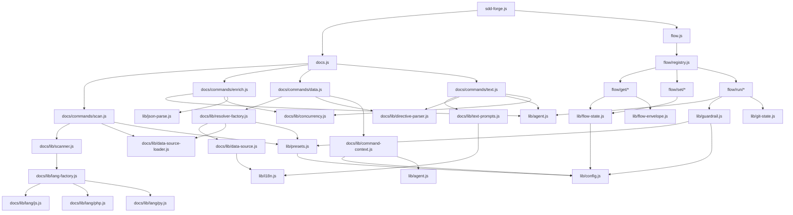

<!-- {{data("base.docs.langSwitcher", {labels: "relative"})}} -->
**English** | [日本語](ja/internal_design.md)
<!-- {{/data}} -->

# Internal Design

## Description

<!-- {{text({prompt: "Write a 1-2 sentence overview of this chapter. Include the project structure, module dependency direction, and key processing flows."})}} -->

This chapter describes sdd-forge's layered architecture, in which a single CLI entry point dispatches to three domain subsystems — docs generation, spec management, and the SDD flow lifecycle — each backed by a shared library of DataSources, directive parsers, and AI agent wrappers. Data flows unidirectionally from source scanning through AI-powered enrichment into template-driven documentation, while the flow subsystem maintains its own persistent state in `specs/<id>/flow.json` and communicates with consumers via structured JSON envelopes.
<!-- {{/text}} -->

## Content

### Project Structure

<!-- {{text({prompt: "Describe the project's directory structure as a tree-format code block. Include role comments for key directories and files. Generate from the actual source code structure.", mode: "deep"})}} -->

```
src/
├── sdd-forge.js              # CLI entry point; dispatches to docs, spec, flow
├── docs.js                   # docs subcommand dispatcher
├── flow.js                   # flow subcommand dispatcher
├── docs/
│   ├── commands/             # Executable doc-generation commands
│   │   ├── scan.js           # Traverses source, runs DataSources, writes analysis.json
│   │   ├── enrich.js         # AI-batched annotation of analysis entries
│   │   ├── data.js           # Resolves {{data}} directives in chapter files
│   │   ├── text.js           # Fills {{text}} directives via AI agent
│   │   └── forge.js          # Multi-round AI doc writing pipeline
│   ├── data/                 # Built-in DataSource implementations
│   │   ├── project.js        # name, description, version from package.json
│   │   ├── docs.js           # chapter list, nav links, lang switcher
│   │   ├── lang.js           # language navigation link generator
│   │   ├── agents.js         # SDD template and agent config metadata
│   │   └── text.js           # Placeholder DataSource stub
│   └── lib/                  # Doc-generation library
│       ├── lang/             # Language-specific file parsers
│       │   ├── js.js         # JS/TS: minify, parse, extractEssential
│       │   ├── php.js        # PHP: minify, parse, extractEssential
│       │   ├── py.js         # Python: minify, extractEssential
│       │   └── yaml.js       # YAML: comment-stripping minifier
│       ├── scanner.js        # File traversal, hash, glob-to-regex
│       ├── directive-parser.js  # Parses {{data}}, {{text}}, 
│       ├── template-merger.js   # Preset-chain template resolution and merging
│       ├── resolver-factory.js  # Instantiates DataSource resolvers per preset chain
│       ├── data-source.js       # DataSource base class
│       ├── data-source-loader.js # Dynamic DataSource module discovery
│       ├── command-context.js   # Shared context resolution for all commands
│       ├── text-prompts.js      # AI prompt builders for text directives
│       ├── concurrency.js       # mapWithConcurrency utility
│       ├── analysis-entry.js    # AnalysisEntry base class and summary helpers
│       └── chapter-resolver.js  # Maps analysis categories to chapter files
├── flow/
│   ├── registry.js           # FLOW_COMMANDS map with pre/post lifecycle hooks
│   ├── get/                  # Read-only flow query commands
│   │   ├── check.js          # Prerequisite checks (impl, dirty, gh)
│   │   ├── context.js        # Analysis entry search and file reading
│   │   ├── guardrail.js      # Returns phase-filtered guardrail articles
│   │   ├── qa-count.js       # Returns QA question count from flow state
│   │   └── resolve-context.js # Full flow context resolution for skills
│   ├── set/                  # Flow state mutation commands
│   │   ├── step.js           # Sets step status in flow.json
│   │   ├── req.js            # Updates requirement status by index
│   │   ├── metric.js         # Increments phase counters (question, redo, ...)
│   │   ├── note.js           # Appends timestamped notes
│   │   ├── summary.js        # Initialises requirements array from JSON
│   │   └── redo.js           # Appends entries to redolog.json
│   └── run/                  # Multi-step execution commands
│       ├── prepare-spec.js   # Creates spec dir, branch/worktree, initial flow state
│       ├── gate.js           # Spec quality gate: heuristic + AI guardrail check
│       ├── impl-confirm.js   # Checks requirements completion before review
│       └── retro.js          # AI retrospective comparing diff vs requirements
└── lib/                      # Shared cross-domain library
    ├── agent.js              # Claude CLI invocation (sync, async, retry, stdin)
    ├── flow-state.js         # flow.json CRUD and active-flow file tracking
    ├── flow-envelope.js      # ok/fail/warn envelope constructors + stdout output
    ├── guardrail.js          # Article parsing, phase filtering, preset chain merge
    ├── i18n.js               # Locale loading, deep-merge, namespaced translation
    ├── presets.js            # Preset chain resolution (resolveChainSafe, etc.)
    ├── config.js             # Config loading and path helpers
    ├── git-state.js          # Dirty detection, branch, ahead count, gh probe
    ├── json-parse.js         # Lenient JSON repair for AI output
    ├── progress.js           # ANSI progress bar and prefixed logger
    ├── skills.js             # Skill template deployment to .agents/ and .claude/
    └── include.js            # Template include directive processor
```
<!-- {{/text}} -->

### Module Composition

<!-- {{text({prompt: "List the major modules in table format. Include module name, file path, and responsibility. Extract from import/require relationships and exports in each file.", mode: "deep"})}} -->

| Module | File Path | Responsibility |
| --- | --- | --- |
| CLI entry | `src/sdd-forge.js` | Top-level argument parsing; dispatches to docs, spec, or flow subsystems |
| scan | `src/docs/commands/scan.js` | Traverses source files, invokes DataSources, merges with existing analysis.json |
| enrich | `src/docs/commands/enrich.js` | Batch AI annotation of analysis entries with summary, detail, chapter, and keywords |
| data | `src/docs/commands/data.js` | Resolves `{{data}}` directives in chapter files using the DataSource resolver |
| text | `src/docs/commands/text.js` | Fills `{{text}}` directives by calling the AI agent with enriched context |
| DataSource (base) | `src/docs/lib/data-source.js` | Base class providing desc lookup, override merging, and Markdown table rendering |
| resolver-factory | `src/docs/lib/resolver-factory.js` | Instantiates preset-chain DataSources and returns a unified `resolve()` interface |
| directive-parser | `src/docs/lib/directive-parser.js` | Parses and in-place resolves `{{data}}`, `{{text}}`, and `` directives |
| template-merger | `src/docs/lib/template-merger.js` | Resolves preset inheritance chains into final per-chapter Markdown templates |
| scanner | `src/docs/lib/scanner.js` | File traversal, MD5 hash computation, glob-to-regex matching, language dispatch |
| lang-factory | `src/docs/lib/lang-factory.js` | Maps file extensions to language-specific handler modules |
| lang/js | `src/docs/lib/lang/js.js` | JS/TS minification, class/function parse, import and export extraction |
| lang/php | `src/docs/lib/lang/php.js` | PHP minification, class/method/relation parse, essential-line extraction |
| command-context | `src/docs/lib/command-context.js` | Resolves shared context (root, config, agent, docsDir) consumed by all doc commands |
| text-prompts | `src/docs/lib/text-prompts.js` | Builds AI system prompts, per-directive prompts, and batch prompts for text generation |
| concurrency | `src/docs/lib/concurrency.js` | `mapWithConcurrency()` — bounded async worker pool for parallel AI calls |
| analysis-entry | `src/docs/lib/analysis-entry.js` | AnalysisEntry base class, ANALYSIS_META_KEYS set, buildSummary helper |
| chapter-resolver | `src/docs/lib/chapter-resolver.js` | Builds category-to-chapter map by scanning `{{data}}` directives in templates |
| agent | `src/lib/agent.js` | Synchronous and async Claude CLI invocation with retry, stdin fallback, and ARG_MAX guard |
| flow-state | `src/lib/flow-state.js` | flow.json CRUD; step, requirement, and metric mutation; active-flow file management |
| flow-envelope | `src/lib/flow-envelope.js` | `ok`/`fail`/`warn` envelope constructors and structured JSON stdout output |
| flow registry | `src/flow/registry.js` | Maps flow subcommand names to handler import factories with pre/post lifecycle hooks |
| guardrail | `src/lib/guardrail.js` | Parses guardrail articles from Markdown, filters by phase, merges preset chain overrides |
| i18n | `src/lib/i18n.js` | Locale file loading with deep-merge across package, preset, and project tiers |
| git-state | `src/lib/git-state.js` | Dirty detection, branch name, ahead count, last commit, and gh CLI availability |
| json-parse | `src/lib/json-parse.js` | Lenient repair of malformed or fence-wrapped AI JSON output |
| progress | `src/lib/progress.js` | ANSI multi-step progress bar and prefixed logger for TTY and pipe environments |
<!-- {{/text}} -->

### Module Dependencies

<!-- {{text({prompt: "Generate a mermaid graph showing inter-module dependencies. Analyze import/require statements in the source code and show the layer structure and dependency direction. Output only the mermaid code block.", mode: "deep"})}} -->


<!-- {{/text}} -->

### Key Processing Flows

<!-- {{text({prompt: "Describe the inter-module data and control flow when running a representative command in numbered steps. Include the flow from entry point to final output.", mode: "deep"})}} -->

The following steps trace execution of `sdd-forge build`, which runs the full doc-generation pipeline (scan → enrich → data → text).

1. **Entry dispatch** — `sdd-forge.js` resolves the `build` subcommand and imports `docs.js`, which sequences the four pipeline commands against the same project root.
2. **scan** — `scan.js` calls `resolveCommandContext()` to load `config.json` and resolve the preset type. `resolveMultiChains()` builds the preset inheritance chain; `loadDataSources()` dynamically imports every `data/*.js` module from each preset directory. `collectFiles()` traverses the source root using glob patterns from `config.scan`. Each DataSource's `parse()` method extracts file metadata; entries are matched against the existing `analysis.json` index by file path and class name so unchanged entries (same MD5 hash) are preserved verbatim. The merged result is written to `.sdd-forge/output/analysis.json`.
3. **enrich** — `enrich.js` reads `analysis.json` and calls `collectEntries()` to list all unenriched items. Entries are grouped into token-limited batches by `splitIntoBatches()`. `mapWithConcurrency()` submits each batch to the AI agent via `callAgentAsync()`; the response is repaired by `repairJson()` and merged back into the analysis object. Enriched fields (`summary`, `detail`, `chapter`, `role`, `keywords`) are written incrementally so progress survives partial runs.
4. **data** — `data.js` calls `createResolver()` from `resolver-factory.js`, which instantiates the full preset-chain DataSource map with `desc` and `loadOverrides` closures. For each chapter file, `resolveDataDirectives()` in `directive-parser.js` iterates `{{data(...)}}` blocks, calls the resolver with `(preset, source, method, analysis, labels)`, and splices the returned Markdown string into the file in reverse-index order to preserve line numbers. Changed files are written back to disk.
5. **text** — `text.js` reads each chapter file and calls `getEnrichedContext()` to assemble an AI context block from all analysis entries whose `chapter` field matches the current file. `buildBatchPrompt()` wraps the cleaned chapter template and all `{{text}}` directive metadata into a single JSON-structured prompt. `callAgentAsync()` submits it; the response is parsed and each directive slot is filled by `applyBatchJsonToFile()` working in reverse index order.
6. **Final output** — All chapter files in `docs/` now contain fully resolved `{{data}}` tables and AI-generated `{{text}}` prose, ready for review or commit.
<!-- {{/text}} -->

### Extension Points

<!-- {{text({prompt: "Describe the locations that need changes and extension patterns when adding new commands or features. Derive from plugin points and dispatch registration patterns in the source code.", mode: "deep"})}} -->

**Adding a new doc command**
Create a file in `src/docs/commands/` exporting a `main(ctx)` function. Register it in the `src/docs.js` dispatch table under the desired subcommand name. The command receives a resolved context from `resolveCommandContext()` and can reuse the shared `agent`, `config`, `root`, and `t` properties without additional wiring.

**Adding a new DataSource**
Create a `.js` file in `src/presets/<preset>/data/` (or the project's `.sdd-forge/data/` for project-specific overrides) exporting a default class that extends `DataSource`. Each public method automatically becomes callable from a `{{data("<preset>.<sourceName>.<method>")}}` directive. `data-source-loader.js` discovers all files in the directory at runtime — no registration step is required.

**Adding a new flow subcommand**
Create a handler module in `src/flow/get/`, `src/flow/set/`, or `src/flow/run/` exporting an `execute(ctx)` async function. Add an entry to `FLOW_COMMANDS` in `src/flow/registry.js` with a lazy `execute` import factory. Attach optional `pre` (runs before the handler) and `post(ctx, result)` (runs after, receives the envelope) hook functions to automate step status transitions or metric increments.

**Adding a new preset**
Create a directory under `src/presets/` containing a `preset.json` with `parent`, `chapters`, and `scan` fields. Add chapter Markdown templates to `templates/<lang>/`. Place preset-specific DataSources in `data/`. Run `sdd-forge upgrade` to propagate changes into the installed project skills and settings.

**Adding guardrail articles**
Append a `<!--  --> ### Title\n<body>\n<!--  -->` block to `src/presets/<preset>/templates/<lang>/guardrail.md` for package-level rules, or to `.sdd-forge/guardrail.md` for project-specific rules. `loadMergedArticles()` merges both sources at runtime, with project articles appended after preset articles.
<!-- {{/text}} -->

---

<!-- {{data("base.docs.nav")}} -->
[← Configuration and Customization](configuration.md)
<!-- {{/data}} -->
