# 04. Internal Design

## Description

<!-- {{text: Describe the overview of this chapter in 1–2 sentences. Cover the project structure, direction of module dependencies, and key processing flows.}} -->
This chapter describes the internal architecture of sdd-forge, covering the three-level dispatch structure that routes CLI commands through dispatcher → command → library layers, and the key processing flows involved in document generation, AI invocation, and spec-driven development workflows.
<!-- {{/text}} -->

## Contents

### Project Structure

<!-- {{text[mode=deep]: Describe the directory structure of this project in a tree-format code block. Include role comments for major directories and files. Cover the dispatchers directly under src/ (sdd-forge.js, docs.js, spec.js, flow.js), docs/commands/ (subcommand implementations), docs/lib/ (document generation libraries), lib/ (shared utilities), presets/ (preset definitions), and templates/ (bundled templates).}} -->
```
sdd-forge/
├── package.json                        ← Package manifest; bin entry points to src/sdd-forge.js
└── src/
    ├── sdd-forge.js                    ← Top-level CLI entry point; routes to docs.js / spec.js / flow.js
    ├── docs.js                         ← Dispatcher for all docs-related subcommands (build, scan, forge, …)
    ├── spec.js                         ← Dispatcher for spec/gate subcommands
    ├── flow.js                         ← SDD flow automation (DIRECT_COMMAND, no sub-routing)
    ├── presets-cmd.js                  ← Presets listing command (DIRECT_COMMAND)
    ├── help.js                         ← Help text renderer
    ├── docs/
    │   ├── commands/                   ← One file per docs subcommand
    │   │   ├── scan.js                 ← Source-code scanning → analysis.json
    │   │   ├── enrich.js               ← AI enrichment of analysis.json entries
    │   │   ├── init.js                 ← Template inheritance resolution → docs/
    │   │   ├── data.js                 ← {{data}} directive resolution
    │   │   ├── text.js                 ← {{text}} directive resolution via AI
    │   │   ├── forge.js                ← Iterative doc improvement loop
    │   │   ├── review.js               ← Doc quality checker
    │   │   ├── readme.js               ← README.md generator
    │   │   ├── agents.js               ← AGENTS.md updater
    │   │   ├── changelog.js            ← Change log generator from specs/
    │   │   ├── translate.js            ← Multi-language translation
    │   │   ├── snapshot.js             ← Snapshot save / check / update
    │   │   └── …                       ← setup, upgrade, default-project, enrich
    │   ├── lib/                        ← Document-generation library layer
    │   │   ├── scanner.js              ← File discovery and PHP/JS parsing utilities
    │   │   ├── directive-parser.js     ← {{data}} / {{text}} / @block directive parser
    │   │   ├── template-merger.js      ← Template inheritance chain resolution
    │   │   ├── data-source.js          ← DataSource base class
    │   │   ├── data-source-loader.js   ← Dynamic DataSource loader
    │   │   ├── resolver-factory.js     ← createResolver() factory
    │   │   ├── forge-prompts.js        ← Prompt builders for forge command
    │   │   ├── text-prompts.js         ← Prompt builders for text command
    │   │   ├── review-parser.js        ← Review output parser and patcher
    │   │   ├── command-context.js      ← Shared context resolver for all commands
    │   │   ├── concurrency.js          ← mapWithConcurrency() utility
    │   │   └── …                       ← scan-source.js, php-array-parser.js, test-env-detection.js
    │   └── data/                       ← Common DataSource implementations
    │       ├── project.js              ← Package metadata DataSource
    │       ├── docs.js                 ← Chapter listing / lang-switcher DataSource
    │       ├── agents.js               ← AGENTS.md section DataSource
    │       └── lang.js                 ← Language switcher link DataSource
    ├── specs/
    │   └── commands/
    │       ├── init.js                 ← spec initialization (branch + spec.md)
    │       └── gate.js                 ← Pre/post implementation gate check
    ├── lib/                            ← Shared utilities used across all layers
    │   ├── agent.js                    ← AI agent invocation (sync + async)
    │   ├── cli.js                      ← repoRoot(), parseArgs(), PKG_DIR, …
    │   ├── config.js                   ← .sdd-forge/config.json loader and path helpers
    │   ├── flow-state.js               ← SDD flow state persistence
    │   ├── presets.js                  ← Auto-discovery of preset.json files
    │   ├── i18n.js                     ← Three-layer i18n with domain namespacing
    │   ├── types.js                    ← Type alias resolution
    │   ├── progress.js                 ← Progress bar and scoped logger
    │   ├── entrypoint.js               ← runIfDirect() guard utility
    │   └── …                           ← agents-md.js, process.js, projects.js
    ├── presets/                        ← Preset definitions (auto-discovered via preset.json)
    │   ├── base/                       ← Base templates and AGENTS.sdd.md
    │   ├── webapp/                     ← Generic webapp DataSources
    │   ├── cli/                        ← CLI-type DataSources (ModulesSource)
    │   ├── library/                    ← Library-type preset
    │   ├── cakephp2/                   ← CakePHP 2.x specific scan + DataSources
    │   ├── laravel/                    ← Laravel specific scan + DataSources
    │   ├── symfony/                    ← Symfony specific scan + DataSources
    │   └── node-cli/                   ← Node CLI preset (extends cli/)
    ├── locale/
    │   ├── en/                         ← English messages (ui.json, messages.json, prompts.json)
    │   └── ja/                         ← Japanese messages
    └── templates/                      ← Bundled file templates
        ├── config.example.json
        ├── review-checklist.md
        └── skills/                     ← Claude skill definitions (sdd-flow-start/close/status)
```
<!-- {{/text}} -->

### Module Overview

<!-- {{text[mode=deep]: Describe the major modules in a table format. Include module name, file path, responsibility. Cover the dispatcher layer (sdd-forge.js, docs.js, spec.js), command layer (docs/commands/*.js, specs/commands/*.js), library layer (lib/agent.js, lib/cli.js, lib/config.js, lib/flow-state.js, lib/presets.js, lib/i18n.js), and document generation layer (docs/lib/scanner.js, directive-parser.js, template-merger.js, forge-prompts.js, text-prompts.js, review-parser.js, data-source.js, resolver-factory.js).}} -->
**Dispatcher Layer**

| Module | Path | Responsibility |
| --- | --- | --- |
| CLI Entry Point | `src/sdd-forge.js` | Parses the top-level subcommand, resolves project context via env vars (`SDD_WORK_ROOT` / `SDD_SOURCE_ROOT`), and delegates to the appropriate dispatcher or handles built-in flags (`--version`). |
| Docs Dispatcher | `src/docs.js` | Routes all documentation-related subcommands (`build`, `scan`, `enrich`, `init`, `data`, `text`, `forge`, `review`, `readme`, `agents`, `changelog`, `snapshot`, `translate`, `setup`, `default`) to their command files under `docs/commands/`. |
| Spec Dispatcher | `src/spec.js` | Routes `spec` and `gate` to their implementations under `specs/commands/`. |
| Flow Command | `src/flow.js` | Direct command (no sub-routing) that automates the full SDD flow from spec creation through gate checking and implementation. |

**Command Layer**

| Module | Path | Responsibility |
| --- | --- | --- |
| scan | `src/docs/commands/scan.js` | Runs DataSource `scan()` methods per preset layer, writes `analysis.json`, and preserves enrichment data for unchanged entries via hash comparison. |
| enrich | `src/docs/commands/enrich.js` | Reads `analysis.json` and calls the AI agent in batches to attach `summary`, `detail`, `chapter`, and `role` fields to each entry. Supports resume on interruption. |
| init | `src/docs/commands/init.js` | Resolves the template inheritance chain (project-local → leaf → arch → base), runs optional AI chapter filtering, and writes template files to `docs/`. |
| data | `src/docs/commands/data.js` | Iterates chapter files and resolves all `{{data}}` directives by calling the appropriate DataSource method via `createResolver()`. |
| text | `src/docs/commands/text.js` | Resolves `{{text}}` directives by calling the configured AI agent; supports batch mode (one call per file) and per-directive mode with concurrency control. |
| forge | `src/docs/commands/forge.js` | Runs an iterative improvement loop: populate `{{data}}` → fill `{{text}}` → invoke AI agent → run review → apply deterministic patches → repeat up to `maxRuns`. |
| review | `src/docs/commands/review.js` | Validates each chapter file for minimum line count, H1 heading, unfilled directives, integrity issues (exposed directives, broken comments), and snapshot drift. |
| spec init | `src/specs/commands/init.js` | Creates a feature branch (or worktree), generates a numbered `specs/NNN-xxx/spec.md` from a template, and saves flow state. |
| gate | `src/specs/commands/gate.js` | Reads `spec.md` and runs pre- or post-implementation checks, reporting unresolved questions and blocking implementation until the spec is approved. |

**Shared Library Layer**

| Module | Path | Responsibility |
| --- | --- | --- |
| agent | `src/lib/agent.js` | Provides `callAgent()` (sync) and `callAgentAsync()` (async/streaming) for invoking AI agents. Handles `{{PROMPT}}` substitution, system prompt injection, `ARG_MAX` stdin fallback, and Claude CLI hang prevention. |
| cli | `src/lib/cli.js` | Exports `PKG_DIR`, `repoRoot()`, `sourceRoot()`, `parseArgs()`, `isInsideWorktree()`, `getMainRepoPath()`, and `formatUTCTimestamp()`. |
| config | `src/lib/config.js` | Loads and validates `.sdd-forge/config.json`; provides path helpers for all `.sdd-forge/` sub-paths (`sddDir`, `sddOutputDir`, `sddDataDir`, etc.). |
| flow-state | `src/lib/flow-state.js` | Persists SDD flow state (`spec`, `baseBranch`, `featureBranch`, `worktree*`) to `.sdd-forge/current-spec` as JSON. |
| presets | `src/lib/presets.js` | Auto-discovers all `preset.json` files under `src/presets/` and exposes `PRESETS`, `presetByLeaf()`, and `presetsForArch()`. |
| i18n | `src/lib/i18n.js` | Three-layer locale merge (package → preset → project) with domain namespacing (`ui:`, `messages:`, `prompts:`), `{{placeholder}}` interpolation, and `t.raw()` for raw values. |

**Document Generation Layer**

| Module | Path | Responsibility |
| --- | --- | --- |
| scanner | `src/docs/lib/scanner.js` | File discovery (`findFiles()`), PHP/JS source parsing (`parsePHPFile()`, `parseJSFile()`), file stats (`getFileStats()`), and extras extraction (`analyzeExtras()`). |
| directive-parser | `src/docs/lib/directive-parser.js` | Parses `{{data}}`, `{{text}}`, `@block`/`@endblock`/`@extends` directives; provides `resolveDataDirectives()` for in-place replacement. |
| template-merger | `src/docs/lib/template-merger.js` | Resolves the template inheritance chain bottom-up and merges `@block` overrides; provides `resolveChaptersOrder()` for chapter ordering. |
| forge-prompts | `src/docs/lib/forge-prompts.js` | Builds system prompts, file-level prompts, and combined prompts for the forge command; converts enriched analysis to summary text via `summaryToText()`. |
| text-prompts | `src/docs/lib/text-prompts.js` | Builds system and per-directive prompts for the text command; extracts enriched context (`getEnrichedContext()`) and analysis context (`getAnalysisContext()`) for AI calls. |
| review-parser | `src/docs/lib/review-parser.js` | Parses review command output to extract `[FAIL]`/`[MISS]` signals; applies deterministic local patches (`patchGeneratedForMisses()`) to resolve common issues. |
| data-source | `src/docs/lib/data-source.js` | Base class for all `{{data}}` resolvers; provides `init()`, `desc()`, `toRows()`, and `toMarkdownTable()`. |
| resolver-factory | `src/docs/lib/resolver-factory.js` | `createResolver()` factory that layers DataSources (common → arch preset → leaf preset → project-local) and exposes a unified `resolve(source, method, analysis, labels)` interface. |
<!-- {{/text}} -->

### Module Dependencies

```mermaid
graph TD
    CLI["sdd-forge.js\n(Entry Point)"]

    CLI --> DOCS["docs.js\n(Docs Dispatcher)"]
    CLI --> SPEC["spec.js\n(Spec Dispatcher)"]
    CLI --> FLOW["flow.js\n(Flow Command)"]
    CLI --> HELP["help.js"]

    DOCS --> SCAN["docs/commands/scan.js"]
    DOCS --> ENRICH["docs/commands/enrich.js"]
    DOCS --> INIT["docs/commands/init.js"]
    DOCS --> DATA["docs/commands/data.js"]
    DOCS --> TEXT["docs/commands/text.js"]
    DOCS --> FORGE["docs/commands/forge.js"]
    DOCS --> REVIEW["docs/commands/review.js"]
    DOCS --> AGENTS["docs/commands/agents.js"]
    DOCS --> README["docs/commands/readme.js"]

    SPEC --> SPEC_INIT["specs/commands/init.js"]
    SPEC --> GATE["specs/commands/gate.js"]

    SCAN --> DSL["docs/lib/data-source-loader.js"]
    SCAN --> SCANNER["docs/lib/scanner.js"]
    ENRICH --> AGENT["lib/agent.js"]
    INIT --> TMPL["docs/lib/template-merger.js"]
    INIT --> AGENT
    DATA --> RESOLVER["docs/lib/resolver-factory.js"]
    DATA --> DPARSER["docs/lib/directive-parser.js"]
    DATA --> CMDCTX["docs/lib/command-context.js"]
    TEXT --> AGENT
    TEXT --> TPROMPTS["docs/lib/text-prompts.js"]
    TEXT --> DPARSER
    FORGE --> AGENT
    FORGE --> FPROMPTS["docs/lib/forge-prompts.js"]
    FORGE --> RPARSER["docs/lib/review-parser.js"]
    FORGE --> DATA
    FORGE --> TEXT
    REVIEW --> DPARSER
    AGENTS --> AGENT
    AGENTS --> RESOLVER
    AGENTS --> DPARSER

    RESOLVER --> DSL
    RESOLVER --> DS["docs/lib/data-source.js"]
    DSL --> DS

    SPEC_INIT --> FLOWSTATE["lib/flow-state.js"]
    GATE --> FLOWSTATE
    FLOW --> FLOWSTATE

    SCAN --> CONFIG["lib/config.js"]
    DATA --> CONFIG
    TEXT --> CONFIG
    FORGE --> CONFIG
    FORGE --> CLI_LIB["lib/cli.js"]
    AGENT --> CLI_LIB
    CONFIG --> CLI_LIB

    INIT --> PRESETS["lib/presets.js"]
    RESOLVER --> PRESETS
    SCAN --> PRESETS

    DATA --> I18N["lib/i18n.js"]
    TEXT --> I18N
    FORGE --> I18N
    AGENTS --> I18N
```

<!-- {{text[mode=deep]: Generate a mermaid graph showing the dependencies between modules. Reflect the three-level dispatch structure and show the dependency direction from dispatcher → command → library. Output only the mermaid code block.}} -->

<!-- {{/text}} -->

### Key Processing Flows

<!-- {{text[mode=deep]: Explain the data and control flow between modules when a representative command (build or forge) is executed, using numbered steps. Include the flow from entry point → dispatch → config loading → analysis data preparation → AI invocation → file writing.}} -->
**`sdd-forge build` pipeline**

1. **Entry point** — `sdd-forge.js` receives `build` as the subcommand. It resolves `root` and `srcRoot` from `SDD_WORK_ROOT`/`SDD_SOURCE_ROOT` env vars (or `git rev-parse`), loads `.sdd-forge/config.json` via `lib/config.js`, then delegates to `docs.js`.
2. **Dispatch** — `docs.js` maps `build` to the build pipeline and executes the ordered sequence: `scan → enrich → init → data → text → readme → agents → [translate]`, each step calling the corresponding `docs/commands/*.js` file. A `createProgress()` instance from `lib/progress.js` tracks progress across steps.
3. **scan** — `docs/commands/scan.js` calls `loadScanSources()` from `docs/lib/data-source-loader.js` for each preset layer (arch → leaf → project-local). Each DataSource's `scan()` method is invoked with `srcRoot` and `scanCfg` from `preset.json`. Results are merged into a flat `analysis` object and written to `.sdd-forge/output/analysis.json`. Enrichment fields from the previous run are preserved via hash comparison.
4. **enrich** — `docs/commands/enrich.js` reads `analysis.json`, collects unenriched entries via `collectEntries()`, splits them into line-count-based batches, and calls `callAgentAsync()` from `lib/agent.js` for each batch. The AI response is parsed by `parseEnrichResponse()` and merged back into `analysis.json` incrementally (resume-safe).
5. **init** — `docs/commands/init.js` calls `resolveTemplates()` from `docs/lib/template-merger.js` to build the inheritance chain (project-local → leaf preset → arch → base) for the target language. `mergeResolved()` applies `@block`/`@endblock` overrides. If `config.chapters` is not set and an AI agent is configured, `aiFilterChapters()` calls the agent to select relevant chapters. Template files are written to `docs/`.
6. **data** — `docs/commands/data.js` calls `createResolver()` from `docs/lib/resolver-factory.js` to build a layered DataSource map. For each chapter file, `resolveDataDirectives()` in `docs/lib/directive-parser.js` iterates directives and calls `resolver.resolve(source, method, analysis, labels)` to replace `{{data}}` blocks in place. Updated files are written back to `docs/`.
7. **text** — `docs/commands/text.js` reads each chapter file, identifies `{{text}}` directives via `parseDirectives()`, and builds prompts using `buildBatchPrompt()` / `buildTextSystemPrompt()` from `docs/lib/text-prompts.js`. `callAgentAsync()` in `lib/agent.js` invokes the configured provider. The AI response is validated by `validateBatchResult()` and written back to the chapter file.
8. **readme / agents** — `docs/commands/readme.js` and `agents.js` similarly use `createResolver()` and `callAgent()` to generate `README.md` and update `AGENTS.md`.

**`sdd-forge forge` flow**

1. `sdd-forge.js` → `docs.js` → `docs/commands/forge.js`. CLI options (mode, prompt, spec, max-runs) are parsed via `lib/cli.js#parseArgs()`.
2. `loadConfig()` from `lib/config.js` reads project configuration; `resolveAgent()` from `lib/agent.js` resolves the active provider.
3. `loadFullAnalysis()` from `docs/lib/command-context.js` reads `analysis.json`; `createResolver()` builds the DataSource map; `populateFromAnalysis()` (re-exported from `data.js`) fills `{{data}}` directives.
4. If an agent is configured, `textFillFromAnalysis()` from `text.js` fills remaining `{{text}}` directives.
5. For each round (up to `maxRuns`): `buildForgeSystemPrompt()` from `docs/lib/forge-prompts.js` assembles the AI prompt including user request, spec content, and enriched analysis summary. `invokeAgent()` (wrapping `callAgentAsync()`) dispatches the call with a progress ticker.
6. `runCommand()` executes `sdd-forge review`; `summarizeReview()` and `parseReviewMisses()` from `docs/lib/review-parser.js` extract failures. `patchGeneratedForMisses()` applies deterministic local fixes.
7. If review passes, `docs/commands/readme.js` is regenerated and (if multi-language) `translate.js --force` is invoked. Loop exits.
<!-- {{/text}} -->

### Extension Points

<!-- {{text[mode=deep]: Explain where changes are needed and the extension patterns when adding new commands or features. Provide steps for each of the following: (1) adding a new docs subcommand, (2) adding a new spec subcommand, (3) adding a new preset, (4) adding a new DataSource ({{data}} resolver), and (5) adding a new AI prompt.}} -->
**(1) Adding a new docs subcommand**

1. Create `src/docs/commands/<name>.js`. Export an async `main(ctx)` function and call `runIfDirect(import.meta.url, main)` at the bottom.
2. Accept a `ctx` object built by `resolveCommandContext()` from `docs/lib/command-context.js` when called programmatically, or build it from `parseArgs()` when called directly.
3. Open `src/docs.js` and add a `case "<name>":` entry in the dispatch switch that dynamically imports your new file and calls `main()`.
4. If the command should be part of the `build` pipeline, add it to the ordered step list in the `build` case of `src/docs.js` and register a step in the `createProgress()` call.
5. Add help text entries to `src/locale/en/ui.json` and `src/locale/ja/ui.json` under `help.cmdHelp.<name>`.

**(2) Adding a new spec subcommand**

1. Create `src/specs/commands/<name>.js` with an exported `main()` function and `runIfDirect` guard.
2. Open `src/spec.js` and add a routing entry for the new subcommand name.
3. If the command interacts with the SDD flow state, use `saveFlowState()` / `loadFlowState()` / `clearFlowState()` from `src/lib/flow-state.js`.
4. Add locale strings to `src/locale/{en,ja}/ui.json`.

**(3) Adding a new preset**

1. Create a directory under `src/presets/<key>/` and add a `preset.json` with at minimum `name`, `arch`, `scan`, and `chapters` fields. The file is auto-discovered by `src/lib/presets.js`.
2. Add a `templates/<lang>/` directory with Markdown template files whose names match the `chapters` array.
3. If the preset needs custom scan logic, create `src/presets/<key>/data/<category>.js` that extends `Scannable(DataSource)` and implements `scan(sourceRoot, scanCfg)`.
4. If the preset's arch layer (`webapp`, `cli`, etc.) already exists, extend its DataSource classes rather than duplicating logic.
5. Add type aliases if needed in `src/lib/types.js` (`TYPE_ALIASES` map) so short names resolve to the full preset path.

**(4) Adding a new DataSource (`{{data}}` resolver)**

1. Create a new file in the appropriate `data/` directory (common: `src/docs/data/`, preset-specific: `src/presets/<key>/data/`).
2. Export a default class that extends `DataSource` (and optionally `Scannable(DataSource)` if it also performs scanning).
3. Call `super.init(ctx)` in `init(ctx)` and store any needed context fields.
4. Implement one or more resolver methods with the signature `methodName(analysis, labels)` returning a Markdown string or `null`. Use `this.toMarkdownTable()` for table output and `this.desc(section, key)` for override descriptions.
5. If the DataSource also scans source code, implement `scan(sourceRoot, scanCfg)` and return an object with a `summary` field for primary categories or a flat object for `extras`.
6. Reference the method in a template with `{{data: <filename_without_ext>.<methodName>("Label1|Label2")}}`.

**(5) Adding a new AI prompt**

1. For prompts used at runtime, add the static text to the appropriate locale JSON file (`src/locale/{en,ja}/prompts.json`) under a descriptive key. Use `t.raw("prompts:<key>")` to retrieve arrays and `t("prompts:<key>", params)` for strings.
2. For complex multi-part prompts, add a builder function in the appropriate prompt module (`src/docs/lib/forge-prompts.js` for forge-related, `src/docs/lib/text-prompts.js` for text-fill-related). Follow the existing pattern of assembling parts arrays and joining with `\n`.
3. If the new prompt requires a system prompt alongside the user prompt, ensure the agent config has `systemPromptFlag` set (e.g., `"--system-prompt"`) in `.sdd-forge/config.json`; otherwise the system prompt is prepended to the user prompt automatically by `lib/agent.js#resolveEffectivePrompt()`.
4. For prompts that may exceed the `ARGV_SIZE_THRESHOLD` (100,000 bytes), no special handling is needed — `buildAgentInvocation()` in `lib/agent.js` automatically switches to stdin delivery.
<!-- {{/text}} -->
