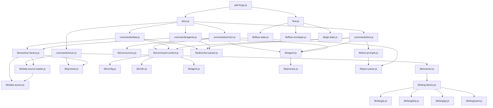

<!-- {{data("base.docs.langSwitcher", {labels: "relative"})}} -->
**English** | [日本語](ja/internal_design.md)
<!-- {{/data}} -->

# Internal Design

## Description

<!-- {{text({prompt: "Write a 1-2 sentence overview of this chapter. Include the project structure, module dependency direction, and key processing flows."})}} -->

This chapter describes the internal architecture of sdd-forge, a layered CLI tool in which top-level dispatchers route to pipeline command handlers that depend on shared libraries for AI invocation, directive parsing, and preset resolution. Data flows unidirectionally from source scanning through structured analysis, AI-based enrichment, directive resolution, and text generation to produce final documentation artifacts.
<!-- {{/text}} -->

## Content

### Project Structure

<!-- {{text({prompt: "Describe the project's directory structure as a tree-format code block. Include role comments for key directories and files. Generate from the actual source code structure.", mode: "deep"})}} -->

```
src/
├── sdd-forge.js             # CLI entry point and top-level subcommand dispatcher
├── docs.js                  # docs subcommand dispatcher
├── flow.js                  # flow subcommand dispatcher
├── help.js                  # help text output
├── docs/
│   ├── commands/            # docs pipeline command implementations
│   │   ├── scan.js          # source traversal and analysis.json generation
│   │   ├── enrich.js        # AI-based per-entry metadata annotation
│   │   ├── data.js          # {{data}} directive resolution and injection
│   │   ├── text.js          # {{text}} directive AI text generation
│   │   ├── agents.js        # AGENTS.md generation and AI refinement
│   │   ├── forge.js         # orchestrated full docs build pipeline
│   │   ├── readme.js        # README generation
│   │   ├── review.js        # post-generation docs review
│   │   └── changelog.js     # changelog generation
│   ├── data/                # DataSource plugins supplying structured data to directives
│   │   ├── agents.js        # AGENTS.md section data
│   │   ├── docs.js          # chapter listing, nav, and language switcher
│   │   ├── lang.js          # language navigation link generation
│   │   ├── project.js       # project name, version, scripts from package.json
│   │   └── text.js          # text category stub
│   └── lib/                 # shared docs pipeline libraries
│       ├── directive-parser.js     # {{data}}/{{text}} parsing and resolution
│       ├── resolver-factory.js     # DataSource resolver wiring and preset chain loading
│       ├── template-merger.js      # preset template layering and block merging
│       ├── scanner.js              # file collection, hashing, and language dispatch
│       ├── text-prompts.js         # AI prompt construction for text generation
│       ├── command-context.js      # shared context resolution (config, paths, agent)
│       ├── chapter-resolver.js     # chapter ordering and category-to-chapter mapping
│       ├── analysis-entry.js       # AnalysisEntry base class and summary utilities
│       ├── analysis-filter.js      # docsExclude glob filtering
│       ├── concurrency.js          # slot-based async concurrency limiter
│       ├── data-source.js          # DataSource base class and table helper
│       ├── data-source-loader.js   # dynamic ES module DataSource loading
│       ├── forge-prompts.js        # forge command AI prompt builders
│       ├── lang-factory.js         # file extension to language handler dispatch
│       ├── lang/                   # language-specific parse, minify, and extract handlers
│       │   ├── js.js               # JavaScript/TypeScript handler
│       │   ├── php.js              # PHP handler
│       │   ├── py.js               # Python handler
│       │   └── yaml.js             # YAML handler
│       ├── minify.js               # top-level minifier delegating to lang handlers
│       ├── php-array-parser.js     # PHP array literal parsing utilities
│       ├── review-parser.js        # AI review output parsing
│       ├── scan-source.js          # Scannable mixin for DataSource subclasses
│       ├── test-env-detection.js   # test framework detection from analysis
│       └── toml-parser.js          # minimal TOML config parser
├── lib/                     # core shared libraries used across all subcommands
│   ├── agent.js             # synchronous and async AI agent invocation
│   ├── agents-md.js         # AGENTS.md SDD template loading
│   ├── cli.js               # arg parsing, path resolution, PKG_DIR
│   ├── config.js            # config loading, path helpers, defaults
│   ├── entrypoint.js        # isDirectRun / runIfDirect execution guards
│   ├── exit-codes.js        # EXIT_SUCCESS / EXIT_ERROR constants
│   ├── flow-envelope.js     # structured JSON protocol for flow commands
│   ├── flow-state.js        # flow.json persistence, step tracking, metrics
│   ├── git-state.js         # git branch, dirty state, and gh availability
│   ├── guardrail.js         # guardrail rule loading and phase filtering
│   ├── i18n.js              # multi-layer i18n with domain namespacing
│   ├── include.js           # <!-- include() --> directive resolver
│   ├── json-parse.js        # tolerant JSON repair parser for LLM output
│   ├── lint.js              # lint guardrail execution against changed files
│   ├── multi-select.js      # interactive terminal preset selector
│   ├── presets.js           # preset chain resolution and multi-chain support
│   ├── process.js           # spawnSync wrapper returning normalized result
│   ├── progress.js          # terminal progress bar and spinner
│   ├── skills.js            # SKILL.md deployment to agent skill directories
│   └── types.js             # config schema validation
├── presets/                 # built-in preset definitions (base, php, node, cli, etc.)
│   └── <preset>/
│       ├── data/            # preset-level DataSource overrides
│       ├── templates/       # chapter template files organized by language
│       └── preset.json      # chapters array, scan include/exclude patterns
├── flow/
│   └── commands/            # SDD flow step implementations (start, status, merge, etc.)
├── specs/
│   └── commands/            # spec and gate command implementations
└── locale/                  # i18n message files
    ├── en/                  # English messages (ui, messages, prompts domains)
    └── ja/                  # Japanese messages
```
<!-- {{/text}} -->

### Module Composition

<!-- {{text({prompt: "List the major modules in table format. Include module name, file path, and responsibility. Extract from import/require relationships and exports in each file.", mode: "deep"})}} -->

| Module | File Path | Responsibility |
| --- | --- | --- |
| Top-level dispatcher | `src/sdd-forge.js` | Parses CLI args and routes to docs, flow, spec, or help subcommands |
| Docs dispatcher | `src/docs.js` | Routes docs subcommands to individual pipeline command handlers |
| Flow dispatcher | `src/flow.js` | Routes SDD flow subcommands to flow step handlers |
| scan | `src/docs/commands/scan.js` | Traverses source files, runs DataSource plugins, writes `analysis.json` |
| enrich | `src/docs/commands/enrich.js` | Calls AI in token-bounded batches to annotate each analysis entry with summary, chapter, role, and keywords |
| data | `src/docs/commands/data.js` | Resolves `{{data(...)}}` directives in chapter files using analysis and DataSources |
| text | `src/docs/commands/text.js` | Resolves `{{text(...)}}` directives by sending batch JSON prompts to the AI agent |
| agents | `src/docs/commands/agents.js` | Generates and AI-refines AGENTS.md from analysis and preset templates |
| DataSource base | `src/docs/lib/data-source.js` | Base class defining the method dispatch protocol and Markdown table helper |
| DataSource loader | `src/docs/lib/data-source-loader.js` | Dynamically imports DataSource `.js` files from a directory and initialises instances |
| resolver-factory | `src/docs/lib/resolver-factory.js` | Wires preset chains, loads DataSources, and exposes a `resolve(preset, source, method)` function |
| directive-parser | `src/docs/lib/directive-parser.js` | Parses `{{data(...)}}` and `{{text(...)}}` directives, resolves block replacements in-place |
| template-merger | `src/docs/lib/template-merger.js` | Merges layered preset templates with block-override and additive strategies, handles multi-language fallback |
| command-context | `src/docs/lib/command-context.js` | Resolves and exposes the shared context bag (root, config, lang, agent, chapter files) for all commands |
| text-prompts | `src/docs/lib/text-prompts.js` | Builds AI prompts for text generation including enriched analysis context and batch JSON format |
| scanner | `src/docs/lib/scanner.js` | Collects files matching include/exclude globs, computes MD5 hashes, and dispatches to language parsers |
| lang-factory | `src/docs/lib/lang-factory.js` | Maps file extensions to language handlers (js, php, py, yaml) |
| agent | `src/lib/agent.js` | Provides `callAgent` (sync) and `callAgentAsync` (async, with retry) for subprocess AI invocation |
| flow-state | `src/lib/flow-state.js` | Persists and mutates `flow.json` per spec, tracks step status, phase, and metrics |
| flow-envelope | `src/lib/flow-envelope.js` | Defines the structured JSON protocol (`ok`, `fail`, `warn`, `output`) for flow command results |
| i18n | `src/lib/i18n.js` | Loads and merges locale message files from package, preset, and project layers; provides `translate()` |
| presets | `src/lib/presets.js` | Resolves preset inheritance chains and supports multi-type chain merging |
| json-parse | `src/lib/json-parse.js` | Tolerant JSON repair parser that recovers from LLM-generated malformed responses |
| concurrency | `src/docs/lib/concurrency.js` | Slot-based async map utility controlling parallel AI agent calls |
| guardrail | `src/lib/guardrail.js` | Loads and merges guardrail rule files from preset chains; filters by phase and scope |
| progress | `src/lib/progress.js` | Terminal progress bar and spinner rendered to stderr with step tracking |
<!-- {{/text}} -->

### Module Dependencies

<!-- {{text({prompt: "Generate a mermaid graph showing inter-module dependencies. Analyze import/require statements in the source code and show the layer structure and dependency direction. Output only the mermaid code block.", mode: "deep"})}} -->


<!-- {{/text}} -->

### Key Processing Flows

<!-- {{text({prompt: "Describe the inter-module data and control flow when running a representative command in numbered steps. Include the flow from entry point to final output.", mode: "deep"})}} -->

The following steps trace the control and data flow for `sdd-forge text`, which fills `{{text(...)}}` directives in documentation chapter files using the AI agent.

1. **Entry** — `sdd-forge.js` parses the CLI arguments and delegates to `docs.js`, which matches the `text` subcommand and calls `commands/text.js`.
2. **Context resolution** — `text.js` calls `resolveCommandContext()` in `lib/command-context.js`, which reads `.sdd-forge/config.json`, resolves `root`, `docsDir`, `lang`, `type`, and instantiates the agent config via `resolveAgent()` from `lib/agent.js`.
3. **Analysis loading** — `loadFullAnalysis()` reads `.sdd-forge/output/analysis.json` into memory. If the file is absent, an error is thrown.
4. **Chapter enumeration** — `getChapterFiles()` in `command-context.js` calls `resolveChaptersOrder()` from `lib/template-merger.js` using the preset chain and any project-level `config.chapters` overrides, returning an ordered list of chapter `.md` filenames.
5. **Directive detection** — For each chapter file, `parseDirectives()` from `lib/directive-parser.js` scans the file line-by-line and returns all `{{text(...)}}` directive descriptors that currently have empty content between their open and close tags.
6. **Enriched context assembly** — `getEnrichedContext()` from `lib/text-prompts.js` filters `analysis.json` entries whose `chapter` field matches the current file's chapter name. For `deep` mode directives it additionally reads source files via `lib/minify.js` to include condensed code in the prompt.
7. **Batch prompt construction** — `buildBatchPrompt()` in `text-prompts.js` assembles a single JSON-schema prompt that lists all unfilled directives in the chapter along with their `id`, `prompt`, and limit parameters, instructing the AI to return a JSON object keyed by directive `id`.
8. **AI invocation** — `callAgentAsync()` in `lib/agent.js` spawns the configured agent process (e.g., the Claude CLI). When the prompt exceeds `ARGV_SIZE_THRESHOLD`, it is delivered via stdin instead of argv to avoid OS argument length limits.
9. **Response parsing** — The raw response is passed to `repairJson()` from `lib/json-parse.js`, which tolerates markdown fences and malformed syntax from the LLM before returning a valid JSON object.
10. **Directive replacement** — `applyBatchJsonToFile()` in `text.js` iterates directives in reverse line order and splices the generated text for each `id` back between the open and close tags, then writes the updated file to disk.
<!-- {{/text}} -->

### Extension Points

<!-- {{text({prompt: "Describe the locations that need changes and extension patterns when adding new commands or features. Derive from plugin points and dispatch registration patterns in the source code.", mode: "deep"})}} -->

**Adding a new docs pipeline command**

New commands are registered in `src/docs.js`, which dispatches on the CLI subcommand string. Each command is implemented as an ES module in `src/docs/commands/` that exports a `main(ctx)` function. The command must call `resolveCommandContext()` from `lib/command-context.js` to obtain the standard context bag. The `runIfDirect()` guard in `lib/entrypoint.js` must be added at the module's bottom to allow both direct execution and import by orchestrators such as `forge.js`.

**Adding a new DataSource**

A DataSource is a class in `src/docs/data/` (or in a preset's `data/` directory) that extends `DataSource` from `lib/data-source.js`. Each public method becomes a callable directive target via `{{data("preset.sourceName.methodName")}}`. The file is discovered and instantiated automatically by `loadDataSources()` in `lib/data-source-loader.js` — no registration is required. To add a project-specific DataSource, place the file in `.sdd-forge/data/`.

**Adding a new preset type**

A new preset is defined by creating a directory under `src/presets/<name>/` containing a `preset.json` (with `key`, `parent`, `label`, `chapters`, and `scan` fields), a `templates/<lang>/` directory with chapter `.md` template files, and optionally a `data/` directory with DataSource overrides. The preset is automatically discovered by `presets.js` via `resolveChainSafe()` and becomes available as a `type` value in project config.

**Adding a new flow step**

Flow steps are enumerated in `FLOW_STEPS` in `src/lib/flow-state.js` and mapped to phases in `PHASE_MAP`. New step handler logic is added in `src/flow/commands/`. The flow dispatcher in `src/flow.js` routes to the appropriate handler. Step status transitions are persisted atomically via `mutateFlowState()` and `updateStepStatus()` in `flow-state.js`.

**Extending the i18n system**

New message keys are added to the appropriate domain file (`ui.json`, `messages.json`, or `prompts.json`) under `src/locale/<lang>/`. Preset-level overrides live in `src/presets/<name>/locale/` and project-level overrides in `.sdd-forge/locale/`. The three layers are merged in priority order by `loadMergedMessages()` in `lib/i18n.js`, so individual keys can be overridden without replacing entire domain files.
<!-- {{/text}} -->

---

<!-- {{data("base.docs.nav")}} -->
[← Configuration and Customization](configuration.md)
<!-- {{/data}} -->
