# 04. 内部設計

## 説明

<!-- {{text: Write a 1-2 sentence overview of this chapter. Include the project structure, module dependency direction, and key processing flows.}} -->

この章では、sdd-forge の内部アーキテクチャについて説明します。対象には、3 層のディレクトリ構造（`src/lib/` → `src/docs/lib/` → `src/docs/commands/`）、CLI のエントリポイントからディスパッチャーを経てコマンド実装へ至る一方向のモジュール依存、そして自動ドキュメント生成を支える `scan → enrich → init → data → text → readme` などの主要な処理パイプラインが含まれます。

<!-- {{/text}} -->

## 内容

### プロジェクト構造

<!-- {{text[mode=deep]: Describe the project's directory structure as a tree-format code block. Include role comments for key directories and files. Generate from the actual source code structure.}} -->

```
sdd-forge/
├── package.json
└── src/
    ├── sdd-forge.js              # CLI entry point & top-level router
    ├── docs.js                   # docs subcommand dispatcher
    ├── spec.js                   # spec subcommand dispatcher
    ├── flow.js                   # flow subcommand dispatcher
    ├── setup.js                  # Interactive project setup
    ├── upgrade.js                # Config migration utility
    ├── presets-cmd.js             # Preset listing command
    ├── help.js                   # Help text display
    │
    ├── docs/
    │   ├── commands/             # docs subcommand implementations
    │   │   ├── scan.js           #   Source code analysis → analysis.json
    │   │   ├── enrich.js         #   AI-powered enrichment of analysis entries
    │   │   ├── init.js           #   Template resolution & docs/ initialization
    │   │   ├── data.js           #   {{data}} directive resolution
    │   │   ├── text.js           #   {{text}} directive resolution via LLM
    │   │   ├── readme.js         #   README.md generation
    │   │   ├── forge.js          #   Multi-round AI doc generation
    │   │   ├── review.js         #   Documentation quality review
    │   │   ├── changelog.js      #   specs/ → change_log.md generation
    │   │   ├── agents.js         #   AGENTS.md generation
    │   │   ├── translate.js      #   Multi-language translation
    │   │   └── snapshot.js       #   Documentation snapshot
    │   │
    │   ├── data/                 # Built-in DataSources (all project types)
    │   │   ├── project.js        #   package.json metadata
    │   │   ├── docs.js           #   Chapter listing & language switcher
    │   │   ├── lang.js           #   Language navigation links
    │   │   └── agents.js         #   AGENTS.md section generation
    │   │
    │   └── lib/                  # Documentation engine libraries
    │       ├── scanner.js        #   File discovery & language parsers
    │       ├── directive-parser.js #  {{data}}/{{text}} & @block parser
    │       ├── template-merger.js #   Preset template inheritance engine
    │       ├── data-source.js    #   DataSource base class
    │       ├── data-source-loader.js # Dynamic DataSource loader
    │       ├── scan-source.js    #   Scannable mixin for DataSources
    │       ├── resolver-factory.js #  Layered DataSource resolver factory
    │       ├── command-context.js #   Shared CLI context resolution
    │       ├── concurrency.js    #   Promise-based parallel execution queue
    │       ├── forge-prompts.js  #   Forge command prompt construction
    │       ├── text-prompts.js   #   {{text}} directive prompt construction
    │       ├── review-parser.js  #   Review output parsing & patching
    │       └── php-array-parser.js #  CakePHP array syntax parser
    │
    ├── flow/
    │   └── commands/
    │       ├── start.js          # SDD flow initiation
    │       └── status.js         # SDD flow status display
    │
    ├── spec/
    │   └── commands/
    │       ├── init.js           # Spec file scaffolding
    │       ├── gate.js           # Spec gate check
    │       └── guardrail.js      # Spec guardrail validation
    │
    ├── lib/                      # Cross-layer shared utilities
    │   ├── agent.js              #   AI agent invocation (sync & async)
    │   ├── cli.js                #   repoRoot, sourceRoot, parseArgs
    │   ├── config.js             #   .sdd-forge/config.json loader
    │   ├── presets.js             #   Preset discovery & resolution
    │   ├── flow-state.js         #   SDD flow state persistence
    │   ├── i18n.js               #   3-layer i18n with domain namespaces
    │   ├── types.js              #   Type alias resolution & validation
    │   ├── entrypoint.js         #   ES module direct-run guard
    │   ├── process.js            #   spawnSync wrapper
    │   ├── progress.js           #   Progress bar & logging
    │   └── agents-md.js          #   AGENTS.md SDD template loader
    │
    ├── presets/                  # Preset definitions (inheritable)
    │   ├── base/                 #   Base preset (all project types)
    │   │   └── data/             #     package.json DataSource
    │   ├── cli/                  #   CLI architecture preset
    │   │   └── data/             #     ModulesSource (JS/MJS/CJS)
    │   ├── node-cli/             #   Node.js CLI preset (extends cli)
    │   ├── webapp/               #   Web application preset
    │   │   └── data/             #     Controllers/Models/Tables/Shells bases
    │   ├── cakephp2/             #   CakePHP 2.x preset (extends webapp)
    │   │   ├── data/             #     CakePHP-specific DataSources
    │   │   └── scan/             #     CakePHP-specific scanners
    │   ├── laravel/              #   Laravel preset (extends webapp)
    │   │   ├── data/             #     Laravel-specific DataSources
    │   │   └── scan/             #     Laravel-specific scanners
    │   ├── symfony/              #   Symfony preset (extends webapp)
    │   │   ├── data/             #     Symfony-specific DataSources
    │   │   └── scan/             #     Symfony-specific scanners
    │   └── library/              #   Library preset
    │
    ├── locale/                   # i18n message files
    │   ├── en/                   #   English (ui.json, messages.json, prompts.json)
    │   └── ja/                   #   Japanese
    │
    └── templates/                # Miscellaneous templates
        └── skills/               #   Claude Code skill definitions
```

<!-- {{/text}} -->

### モジュール構成

<!-- {{text[mode=deep]: List the major modules in table format. Include module name, file path, and responsibility. Extract from import/require relationships and exports in each file.}} -->

| モジュール | パス | 責務 |
| --- | --- | --- |
| CLI ルーター | `src/sdd-forge.js` | 最上位のコマンドを `docs.js`、`spec.js`、`flow.js`、および独立コマンドへ振り分けます |
| Docs ディスパッチャー | `src/docs.js` | `sdd-forge docs <cmd>` を各コマンドファイルへルーティングし、`build` パイプラインを統括します |
| Scan コマンド | `src/docs/commands/scan.js` | glob パターンでファイルを収集し、DataSource の `match()` / `scan()` に処理を委譲して `analysis.json` を出力します |
| Init コマンド | `src/docs/commands/init.js` | テンプレート継承チェーンを解決し、プリセットを統合し、必要に応じて AI により章を絞り込みます |
| Data コマンド | `src/docs/commands/data.js` | DataSource リゾルバーを使ってテンプレート内の `{{data}}` ディレクティブを解決します |
| Text コマンド | `src/docs/commands/text.js` | LLM エージェントを用いて `{{text}}` ディレクティブを解決します |
| Directive Parser | `src/docs/lib/directive-parser.js` | `{{data}}`、`{{text}}`、および `@block` / `@extends` テンプレート構文を解析します |
| Template Merger | `src/docs/lib/template-merger.js` | プリセット階層をまたいで下位から上位へテンプレートを解決し、ブロック単位で統合します |
| DataSource Base | `src/docs/lib/data-source.js` | すべてのリゾルバー向けに `match()`、`desc()`、`mergeDesc()`、`toMarkdownTable()` を提供する基底クラスです |
| DataSource Loader | `src/docs/lib/data-source-loader.js` | `data/` ディレクトリから DataSource クラスを動的に `import()` します |
| Resolver Factory | `src/docs/lib/resolver-factory.js` | `{{data}}` 解決のために、共通 → アーキテクチャ → 末端 → プロジェクトローカルの層構造リゾルバーを構築します |
| Scanner Utilities | `src/docs/lib/scanner.js` | glob によるファイル収集、PHP/JS パーサー、`getFileStats()` による hash / lines / mtime 取得を担います |
| Command Context | `src/docs/lib/command-context.js` | すべてのコマンドに共通する `root`、`config`、`type`、`lang`、`docsDir`、`agent` の解決を統一します |
| Concurrency | `src/docs/lib/concurrency.js` | 並列 LLM 呼び出しのために、同時実行数を設定可能な `mapWithConcurrency()` を提供します |
| Text Prompts | `src/docs/lib/text-prompts.js` | `{{text}}` 処理用のプロンプトを構築し、拡張済みコンテキストの収集も行います |
| Forge Prompts | `src/docs/lib/forge-prompts.js` | `forge` コマンドの多段 AI 生成向けに system/file プロンプトを組み立てます |
| Agent | `src/lib/agent.js` | `execFileSync` / `spawn` を使った AI エージェント呼び出し、引数サイズの管理、stdin フォールバックを担います |
| CLI Utilities | `src/lib/cli.js` | `repoRoot()`、`sourceRoot()`、`parseArgs()`、`PKG_DIR`、タイムスタンプ整形を提供します |
| Config | `src/lib/config.js` | `.sdd-forge/config.json` を読み込み、パス解決用の補助を提供します |
| Presets | `src/lib/presets.js` | 末端名によるプリセット探索と `PRESETS_DIR` 定数を提供します |
| i18n | `src/lib/i18n.js` | `domain:key` 名前空間付きで 3 層のメッセージ読み込み（default → preset → project）を行います |
| Flow State | `src/lib/flow-state.js` | SDD ワークフローのステップと要件追跡のために `flow.json` を永続化します |
| Progress | `src/lib/progress.js` | TTY を考慮した進捗バーを、重み付きステップとスピナーアニメーション付きで提供します |
| Entrypoint | `src/lib/entrypoint.js` | ES Modules の CLI を安全に扱うための `isDirectRun()` ガードと `runIfDirect()` を提供します |

<!-- {{/text}} -->

### モジュール依存関係

```mermaid
graph TD
    subgraph "CLI エントリ層"
        SDD[sdd-forge.js]
        DOCS[docs.js]
        SPEC[spec.js]
        FLOW[flow.js]
        SETUP[setup.js]
    end

    subgraph "コマンド層 (src/docs/commands/)"
        SCAN[scan.js]
        ENRICH[enrich.js]
        INIT[init.js]
        DATA[data.js]
        TEXT[text.js]
        README[readme.js]
        FORGE[forge.js]
        REVIEW[review.js]
        CHANGELOG[changelog.js]
        AGENTS_CMD[agents.js]
    end

    subgraph "エンジン層 (src/docs/lib/)"
        DP[directive-parser.js]
        TM[template-merger.js]
        DS[data-source.js]
        DSL[data-source-loader.js]
        RF[resolver-factory.js]
        CC[command-context.js]
        SC[scanner.js]
        CONC[concurrency.js]
        TP[text-prompts.js]
        FP[forge-prompts.js]
        RP[review-parser.js]
        SS[scan-source.js]
    end

    subgraph "共有ユーティリティ (src/lib/)"
        AG[agent.js]
        CLI[cli.js]
        CFG[config.js]
        PR[presets.js]
        I18N[i18n.js]
        FS_[flow-state.js]
        TYPES[types.js]
        EP[entrypoint.js]
        PROG[progress.js]
    end

    subgraph "プリセット DataSource 群 (src/presets/)"
        BASE_DS[base/data/]
        WEBAPP_DS[webapp/data/]
        CAKE_DS[cakephp2/data/]
        LARAVEL_DS[laravel/data/]
        SYMFONY_DS[symfony/data/]
        CLI_DS[cli/data/]
    end

    SDD --> DOCS
    SDD --> SPEC
    SDD --> FLOW
    SDD --> SETUP

    DOCS --> SCAN
    DOCS --> INIT
    DOCS --> DATA
    DOCS --> TEXT
    DOCS --> README
    DOCS --> FORGE
    DOCS --> REVIEW

    SCAN --> CC
    SCAN --> SC
    SCAN --> DSL
    SCAN --> PR

    INIT --> CC
    INIT --> TM
    INIT --> DP
    INIT --> AG
    INIT --> FP

    DATA --> CC
    DATA --> DP
    DATA --> RF

    TEXT --> CC
    TEXT --> DP
    TEXT --> TP
    TEXT --> CONC
    TEXT --> AG

    FORGE --> FP
    FORGE --> RP
    FORGE --> CONC

    RF --> DSL
    RF --> PR
    DSL --> DS

    CC --> CLI
    CC --> CFG
    CC --> TYPES
    CC --> AG
    CC --> I18N
    CC --> TM

    TM --> DP
    TM --> PR

    WEBAPP_DS --> DS
    WEBAPP_DS --> SS
    CAKE_DS --> WEBAPP_DS
    LARAVEL_DS --> WEBAPP_DS
    SYMFONY_DS --> WEBAPP_DS
    CLI_DS --> DS
    CLI_DS --> SS
    BASE_DS --> DS
    BASE_DS --> SS
```

<!-- {{text[mode=deep]: Generate a mermaid graph showing inter-module dependencies. Analyze import/require statements in the source code and show the layer structure and dependency direction. Output only the mermaid code block.}} -->



<!-- {{/text}} -->

### 主要な処理フロー

<!-- {{text[mode=deep]: Describe the inter-module data and control flow when running a representative command in numbered steps. Include the flow from entry point to final output.}} -->

` sdd-forge docs build` パイプラインが主要な処理フローです。次の段階を順番に実行します。

1. **開始** — `sdd-forge.js` が `docs build` を受け取り、`docs.js` に処理を委譲します。`docs.js` は `scan → enrich → init → data → text → readme → agents → [translate]` という全体パイプラインを統括します。
2. **Scan** (`scan.js`) — `resolveCommandContext()` が共有の `CommandContext`（root、config、type）を構築します。`collectFiles()` は `preset.json` または `config.json` の include/exclude glob パターンに基づいてソースファイルを収集します。DataSource は `loadDataSources()` によって継承順（`base → arch → leaf → project-local`）で読み込まれます。各 DataSource の `match()` が対象ファイルを絞り込み、`scan()` が構造化データを抽出します。`preserveEnrichment()` は、ファイル hash が一致する場合に前回の `analysis.json` から拡張済みフィールドを引き継ぎます。結果は `.sdd-forge/output/analysis.json` に書き込まれます。
3. **Enrich** (`enrich.js`) — 解析エントリをバッチ単位で AI エージェントに送信し、各エントリに対する `summary`、`detail`、`chapter`、`role` の分類結果を受け取ります。拡張されたフィールドは `enrichedAt` タイムスタンプとともに `analysis.json` に統合されます。
4. **Init** (`init.js`) — `resolveTemplates()` がレイヤーディレクトリを下位から上位へ（project-local → leaf → arch → base）組み立て、各章ファイルを解決します。`mergeResolved()` は下位から上位へ統合しながら `@block` / `@extends` 継承を適用します。`config.chapters` が未定義で、かつ AI エージェントが利用可能な場合は、`aiFilterChapters()` が解析サマリーをもとに関連する章を選択します。`stripBlockDirectives()` はテンプレート制御構文を除去してから `docs/` に書き込みます。
5. **Data** (`data.js`) — `resolver-factory.js` の `createResolver()` が、同じレイヤー順で DataSource を読み込み、各 DataSource に対して `init(ctx)` を呼び出します。各章ファイルについて、`processTemplate()` が `resolveDataDirectives()` を実行します。この処理では、行番号ずれを防ぐためにディレクティブを逆順で解析し、各 DataSource のメソッド（例: `controllers.list(analysis, labels)`）を呼び出します。レンダリングされた Markdown は `{{data}}` と `{{/data}}` タグの間の内容を置き換えます。
6. **Text** (`text.js`) — バッチモード（既定）では、`stripFillContent()` が前回生成済みの内容を除去し、`buildBatchPrompt()` が空のディレクティブを含むファイル全体を使ってプロンプトを構築し、AI が 1 回の呼び出しですべての `{{text}}` ディレクティブを埋めます。`validateBatchResult()` は内容の縮小や充足率を検証します。ディレクティブ単位モードでは、`buildPrompt()` が前後 20 行の文脈付きで個別プロンプトを生成し、`mapWithConcurrency()` が並列で LLM 呼び出しを実行します。`getEnrichedContext()` は章ごとに拡張済みの解析データをプロンプトへ注入します。
7. **README** (`readme.js`) — プリセットテンプレートから `README.md` を生成します。`{{data}}` ディレクティブ（例: 目次用の `docs.chapters()`）を解決し、最終出力をプロジェクトルートに書き込みます。
8. **出力** — 完成したドキュメントは `docs/` 配下に配置されます。各ファイルには解決済みの `{{data}}` テーブルと AI 生成の `{{text}}` 本文が含まれ、今後の増分更新に備えてテンプレート構造も維持されます。

<!-- {{/text}} -->

### 拡張ポイント

<!-- {{text[mode=deep]: Describe the locations that need changes and extension patterns when adding new commands or features. Derive from plugin points and dispatch registration patterns in the source code.}} -->

**新しい DataSource を追加する場合（最も一般的な拡張）**

`src/presets/` 配下の適切な `data/` ディレクトリに、新しい `.js` ファイルを作成します。ファイルは `DataSource` を継承した default class を export する必要があります（scan 機能が必要なら `Scannable(DataSource)` を使用します）。`data-source-loader.js` は `data/` ディレクトリ内のすべての `.js` ファイルを動的に import するため、登録作業は不要です。DataSource はテンプレート内の `{{data: sourceName.methodName("labels")}}` ディレクティブから自動的に利用可能になります。親プリセットの DataSource を上書きしたい場合は、子プリセットの `data/` ディレクトリに同名ファイルを作成します。

**新しい docs サブコマンドを追加する場合**

`src/docs/commands/` に async な `main(ctx)` 関数を実装した新しいファイルを作成し、それを export します。コマンド名は `src/docs.js` のディスパッチテーブルに追加して登録します。共有の `CommandContext` を取得するには `resolveCommandContext()` を使います。`sdd-forge docs build` の一部として実行したい場合は、`docs.js` の `build` パイプライン配列にも追加します。

**新しいプリセットを追加する場合**

`src/presets/` 配下にディレクトリを作成し、`parent`、`scan`（include/exclude glob）、`chapters`（順序付き章ファイル一覧）を定義した `preset.json` を配置します。さらに、`{{data}}` と `{{text}}` ディレクティブを用いた Markdown 章テンプレートを `templates/{lang}/` 配下に追加します。テンプレートでは、親プリセットからの継承に `@extends` / `@block` / `@endblock` を利用できます。`presets.js` モジュールは `src/presets/` ディレクトリ構造を走査してプリセットを検出します。

**新しいトップレベルコマンドを追加する場合**

`src/` に独立したコマンドファイル（例: `src/mycommand.js`）を作成し、`src/sdd-forge.js` のディスパッチ switch に登録します。直接実行とディスパッチ経由の両方に対応するため、`entrypoint.js` の `runIfDirect(import.meta.url, main)` を利用します。

**AI エージェントの挙動をカスタマイズする場合**

エージェント設定は、`agent.js` の `resolveAgent(config, commandId)` によりコマンド単位で解決されます。`config.json` の `agent.commands` セクションでは階層的な上書きが可能です（例: `docs.text` → `docs` → default）。AI 応答の前置きを除去するための独自 `preamblePatterns` は、`config.json` の `textFill.preamblePatterns` に追加できます。

**プロジェクト固有の DataSource やテンプレートを追加する場合**

カスタム DataSource ファイルは `.sdd-forge/data/` に、カスタムテンプレートは `.sdd-forge/templates/{lang}/docs/` に配置します。これらのプロジェクトローカル層は解決チェーン内で最優先され、同名のプリセット DataSource やテンプレートを上書きします。

<!-- {{/text}} -->
