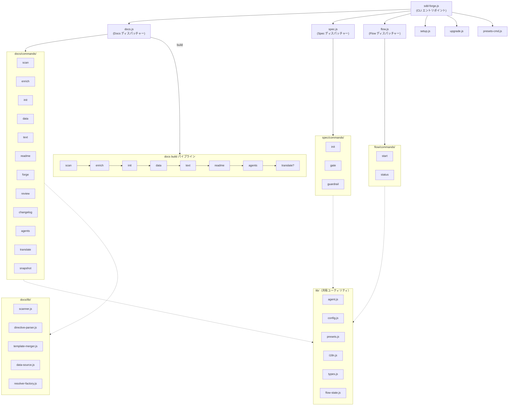

# 01. ツール概要とアーキテクチャ

## 説明

<!-- {{text: Write a 1-2 sentence overview of this chapter. Include the tool's purpose, the problem it solves, and its primary use cases.}} -->

この章では、ソースコード解析から技術文書の生成を自動化する、Spec-Driven Development 向け CLI ツール `sdd-forge` を紹介します。ツールのアーキテクチャ、主要な概念、そしてプロジェクト設定から文書出力までの一般的な流れを扱います。
<!-- {{/text}} -->

## 内容

### 目的

<!-- {{text: Describe the problem this CLI tool solves and its target users. Derive the purpose from package.json and README.}} -->

`sdd-forge` は、絶えず変化するコードベースに対して、技術文書を正確かつ最新の状態に保ち続けるという課題を解決します。手作業で作成した文書は、時間がたつにつれて実装とのずれが生じやすく、古い情報や誤解を招く内容が増えることで、オンボーディングや保守の妨げになります。

このツールは、手作業で文書を書く負担を増やさずに、構造化された信頼できるプロジェクト文書を必要とする開発チームや技術リードを対象としています。`sdd-forge` はソースコードを走査し、その解析結果を AI で補強し、テンプレート駆動のパイプラインで文書を生成することで、文書が常にコードの最新状態を反映するようにします。

`sdd-forge` は外部依存を持たず（Node.js 組み込みモジュールのみ使用）、設定可能なプリセットシステムにより、CakePHP 2.x、Laravel、Symfony、汎用の webapp/library プリセットなど、複数の Web アプリケーションフレームワークに対応します。さらに、仕様管理を文書生成パイプラインと結び付ける Spec-Driven Development ワークフロー（`flow` および `spec` コマンド）も提供します。
<!-- {{/text}} -->

### アーキテクチャ概要

<!-- {{text[mode=deep]: Generate a mermaid flowchart showing the tool's overall architecture. Include the dispatch structure from entry point to subcommands and the main processing flow (input → processing → output). Output only the mermaid code block.}} -->


<!-- {{/text}} -->

### 主要な概念

<!-- {{text: Explain the key concepts and terminology needed to understand this tool in table format. Extract the main concepts from source code.}} -->

| 概念 | 説明 |
|---|---|
| **Preset** | フレームワークごとの設定パッケージです（例: `symfony`, `cakephp2`, `laravel`）。走査ロジック、DataSource、章テンプレート、既定設定を定義します。プリセットは `src/presets/` 以下にあり、`sdd-forge setup` の実行時に選択されます。 |
| **DataSource** | 特定カテゴリのソースファイル（コントローラー、モデル、エンティティなど）を走査し、`{{data}}` ディレクティブを解決して、Markdown の表などの構造化データを生成するクラスです。各プリセットは独自の DataSource 実装を持ちます。 |
| **Directive** | 文書ファイルに埋め込まれるテンプレート用マーカーです。`{{data: ...}}` ディレクティブは DataSource から構造化データ（表、一覧）を挿入します。`{{text: ...}}` ディレクティブは、AI が生成した本文を配置する箇所を示します。 |
| **Build Pipeline** | 文書生成を端から端まで行う一連の処理です: `scan → enrich → init → data → text → readme → agents → [translate]`。`sdd-forge docs build` を実行すると、すべての手順が順番に実行されます。 |
| **Enrichment** | 生の走査結果（analysis.json）を受け取り、各項目に役割分類、要約、章の割り当てを追加して、後続の本文生成に必要な文脈を与える AI ベースの処理です。 |
| **Chapter** | 1 つの文書ファイルです（例: `overview.md`, `cli_commands.md`）。並び順は `preset.json` の `chapters` 配列で定義されます。章にはディレクティブが含まれ、`data` と `text` の各パイプライン処理で内容が埋められます。 |
| **Spec-Driven Development (SDD)** | 機能開発を仕様作成（`spec init`）から始め、ゲートチェック（`spec gate`）を通過して実装へ進めるワークフローです。このライフサイクルは `flow` コマンド群が管理します。 |
| **AGENTS.md / CLAUDE.md** | プロジェクト構造、規約、アーキテクチャに関する最新情報を AI コーディング支援ツールへ提供する、自動生成のプロジェクトコンテキストファイルです。 |
<!-- {{/text}} -->

### 一般的な利用の流れ

<!-- {{text: Describe the typical steps from installation to first output in step format. Derive the steps from help output and command definitions in the source code.}} -->

1. **sdd-forge をインストールする** — パッケージをグローバル、または開発依存としてインストールします。
   ```
   npm install -g sdd-forge
   ```

2. **プロジェクトを初期化する** — プロジェクトルートで対話形式のセットアップウィザードを実行します。これにより `.sdd-forge/config.json` 設定ファイルが作成され、利用するフレームワークに適したプリセットが選択されます。
   ```
   sdd-forge setup
   ```

3. **文書を生成する** — フルビルドパイプラインを実行し、ソースコードを走査し、解析結果を AI で補強し、すべての文書ファイルを生成します。
   ```
   sdd-forge docs build
   ```
   この処理では、パイプラインの各手順 `scan → enrich → init → data → text → readme → agents → [translate]` が順に実行されます。

4. **出力を確認する** — 生成された文書は、プロジェクトの `docs/` ディレクトリに章ファイル一式として出力されます。各章をまとめて参照できる `README.md` の目次も生成されます。

5. **個別の手順を繰り返し実行する** — 文書の特定部分だけを再生成したい場合は、個別のサブコマンドを実行します。
   ```
   sdd-forge docs scan      # ソースファイルを再走査する
   sdd-forge docs enrich    # 解析結果を AI で再補強する
   sdd-forge docs text      # 本文セクションを再生成する
   ```

6. **継続的に文書を保守する** — コード変更後に `sdd-forge docs build` を再実行すると、文書を更新できます。ツールは変更を検出して影響のある部分を再生成し、文書とコードベースの同期を保ちます。
<!-- {{/text}} -->
