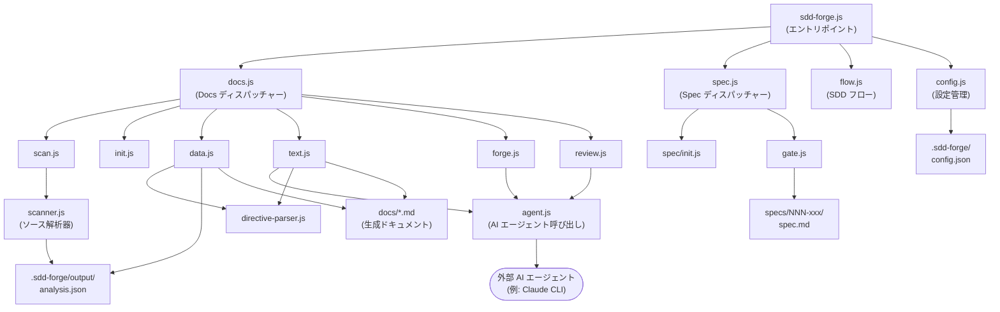

# 01. システム概要

## 説明

<!-- {{text: Write a 1-2 sentence overview of this chapter. Include the project's architecture and whether it integrates with external systems.}} -->

本章では、`sdd-forge` の全体アーキテクチャについて説明します。`sdd-forge` は、ソースコードを解析してテンプレートディレクティブを AI 生成コンテンツで解決することで、Spec-Driven Development を通じたドキュメント生成を自動化する Node.js CLI ツールです。このツールは Node.js 組み込みモジュールのみを使用してローカルファイルシステム上で完全に動作し、テキスト生成およびレビュータスクに対しては設定可能な外部 AI エージェント（Claude CLI など）とオプションで連携します。

<!-- {{/text}} -->

## 内容

### アーキテクチャ図

<!-- {{text: Generate a mermaid flowchart showing the project architecture. Include data flows between major components. Output only the mermaid code block.}} -->

<!-- {{/text}} -->

### コンポーネントの責務

<!-- {{text: Describe the major components with their location, responsibilities, and I/O in table format.}} -->

| コンポーネント | 場所 | 責務 | 入力 | 出力 |
|---|---|---|---|---|
| CLI エントリポイント | `src/sdd-forge.js` | サブコマンドのルーティングと環境変数によるプロジェクトコンテキストの解決 | CLI 引数、`SDD_SOURCE_ROOT` / `SDD_WORK_ROOT` 環境変数 | ディスパッチャーへ委譲 |
| Docs ディスパッチャー | `src/docs.js` | ドキュメント関連のサブコマンド（`scan`、`init`、`data`、`text`、`forge`、`review` など）のルーティング | サブコマンド名と引数 | `src/docs/commands/*.js` へ委譲 |
| Spec ディスパッチャー | `src/spec.js` | SDD ワークフロー管理のための `spec` および `gate` サブコマンドのルーティング | サブコマンド名と引数 | `src/specs/commands/*.js` へ委譲 |
| SDD フロー | `src/flow.js` | SDD ワークフロー全体のエンドツーエンド自動化 | `--request` 引数と `.sdd-forge/current-spec` のフロー状態 | spec 作成・ゲートチェック・実装のオーケストレーション |
| スキャナー | `src/docs/lib/scanner.js` | ソースファイルの解析と構造メタデータ（ファイル・モジュール・メソッド）の抽出 | 設定されたパス配下のソースファイル | `.sdd-forge/output/analysis.json` |
| ディレクティブパーサー | `src/docs/lib/directive-parser.js` | テンプレートファイル内の `{{data}}` および `{{text}}` ディレクティブの解析 | `.md` テンプレートファイル | 後続リゾルバー向けディレクティブ AST |
| エージェント呼び出し | `src/lib/agent.js` | 設定された外部 AI エージェントの同期または非同期呼び出し | プロンプト文字列、`config.json` からのエージェント設定 | AI 生成テキストのレスポンス |
| 設定管理 | `src/lib/config.js` | プロジェクト設定の読み込み・検証・アクセス提供およびパスユーティリティ | `.sdd-forge/config.json`、`.sdd-forge/context.json` | 検証済み設定オブジェクト、解決済みファイルパス |
| リゾルバーファクトリー | `src/docs/lib/resolver-factory.js` | 指定したプロジェクトタイプ / プリセットに対応する `DataSource` リゾルバーの生成 | プロジェクトタイプ、解析データ | `data.js` 向けインスタンス化済み `DataSource` |
| テンプレートマージャー | `src/docs/lib/template-merger.js` | プリセット層をまたいだ `@extends` / `@block` テンプレート継承の解決 | ベーステンプレートと子テンプレートファイル | マージ済みテンプレートコンテンツ |

<!-- {{/text}} -->

### 外部インテグレーション

<!-- {{text: If there are external system integrations, describe their purpose and connection method in table format.}} -->

| インテグレーション | 目的 | 接続方式 | 設定 |
|---|---|---|---|
| AI エージェント（例: Claude CLI） | `{{text}}` ディレクティブのドキュメントテキスト生成、`forge` による改善実行、`review` による品質チェック | `execFileSync`（同期）または `stdin: "ignore"` を指定した `spawn`（非同期）による CLI サブプロセス呼び出し | `.sdd-forge/config.json` の `providers` および `defaultAgent` で定義。カスタムの `command`、`args`、`timeoutMs`、`systemPromptFlag` をサポート |

`sdd-forge` はその他の外部サービス依存を持ちません。すべてのファイル I/O は Node.js 組み込みモジュール（`fs`、`path`、`child_process`、`os`）を使用し、ツール自体がネットワーク呼び出しを直接行うことはありません。AI エージェントのバイナリは、`sdd-forge` を実行するマシンの `PATH` にインストールされアクセス可能な状態である必要があります。

<!-- {{/text}} -->

### 環境ごとの差異

<!-- {{text: Describe the configuration differences across environments (local/staging/production).}} -->

`sdd-forge` はローカル CLI ツールであるため、従来のマルチ環境デプロイモデルには従いません。設定は各プロジェクトの作業ディレクトリにある `.sdd-forge/config.json` によって完全にファイル駆動で管理され、ツールの動作はどこで実行しても一貫しています。代表的な利用コンテキストにおける違いは以下のとおりです。

| コンテキスト | 特徴 | 備考 |
|---|---|---|
| ローカル開発 | インタラクティブな使用。AI エージェント呼び出しはリアルタイム。安全な確認のための `--dry-run` フラグが利用可能 | 開発者は `sdd-forge text`、`sdd-forge forge`、`sdd-forge review` をインタラクティブに実行可能 |
| CI / 自動化パイプライン | 非インタラクティブ。`sdd-forge build` が scan → data → text → readme のフルパイプラインを無人で実行 | CI 環境に AI エージェントバイナリが存在し、`config.json` がコミット済みまたは注入されている必要がある |
| マルチプロジェクト構成 | 複数のソースプロジェクトが `.sdd-forge/projects.json` に登録済み。`--project <name>` フラグでコンテキストを選択 | `SDD_SOURCE_ROOT` および `SDD_WORK_ROOT` 環境変数でプロジェクト固有のパスを上書き可能 |

`config.json` の `lang` および `output.languages` フィールドが全コンテキストにおける出力言語の動作を制御します。`sdd-forge` 自身はシークレットや認証情報を保存しません。AI エージェントの認証（必要な場合）は、ツールの外部にあるエージェント固有の設定で管理されます。

<!-- {{/text}} -->
