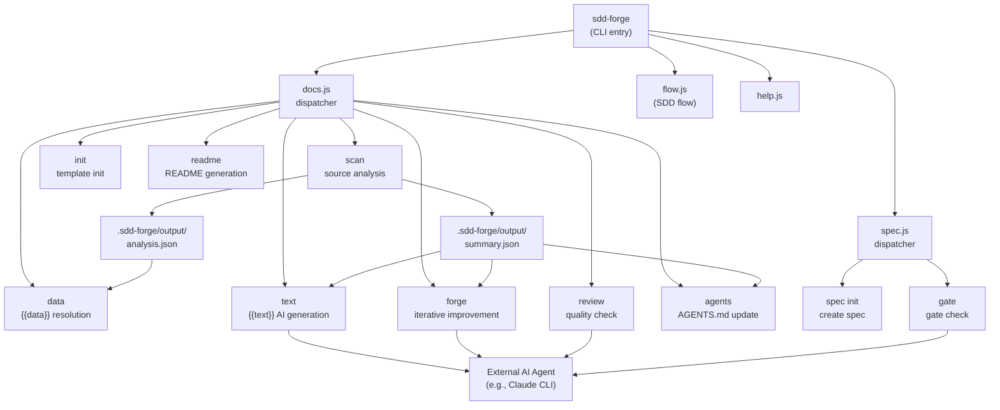

# 01. システム概要

## 説明

<!-- {{text: Write a 1-2 sentence overview of this chapter. Include the project's architecture and whether it integrates with external systems.}} -->

本章では、sdd-forge の全体アーキテクチャについて説明する。sdd-forge は、3 層のコマンドディスパッチシステムを通じてドキュメント生成を自動化し、Spec-Driven Development（SDD）ワークフローを強制する Node.js CLI ツールである。このツールはサードパーティのランタイム依存を持たず、Node.js 組み込みモジュールのみを使用するが、テキスト生成・品質レビュー・スペックゲーティングのために外部設定された AI エージェント（Claude CLI 等）と連携する。
<!-- {{/text}} -->

## 内容

### アーキテクチャ図

<!-- {{text: Generate a mermaid flowchart showing the project architecture. Include data flows between major components. Output only the mermaid code block.}} -->

<!-- {{/text}} -->

### コンポーネント責務

<!-- {{text: Describe the major components with their location, responsibilities, and I/O in table format.}} -->

| コンポーネント | 場所 | 責務 | 入力 | 出力 |
|---|---|---|---|---|
| CLI エントリ | `src/sdd-forge.js` | トップレベルのコマンドルーティング。`SDD_SOURCE_ROOT` / `SDD_WORK_ROOT` 環境変数と `--project` フラグによりプロジェクトコンテキストを解決 | CLI 引数、`.sdd-forge/projects.json` | サブディスパッチャーへの委譲 |
| docs ディスパッチャー | `src/docs.js` | ドキュメント関連サブコマンド（scan, init, data, text, readme, forge, review, agents, changelog, setup 等）をルーティング | CLI 引数 | `src/docs/commands/*.js` へ委譲 |
| spec ディスパッチャー | `src/spec.js` | spec ライフサイクルサブコマンド（spec, gate）をルーティング | CLI 引数 | `src/specs/commands/*.js` へ委譲 |
| SDD フロー | `src/flow.js` | SDD ワークフロー全体（spec → gate → 実装 → forge → review）をエンドツーエンドで自動化 | `--request` 文字列 | 全 SDD ステップを順次オーケストレーション |
| スキャナー | `src/docs/lib/scanner.js` | ソースディレクトリを走査し、PHP・JS・YAML ソースファイルを構造化データに解析 | ソースルートディレクトリ | `.sdd-forge/output/analysis.json`、`summary.json` |
| ディレクティブパーサー | `src/docs/lib/directive-parser.js` | Markdown テンプレート内の `{{data}}`、`{{text}}`、`@block`、`@extends` ディレクティブを解析 | Markdown テンプレートファイル | 解析済みディレクティブ AST |
| テンプレートマージャー | `src/docs/lib/template-merger.js` | `@extends` / `@block` テンプレート継承チェーンを解決 | 継承ディレクティブを含むテンプレートファイル | マージ済み Markdown テンプレート |
| AI エージェント | `src/lib/agent.js` | 設定された外部 AI エージェントを同期（`execFileSync`）または非同期（`spawn`）で呼び出す | プロンプト文字列、`config.json` のエージェント設定 | AI 生成・レビュー済みテキスト |
| コンフィグ | `src/lib/config.js` | `.sdd-forge/config.json` のロードとバリデーション、`.sdd-forge/` ファイルパス解決、`context.json` 管理 | `.sdd-forge/` ディレクトリ | バリデーション済み設定オブジェクト、解決済みパス |
| プリセットシステム | `src/lib/presets.js` | `src/presets/*/preset.json` エントリを自動探索し、プロジェクトタイプ解決用の型エイリアスマップを構築 | `src/presets/` ディレクトリ | 全コマンドで参照される `PRESETS` 定数 |
| フロー状態 | `src/lib/flow-state.js` | SDD ワークフローの進行状態（現在の spec パス、ベース/フィーチャーブランチ名、worktree 情報）を永続化 | `.sdd-forge/current-spec` JSON ファイル | ロード・保存されたフロー状態オブジェクト |
<!-- {{/text}} -->

### 外部連携

<!-- {{text: If there are external system integrations, describe their purpose and connection method in table format.}} -->

sdd-forge 自体には外部ランタイム依存がなく、`.sdd-forge/config.json` で定義された AI エージェントインターフェースを通じてのみ外部と通信する。その他の処理はすべて Node.js 組み込みモジュールで実行される。

| 連携先 | 目的 | 接続方法 |
|---|---|---|
| AI エージェント（例: Claude CLI） | `{{text}}` ディレクティブの解決、ドキュメントの反復改善（`forge`）、品質レビュー（`review`）、spec ゲート評価（`gate`）を担う | `config.json` → `providers` マップ + `defaultAgent` で設定。`execFileSync`（同期）または `spawn` + `stdin: "ignore"`（ストリーミングコールバック対応の非同期）を使用して子プロセスとして呼び出す |
| Git | リポジトリルートの特定（`git rev-parse`）、SDD フロー中のフィーチャーブランチおよび worktree の管理 | Node.js `child_process` 経由で子プロセスとして呼び出す。`src/lib/cli.js` の `repoRoot()` を通じて解決 |
<!-- {{/text}} -->

### 環境差異

<!-- {{text: Describe the configuration differences across environments (local/staging/production).}} -->

sdd-forge は開発者向け CLI ツールであり、ステージングや本番といった定義済みのデプロイ環境は存在しない。すべてのランタイム動作は環境変数とプロジェクトごとの `.sdd-forge/config.json` によって制御される。以下は実行コンテキストによって主に異なる設定ポイントである。

| 設定ポイント | 仕組み | 説明 |
|---|---|---|
| ソースルート | `SDD_SOURCE_ROOT` 環境変数 | `git rev-parse` または `cwd` で解決されるソースディレクトリを上書き。解析対象プロジェクトが作業ディレクトリと異なる場合に有用 |
| 作業ルート | `SDD_WORK_ROOT` 環境変数 | `.sdd-forge/` が配置される作業ルートを上書き。ツールと対象プロジェクトを別ディレクトリに置くことが可能 |
| マルチプロジェクト選択 | `--project <name>` フラグ | `.sdd-forge/projects.json` から名前付きプロジェクトエントリを選択。1 つの sdd-forge インストールで複数コードベースを管理可能 |
| AI エージェント | `config.json` → `providers` + `defaultAgent` | 外部 AI エージェントのコマンド・引数・タイムアウトを指定。環境ごとに切り替え可能（例: CI では高速なモデルを使用） |
| ファイル処理並列数 | `config.json` → `limits.concurrency` | 並列ファイル処理数を制御（デフォルト: 5）。高コア数の CI ランナーでは増加、メモリ制約のある環境では削減 |
| AI エージェントタイムアウト | `config.json` → `limits.designTimeoutMs` | AI エージェント呼び出しの最大待機時間を設定。ネットワーク遅延やエージェント起動レイテンシが高い CI 環境ではチューニングが必要 |
| 出力言語 | `config.json` → `output.languages` + `output.default` | ビルドパイプラインでドキュメントを単一言語で生成するか、複数言語に翻訳するかを決定 |
<!-- {{/text}} -->
