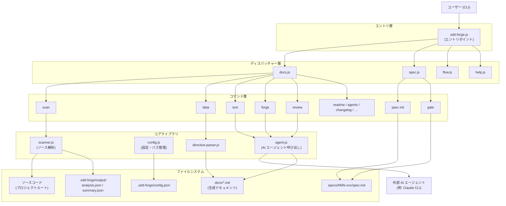

# 01. システム概要

## 説明

<!-- {{text: Write a 1-2 sentence overview of this chapter. Include the project's architecture and whether it integrates with external systems.}} -->

本章では、ソースコード解析によるドキュメント自動生成と、Spec-Driven Development（SDD）ワークフローによる機能開発を推進する Node.js CLI ツール「sdd-forge」の構造概要を説明する。本ツールは3層のコマンドディスパッチアーキテクチャを採用し、ドキュメントテキストの生成・改善のために外部 AI エージェント（Claude CLI など）と連携する。

## 内容

### アーキテクチャ図

<!-- {{text: Generate a mermaid flowchart showing the project architecture. Include data flows between major components. Output only the mermaid code block.}} -->

### コンポーネントの責務

<!-- {{text: Describe the major components with their location, responsibilities, and I/O in table format.}} -->

| コンポーネント | 場所 | 責務 | 入力 | 出力 |
|---|---|---|---|---|
| CLI エントリポイント | `src/sdd-forge.js` | プロジェクトコンテキストを解決し、サブコマンドを適切なディスパッチャーへルーティングする | CLI 引数、環境変数（`SDD_SOURCE_ROOT`、`SDD_WORK_ROOT`） | ディスパッチされたコマンド実行 |
| ドキュメントディスパッチャー | `src/docs.js` | `build`、`scan`、`init`、`data`、`text`、`forge`、`review` および関連サブコマンドをルーティングする | サブコマンド名＋フラグ | `docs/commands/*.js` へ委譲 |
| スペックディスパッチャー | `src/spec.js` | `spec` および `gate` サブコマンドをルーティングする | サブコマンド名＋フラグ | `specs/commands/*.js` へ委譲 |
| SDD フローランナー | `src/flow.js` | SDD サイクル全体をエンドツーエンドで自動実行する | `--request` プロンプト文字列 | spec → gate → 実装 → forge → review のオーケストレーション |
| ソーススキャナー | `src/docs/lib/scanner.js` | プロジェクトのソースファイルを解析し、モジュール・ルート・構造を抽出する | ソースルートディレクトリ | `.sdd-forge/output/analysis.json`、`summary.json` |
| ディレクティブパーサー | `src/docs/lib/directive-parser.js` | Markdown テンプレート内の `{{data}}` および `{{text}}` ディレクティブを解析する | `.md` テンプレートファイル | リゾルバー向けディレクティブ AST |
| データリゾルバー | `src/docs/lib/resolver-factory.js` | 構造化された解析データを `{{data}}` ディレクティブに注入する | `analysis.json`、ディレクティブ AST | 解決済み Markdown セクション |
| AI エージェント呼び出し | `src/lib/agent.js` | 外部 AI エージェントプロセスを同期または非同期で呼び出す | プロンプト文字列、エージェント設定 | AI 生成テキスト（stdout） |
| 設定マネージャー | `src/lib/config.js` | `.sdd-forge/config.json` を読み込みバリデーションし、標準パスを解決する | `.sdd-forge/` ディレクトリ | 型付き設定オブジェクト、ファイルパス |
| スペックゲート | `src/specs/commands/gate.js` | 実装前後のチェックリストに基づいてスペックを検証する | `spec.md` パス、`--phase` フラグ | PASS / FAIL レポート |
| フォージエンジン | `src/docs/commands/forge.js` | AI エージェントへのプロンプトにより `docs/` を反復改善する | 変更内容サマリープロンプト、`spec.md` パス | 更新された `docs/*.md` ファイル |

### 外部連携

<!-- {{text: If there are external system integrations, describe their purpose and connection method in table format.}} -->

| システム | 目的 | 接続方法 | 設定 |
|---|---|---|---|
| AI エージェント（例: Claude CLI） | `{{text}}` ディレクティブのドキュメントテキスト生成・改善、および `forge`、`review`、`agents`、`text` コマンドの実行を担う | `src/lib/agent.js` 内で `execFileSync`（同期）または `spawn`（非同期ストリーミング）によって子プロセスとして起動される | `.sdd-forge/config.json` の `providers` に定義し、`defaultAgent` キーで選択する |

AI エージェントが唯一の外部連携である。ファイルスキャン、ディレクティブ解析、テンプレートマージ、スペック管理など、その他の処理はすべて Node.js 組み込みモジュール（`fs`、`path`、`child_process`、`os`）のみに依存する。エージェントのコマンド、引数、タイムアウト、システムプロンプトの渡し方（`--system-prompt` または `--system-prompt-file`）はプロジェクトごとに設定可能である。

### 環境別の差異

<!-- {{text: Describe the configuration differences across environments (local/staging/production).}} -->

sdd-forge はローカル CLI ツールであるため、従来の意味での独立したデプロイ環境は存在しない。環境による設定の違いは、プロジェクトごとの `.sdd-forge/config.json` 設定と環境変数によって表現される。

| 観点 | ローカル開発 | CI / 自動化パイプライン | マルチプロジェクト構成 |
|---|---|---|---|
| プロジェクト解決 | インタラクティブ；`--project` フラグまたは `.sdd-forge/projects.json` の `default` キーを使用 | ジョブごとに `SDD_SOURCE_ROOT` と `SDD_WORK_ROOT` 環境変数を明示的に設定 | `.sdd-forge/projects.json` に名前付きプロジェクトを登録し、`--project <name>` でターゲットを選択 |
| AI エージェント | `config.json` の `providers` + `defaultAgent` で設定；インタラクティブに動作 | 同設定を使用；非 TTY 環境でのハングを防ぐため `stdin: "ignore"` を利用（`callAgentAsync`） | プロジェクトごとに独立したエージェント設定を持つ `config.json` を保持 |
| 言語 / 出力 | `lang` と `output.languages` で CLI 言語とドキュメント出力ロケールを制御 | 同設定値が適用される；個別のオーバーライド機構はなし | プロジェクトごとの `config.json` により言語を個別に設定可能 |
| 並列処理 | `limits.concurrency`（デフォルト: 5）でファイル並列処理数を制御 | 高コアマシンでは値を上げて高速化可能 | プロジェクトごとに独立して調整可能 |
| タイムアウト | `limits.designTimeoutMs` / プロバイダーごとの `timeoutMs` | 低速な CI エージェントでは値を増やすべき；デフォルト定数: 120 秒 / 180 秒 / 300 秒 | プロジェクトごとに設定可能 |
