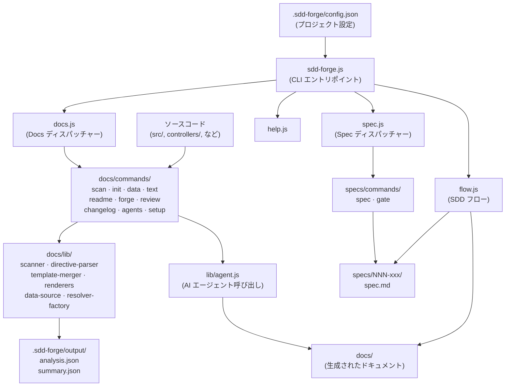

# 01. ツール概要とアーキテクチャ

## Description

<!-- {{text: Write a 1-2 sentence overview of this chapter. Cover the tool's purpose, the problems it solves, and its primary use cases.}} -->

本章では sdd-forge の概要を説明します。sdd-forge は、ソースコード解析からドキュメント生成を自動化し、機能追加・変更に対して Spec-Driven Development（SDD）ワークフローを強制する CLI ツールです。ツールの核となる目的、解決する課題、アーキテクチャ設計、および導入の典型的な手順を解説します。

## Contents

### ツールの目的

<!-- {{text: Explain the problems this CLI tool solves and the target users it is designed for.}} -->

開発チームはしばしば、次の 2 つの複合的な問題に直面します。ドキュメントがソースコードと乖離しやすいこと、そして明確にレビューされた仕様なしに機能開発が進んでしまうことです。sdd-forge はその両方を解決します。ソースコードから構造情報を自動抽出して生きたドキュメントを生成しながら、実装開始前に書面による承認済み仕様を必須とするゲートベースのワークフローを提供します。

主なターゲットユーザーは、ドキュメントの正確性が重要なコードベースを管理するソフトウェア開発者や技術リードです。特に、複数のコントリビューターが存在するプロジェクトや、頻繁に反復的な変更が行われるプロジェクトに有効です。新メンバーのオンボーディング、アーキテクチャレビュー、仕様と実装の間のトレーサビリティが求められる継続的な機能開発において特に価値を発揮します。

### アーキテクチャ概要

<!-- {{text: Generate a mermaid flowchart of the overall tool architecture. Include the flow of input, processing, and output, as well as the relationships between major modules. Output only the mermaid code block.}} -->



### 主要概念

<!-- {{text: Explain the important concepts and terminology needed to understand this tool in table format.}} -->

| 概念 | 説明 |
|---|---|
| **SDD（Spec-Driven Development）** | 実装開始前に仕様ドキュメントを作成・レビュー・承認し、ゲートチェックを通過することを必須とする開発ワークフロー。 |
| **Spec** | 単一の機能や修正の意図・スコープ・受け入れ基準を定義した構造化マークダウンドキュメント（`spec.md`）。`specs/NNN-xxx/` 配下に格納される。 |
| **ゲートチェック** | `sdd-forge gate` によって実行される検証ステップ。実装開始前に仕様が十分に完成していることを確認する。 |
| **ディレクティブ** | ドキュメントテンプレート内のプレースホルダーマーカー。`{{data}}` はソース解析から解決され、`{{text}}` は AI エージェントによって解決される。 |
| **プリセット** | スキャン対象ファイルと適用するドキュメントテンプレートを決定するプロジェクトタイプのプロファイル（例: `webapp/cakephp2`、`cli/node-cli`）。 |
| **`analysis.json`** | `sdd-forge scan` の完全な構造化出力。コントローラー、モデル、ルート、その他のソース構造から抽出した情報を含む。 |
| **`summary.json`** | テキスト生成コマンドの主要入力として使用される、AI 向けに最適化された `analysis.json` のコンパクトなサブセット。 |
| **Forge** | AI がソース解析と文脈に基づいてドキュメントを改善する反復的なドキュメント改善プロセス（`sdd-forge forge`）。 |
| **プロバイダー / エージェント** | テキスト生成とレビューに使用される AI バックエンドの設定（例: Claude CLI）。`config.json` の `providers` に定義する。 |
| **`.sdd-forge/`** | 設定、スキャン出力、フロー状態、プロジェクト登録データを保持するプロジェクトローカルの作業ディレクトリ。 |

### 典型的な利用フロー

<!-- {{text: Explain the typical steps a user takes from installation to obtaining their first output, in a step-by-step format.}} -->

**ステップ 1 — インストール**
npm 経由で sdd-forge をグローバルにインストールします:
```
npm install -g sdd-forge
```

**ステップ 2 — プロジェクトのセットアップ**
プロジェクトルートで `sdd-forge setup` を実行します。プロジェクトが登録され、`.sdd-forge/config.json` が生成されます。ここでプロジェクトタイプ、出力言語、AI プロバイダーを設定します。

**ステップ 3 — ソースコードのスキャン**
`sdd-forge scan` を実行してソースファイルを解析します。`.sdd-forge/output/analysis.json` と `summary.json` が生成され、すべてのドキュメント生成のデータ基盤となります。

**ステップ 4 — ドキュメントのビルド**
`sdd-forge build` を実行して、適切なプリセットからドキュメントテンプレートを初期化し、`{{data}}` ディレクティブを解析結果で展開し、AI エージェントを呼び出して `{{text}}` ディレクティブを解決します。出力は `docs/` に書き込まれます。

**ステップ 5 — 出力のレビュー**
`sdd-forge review` を実行して生成されたドキュメントの品質をチェックします。指摘された問題に対処し、レビューが通過するまで繰り返します。

**ステップ 6 — SDD を活用した機能開発**
新機能を追加する際は、`sdd-forge spec --title "機能名"` で仕様書を作成します。SDD フローに従って仕様を洗練させ、ゲートチェックを通過し、実装したら `sdd-forge forge` と `sdd-forge review` を実行してドキュメントを最新の状態に保ちます。
