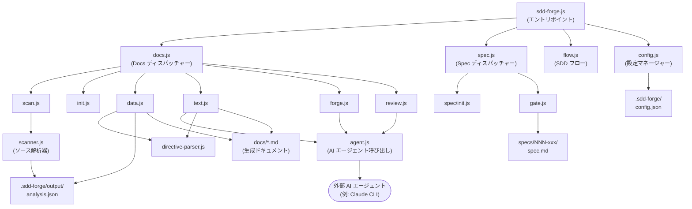

# 01. システム概要

## 説明

<!-- {{text: Write a 1-2 sentence overview of this chapter. Include the project's architecture and whether it integrates with external systems.}} -->

本章では、`sdd-forge` の全体アーキテクチャを説明する。`sdd-forge` は、ソースコードを解析してテンプレートディレクティブを AI 生成コンテンツで解決することで、Spec-Driven Development によるドキュメント自動生成を行う Node.js CLI ツールである。このツールは Node.js 組み込みモジュールのみを使用してローカルファイルシステム上で完結して動作し、テキスト生成やレビュータスクには設定可能な外部 AI エージェント（Claude CLI 等）とオプションで連携する。

<!-- {{/text}} -->

## 内容

### アーキテクチャ図

<!-- {{text: Generate a mermaid flowchart showing the project architecture. Include data flows between major components. Output only the mermaid code block.}} -->

<!-- {{/text}} -->

### コンポーネントの責務

<!-- {{text: Describe the major components with their location, responsibilities, and I/O in table format.}} -->

| コンポーネント | 場所 | 責務 | 入力 | 出力 |
|---|---|---|---|---|
| CLI エントリポイント | `src/sdd-forge.js` | サブコマンドのルーティングと環境変数によるプロジェクトコンテキストの解決 | CLI 引数、`SDD_SOURCE_ROOT` / `SDD_WORK_ROOT` 環境変数 | ディスパッチャーへ委譲 |
| Docs ディスパッチャー | `src/docs.js` | ドキュメント関連サブコマンド（`scan`、`init`、`data`、`text`、`forge`、`review` 等）のルーティング | サブコマンド名と引数 | `src/docs/commands/*.js` へ委譲 |
| Spec ディスパッチャー | `src/spec.js` | SDD ワークフロー管理のための `spec` および `gate` サブコマンドのルーティング | サブコマンド名と引数 | `src/specs/commands/*.js` へ委譲 |
| SDD フロー | `src/flow.js` | SDD ワークフロー全体のエンドツーエンド自動実行 | `--request` 引数と `.sdd-forge/current-spec` のフロー状態 | spec 作成・ゲートチェック・実装のオーケストレーション |
| スキャナー | `src/docs/lib/scanner.js` | ソースファイルの解析と構造メタデータ（ファイル・モジュール・メソッド）の抽出 | 設定済みパス配下のソースファイル | `.sdd-forge/output/analysis.json` |
| ディレクティブパーサー | `src/docs/lib/directive-parser.js` | テンプレートファイル内の `{{data}}` および `{{text}}` ディレクティブの解析 | `.md` テンプレートファイル | 後続リゾルバー向けのディレクティブ AST |
| エージェント呼び出し | `src/lib/agent.js` | 設定済み外部 AI エージェントの同期・非同期呼び出し | プロンプト文字列、`config.json` のエージェント設定 | AI 生成テキストレスポンス |
| 設定マネージャー | `src/lib/config.js` | プロジェクト設定の読み込み・バリデーション・提供、およびパスユーティリティ | `.sdd-forge/config.json`、`.sdd-forge/context.json` | バリデーション済み設定オブジェクト、解決済みファイルパス |
| リゾルバーファクトリー | `src/docs/lib/resolver-factory.js` | 指定されたプロジェクトタイプ・プリセットに対応する `DataSource` リゾルバーの生成 | プロジェクトタイプ、解析データ | `data.js` 向けにインスタンス化された `DataSource` |
| テンプレートマージャー | `src/docs/lib/template-merger.js` | プリセット層をまたいだ `@extends` / `@block` テンプレート継承の解決 | ベースおよび子テンプレートファイル | マージされたテンプレートコンテンツ |

<!-- {{/text}} -->

### 外部連携

<!-- {{text: If there are external system integrations, describe their purpose and connection method in table format.}} -->

| 連携先 | 目的 | 接続方法 | 設定 |
|---|---|---|---|
| AI エージェント（例: Claude CLI） | `{{text}}` ディレクティブのドキュメントテキスト生成、`forge` による改善、`review` による品質チェックの実行 | `execFileSync`（同期）または `spawn` + `stdin: "ignore"`（非同期）による CLI サブプロセス呼び出し | `.sdd-forge/config.json` の `providers` および `defaultAgent` で定義。カスタムの `command`、`args`、`timeoutMs`、`systemPromptFlag` をサポート |

`sdd-forge` はその他の外部サービス依存を持たない。すべてのファイル I/O は Node.js 組み込みモジュール（`fs`、`path`、`child_process`、`os`）を使用し、ツール自体からネットワーク呼び出しは行われない。AI エージェントのバイナリは、`sdd-forge` が実行されるマシンにインストールされ、システムの `PATH` 上でアクセス可能である必要がある。

<!-- {{/text}} -->

### 環境別の差異

<!-- {{text: Describe the configuration differences across environments (local/staging/production).}} -->

`sdd-forge` はローカル CLI ツールであるため、従来の多環境デプロイモデルには従わない。設定は各プロジェクトの作業ディレクトリ内の `.sdd-forge/config.json` によって完全にファイル駆動で管理され、ツールの実行環境に関わらず動作は一貫している。典型的な利用状況における差異は以下の通りである：

| コンテキスト | 特徴 | 備考 |
|---|---|---|
| ローカル開発 | インタラクティブな使用；AI エージェント呼び出しはリアルタイム；安全な確認のための `--dry-run` フラグが利用可能 | 開発者は `sdd-forge text`、`sdd-forge forge`、`sdd-forge review` をインタラクティブに実行可能 |
| CI / 自動パイプライン | 非インタラクティブ；`sdd-forge build` が scan → data → text → readme の全パイプラインを無人実行 | CI 環境に AI エージェントバイナリが存在し、`config.json` がコミット済みまたは注入済みであることが必要 |
| マルチプロジェクト構成 | 複数ソースプロジェクトが `.sdd-forge/projects.json` に登録され、`--project <name>` フラグでコンテキストを選択 | `SDD_SOURCE_ROOT` および `SDD_WORK_ROOT` 環境変数でプロジェクト固有のパスを上書き可能 |

`config.json` の `lang` および `output.languages` フィールドが、すべてのコンテキストにおける出力言語の動作を制御する。`sdd-forge` 自体はシークレットや認証情報を保存しない。AI エージェントの認証（必要な場合）は、ツール外部のエージェント固有の設定によって管理される。

<!-- {{/text}} -->
