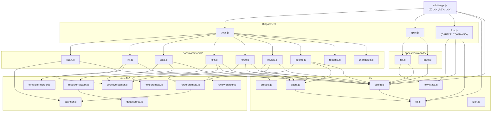

# 04. 内部設計

## 概要

<!-- {{text: Describe the purpose of this chapter in 1–2 sentences. Cover the project structure, module dependency direction, and key processing flows.}} -->

本章では、sdd-forge の内部アーキテクチャについて説明する。ディレクトリ構成、モジュールの責務、3層ディスパッチ構造におけるモジュール依存の方向性、および代表的なコマンドのエンドツーエンドの処理フローを取り上げる。
<!-- {{/text}} -->

## 目次

### プロジェクト構造

<!-- {{text: Describe the directory structure of this project in a tree-format code block. Include role comments for major directories and files. Cover the dispatchers directly under src/ (sdd-forge.js, docs.js, spec.js, flow.js), docs/commands/ (subcommand implementations), docs/lib/ (document generation library), lib/ (shared utilities), presets/ (preset definitions), and templates/ (bundled templates).}} -->

```
sdd-forge/
├── package.json                        ← パッケージマニフェスト；バイナリエントリは src/sdd-forge.js
├── src/
│   ├── sdd-forge.js                    ← トップレベル CLI エントリポイント；docs.js / spec.js / flow.js へルーティング
│   ├── docs.js                         ← docs サブコマンド全般のディスパッチャー（build, scan, init, data, text, …）
│   ├── spec.js                         ← spec サブコマンドのディスパッチャー（spec, gate）
│   ├── flow.js                         ← DIRECT_COMMAND: SDD フロー自動化（サブルーティングなし）
│   ├── presets-cmd.js                  ← DIRECT_COMMAND: プリセット一覧・検査
│   ├── help.js                         ← ヘルプテキスト表示
│   ├── docs/
│   │   ├── commands/                   ← docs サブコマンドの実装（1コマンド1ファイル）
│   │   │   ├── scan.js                 ← ソース解析 → analysis.json + summary.json
│   │   │   ├── init.js                 ← プリセットテンプレートから docs/ を初期化
│   │   │   ├── data.js                 ← {{data}} ディレクティブを解決
│   │   │   ├── text.js                 ← AI エージェント経由で {{text}} ディレクティブを解決
│   │   │   ├── readme.js               ← README.md を生成
│   │   │   ├── forge.js                ← docs の反復改善
│   │   │   ├── review.js               ← docs 品質チェック
│   │   │   ├── agents.js               ← AGENTS.md を更新
│   │   │   ├── changelog.js            ← specs/ から change_log.md を生成
│   │   │   ├── setup.js                ← プロジェクト登録 + 設定生成
│   │   │   └── …                       ← upgrade, translate, default-project など
│   │   └── lib/                        ← ドキュメント生成ライブラリ（コマンド間で共有）
│   │       ├── scanner.js              ← ファイル探索、PHP/JS/YAML 解析ユーティリティ
│   │       ├── directive-parser.js     ← {{data}}, {{text}}, @block, @extends ディレクティブの解析
│   │       ├── template-merger.js      ← @extends / @block テンプレート継承の解決
│   │       ├── data-source.js          ← DataSource 基底クラス
│   │       ├── data-source-loader.js   ← プリセット別 DataSource の動的ロード
│   │       ├── resolver-factory.js     ← data コマンドが使用する createResolver() ファクトリ
│   │       ├── forge-prompts.js        ← forge / agents コマンド向けプロンプト生成；summaryToText()
│   │       ├── text-prompts.js         ← text コマンド向けプロンプト生成
│   │       ├── review-parser.js        ← review コマンドの構造化出力をパース
│   │       ├── scan-source.js          ← スキャン設定ローダー
│   │       ├── concurrency.js          ← ファイル並列処理ユーティリティ
│   │       ├── command-context.js      ← resolveCommandContext() および関連ヘルパー
│   │       └── php-array-parser.js     ← PHP 配列構文パーサー
│   ├── specs/
│   │   └── commands/
│   │       ├── init.js                 ← 新しい spec を作成（ブランチ + spec.md）
│   │       └── gate.js                 ← spec のゲートチェック（pre / post フェーズ）
│   ├── lib/                            ← 全レイヤーで共有される共通ユーティリティ
│   │   ├── agent.js                    ← AI エージェント呼び出し（同期 + 非同期）
│   │   ├── cli.js                      ← CLI パーサー、パス解決、PKG_DIR
│   │   ├── config.js                   ← 設定ロード・バリデーション；.sdd-forge/ パスヘルパー
│   │   ├── flow-state.js               ← current-spec JSON の状態管理
│   │   ├── presets.js                  ← src/presets/ の自動探索
│   │   ├── i18n.js                     ← 国際化ユーティリティ
│   │   ├── projects.js                 ← マルチプロジェクトレジストリヘルパー
│   │   ├── types.js                    ← TYPE_ALIASES と型解決
│   │   └── …                           ← agents-md, entrypoint, process, progress
│   ├── presets/                        ← プリセット定義（preset.json により自動探索）
│   │   ├── base/                       ← ベースプリセット；ja/ と en/ のドキュメントテンプレート
│   │   ├── webapp/                     ← webapp アーキプリセット
│   │   │   ├── cakephp2/               ← CakePHP 2.x プリセット（PHP アナライザー含む）
│   │   │   ├── laravel/                ← Laravel プリセット
│   │   │   └── symfony/                ← Symfony プリセット
│   │   ├── cli/
│   │   │   └── node-cli/               ← Node.js CLI プリセット
│   │   └── library/                    ← ライブラリアーキプリセット
│   └── templates/                      ← バンドル済みドキュメント・spec テンプレート
│       ├── config.example.json
│       ├── review-checklist.md
│       └── skills/                     ← Claude スキルテンプレート（sdd-flow-start, sdd-flow-close）
├── docs/                               ← sdd-forge 自身の設計ドキュメント（npm 公開対象）
├── tests/                              ← テストファイル（*.test.js、Node 組み込みランナー）
└── specs/                              ← 蓄積された SDD spec ファイル（020件以上）
```
<!-- {{/text}} -->

### モジュール概要

<!-- {{text: Describe the major modules in a table format. Include module name, file path, and responsibility. Cover the dispatcher layer (sdd-forge.js, docs.js, spec.js), command layer (docs/commands/*.js, specs/commands/*.js), library layer (lib/agent.js, lib/cli.js, lib/config.js, lib/flow-state.js, lib/presets.js, lib/i18n.js), and document generation layer (docs/lib/scanner.js, directive-parser.js, template-merger.js, forge-prompts.js, text-prompts.js, review-parser.js, data-source.js, resolver-factory.js).}} -->

**ディスパッチャー層**

| モジュール | パス | 責務 |
|---|---|---|
| CLI エントリポイント | `src/sdd-forge.js` | トップレベルのサブコマンドを解析し、`SDD_SOURCE_ROOT` / `SDD_WORK_ROOT` 経由でプロジェクトコンテキストを解決して、適切なディスパッチャーまたは DIRECT_COMMAND に委譲する |
| docs ディスパッチャー | `src/docs.js` | docs 関連サブコマンド（`build`, `scan`, `init`, `data`, `text`, `readme`, `forge`, `review`, `agents`, `changelog`, `setup`, `upgrade`, `translate`）をコマンドモジュールにルーティングする |
| spec ディスパッチャー | `src/spec.js` | `spec` と `gate` サブコマンドをコマンドモジュールにルーティングする |

**コマンド層**

| モジュール | パス | 責務 |
|---|---|---|
| scan | `src/docs/commands/scan.js` | ソースファイルを解析し、`analysis.json` + `summary.json` を `.sdd-forge/output/` に書き出す |
| init | `src/docs/commands/init.js` | `@extends` / `@block` 継承を通じてプリセットテンプレートから `docs/` ディレクトリを初期化する |
| data | `src/docs/commands/data.js` | `createResolver()` を使用して docs 内の全 `{{data: …}}` ディレクティブを解決する |
| text | `src/docs/commands/text.js` | 生成したプロンプトで AI エージェントを呼び出し、全 `{{text: …}}` ディレクティブを解決する |
| readme | `src/docs/commands/readme.js` | docs コンテンツとプロジェクトメタデータから `README.md` を生成する |
| forge | `src/docs/commands/forge.js` | 現在の解析データをもとに AI による docs の反復改善を実行する |
| review | `src/docs/commands/review.js` | docs 品質チェックを実行し、構造化された合否結果をパースする |
| agents | `src/docs/commands/agents.js` | `AGENTS.md` の `<!-- SDD -->` および `<!-- PROJECT -->` セクションを再構築する |
| changelog | `src/docs/commands/changelog.js` | `specs/` のエントリを集約して `change_log.md` を生成する |
| spec init | `src/specs/commands/init.js` | フィーチャーブランチを作成し、新しい `spec.md` を初期化する |
| gate | `src/specs/commands/gate.js` | 実装前・実装後のチェックリストに対して spec を検証する |
| flow | `src/flow.js` | DIRECT_COMMAND: SDD フロー全体（spec → gate → 実装 → forge → review）をオーケストレーションする |

**ライブラリ層**

| モジュール | パス | 責務 |
|---|---|---|
| agent | `src/lib/agent.js` | AI エージェントを同期（`callAgent`）または非同期（`callAgentAsync`）で呼び出し、プロンプト注入とタイムアウト管理を行う |
| cli | `src/lib/cli.js` | `parseArgs()`、`PKG_DIR`、`repoRoot()`、`sourceRoot()`、`isInsideWorktree()`、タイムスタンプ生成を提供する |
| config | `src/lib/config.js` | `.sdd-forge/config.json` をロード・バリデーションし、`.sdd-forge/` パスヘルパーと `resolveProjectContext()` を公開する |
| flow-state | `src/lib/flow-state.js` | SDD フロー状態追跡のために `.sdd-forge/current-spec` JSON を読み書き・削除する |
| presets | `src/lib/presets.js` | `src/presets/` 以下の `preset.json` ファイルを自動探索し、`PRESETS` 定数を公開する |
| i18n | `src/lib/i18n.js` | ロケール文字列をロードし、CLI 出力とテンプレートで使用する翻訳ヘルパーを提供する |

**ドキュメント生成層**

| モジュール | パス | 責務 |
|---|---|---|
| scanner | `src/docs/lib/scanner.js` | ファイルシステム探索、PHP/JS/YAML 解析、コントローラー・モデル・ルート・シェルを抽出する `genericScan` |
| directive-parser | `src/docs/lib/directive-parser.js` | Markdown ファイルを `{{data}}`、`{{text}}`、`@block`、`@extends` ディレクティブのセグメントにトークナイズする |
| template-merger | `src/docs/lib/template-merger.js` | `@extends` / `@block` の継承チェーンを解決し、最終的なテンプレートコンテンツを生成する |
| forge-prompts | `src/docs/lib/forge-prompts.js` | `forge` と `agents` コマンド向けのプロンプトを構築し、解析 JSON を読みやすいテキストに変換する `summaryToText()` を提供する |
| text-prompts | `src/docs/lib/text-prompts.js` | `text` コマンド向けのディレクティブごとのプロンプトを構築する |
| review-parser | `src/docs/lib/review-parser.js` | review AI エージェントからの構造化された合否出力をパースする |
| data-source | `src/docs/lib/data-source.js` | プリセット固有の全 DataSource 実装が従うべきインターフェースを定義する基底クラス |
| resolver-factory | `src/docs/lib/resolver-factory.js` | プロジェクトタイプに基づいて適切な DataSource を `data` コマンドに接続する `createResolver()` ファクトリ |
<!-- {{/text}} -->

### モジュール依存関係

<!-- {{text: Generate a mermaid graph showing the dependencies between modules. Reflect the three-layer dispatch structure and show the dependency direction from dispatcher → command → library. Output only the mermaid code block.}} -->


<!-- {{/text}} -->

### 主要な処理フロー

<!-- {{text: Explain the inter-module data and control flow when a representative command (build or forge) is executed, using numbered steps. Include the flow from entry point → dispatch → config loading → analysis data preparation → AI call → file writing.}} -->

**`sdd-forge build` — フルパイプライン実行**

1. **エントリポイント** — `sdd-forge.js` が `build` サブコマンドを受け取り、プロジェクトコンテキストを解決（`--project` フラグまたは `.sdd-forge/projects.json` のデフォルト設定）して `SDD_SOURCE_ROOT` と `SDD_WORK_ROOT` 環境変数を設定し、`docs.js` に委譲する。
2. **ディスパッチ** — `docs.js` が `build` を `scan → init → data → text → readme → agents → [translate]` の順次パイプラインにマッピングし、各コマンドモジュールを順番に呼び出す。
3. **設定ロード** — 各コマンドが `src/lib/config.js` の `loadConfig(root)` を呼び出して `.sdd-forge/config.json` を読み込み、プロジェクトタイプ、出力言語、AI エージェント設定、並列処理数などを取得する。
4. **ソース解析（`scan`）** — `scan.js` が `docs/lib/scanner.js` のユーティリティを呼び出してソースツリーを探索し、PHP/JS/YAML ファイルを解析して `.sdd-forge/output/analysis.json`（フル）と `summary.json`（AI 向け軽量版）を書き出す。
5. **テンプレート初期化（`init`）** — `init.js` が `directive-parser.js` を使ってプリセットテンプレート内の `@extends` / `@block` ディレクティブを特定し、`template-merger.js` で `docs/` 以下の最終的な Markdown スケルトンを生成する。
6. **データ解決（`data`）** — `data.js` が `resolver-factory.js` の `createResolver()` を呼び出してプロジェクトタイプに対応する `DataSource` を選択する。docs 内の各 `{{data: …}}` ディレクティブが `analysis.json` から抽出された構造化コンテンツで置き換えられる。
7. **AI テキスト生成（`text`）** — `text.js` が各 `{{text: …}}` ディレクティブを読み取り、`text-prompts.js` でプロンプトを構築（`summary.json` のコンテンツとプロジェクトコンテキストを組み込み）して、`lib/agent.js` の `callAgentAsync()` を呼び出して AI レスポンスをストリーミングする。結果が docs の Markdown ファイルに書き戻される。
8. **成果物のファイナライズ** — `readme.js` が docs コンテンツから `README.md` を組み立て、`agents.js` が `AGENTS.md` のセクションを再生成し、複数の出力言語が設定されている場合は `translate.js` が翻訳版を生成する。

**`sdd-forge forge` — docs の反復改善**

1. **エントリポイント → ディスパッチ** — 手順2まで上記と同様；`docs.js` が直接 `forge.js` に委譲する。
2. **設定と解析データのロード** — `forge.js` が `loadConfig()` を呼び出し、`forge-prompts.js` の `summaryToText()` を使って `.sdd-forge/output/summary.json`（存在しない場合は `analysis.json` にフォールバック）を読み込んで人間が読めるテキストブロックに変換する。
3. **プロンプト構築** — `forge-prompts.js` がサマリーテキスト、現在の docs コンテンツ、呼び出し元が指定した `--prompt` 引数、config の `documentStyle` 設定を組み合わせて単一の改善プロンプトを生成する。
4. **AI 呼び出し** — `lib/agent.js` の `callAgentAsync()` が設定済みの AI エージェントプロセスを `stdin: "ignore"` でスポーンし、`{{PROMPT}}` プレースホルダーにプロンプトを注入（未使用の場合は末尾に追加）して、コールバック経由で出力をストリーミングする。
5. **ファイル書き込み** — `forge.js` が AI レスポンスを受け取り、`{{text}}` / `{{data}}` ディレクティブブロック外のコンテンツを変更せずに、関連する docs の Markdown ファイルに更新内容を書き込む。
6. **品質チェック** — `forge` の後、パイプライン（またはユーザー）が `sdd-forge review` を実行する。review チェックリストで AI エージェントを再度呼び出し、`review-parser.js` が構造化された合否結果をパースして、追加の forge 反復が必要かどうかを判定する。
<!-- {{/text}} -->

### 拡張ポイント

<!-- {{text: Explain where changes are needed and the extension patterns when adding new commands or features. Cover each of the following with steps: (1) adding a new docs subcommand, (2) adding a new spec subcommand, (3) adding a new preset, (4) adding a new DataSource ({{data}} resolver), and (5) adding a new AI prompt.}} -->

**(1) 新しい docs サブコマンドの追加**

1. `src/docs/commands/<name>.js` を作成し、`main(argv, env)` 関数をエクスポートする（直接実行スクリプトの場合は末尾で `main()` を呼び出す）。
2. `src/docs.js` を開き、新しいコマンドモジュールをインポートして呼び出す `case '<name>':` ブランチをディスパッチャーのスイッチ文に追加する。
3. `sdd-forge help` に表示されるよう `src/help.js` にサブコマンドを追加する。
4. `build` パイプラインの一部として実行する場合は、`docs/commands/build.js`（または `docs.js` 内のインライン build ロジック）のパイプラインシーケンスの適切な位置に挿入する。

**(2) 新しい spec サブコマンドの追加**

1. `src/specs/commands/<name>.js` に `main()` 関数を作成する。
2. `src/spec.js` を開き、新しいモジュールへのルーティングケースを追加する。
3. `src/help.js` に新しいサブコマンドの説明を追加する。
4. コマンドが SDD フロー状態に関与する場合は、`src/lib/flow-state.js` の `saveFlowState()` / `loadFlowState()` を使用する。

**(3) 新しいプリセットの追加**

1. `src/presets/<arch>/<key>/` ディレクトリを作成し、プリセットの `type`、`arch`、`isArch`、スキャン対象、章構成を記述した `preset.json` を追加する。
2. `src/presets/<arch>/<key>/templates/{ja,en}/` 以下に Markdown テンプレートを追加し、`@extends base` と `@block` ディレクティブを使ってベースレイアウトを継承・オーバーライドする。
3. プリセットにカスタムのソース解析が必要な場合は、アナライザーモジュールを追加してプリセットのリゾルバーまたは `docs/lib/scanner.js` に登録する。
4. `src/lib/presets.js` は起動時に全 `preset.json` ファイルを自動探索するため、`PRESETS` への手動登録は不要。
5. 必要に応じて `src/lib/types.js` の `TYPE_ALIASES` に型エイリアスを追加する。

**(4) 新しい DataSource（`{{data}}` リゾルバー）の追加**

1. `src/docs/data/`（または関連するプリセットディレクトリ）に `src/docs/lib/data-source.js` の `DataSource` を継承した新しいクラスを作成し、必要なリゾルバーメソッドを実装する。
2. 対応するプロジェクトタイプに対して新しい DataSource が返されるよう `src/docs/lib/data-source-loader.js` に登録する。
3. `resolver-factory.js` が `data-source-loader.js` を呼び出して DataSource インスタンスを取得する；`data` コマンドが `{{data: yourNamespace("…")}}` ディレクティブを見つけた際にリゾルバーが呼び出される。
4. `tests/docs/lib/` に新しいリゾルバーの出力フォーマットをカバーするテストを追加する。

**(5) 新しい AI プロンプトの追加**

1. プロンプトが `forge`/`agents` フロー向けか（→ `src/docs/lib/forge-prompts.js`）、`text` ディレクティブ解決フロー向けか（→ `src/docs/lib/text-prompts.js`）を判断する。
2. 適切なプロンプトファイルにエクスポートされたビルダー関数（例: `buildMyFeaturePrompt(context)`）を追加し、解析データ、config 設定、呼び出し元から渡された引数からプロンプト文字列を構築する。
3. 関連するコマンドモジュール（`forge.js`、`agents.js`、または `text.js`）で新しいビルダーをインポートして呼び出し、結果を `src/lib/agent.js` の `callAgent()` または `callAgentAsync()` に渡す。
4. プロンプトにカスタムのシステムプロンプトが必要な場合は、エージェント設定の `systemPromptFlag` を設定するか、`agent.js` のドキュメントに記載の `--system-prompt-file` 引数を渡す。
<!-- {{/text}} -->
