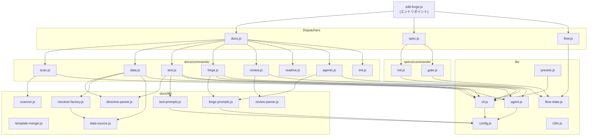

# 04. 内部設計

## 概要

<!-- {{text: Describe the purpose of this chapter in 1–2 sentences. Cover the project structure, direction of module dependencies, and key processing flows.}} -->

本章では、sdd-forge の内部アーキテクチャとして、ディレクトリ構成、各モジュールの責務、および3層ディスパッチ構造におけるモジュール間の依存方向を解説する。また、CLI エントリポイントから AI 呼び出し・ファイル出力に至るまでの主要な処理フローも説明する。

## 目次

### プロジェクト構造

<!-- {{text: Describe the directory structure of this project in a tree-format code block. Include role comments for major directories and files. Cover the top-level dispatchers under src/ (sdd-forge.js, docs.js, spec.js, flow.js), docs/commands/ (subcommand implementations), docs/lib/ (document generation libraries), lib/ (shared utilities), presets/ (preset definitions), and templates/ (bundled templates).}} -->

```
sdd-forge/
├── package.json                      ← パッケージマニフェスト。bin エントリ: ./src/sdd-forge.js
└── src/
    ├── sdd-forge.js                  ← トップレベル CLI エントリポイント。ディスパッチャーへルーティング
    ├── docs.js                       ← docs 系サブコマンド全般のディスパッチャー
    ├── spec.js                       ← spec/gate サブコマンドのディスパッチャー
    ├── flow.js                       ← SDD フロー自動実行（DIRECT_COMMAND）
    ├── presets-cmd.js                ← プリセット一覧表示コマンド（DIRECT_COMMAND）
    ├── help.js                       ← ヘルプテキスト出力
    ├── docs/
    │   ├── commands/                 ← サブコマンド実装
    │   │   ├── scan.js               ← ソース解析 → analysis.json / summary.json
    │   │   ├── init.js               ← テンプレートから docs/ を初期化
    │   │   ├── data.js               ← {{data}} ディレクティブを解決
    │   │   ├── text.js               ← {{text}} ディレクティブを AI で解決
    │   │   ├── readme.js             ← README.md を自動生成
    │   │   ├── forge.js              ← AI による docs の反復改善
    │   │   ├── review.js             ← AI による docs 品質チェック
    │   │   ├── agents.js             ← AGENTS.md セクションを再生成
    │   │   ├── changelog.js          ← specs/ から change_log.md を生成
    │   │   ├── setup.js              ← プロジェクト登録 + 設定生成
    │   │   └── ...                   ← upgrade, translate, default-project 等
    │   └── lib/                      ← ドキュメント生成ライブラリモジュール
    │       ├── scanner.js            ← ファイル探索および PHP/JS/YAML 解析
    │       ├── directive-parser.js   ← {{data}} / {{text}} / @block / @extends の解析
    │       ├── template-merger.js    ← テンプレート継承（@extends / @block）の解決
    │       ├── data-source.js        ← DataSource 基底クラス
    │       ├── data-source-loader.js ← プリセット別 DataSource の動的ロード
    │       ├── resolver-factory.js   ← data コマンド向け createResolver() ファクトリ
    │       ├── forge-prompts.js      ← forge/agents 向けプロンプト生成。summaryToText() を提供
    │       ├── text-prompts.js       ← text コマンド向けプロンプト生成
    │       ├── review-parser.js      ← AI レビュー出力のパース
    │       ├── renderers.js          ← Markdown レンダリングユーティリティ
    │       ├── scan-source.js        ← スキャン設定ローダー
    │       ├── concurrency.js        ← ファイル並列処理ユーティリティ
    │       └── ...                   ← composer-utils.js, php-array-parser.js
    ├── specs/
    │   └── commands/
    │       ├── init.js               ← spec.md 作成 + feature ブランチのセットアップ
    │       └── gate.js               ← spec ゲートチェック（pre/post フェーズ）
    ├── lib/                          ← 全レイヤーで共有するユーティリティ
    │   ├── agent.js                  ← AI エージェント呼び出し（同期/非同期）
    │   ├── cli.js                    ← 引数パース、パス解決ユーティリティ
    │   ├── config.js                 ← 設定ロード・バリデーション、.sdd-forge/ パスヘルパー
    │   ├── flow-state.js             ← SDD フロー状態管理（current-spec）
    │   ├── presets.js                ← プリセット自動探索・検索
    │   ├── i18n.js                   ← 国際化ユーティリティ
    │   ├── types.js                  ← 型エイリアスとプロジェクトタイプ定義
    │   └── ...                       ← agents-md.js, process.js, projects.js, entrypoint.js
    ├── presets/                      ← プロジェクトタイプ別プリセット定義
    │   ├── base/                     ← ベースプリセット（アーキ層）
    │   │   ├── preset.json
    │   │   └── templates/            ← ドキュメントテンプレート（ja/ および en/）
    │   ├── webapp/, cli/, library/   ← アーキテクチャ層プリセット
    │   ├── cakephp2/, laravel/, symfony/ ← フレームワーク固有プリセット
    │   └── node-cli/                 ← Node.js CLI プリセット
    └── templates/                    ← バンドル済みテンプレート（config.example.json, review-checklist.md, skills/）
```

### モジュール概要

<!-- {{text: List the major modules in a table format. Include module name, file path, and responsibility. Cover the dispatcher layer (sdd-forge.js, docs.js, spec.js), command layer (docs/commands/*.js, specs/commands/*.js), library layer (lib/agent.js, lib/cli.js, lib/config.js, lib/flow-state.js, lib/presets.js, lib/i18n.js), and document generation layer (docs/lib/scanner.js, directive-parser.js, template-merger.js, forge-prompts.js, text-prompts.js, review-parser.js, data-source.js, resolver-factory.js).}} -->

| レイヤー | モジュール | ファイルパス | 責務 |
|---|---|---|---|
| **ディスパッチャー** | CLI エントリポイント | `src/sdd-forge.js` | トップレベルのサブコマンドを解析し、環境変数を通じてプロジェクトコンテキストを解決。ディスパッチャーまたは DIRECT_COMMAND へルーティング |
| **ディスパッチャー** | docs ディスパッチャー | `src/docs.js` | docs 系サブコマンド全般（`build`, `scan`, `init`, `data`, `text`, `readme`, `forge`, `review`, `agents`, `changelog`, `setup` 等）をルーティング |
| **ディスパッチャー** | spec ディスパッチャー | `src/spec.js` | `spec` および `gate` サブコマンドをルーティング |
| **コマンド** | scan | `src/docs/commands/scan.js` | ソースファイルを解析し、`analysis.json` と `summary.json` を生成 |
| **コマンド** | data | `src/docs/commands/data.js` | 解析データを使って docs 内の `{{data}}` ディレクティブを解決 |
| **コマンド** | text | `src/docs/commands/text.js` | AI エージェントを呼び出して `{{text}}` ディレクティブを解決 |
| **コマンド** | forge | `src/docs/commands/forge.js` | AI を通じて既存 docs コンテンツを反復改善 |
| **コマンド** | review | `src/docs/commands/review.js` | レビューチェックリストに基づき AI による品質チェックを実行 |
| **コマンド** | readme | `src/docs/commands/readme.js` | docs と解析データから `README.md` を自動生成 |
| **コマンド** | agents | `src/docs/commands/agents.js` | `AGENTS.md` の SDD セクションおよび PROJECT セクションを再生成 |
| **コマンド** | spec init | `src/specs/commands/init.js` | 新しい spec ファイルと feature ブランチを作成 |
| **コマンド** | gate | `src/specs/commands/gate.js` | ゲート基準に対して spec ファイルを検証（pre/post フェーズ） |
| **ライブラリ** | agent | `src/lib/agent.js` | 同期・非同期の AI エージェント呼び出し、プロンプト注入、タイムアウト管理 |
| **ライブラリ** | cli | `src/lib/cli.js` | `parseArgs()`, `repoRoot()`, `sourceRoot()`, `isInsideWorktree()`, `PKG_DIR` 定数 |
| **ライブラリ** | config | `src/lib/config.js` | `.sdd-forge/config.json` のロード・バリデーション、`.sdd-forge/` 配下のパスヘルパー管理 |
| **ライブラリ** | flow-state | `src/lib/flow-state.js` | `.sdd-forge/current-spec` の読み書きによる SDD フロー進行状態の追跡 |
| **ライブラリ** | presets | `src/lib/presets.js` | `src/presets/` 配下の `preset.json` を自動探索し、`PRESETS` 定数および検索ヘルパーを公開 |
| **ライブラリ** | i18n | `src/lib/i18n.js` | ロケール文字列のロードと翻訳ユーティリティ |
| **ドキュメント生成** | scanner | `src/docs/lib/scanner.js` | ファイル探索、PHP/JS/YAML 解析ユーティリティ、`genericScan()` |
| **ドキュメント生成** | directive-parser | `src/docs/lib/directive-parser.js` | Markdown ファイルから `{{data}}`, `{{text}}`, `@block`, `@extends` ディレクティブを解析 |
| **ドキュメント生成** | template-merger | `src/docs/lib/template-merger.js` | ディレクティブ処理前にテンプレート継承（`@extends` / `@block`）を解決 |
| **ドキュメント生成** | forge-prompts | `src/docs/lib/forge-prompts.js` | `forge` および `agents` コマンド向けプロンプトを生成。`summaryToText()` を提供 |
| **ドキュメント生成** | text-prompts | `src/docs/lib/text-prompts.js` | `text` コマンド向けのディレクティブ単位プロンプトを生成 |
| **ドキュメント生成** | review-parser | `src/docs/lib/review-parser.js` | `review` コマンドの AI 出力を構造化し、合否結果としてパース |
| **ドキュメント生成** | data-source | `src/docs/lib/data-source.js` | すべての `{{data}}` リゾルバー実装の基底クラス |
| **ドキュメント生成** | resolver-factory | `src/docs/lib/resolver-factory.js` | 指定プリセットに応じた DataSource を生成する `createResolver()` ファクトリ |

### モジュール依存関係

<!-- {{text: Generate a mermaid graph showing the dependencies between modules. Reflect the three-layer dispatch structure and show the dependency direction from dispatcher → command → library. Output only the mermaid code block.}} -->



### 主要な処理フロー

<!-- {{text: Explain the inter-module data and control flow when a representative command (build or forge) is executed, using numbered steps. Include the flow from entry point → dispatch → config loading → analysis data preparation → AI invocation → file writing.}} -->

以下は `sdd-forge forge` コマンドを実行したときの制御フローとデータフローである。このコマンドは AI を活用したドキュメント更新の典型的なエンドツーエンドの流れを示している。

1. **エントリポイント** — `sdd-forge.js` がサブコマンドとして `forge` を受け取る。`--project` フラグ、`.sdd-forge/projects.json`、またはカレントディレクトリからプロジェクトコンテキストを解決し、`SDD_SOURCE_ROOT` および `SDD_WORK_ROOT` 環境変数を設定した上で `docs.js` へ制御を渡す。
2. **ディスパッチ** — `docs.js` が `forge` に一致するケースを選択し、`docs/commands/forge.js` を動的にインポートして、パース済みの引数を渡す。
3. **設定ロード** — `forge.js` が `lib/config.js` の `loadConfig()` を呼び出して `.sdd-forge/config.json` を読み込む。有効な言語、AI エージェント設定、ドキュメントスタイルオプションが設定から取得される。
4. **解析データの準備** — `forge.js` が `.sdd-forge/output/summary.json` を読み込む（存在しない場合は `analysis.json` にフォールバック）。`docs/lib/forge-prompts.js` の `summaryToText()` 関数が JSON 構造を AI プロンプトに適した簡潔なテキストへ変換する。
5. **プロンプト構築** — `forge-prompts.js` が、解析サマリー・既存の docs コンテンツ・`documentStyle` 設定（トーン、目的、カスタム指示）を組み合わせて、システムプロンプトとユーザープロンプトを組み立てる。
6. **AI 呼び出し** — 構築されたプロンプトを引数として `lib/agent.js` が呼び出される。`callAgentAsync()` は設定済みの AI エージェントプロセスを（`spawn` + `stdin: "ignore"` で）起動し、コールバックを通じてレスポンスをストリーミングする。
7. **レスポンスのパース** — AI が生成した出力がパース・検証される。`forge` コマンドの場合、レスポンスには1つ以上の docs ファイルの更新済み Markdown コンテンツが含まれる。
8. **ファイル書き込み** — 更新されたコンテンツが `docs/` 配下の対応ファイルに書き込まれる。出力中のディレクティブマーカー（`{{data}}` / `{{text}}` ブロック）は将来の自動実行で再処理できるよう保持される。
9. **レビュー（任意）** — `forge` の後、SDD ワークフローでは `sdd-forge review` の実行を推奨する。review も同様のフローをたどるが、AI レスポンスから合否結果を構造化してパースするために `review-parser.js` を使用する。

`build` コマンドの場合は、同じパイプラインが `scan` → `init` → `data` → `text` → `readme` の順で逐次実行され、各ステップの出力が次のステップの入力として使われる。

### 拡張ポイント

<!-- {{text: Explain where changes are needed and the extension patterns when adding new commands or features. Provide steps for each of the following: (1) adding a new docs subcommand, (2) adding a new spec subcommand, (3) adding a new preset, (4) adding a new DataSource ({{data}} resolver), and (5) adding a new AI prompt.}} -->

**1. 新しい docs サブコマンドを追加する**

1. `src/docs/commands/<name>.js` を作成する。`main(args)` 関数をエクスポートする（直接実行をサポートする場合は末尾で `main()` を呼び出す）。
2. `src/docs.js` を開き、ディスパッチマップに新しいサブコマンド名のケースを追加し、新ファイルのパスを指定する。
3. `src/help.js` のコマンド一覧に項目を追加し、`sdd-forge help` の出力に反映させる。
4. `tests/docs/commands/` 配下に対応するテストファイルを追加する。

**2. 新しい spec サブコマンドを追加する**

1. `src/specs/commands/<name>.js` を作成し、`main(args)` 関数を実装する。
2. `src/spec.js` にディスパッチケースを追加して新しいサブコマンドを登録する。
3. `src/help.js` を更新して新コマンドの説明を追記する。
4. `tests/specs/commands/` 配下にテストを追加する。

**3. 新しいプリセットを追加する**

1. `src/presets/<key>/` 配下に `preset.json` を含むディレクトリを作成する。必須フィールドとして `type`, `arch`, `chapters`（含めるドキュメントテンプレートファイルのリスト）を設定する。
2. `chapters` で宣言したファイル名を使い、`src/presets/<key>/templates/{ja,en}/` 配下にドキュメントテンプレートを配置する。
3. カスタムのソーススキャンロジックが必要な場合は、アナライザーモジュールを追加して `preset.json` から参照する。既存プリセット（`cakephp2` 等）のパターンに倣ってスキャンロジックを実装する。
4. `src/lib/presets.js` が `preset.json` を再帰探索して自動登録するため、手動での登録は不要である。
5. 短縮名でプリセットを参照できるようにする場合は、`src/lib/types.js` に型エイリアスを追加する。

**4. 新しい DataSource（`{{data}}` リゾルバー）を追加する**

1. `src/docs/lib/data-source.js` の `DataSource` を継承するクラスを作成する。指定されたディレクティブキーのデータ値を返す `resolve(key, args)` メソッドを実装する。
2. `src/docs/lib/data-source-loader.js` で新しい DataSource を適切なプリセットタイプにマッピングして登録する。
3. `resolver-factory.js` が `createResolver()` で DataSource をインスタンス化できることを確認する。ファクトリが明示的な型マッチングを使っている場合はケースを追加する。
4. 代表的なディレクティブキーの解決結果を検証するテストを作成する。

**5. 新しい AI プロンプトを追加する**

1. プロンプトが属するコマンドを確認する。docs 改善向けプロンプトは `src/docs/lib/forge-prompts.js` にビルダー関数を追加する。`{{text}}` ディレクティブ向けプロンプトは `src/docs/lib/text-prompts.js` に追加する。
2. プロンプトビルダーは、関連する設定と解析データを引数として受け取り、`{ system, user }` オブジェクトを返す形式にする。
3. 対応するコマンドファイル（`forge.js`, `text.js` 等）からプロンプトビルダーを呼び出し、その結果を `lib/agent.js` の `callAgent()` または `callAgentAsync()` に渡す。
4. プロンプトにカスタムシステムプロンプトファイル（`--system-prompt-file` 用）が必要な場合は、`ensureAgentWorkDir()` を呼び出し、呼び出し後に一時ファイルを確実に削除する。
