# 04. 内部設計

## 概要

<!-- {{text: Describe the purpose of this chapter in 1–2 sentences. Cover the project structure, module dependency direction, and key processing flows.}} -->

本章では sdd-forge の内部アーキテクチャを解説し、モジュールの構成方法、モジュール間の制御・データフロー、ドキュメント生成と SDD ワークフロー実行を担う主要な処理パイプラインについて説明する。階層化されたディスパッチ構造と依存関係の方向を理解することは、ツールの拡張や修正を行うコントリビューターにとって不可欠である。

## 目次

### プロジェクト構造

<!-- {{text: Describe the directory structure of this project in a tree-format code block. Include role comments for major directories and files. Cover the dispatchers directly under src/ (sdd-forge.js, docs.js, spec.js, flow.js), docs/commands/ (subcommand implementations), docs/lib/ (document generation library), lib/ (shared utilities), presets/ (preset definitions), and templates/ (bundled templates).}} -->

```
sdd-forge/
├── package.json                        ← パッケージマニフェスト。bin エントリは src/sdd-forge.js を指す
├── src/
│   ├── sdd-forge.js                    ← トップレベル CLI エントリポイント。ディスパッチャーにルーティング
│   ├── docs.js                         ← docs 関連サブコマンドのディスパッチャー
│   ├── spec.js                         ← spec/gate サブコマンドのディスパッチャー
│   ├── flow.js                         ← DIRECT_COMMAND: SDD フロー自動実行（サブルーティングなし）
│   ├── presets-cmd.js                  ← DIRECT_COMMAND: プリセット一覧表示コマンド
│   ├── help.js                         ← コマンドヘルプ画面を描画
│   ├── docs/
│   │   ├── commands/                   ← docs サブコマンドごとに 1 ファイル（scan, init, data, text,
│   │   │                                  readme, forge, review, agents, changelog, setup,
│   │   │                                  snapshot, upgrade, translate, default-project）
│   │   ├── lib/                        ← ドキュメント生成ライブラリ（scanner, directive-parser,
│   │   │                                  template-merger, data-source, resolver-factory,
│   │   │                                  forge-prompts, text-prompts, review-parser,
│   │   │                                  command-context, concurrency, test-env-detection, …）
│   │   └── data/                       ← DataSource 実装（project, docs, agents, lang）
│   ├── specs/
│   │   └── commands/                   ← spec サブコマンド実装（init, gate）
│   ├── lib/                            ← 全レイヤーで共有するユーティリティ
│   │   ├── agent.js                    ← AI エージェント呼び出し（同期 / 非同期）
│   │   ├── cli.js                      ← CLI 引数パース、パス解決ユーティリティ
│   │   ├── config.js                   ← .sdd-forge/config.json の読み込みとパスヘルパー
│   │   ├── flow-state.js               ← .sdd-forge/current-spec の状態管理
│   │   ├── presets.js                  ← プリセットの自動探索・登録
│   │   ├── i18n.js                     ← ロケールメッセージの読み込み
│   │   ├── agents-md.js                ← AGENTS.md 生成ヘルパー
│   │   └── types.js                    ← TYPE_ALIASES と型解決ユーティリティ
│   ├── presets/                        ← プロジェクトタイプ別のプリセット定義
│   │   ├── base/                       ← ベースプリセット（isArch）。共有ドキュメントテンプレート（ja/en）
│   │   ├── webapp/                     ← アーキテクチャ層プリセット + FW 固有サブプリセット
│   │   │   ├── cakephp2/               ← CakePHP 2.x アナライザーと DataSource
│   │   │   ├── laravel/                ← Laravel アナライザー
│   │   │   └── symfony/                ← Symfony アナライザー
│   │   ├── cli/
│   │   │   └── node-cli/               ← Node.js CLI プリセット。src/**/*.js モジュールをスキャン
│   │   ├── library/                    ← ライブラリプリセット
│   │   └── lib/                        ← プリセット共有ユーティリティ（composer-utils.js）
│   ├── locale/
│   │   ├── ja/                         ← 日本語メッセージバンドル（messages, prompts, ui）
│   │   └── en/                         ← 英語メッセージバンドル
│   └── templates/                      ← バンドル済み設定サンプル、レビューチェックリスト、
│                                          SDD スキル定義
├── docs/                               ← sdd-forge 自身の生成済み設計ドキュメント
├── tests/                              ← テストファイル（*.test.js）。src/ の構造を反映
└── specs/                              ← 開発を通じて蓄積された SDD spec ファイル
```

### モジュール概要

<!-- {{text: Describe the major modules in a table format. Include module name, file path, and responsibility. Cover the dispatcher layer (sdd-forge.js, docs.js, spec.js), command layer (docs/commands/*.js, specs/commands/*.js), library layer (lib/agent.js, lib/cli.js, lib/config.js, lib/flow-state.js, lib/presets.js, lib/i18n.js), and document generation layer (docs/lib/scanner.js, directive-parser.js, template-merger.js, forge-prompts.js, text-prompts.js, review-parser.js, data-source.js, resolver-factory.js).}} -->

| モジュール | ファイルパス | 責務 |
|---|---|---|
| **CLI エントリポイント** | `src/sdd-forge.js` | トップレベルのサブコマンドを解析し、`SDD_SOURCE_ROOT` / `SDD_WORK_ROOT` 経由でプロジェクトコンテキストを解決して、適切なディスパッチャーまたはダイレクトコマンドに委譲する |
| **Docs ディスパッチャー** | `src/docs.js` | docs 関連サブコマンド（`build`, `scan`, `init`, `data`, `text`, `readme`, `forge`, `review`, `changelog`, `agents`, `snapshot`, `upgrade`, `translate`, `setup`, `default`）を各実装にルーティングする |
| **Spec ディスパッチャー** | `src/spec.js` | `spec` および `gate` サブコマンドを `specs/commands/` 配下の実装にルーティングする |
| **Flow コマンド** | `src/flow.js` | DIRECT_COMMAND — サブルーティングを行わず、SDD ワークフロー自動実行全体を実行する |
| **scan** | `src/docs/commands/scan.js` | アクティブなプリセットに従ってソースファイルを解析し、`analysis.json` を書き出す |
| **init** | `src/docs/commands/init.js` | `@extends` / `@block` 継承を使ってプリセットテンプレートから `docs/` ディレクトリを初期化する |
| **data** | `src/docs/commands/data.js` | DataSource 実装を問い合わせて docs ファイル内の `{{data}}` ディレクティブを解決する |
| **text** | `src/docs/commands/text.js` | 設定済みの AI エージェントを呼び出して `{{text}}` ディレクティブを解決する |
| **forge** | `src/docs/commands/forge.js` | 変更サマリーを AI にプロンプトとして与え、docs の品質を反復的に改善する |
| **review** | `src/docs/commands/review.js` | docs に対して品質チェックリストを実行し、PASS / FAIL を報告する |
| **spec init** | `src/specs/commands/init.js` | 新しい SDD spec ファイルと（任意で）feature ブランチを初期化する |
| **gate** | `src/specs/commands/gate.js` | ゲートチェックリストに対して spec を検証する（`--phase pre` / `post`） |
| **agent.js** | `src/lib/agent.js` | 設定済みの AI エージェントを呼び出す `callAgent()`（同期）と `callAgentAsync()`（非同期/ストリーミング）を提供する。`{{PROMPT}}` プレースホルダーによるプロンプト注入を管理する |
| **cli.js** | `src/lib/cli.js` | コードベース全体で使用する `PKG_DIR`、`repoRoot()`、`sourceRoot()`、`parseArgs()`、`isInsideWorktree()`、タイムスタンプユーティリティをエクスポートする |
| **config.js** | `src/lib/config.js` | `.sdd-forge/config.json` を読み込んで検証する。`.sdd-forge/` 成果物向けのパスヘルパーを公開する |
| **flow-state.js** | `src/lib/flow-state.js` | `.sdd-forge/current-spec` を読み書き・削除して進行中の SDD ワークフロー状態を追跡する |
| **presets.js** | `src/lib/presets.js` | `src/presets/` 配下の `preset.json` を自動探索し、`PRESETS` 定数を構築して検索ヘルパーを提供する |
| **i18n.js** | `src/lib/i18n.js` | `src/locale/{lang}/` からロケールメッセージバンドルを読み込み、翻訳済み文字列を解決する |
| **scanner.js** | `src/docs/lib/scanner.js` | `scan` ステップで使用するファイル探索と言語固有の解析ユーティリティ（PHP、JS、YAML） |
| **directive-parser.js** | `src/docs/lib/directive-parser.js` | Markdown テンプレートファイルから `{{data}}`、`{{text}}`、`@block`、`@extends` ディレクティブを解析する |
| **template-merger.js** | `src/docs/lib/template-merger.js` | ディレクティブ処理の前に `@extends` / `@block` テンプレート継承を解決する |
| **forge-prompts.js** | `src/docs/lib/forge-prompts.js` | `forge` コマンドと `agents` コマンド向けのプロンプトを構築する。`summaryToText()` を含む |
| **text-prompts.js** | `src/docs/lib/text-prompts.js` | `text` コマンド向けのディレクティブごとのプロンプトを構築する |
| **review-parser.js** | `src/docs/lib/review-parser.js` | AI レビュー出力を構造化された PASS / FAIL 結果に解析する |
| **data-source.js** | `src/docs/lib/data-source.js` | 全 DataSource 実装の基底クラス。`toMarkdownTable()`、`toRows()`、`desc()` を提供する |
| **resolver-factory.js** | `src/docs/lib/resolver-factory.js` | `data` コマンド向けに DataSource インスタンスを `{{data}}` ディレクティブキーに紐付ける `createResolver()` ファクトリ |

### モジュール依存関係

```mermaid
graph TD
    CLI["sdd-forge.js\n(エントリポイント)"]

    CLI --> DOCS["docs.js\n(Docs ディスパッチャー)"]
    CLI --> SPEC["spec.js\n(Spec ディスパッチャー)"]
    CLI --> FLOW["flow.js\n(ダイレクトコマンド)"]
    CLI --> PRESETS_CMD["presets-cmd.js\n(ダイレクトコマンド)"]
    CLI --> HELP["help.js"]

    DOCS --> CMD_SCAN["docs/commands/scan.js"]
    DOCS --> CMD_INIT["docs/commands/init.js"]
    DOCS --> CMD_DATA["docs/commands/data.js"]
    DOCS --> CMD_TEXT["docs/commands/text.js"]
    DOCS --> CMD_FORGE["docs/commands/forge.js"]
    DOCS --> CMD_REVIEW["docs/commands/review.js"]
    DOCS --> CMD_AGENTS["docs/commands/agents.js"]
    DOCS --> CMD_OTHER["docs/commands/…"]

    SPEC --> SPEC_INIT["specs/commands/init.js"]
    SPEC --> SPEC_GATE["specs/commands/gate.js"]

    CMD_SCAN --> LIB_CLI["lib/cli.js"]
    CMD_SCAN --> LIB_CONFIG["lib/config.js"]
    CMD_SCAN --> LIB_SCANNER["docs/lib/scanner.js"]

    CMD_DATA --> LIB_CONFIG
    CMD_DATA --> LIB_CLI
    CMD_DATA --> RESOLVER["docs/lib/resolver-factory.js"]
    CMD_DATA --> DIRECTIVE["docs/lib/directive-parser.js"]

    CMD_TEXT --> LIB_AGENT["lib/agent.js"]
    CMD_TEXT --> LIB_CONFIG
    CMD_TEXT --> DIRECTIVE
    CMD_TEXT --> TEXT_PROMPTS["docs/lib/text-prompts.js"]

    CMD_FORGE --> LIB_AGENT
    CMD_FORGE --> LIB_CONFIG
    CMD_FORGE --> FORGE_PROMPTS["docs/lib/forge-prompts.js"]

    CMD_REVIEW --> LIB_AGENT
    CMD_REVIEW --> REVIEW_PARSER["docs/lib/review-parser.js"]

    CMD_INIT --> LIB_CONFIG
    CMD_INIT --> LIB_PRESETS["lib/presets.js"]
    CMD_INIT --> TMPL_MERGER["docs/lib/template-merger.js"]

    SPEC_INIT --> LIB_CLI
    SPEC_INIT --> LIB_CONFIG
    SPEC_GATE --> LIB_AGENT
    SPEC_GATE --> LIB_CONFIG

    FLOW --> LIB_CLI
    FLOW --> LIB_CONFIG
    FLOW --> FLOW_STATE["lib/flow-state.js"]

    RESOLVER --> DATA_SOURCE["docs/lib/data-source.js"]
    LIB_AGENT --> LIB_CLI
    LIB_CONFIG --> LIB_CLI
    LIB_PRESETS --> LIB_CLI
```

<!-- {{text: Generate a mermaid graph showing the dependencies between modules. Reflect the three-layer dispatch structure and show the dependency direction from dispatcher → command → library. Output only the mermaid code block.}} -->



### 主要な処理フロー

<!-- {{text: Explain the inter-module data and control flow when a representative command (build or forge) is executed, using numbered steps. Include the flow from entry point → dispatch → config loading → analysis data preparation → AI call → file writing.}} -->

**`sdd-forge build` パイプライン**

1. **エントリポイント** — `sdd-forge.js` が `build` サブコマンドを受け取り、プロジェクトコンテキストを解決し（`--project` フラグまたは `.sdd-forge/projects.json` 経由）、`SDD_SOURCE_ROOT` と `SDD_WORK_ROOT` 環境変数を設定して `docs.js` に委譲する。
2. **ディスパッチ** — `docs.js` が `build` をシーケンシャルなパイプライン（`scan → init → data → text → readme → agents → [translate]`）にマッピングする。
3. **scan** — `docs/commands/scan.js` が `lib/config.js` を読み込んでプロジェクトの `type` を特定し、`lib/presets.js` でアクティブなプリセットを解決し、`docs/lib/scanner.js` を通じてプリセットの言語固有アナライザーを呼び出し、`.sdd-forge/output/analysis.json` を書き出す。
4. **init** — `docs/commands/init.js` が `lib/presets.js` でテンプレートファイルを特定し、`docs/lib/template-merger.js` で `@extends` / `@block` 継承を解決し、`docs/` にチャプタースケルトンを書き出す。
5. **data** — `docs/commands/data.js` が各 `docs/*.md` ファイルを読み込み、`docs/lib/directive-parser.js` で `{{data}}` ディレクティブを解析し、`docs/lib/resolver-factory.js` で `DataSource` 実装を基にリゾルバーを構築し、各ディレクティブブロックをレンダリング済みの Markdown テーブルで置換する。
6. **text** — `docs/commands/text.js` が `{{text}}` ディレクティブを解析し、`docs/lib/text-prompts.js` でディレクティブごとのプロンプトを構築し（関連するソースファイルの内容を含む）、`lib/agent.js` の `callAgentAsync()` で設定済みの AI エージェントを呼び出す。返却されたテキストはディレクティブマーカー間に注入される。
7. **readme & agents** — `docs/commands/readme.js` と `docs/commands/agents.js` も同じパターンに従う。`docs/lib/command-context.js` で `analysis.json` を読み込み、`docs/lib/forge-prompts.js` でプロンプトを構築し、AI を呼び出して出力ファイルを書き出す。
8. **translate**（任意）— 複数の出力言語が設定されており、`output.mode` が `translate` の場合、translate コマンドが生成済みの各ドキュメントをセカンダリ言語に再レンダリングする。

**`sdd-forge forge` フロー**

1. `sdd-forge.js` がプロジェクトコンテキストを解決して `docs.js` に委譲し、`docs.js` が `docs/commands/forge.js` を読み込む。
2. `forge.js` が `lib/config.js` からエージェント設定を読み込み、`docs/lib/command-context.js` 経由で `analysis.json` を読み込む。
3. `docs/lib/forge-prompts.js` が `--prompt` による変更サマリー、現在の docs コンテンツ、解析データを組み合わせた改善プロンプトを構築する。
4. `lib/agent.js` の `callAgentAsync()` が AI レスポンスをストリーミングで受け取る。影響を受ける各 `{{text}}` セクションが対応する `docs/*.md` ファイルに更新される。
5. 書き出し後、`docs/commands/review.js` を呼び出して結果を検証できる。`docs/lib/review-parser.js` が AI のチェックリスト出力を PASS または FAIL として解釈する。

### 拡張ポイント

<!-- {{text: Explain where changes are needed and the extension patterns when adding new commands or features. Cover each of the following with steps: (1) adding a new docs subcommand, (2) adding a new spec subcommand, (3) adding a new preset, (4) adding a new DataSource ({{data}} resolver), and (5) adding a new AI prompt.}} -->

**(1) 新しい docs サブコマンドの追加**

1. `src/docs/commands/<name>.js` を作成する。`main(args)` 関数をエクスポートするか、`isDirectRun` でガードしたトップレベルの `main()` 呼び出しを使用する。
2. `src/docs.js` を開き、サブコマンドの switch に `case '<name>':` エントリを追加して新しいモジュールをインポート・呼び出す。
3. `src/help.js` を更新してヘルプ出力に新しいコマンドを一覧表示する。
4. `tests/docs/commands/<name>.test.js` にテストを追加する。

**(2) 新しい spec サブコマンドの追加**

1. `main(args)` 関数を持つ `src/specs/commands/<name>.js` を作成する。
2. `src/spec.js` を開き、対応するルーティングケースを追加する。
3. `src/help.js` にコマンドを登録する。

**(3) 新しいプリセットの追加**

1. `src/presets/<arch>/<key>/` 配下にディレクトリを作成する（例: `src/presets/webapp/rails/`）。
2. `type`、`arch`、`isArch`（該当する場合）、`chapters`、`scan` ターゲットを宣言した `preset.json` ファイルを追加する。
3. ドキュメントテンプレートを `src/presets/<arch>/<key>/templates/{ja,en}/` に配置する。
4. プリセットがカスタムファイル解析を必要とする場合、アナライザーモジュールを `preset.json` と同じ場所に追加し、`scan` 設定から参照する。
5. `lib/presets.js` が次回の実行時に新しいプリセットを自動探索する。手動での登録は不要。

**(4) 新しい DataSource（`{{data}}` リゾルバー）の追加**

1. `DataSource`（`src/docs/lib/data-source.js`）を継承するクラスを作成し、最低限 `toRows()` と `desc()` を実装する。
2. ファイルを `src/docs/data/` または関連するプリセットディレクトリに配置する。
3. `src/docs/lib/resolver-factory.js` の `createResolver()` 内に新しい DataSource キーを登録し、ディレクティブキー文字列をクラスのインスタンスにマッピングする。
4. 対応するテンプレートファイルで `{{data: <key>}}` としてキーを参照する。

**(5) 新しい AI プロンプトの追加**

1. プロンプトが `forge`/`agents` フロー向けか（→ `src/docs/lib/forge-prompts.js`）、`text` ディレクティブフロー向けか（→ `src/docs/lib/text-prompts.js`）を判断する。
2. 関連する解析データを受け取ってプロンプト文字列を返す名前付きのビルダー関数を追加する。
3. 使用するコマンドファイルから新しいビルダーをインポートして呼び出し、結果を `lib/agent.js` の `callAgent()` または `callAgentAsync()` に渡す。
4. プロンプトにロケール固有の文言が必要な場合、`src/locale/{ja,en}/prompts.json` にメッセージキーを追加し、`lib/i18n.js` 経由で読み込む。
