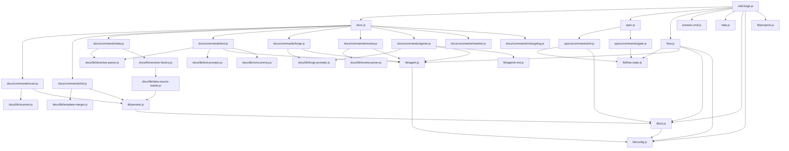

# 04. 内部設計

## 概要

<!-- {{text: Describe the purpose of this chapter in 1–2 sentences. Cover the project structure, direction of module dependencies, and key processing flows.}} -->

本章では sdd-forge の内部アーキテクチャを解説する。ディレクトリ構成、モジュール間の依存関係、および代表的なコマンド実行時の処理フローを体系的に示す。

## 目次

### プロジェクト構造

<!-- {{text: Describe the directory structure of this project in a tree-format code block. Include role comments for major directories and files.}} -->

```
sdd-forge/
├── package.json                       # パッケージ定義・バイナリエントリ（sdd-forge → src/sdd-forge.js）
├── src/
│   ├── sdd-forge.js                   # CLI エントリポイント・3層ディスパッチの起点
│   ├── docs.js                        # docs 系サブコマンドディスパッチャー
│   ├── spec.js                        # spec 系サブコマンドディスパッチャー
│   ├── flow.js                        # SDD フロー自動実行（DIRECT_COMMAND）
│   ├── presets-cmd.js                 # presets コマンド（DIRECT_COMMAND）
│   ├── help.js                        # ヘルプ表示
│   ├── docs/
│   │   ├── commands/                  # docs 系の各コマンド実装
│   │   │   └── scan.js, init.js, data.js, text.js, readme.js,
│   │   │       forge.js, review.js, agents.js, changelog.js, setup.js ...
│   │   ├── data/                      # DataSource 実装群（project.js, docs.js, agents.js, lang.js）
│   │   └── lib/                       # ドキュメント生成ライブラリ群
│   │       └── scanner.js, directive-parser.js, template-merger.js,
│   │           forge-prompts.js, text-prompts.js, review-parser.js,
│   │           data-source-loader.js, resolver-factory.js, renderers.js ...
│   ├── specs/
│   │   └── commands/                  # spec 初期化（init.js）・ゲートチェック（gate.js）
│   ├── lib/                           # 共通ライブラリ群
│   │   └── agent.js, config.js, cli.js, i18n.js, presets.js,
│   │       flow-state.js, projects.js, types.js, agents-md.js ...
│   ├── presets/                       # プリセット定義（base / webapp / cli / library 等）
│   │   ├── base/templates/{ja,en}/    # docs テンプレート（全プリセット共通）
│   │   ├── webapp/, cli/, library/    # アーキテクチャ層プリセット
│   │   └── cakephp2/, laravel/, symfony/, node-cli/  # フレームワーク固有プリセット
│   └── templates/                     # 設定テンプレート・review チェックリスト・スキル定義
├── docs/                              # sdd-forge 自身の設計ドキュメント
├── tests/                             # テストファイル（*.test.js）
└── specs/                             # SDD spec ファイル
```

### モジュール構成

<!-- {{text: List all modules in a table format. Include module name, file path, and responsibilities.}} -->

| モジュール名 | ファイルパス | 役割 |
|---|---|---|
| CLI エントリポイント | `src/sdd-forge.js` | サブコマンドのルーティング・プロジェクトコンテキスト解決 |
| docs ディスパッチャー | `src/docs.js` | docs 系コマンドへの振り分け |
| spec ディスパッチャー | `src/spec.js` | spec / gate コマンドへの振り分け |
| SDD フロー | `src/flow.js` | SDD フロー自動実行（DIRECT_COMMAND） |
| presets コマンド | `src/presets-cmd.js` | プリセット一覧表示（DIRECT_COMMAND） |
| ヘルプ | `src/help.js` | コマンド一覧表示 |
| scan | `src/docs/commands/scan.js` | ソースコード解析・analysis.json / summary.json 生成 |
| init | `src/docs/commands/init.js` | テンプレートから docs/ を初期化 |
| data | `src/docs/commands/data.js` | `{{data}}` ディレクティブの解決 |
| text | `src/docs/commands/text.js` | `{{text}}` ディレクティブの AI 生成 |
| readme | `src/docs/commands/readme.js` | README.md 自動生成 |
| forge | `src/docs/commands/forge.js` | docs 反復改善 |
| review | `src/docs/commands/review.js` | docs 品質チェック |
| agents | `src/docs/commands/agents.js` | AGENTS.md 更新 |
| changelog | `src/docs/commands/changelog.js` | specs から change_log.md 生成 |
| setup | `src/docs/commands/setup.js` | プロジェクト登録・設定生成 |
| spec init | `src/specs/commands/init.js` | spec.md 初期化・feature ブランチ作成 |
| gate | `src/specs/commands/gate.js` | spec ゲートチェック（pre / post） |
| agent | `src/lib/agent.js` | AI エージェント呼び出し（同期・非同期・ストリーミング） |
| config | `src/lib/config.js` | 設定読み込み・パスユーティリティ・コンテキスト管理 |
| cli | `src/lib/cli.js` | CLI 共通ユーティリティ・引数パーサー・ルートパス解決 |
| i18n | `src/lib/i18n.js` | 多言語対応メッセージ管理 |
| presets | `src/lib/presets.js` | プリセット自動探索・型エイリアス管理 |
| flow-state | `src/lib/flow-state.js` | `.sdd-forge/current-spec` による SDD フロー状態管理 |
| projects | `src/lib/projects.js` | 複数プロジェクト登録情報の管理 |
| agents-md | `src/lib/agents-md.js` | AGENTS.md のセクション差し替え処理 |
| scanner | `src/docs/lib/scanner.js` | ファイル探索・PHP / JS / YAML 解析ユーティリティ |
| directive-parser | `src/docs/lib/directive-parser.js` | `{{data}}` / `{{text}}` / `@block` / `@extends` ディレクティブ解析 |
| template-merger | `src/docs/lib/template-merger.js` | テンプレート継承（`@extends` / `@block`）の解決 |
| forge-prompts | `src/docs/lib/forge-prompts.js` | forge / agents コマンド向けプロンプト生成・`summaryToText()` |
| text-prompts | `src/docs/lib/text-prompts.js` | text コマンド向けプロンプト生成 |
| review-parser | `src/docs/lib/review-parser.js` | review コマンドの結果パース |
| data-source-loader | `src/docs/lib/data-source-loader.js` | プリセット別 DataSource の動的ロード |
| resolver-factory | `src/docs/lib/resolver-factory.js` | `createResolver()` ファクトリ（data コマンドで利用） |
| renderers | `src/docs/lib/renderers.js` | マークダウン出力レンダリング |
| concurrency | `src/docs/lib/concurrency.js` | ファイル並列処理ユーティリティ |

### モジュール依存関係

<!-- {{text: Generate a dependency graph between modules using a mermaid graph. Output only the mermaid code block.}} -->



### 主要な処理フロー

<!-- {{text: Explain the data and control flow between modules when a representative command is executed.}} -->

ここでは `sdd-forge build` の実行を例に、モジュール間のデータ・制御フローを説明する。

**1. エントリポイントとコンテキスト解決**
`sdd-forge.js` がサブコマンド `build` を受け取り、`lib/projects.js` と `lib/config.js` を通じてプロジェクトコンテキスト（`SDD_SOURCE_ROOT` / `SDD_WORK_ROOT`）を環境変数に設定した上で `docs.js` に委譲する。

**2. docs.js によるパイプライン実行**
`docs.js` が `build` を `scan → init → data → text → readme` の順に逐次実行する。各コマンドは独立したモジュールとして実装されており、前段の出力ファイルを次段が読み込む形でデータが連鎖する。

**3. scan フェーズ**
`docs/commands/scan.js` が `lib/presets.js` からプリセット設定を取得し、`docs/lib/scanner.js` を通じてソースファイルを探索・解析する。結果は `.sdd-forge/output/analysis.json`（フル）と `summary.json`（AI 向け軽量版）として保存される。

**4. init フェーズ**
`docs/commands/init.js` が `docs/lib/template-merger.js` を介して `@extends` / `@block` ディレクティブを解決し、プリセットテンプレートから `docs/` 配下の初期ドキュメントファイルを生成する。

**5. data フェーズ**
`docs/commands/data.js` が `docs/lib/directive-parser.js` で各ドキュメントの `{{data}}` ディレクティブを検出し、`docs/lib/resolver-factory.js` → `docs/lib/data-source-loader.js` 経由でプリセット対応の DataSource を動的にロードする。DataSource は `analysis.json` のデータを読み取り、ディレクティブをマークダウン表形式等に変換して置換する。

**6. text フェーズ**
`docs/commands/text.js` が `{{text}}` ディレクティブを検出し、`docs/lib/text-prompts.js` でプロンプトを構築した後、`lib/agent.js` 経由で AI エージェントを呼び出す。生成されたテキストはディレクティブ直後に挿入される。`lib/concurrency.js` により複数ファイルの処理が並列化される。

**7. readme フェーズ**
`docs/commands/readme.js` が `docs/lib/forge-prompts.js` の `summaryToText()` で docs 全体のサマリーを構築し、`lib/agent.js` 経由で README.md を生成する。

### 拡張ポイント

<!-- {{text: Explain which parts need to be modified when adding new commands or features, and describe the extension patterns.}} -->

**新しい docs 系コマンドの追加**
1. `src/docs/commands/<new-command>.js` にコマンド実装を作成する。
2. `src/docs.js` のディスパッチテーブルにサブコマンド名とモジュールパスのマッピングを追加する。
3. `src/help.js` にコマンド説明を追記する。

**新しい spec 系コマンドの追加**
1. `src/specs/commands/<new-command>.js` に実装を作成する。
2. `src/spec.js` のディスパッチテーブルに追加する。

**新しいプリセットの追加**
1. `src/presets/<arch>/<key>/` ディレクトリを作成し `preset.json` を配置する。`lib/presets.js` は `src/presets/` を自動探索するため、`preset.json` を置くだけで自動登録される。
2. 必要に応じて `src/presets/<key>/templates/{ja,en}/` にテンプレートファイルを追加する。
3. プリセット固有の解析ロジックが必要な場合は `src/docs/data/<name>.js` に DataSource を実装し、`src/docs/lib/data-source-loader.js` にマッピングを追記する。

**新しい DataSource の追加**
`src/docs/lib/data-source.js` の基底クラスを継承したクラスを `src/docs/data/<name>.js` に実装し、`src/docs/lib/data-source-loader.js` に対象プリセットおよびディレクティブ名とのマッピングを追加する。

**AI プロンプトのカスタマイズ**
`text` コマンド向けは `src/docs/lib/text-prompts.js`、`forge` / `agents` コマンド向けは `src/docs/lib/forge-prompts.js` を編集する。設定ファイルの `documentStyle.customInstruction` フィールドを使うことで、コードを変更せずに追加指示を注入することもできる。
