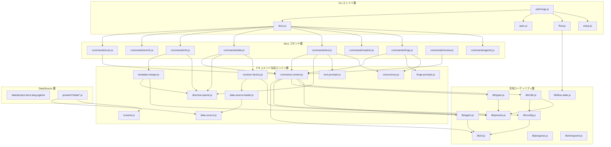

# 04. 内部設計

## 説明

<!-- {{text: この章の概要を1〜2文で記述してください。プロジェクト構成・モジュール依存の方向・主要な処理フローを踏まえること。}} -->

sdd-forge は3層ディスパッチ（CLI エントリ → サブコマンドルーター → コマンド実装）を基本構造とし、プリセット継承チェーンによる DataSource の多態性でフレームワーク固有の解析ロジックを差し替えます。共有ユーティリティ層（`src/lib/`）が設定・i18n・エージェント呼び出し・フロー状態管理を一元化し、上位のコマンド層やドキュメント生成エンジン層はこの共有層に依存する単方向の依存構造を取ります。

<!-- {{/text}} -->

## 内容

### プロジェクト構成

<!-- {{text[mode=deep]: このプロジェクトのディレクトリ構成を tree 形式のコードブロックで記述してください。主要ディレクトリ・ファイルの役割コメントを含めること。ソースコードの実際の構成から生成すること。}} -->

```
src/
├── sdd-forge.js                    # CLI エントリポイント・トップレベルルーター
├── docs.js                         # docs サブコマンドディスパッチャー（build パイプライン含む）
├── spec.js                         # spec サブコマンドディスパッチャー
├── flow.js                         # flow サブコマンドディスパッチャー
├── setup.js                        # プロジェクト初期セットアップ
├── upgrade.js                      # 設定アップグレード
├── presets-cmd.js                   # プリセット一覧コマンド
├── help.js                         # ヘルプ表示
│
├── lib/                            # 全レイヤー共有ユーティリティ
│   ├── cli.js                      #   repoRoot, sourceRoot, parseArgs, PKG_DIR
│   ├── config.js                   #   .sdd-forge/config.json ローダー・バリデーション
│   ├── agent.js                    #   AI エージェント呼び出し（同期・非同期）
│   ├── presets.js                  #   プリセット自動探索・parent チェーン解決
│   ├── flow-state.js               #   SDD フロー状態永続化（flow.json）
│   ├── i18n.js                     #   3層マージ対応 i18n（ui/messages/prompts）
│   ├── types.js                    #   型エイリアス解決・config バリデーション
│   ├── entrypoint.js               #   ES Modules 直接実行判定
│   ├── process.js                  #   spawnSync ラッパー
│   ├── progress.js                 #   プログレスバー・ロギング
│   └── agents-md.js                #   AGENTS.md テンプレート読み込み
│
├── docs/
│   ├── commands/                   # docs サブコマンド実装
│   │   ├── scan.js                 #   ソースコード解析 → analysis.json 生成
│   │   ├── enrich.js               #   AI による analysis エントリ拡充
│   │   ├── init.js                 #   テンプレート → docs/ 展開
│   │   ├── data.js                 #   {{data}} ディレクティブ解決
│   │   ├── text.js                 #   {{text}} ディレクティブ LLM 解決
│   │   ├── readme.js               #   README.md 生成
│   │   ├── forge.js                #   反復生成＋レビューループ
│   │   ├── review.js               #   ドキュメント品質レビュー
│   │   ├── changelog.js            #   変更履歴生成
│   │   ├── agents.js               #   AGENTS.md 生成・更新
│   │   └── translate.js            #   多言語翻訳
│   │
│   ├── data/                       # 共通 DataSource（全プリセットで利用可能）
│   │   ├── project.js              #   package.json メタデータ
│   │   ├── docs.js                 #   章ファイル一覧・言語切替リンク
│   │   ├── lang.js                 #   言語切替リンク（軽量版）
│   │   └── agents.js               #   AGENTS.md セクション生成
│   │
│   └── lib/                        # ドキュメント生成エンジン
│       ├── directive-parser.js     #   {{data}}/{{text}} パーサー・ブロック継承
│       ├── template-merger.js      #   テンプレート解決・章順序・ブロックマージ
│       ├── resolver-factory.js     #   DataSource リゾルバファクトリ
│       ├── data-source.js          #   DataSource 基底クラス
│       ├── data-source-loader.js   #   DataSource 動的ローダー
│       ├── scan-source.js          #   ScanSource 基底・Scannable ミックスイン
│       ├── scanner.js              #   ファイル探索・言語別パーサ
│       ├── command-context.js      #   コマンド共有コンテキスト解決
│       ├── concurrency.js          #   並列実行キュー
│       ├── text-prompts.js         #   {{text}} プロンプト構築
│       ├── forge-prompts.js        #   forge プロンプト構築
│       ├── review-parser.js        #   review 出力パーサー
│       └── php-array-parser.js     #   PHP 配列構文パーサー
│
├── flow/commands/                  # flow サブコマンド実装
│   ├── start.js                    #   SDD フロー開始
│   ├── status.js                   #   フロー状態表示
│   ├── review.js                   #   フローレビュー
│   ├── merge.js                    #   マージ・クリーンアップ
│   ├── resume.js                   #   コンテキスト復帰
│   └── cleanup.js                  #   ブランチ・worktree 削除
│
├── spec/commands/                  # spec サブコマンド実装
│   ├── init.js                     #   仕様書スキャフォールド
│   ├── gate.js                     #   仕様ゲートチェック
│   └── guardrail.js                #   実装ガードレール
│
├── presets/                        # プリセット定義
│   ├── base/                       #   全プリセット共通基底
│   ├── webapp/                     #   Web アプリケーション共通
│   ├── cli/                        #   CLI アプリケーション共通
│   ├── library/                    #   ライブラリ共通
│   ├── node/                       #   Node.js 言語層
│   ├── php/                        #   PHP 言語層
│   ├── node-cli/                   #   Node.js CLI（cli + node）
│   ├── cakephp2/                   #   CakePHP 2.x（webapp + php）
│   ├── laravel/                    #   Laravel（webapp + php）
│   └── symfony/                    #   Symfony（webapp + php）
│
├── locale/                         # i18n メッセージファイル
│   ├── en/                         #   英語（ui.json, messages.json, prompts.json）
│   └── ja/                         #   日本語
│
└── templates/                      # スキャフォールドテンプレート
```

<!-- {{/text}} -->

### モジュール構成

<!-- {{text[mode=deep]: 主要モジュールの一覧を表形式で記述してください。モジュール名・ファイルパス・責務を含めること。ソースコードの import/require 関係と各ファイルのエクスポートから抽出すること。}} -->

| モジュール名 | ファイルパス | 責務 |
| --- | --- | --- |
| CLI ルーター | `src/sdd-forge.js` | トップレベルコマンドルーティング（docs/spec/flow/setup/help） |
| docs ディスパッチャー | `src/docs.js` | docs サブコマンドの振り分けと build パイプライン制御 |
| spec ディスパッチャー | `src/spec.js` | spec サブコマンドの振り分け |
| flow ディスパッチャー | `src/flow.js` | flow サブコマンドの振り分け |
| CLI ユーティリティ | `src/lib/cli.js` | プロジェクトルート解決・引数パース・worktree 判定・タイムスタンプ生成 |
| 設定ローダー | `src/lib/config.js` | `.sdd-forge/config.json` の読み込み・出力ディレクトリ解決 |
| 型・バリデーション | `src/lib/types.js` | config バリデーション・プロジェクトタイプのエイリアス解決 |
| エージェント呼び出し | `src/lib/agent.js` | AI エージェントの同期・非同期呼び出し・プロバイダー解決・コンテキストファイル管理 |
| プリセット探索 | `src/lib/presets.js` | プリセット自動探索・parent チェーン解決・lang 層解決 |
| フロー状態管理 | `src/lib/flow-state.js` | `flow.json` による SDD ワークフロー状態の永続化・ステップ管理 |
| i18n | `src/lib/i18n.js` | 3層マージ（デフォルト→プリセット→プロジェクト）の国際化メッセージ管理 |
| エントリポイント | `src/lib/entrypoint.js` | ES Modules の直接実行判定と安全な main() 起動 |
| プログレス表示 | `src/lib/progress.js` | TTY プログレスバー・スピナー・コマンドロガー |
| コマンドコンテキスト | `src/docs/lib/command-context.js` | 全 docs コマンド共通の root/config/type/agent/i18n 解決 |
| ディレクティブパーサー | `src/docs/lib/directive-parser.js` | `{{data}}`/`{{text}}` ディレクティブの解析・ブロック継承構文処理 |
| テンプレートマージャー | `src/docs/lib/template-merger.js` | テンプレート継承チェーン解決・ブロックマージ・章順序解決 |
| リゾルバファクトリ | `src/docs/lib/resolver-factory.js` | type に応じた DataSource のロードとリゾルバ生成 |
| DataSource 基底 | `src/docs/lib/data-source.js` | `{{data}}` リゾルバの基底クラス（テーブル生成・overrides マージ） |
| Scannable ミックスイン | `src/docs/lib/scan-source.js` | DataSource に scan 能力を付加するミックスイン |
| スキャナユーティリティ | `src/docs/lib/scanner.js` | ファイル探索・PHP/JS パーサー・glob 変換 |
| 並列実行キュー | `src/docs/lib/concurrency.js` | 最大同時実行数を制限した Promise ベースの並列処理 |
| text プロンプト構築 | `src/docs/lib/text-prompts.js` | `{{text}}` 処理用のシステムプロンプト・enriched コンテキスト構築 |
| forge プロンプト構築 | `src/docs/lib/forge-prompts.js` | forge コマンド用プロンプト構築・analysis テキスト化 |

<!-- {{/text}} -->

### モジュール依存関係

<!-- {{text[mode=deep]: モジュール間の依存関係を mermaid graph で生成してください。ソースコードの import/require を解析し、レイヤー構造と依存方向を示すこと。出力は mermaid コードブロックのみ。}} -->



<!-- {{/text}} -->

### 主要な処理フロー

<!-- {{text[mode=deep]: 代表的なコマンドを実行した際のモジュール間のデータ・制御フローを番号付きステップで説明してください。エントリポイントから最終出力までの流れを含めること。}} -->

**`sdd-forge docs build` パイプライン**

1. `sdd-forge.js` が `process.argv` から `docs` サブコマンドを識別し、`docs.js` にディスパッチします。
2. `docs.js` は `build` コマンドを検出すると、パイプライン `scan → enrich → init → data → text → readme → agents → [translate]` を順次実行します。`createProgress()` でプログレスバーを初期化します。
3. **scan**: `scan.js` が `collectFiles()` で対象ファイルを収集し、各プリセットの DataSource の `match()` / `scan()` でカテゴリ別にソースコードを解析します。結果は `.sdd-forge/output/analysis.json` に書き込まれます。
4. **enrich**: AI エージェントに analysis 全体を渡し、各エントリに role・summary・detail・chapter 分類を一括付与します。
5. **init**: `template-merger.js` が `buildLayers()` でプリセット継承チェーンのテンプレートレイヤーを構築し、`resolveTemplates()` で各章ファイルを解決します。`@extends` / `@block` ディレクティブがある場合はブロック単位でマージします。結果を `docs/` ディレクトリに展開します。
6. **data**: `data.js` が `resolveCommandContext()` でコンテキストを構築し、`createResolver()` で type に応じたリゾルバを生成します。`getChapterFiles()` で章ファイル一覧を取得し、各ファイルの `{{data}}` ディレクティブを `resolveDataDirectives()` で解決して Markdown テーブル等に置換します。
7. **text**: `text.js` がバッチモード（`processTemplateFileBatch()`）で各章ファイル内の `{{text}}` ディレクティブを処理します。`getEnrichedContext()` で enriched analysis から章に該当するエントリのコンテキストを構築し、`buildBatchPrompt()` でプロンプトを組み立てて AI エージェントに送信します。結果は `validateBatchResult()` で品質検証されます。
8. **readme**: README.md を生成し、`{{data}}` ディレクティブ（章一覧テーブル等）を解決します。
9. **agents**: `agents.js` が AGENTS.md の SDD セクション（テンプレート）と PROJECT セクション（analysis からの自動生成）を更新します。

**`sdd-forge docs data` 単独実行**

1. `sdd-forge.js` → `docs.js` → `data.js` の3層ディスパッチで `main()` が呼び出されます。
2. `resolveCommandContext()` が root・config・type・docsDir・agent・i18n を解決します。
3. `analysis.json` をファイルシステムから読み込みます。
4. `createResolver(type, root)` がプリセット parent チェーン（base → arch → leaf）と lang 層の順に DataSource をロードし、プロジェクト固有 DataSource（`.sdd-forge/data/`）を最高優先で追加します。
5. `getChapterFiles()` が config.chapters → preset.chapters → アルファベット順のフォールバックで対象ファイルを決定します。
6. 各ファイルに対して `processTemplate()` が `resolveDataDirectives()` を呼び出し、`{{data: source.method("labels")}}` を DataSource の対応メソッドの戻り値（Markdown テーブル等）で置換します。
7. `dryRun` でなければ `fs.writeFileSync()` でファイルを更新します。

<!-- {{/text}} -->

### 拡張ポイント

<!-- {{text[mode=deep]: 新しいコマンドや機能を追加する際に変更が必要な箇所と、拡張パターンを説明してください。ソースコードのプラグインポイントやディスパッチ登録パターンから導出すること。}} -->

**新しいプリセットの追加**

`src/presets/{key}/` ディレクトリに `preset.json`（`parent`・`chapters`・`scan` 等を定義）と `data/` ディレクトリ配下に DataSource クラスを配置します。`presets.js` の `discoverPresets()` が自動探索するため、ディレクトリ追加だけで認識されます。DataSource は `Scannable(DataSource)` または既存の親プリセット DataSource（例: `webapp/data/controllers.js`）を継承し、`match()` と `scan()` をオーバーライドします。テンプレートは `templates/{lang}/` 配下に `.md` ファイルを配置し、`@extends` ディレクティブで親テンプレートのブロックを選択的に上書きできます。

**新しい DataSource の追加**

`src/docs/data/` に共通 DataSource を、または `src/presets/{preset}/data/` にプリセット固有 DataSource を追加します。`data-source-loader.js` の `loadDataSources()` がディレクトリ内の `.js` ファイルを動的にインポートするため、ファイル追加だけで登録されます。ファイル名がディレクティブの `source` 名になります（例: `mydata.js` → `{{data: mydata.method("...")}}`）。

**新しい docs サブコマンドの追加**

`src/docs/commands/{cmd}.js` に `main()` 関数を実装し、`src/docs.js` のディスパッチテーブルにエントリを追加します。`resolveCommandContext()` を呼び出すことで root・config・type 等の共通コンテキストを取得でき、`runIfDirect()` で直接実行もサポートできます。

**新しいトップレベルコマンドの追加**

`src/{cmd}.js` にコマンドを実装し、`src/sdd-forge.js` のルーティング条件に分岐を追加します。

**i18n メッセージの拡張**

`src/locale/{lang}/` 配下の `ui.json`・`messages.json`・`prompts.json` にキーを追加します。プリセット固有メッセージは `src/presets/{preset}/locale/` に、プロジェクト固有メッセージは `.sdd-forge/locale/` に配置でき、3層マージで後勝ちになります。

**scan 対象の拡張**

`preset.json` の `scan.include` / `scan.exclude` glob パターンで対象ファイルを制御します。新しいファイル種別を解析する場合は、対応する DataSource の `match()` でファイル判定を定義し、`scan()` で解析ロジックを実装します。

<!-- {{/text}} -->
