# 04. 内部設計

## 説明

<!-- {{text: この章の概要を1〜2文で記述してください。プロジェクト構成・モジュール依存の方向・主要な処理フローを踏まえること。}} -->

sdd-forge は 3 層ディスパッチ（CLI エントリ → ドメインディスパッチャー → コマンド実装）を軸に構成され、共有ライブラリ層（`src/lib/`）とドキュメント生成ライブラリ層（`src/docs/lib/`）が全コマンドに共通機能を提供します。プリセット継承（base → アーキテクチャ → リーフ）による DataSource の階層的ロードと、`{{data}}`/`{{text}}` ディレクティブによるテンプレート駆動のドキュメント生成が中核的な処理フローです。

<!-- {{/text}} -->

## 内容

### プロジェクト構成

<!-- {{text[mode=deep]: このプロジェクトのディレクトリ構成を tree 形式のコードブロックで記述してください。主要ディレクトリ・ファイルの役割コメントを含めること。ソースコードの実際の構成から生成すること。}} -->

```
sdd-forge/
├── package.json
└── src/
    ├── sdd-forge.js              # CLI エントリポイント・トップレベルルーター
    ├── docs.js                   # docs サブコマンドディスパッチャー
    ├── spec.js                   # spec サブコマンドディスパッチャー
    ├── flow.js                   # flow サブコマンドディスパッチャー
    ├── setup.js                  # プロジェクト初期セットアップ
    ├── upgrade.js                # 設定マイグレーション
    ├── presets-cmd.js            # プリセット一覧表示
    ├── help.js                   # ヘルプ表示
    ├── docs/
    │   ├── commands/             # docs サブコマンド実装
    │   │   ├── scan.js           #   ソースコード解析 → analysis.json 生成
    │   │   ├── enrich.js         #   AI による analysis エントリへの要約・分類付与
    │   │   ├── init.js           #   テンプレート継承解決 → docs/ 初期化
    │   │   ├── data.js           #   {{data}} ディレクティブ解決
    │   │   ├── text.js           #   {{text}} ディレクティブの LLM 解決
    │   │   ├── readme.js         #   README.md 生成
    │   │   ├── forge.js          #   AI ドキュメント生成（レビューループ付き）
    │   │   ├── review.js         #   ドキュメント品質レビュー
    │   │   ├── changelog.js      #   specs/ から change_log.md 生成
    │   │   ├── agents.js         #   AGENTS.md 生成・更新
    │   │   ├── translate.js      #   多言語翻訳
    │   │   └── snapshot.js       #   スナップショット取得
    │   ├── data/                 # 共通 DataSource（全プリセットで利用可能）
    │   │   ├── project.js        #   package.json メタデータ提供
    │   │   ├── docs.js           #   章一覧テーブル・言語切替リンク
    │   │   ├── lang.js           #   言語切替リンク（🌐 形式）
    │   │   └── agents.js         #   AGENTS.md セクション生成
    │   └── lib/                  # ドキュメント生成ライブラリ
    │       ├── directive-parser.js    # {{data}}/{{text}} ディレクティブパーサー
    │       ├── template-merger.js     # プリセット階層テンプレート継承エンジン
    │       ├── data-source.js         # DataSource 基底クラス
    │       ├── data-source-loader.js  # DataSource 動的ローダー
    │       ├── resolver-factory.js    # リゾルバファクトリ（プリセット階層ロード）
    │       ├── scanner.js             # ファイル探索・言語別パーサー
    │       ├── scan-source.js         # ScanSource 基底クラス・Scannable ミックスイン
    │       ├── command-context.js     # コマンド共通コンテキスト解決
    │       ├── concurrency.js         # 並列実行キュー
    │       ├── text-prompts.js        # {{text}} 用プロンプト構築
    │       ├── forge-prompts.js       # forge 用プロンプト構築
    │       ├── review-parser.js       # レビュー出力パーサー
    │       └── php-array-parser.js    # PHP 配列構文パーサー
    ├── flow/
    │   └── commands/             # flow サブコマンド実装
    │       ├── start.js          #   SDD フロー開始
    │       ├── status.js         #   フロー状態表示
    │       └── review.js         #   フローレビュー
    ├── spec/
    │   └── commands/             # spec サブコマンド実装
    │       ├── init.js           #   spec 初期化
    │       ├── gate.js           #   spec ゲートチェック
    │       └── guardrail.js      #   ガードレールチェック
    ├── lib/                      # 全レイヤー共有ユーティリティ
    │   ├── cli.js                #   repoRoot, sourceRoot, parseArgs, PKG_DIR
    │   ├── config.js             #   .sdd-forge/config.json ローダー
    │   ├── agent.js              #   AI エージェント呼び出し（同期・非同期）
    │   ├── presets.js            #   preset.json 自動探索
    │   ├── flow-state.js         #   SDD フロー状態永続化（flow.json）
    │   ├── i18n.js               #   3 層マージ国際化
    │   ├── types.js              #   型エイリアス解決・バリデーション
    │   ├── agents-md.js          #   AGENTS.md テンプレート読み込み
    │   ├── entrypoint.js         #   直接実行判定・main() 起動
    │   ├── process.js            #   spawnSync ラッパー
    │   └── progress.js           #   プログレスバー・ロギング
    ├── presets/                   # プリセット定義
    │   ├── base/                 #   全プリセット共通の基底
    │   │   └── data/
    │   │       └── package.js    #     package.json/composer.json DataSource
    │   ├── cli/                  #   CLI アプリ向けアーキテクチャ
    │   │   └── data/
    │   │       └── modules.js    #     汎用モジュール DataSource
    │   ├── node-cli/             #   Node.js CLI 向けリーフプリセット
    │   ├── webapp/               #   Web アプリ向けアーキテクチャ
    │   │   └── data/
    │   │       ├── controllers.js #    コントローラー基底 DataSource
    │   │       ├── models.js      #    モデル基底 DataSource
    │   │       ├── tables.js      #    テーブル基底 DataSource
    │   │       ├── shells.js      #    シェル基底 DataSource
    │   │       ├── routes.js      #    ルート基底 DataSource
    │   │       └── webapp-data-source.js # webapp 共通基底
    │   ├── cakephp2/             #   CakePHP 2.x 向けリーフプリセット
    │   ├── laravel/              #   Laravel 向けリーフプリセット
    │   ├── symfony/              #   Symfony 向けリーフプリセット
    │   └── library/              #   ライブラリ向けリーフプリセット
    ├── locale/                   # i18n メッセージファイル
    │   ├── en/                   #   英語（ui.json, messages.json, prompts.json）
    │   └── ja/                   #   日本語
    └── templates/                # 設定テンプレート・スキル定義
```

<!-- {{/text}} -->

### モジュール構成

<!-- {{text[mode=deep]: 主要モジュールの一覧を表形式で記述してください。モジュール名・ファイルパス・責務を含めること。ソースコードの import/require 関係と各ファイルのエクスポートから抽出すること。}} -->

| モジュール名 | ファイルパス | 責務 |
| --- | --- | --- |
| CLI エントリ | `src/sdd-forge.js` | トップレベルルーター。サブコマンドを `docs.js` / `spec.js` / `flow.js` / 独立コマンドに振り分ける |
| docs ディスパッチャー | `src/docs.js` | `docs` サブコマンドのルーティング。`build` パイプライン（scan→enrich→init→data→text→readme→agents）の実行 |
| spec ディスパッチャー | `src/spec.js` | `spec init` / `spec gate` / `spec guardrail` のルーティング |
| flow ディスパッチャー | `src/flow.js` | `flow start` / `flow status` / `flow review` のルーティング |
| directive-parser | `src/docs/lib/directive-parser.js` | `{{data}}` / `{{text}}` ディレクティブの解析、ブロック継承構文（`@block`/`@extends`）の解析、ディレクティブ置換処理 |
| template-merger | `src/docs/lib/template-merger.js` | プリセット階層（project-local → leaf → arch → base）のテンプレート解決とブロック単位マージ |
| resolver-factory | `src/docs/lib/resolver-factory.js` | DataSource のプリセット階層ロードとディレクティブ解決用リゾルバの生成 |
| data-source | `src/docs/lib/data-source.js` | `{{data}}` リゾルバの基底クラス。`toMarkdownTable()` / `mergeDesc()` などの共通メソッド提供 |
| data-source-loader | `src/docs/lib/data-source-loader.js` | `data/` ディレクトリから DataSource クラスを動的 import でロード・インスタンス化 |
| scanner | `src/docs/lib/scanner.js` | glob ベースのファイル収集、PHP/JS 言語別パーサー、ファイル統計（行数・ハッシュ・mtime）取得 |
| scan-source | `src/docs/lib/scan-source.js` | `Scannable` ミックスインの提供。DataSource に `match()` / `scan()` 能力を付加 |
| command-context | `src/docs/lib/command-context.js` | 全 docs コマンド共通のコンテキスト解決（root / srcRoot / config / lang / type / docsDir / agent） |
| concurrency | `src/docs/lib/concurrency.js` | `mapWithConcurrency()` による最大同時実行数制限付き並列処理 |
| text-prompts | `src/docs/lib/text-prompts.js` | `{{text}}` ディレクティブ処理用のプロンプト構築。enriched analysis からのコンテキスト収集 |
| forge-prompts | `src/docs/lib/forge-prompts.js` | forge コマンド用のシステムプロンプト・ファイルプロンプト構築 |
| agent | `src/lib/agent.js` | AI エージェントの同期（`callAgent`）・非同期（`callAgentAsync`）呼び出し。stdin フォールバック対応 |
| cli | `src/lib/cli.js` | `repoRoot()` / `sourceRoot()` / `parseArgs()` / `PKG_DIR` などの共通 CLI ユーティリティ |
| config | `src/lib/config.js` | `.sdd-forge/config.json` の読み込み・パス解決 |
| presets | `src/lib/presets.js` | `src/presets/` 配下のプリセット自動探索。`presetByLeaf()` でリーフ名からプリセット設定を取得 |
| i18n | `src/lib/i18n.js` | 3 層マージ（デフォルト → プリセット固有 → プロジェクト固有）の国際化。`translate()` / `createI18n()` |
| flow-state | `src/lib/flow-state.js` | `.sdd-forge/flow.json` の CRUD。SDD ワークフローのステップ・要件の状態管理 |
| progress | `src/lib/progress.js` | TTY プログレスバー（ANSI エスケープ）・スピナー・ロガー |
| entrypoint | `src/lib/entrypoint.js` | `runIfDirect()` による直接実行判定と安全な `main()` 起動 |

<!-- {{/text}} -->

### モジュール依存関係

```mermaid
graph TD
    subgraph "CLI Layer"
        entry[sdd-forge.js]
        docs_disp[docs.js]
        spec_disp[spec.js]
        flow_disp[flow.js]
        setup[setup.js]
    end

    subgraph "docs/commands"
        scan[scan.js]
        enrich[enrich.js]
        init_cmd[init.js]
        data_cmd[data.js]
        text_cmd[text.js]
        readme[readme.js]
        forge[forge.js]
        review_cmd[review.js]
        changelog[changelog.js]
        agents_cmd[agents.js]
    end

    subgraph "docs/lib"
        directive_parser[directive-parser.js]
        template_merger[template-merger.js]
        resolver_factory[resolver-factory.js]
        data_source[data-source.js]
        ds_loader[data-source-loader.js]
        scanner[scanner.js]
        scan_source[scan-source.js]
        cmd_context[command-context.js]
        concurrency[concurrency.js]
        text_prompts[text-prompts.js]
        forge_prompts[forge-prompts.js]
        review_parser[review-parser.js]
    end

    subgraph "lib (shared)"
        cli[cli.js]
        config[config.js]
        agent[agent.js]
        presets[presets.js]
        i18n[i18n.js]
        flow_state[flow-state.js]
        progress[progress.js]
        entrypoint[entrypoint.js]
        types[types.js]
    end

    subgraph "presets/data"
        base_ds[base/data/package.js]
        webapp_ds[webapp/data/*.js]
        cli_ds[cli/data/modules.js]
        cake_ds[cakephp2/data/*.js]
        laravel_ds[laravel/data/*.js]
        symfony_ds[symfony/data/*.js]
    end

    entry --> docs_disp
    entry --> spec_disp
    entry --> flow_disp
    entry --> setup

    docs_disp --> scan
    docs_disp --> init_cmd
    docs_disp --> data_cmd
    docs_disp --> text_cmd
    docs_disp --> readme
    docs_disp --> agents_cmd

    scan --> ds_loader
    scan --> scanner
    scan --> cmd_context
    scan --> presets

    init_cmd --> template_merger
    init_cmd --> directive_parser
    init_cmd --> agent
    init_cmd --> cmd_context

    data_cmd --> directive_parser
    data_cmd --> resolver_factory
    data_cmd --> cmd_context

    text_cmd --> directive_parser
    text_cmd --> text_prompts
    text_cmd --> concurrency
    text_cmd --> agent
    text_cmd --> cmd_context

    forge --> forge_prompts
    forge --> review_parser
    forge --> agent

    resolver_factory --> ds_loader
    resolver_factory --> presets

    ds_loader --> data_source

    template_merger --> directive_parser
    template_merger --> presets

    cmd_context --> cli
    cmd_context --> config
    cmd_context --> agent
    cmd_context --> i18n
    cmd_context --> types
    cmd_context --> template_merger

    text_prompts --> i18n

    cake_ds --> webapp_ds
    laravel_ds --> webapp_ds
    symfony_ds --> webapp_ds
    webapp_ds --> data_source
    webapp_ds --> scan_source
    cli_ds --> data_source
    cli_ds --> scan_source
    base_ds --> data_source
    base_ds --> scan_source

    flow_disp --> flow_state
    flow_state --> config
```

<!-- {{text[mode=deep]: モジュール間の依存関係を mermaid graph で生成してください。ソースコードの import/require を解析し、レイヤー構造と依存方向を示すこと。出力は mermaid コードブロックのみ。}} -->



<!-- {{/text}} -->

### 主要な処理フロー

<!-- {{text[mode=deep]: 代表的なコマンドを実行した際のモジュール間のデータ・制御フローを番号付きステップで説明してください。エントリポイントから最終出力までの流れを含めること。}} -->

**`sdd-forge docs build` パイプライン**

1. `sdd-forge.js` がコマンドライン引数を解析し、`docs.js` ディスパッチャーに `build` サブコマンドを委譲します。
2. `docs.js` が `progress.js` でパイプラインプログレスバーを初期化し、以下のステップを順次実行します。
3. **scan**: `scan.js` が `config.json` と `preset.json` の scan 設定から include/exclude glob パターンを取得し、`scanner.js` の `collectFiles()` でソースファイルを収集します。`data-source-loader.js` が base → 親プリセット → 子プリセット → プロジェクトローカルの順で DataSource をロードし、各 DataSource の `match()` でファイルを振り分け `scan()` を実行します。結果は `.sdd-forge/output/analysis.json` に書き出されます。既存 analysis.json がある場合、`preserveEnrichment()` でハッシュ一致エントリの enriched フィールドを引き継ぎます。
4. **enrich**: `enrich.js` が analysis.json の全エントリに対して AI エージェントを呼び出し、各エントリに `summary`（1 行要約）・`detail`（詳細説明）・`chapter`（所属する章名）・`role`（エントリの役割分類）を一括付与します。
5. **init**: `init.js` が `template-merger.js` を使用してプリセット階層のテンプレート継承チェーンを解決・マージし、`docs/` ディレクトリに章ファイルを生成します。`config.chapters` が未定義で AI エージェントが利用可能な場合は `aiFilterChapters()` で章の取捨選択を行います。
6. **data**: `data.js` が `resolver-factory.js` でプリセット階層の DataSource リゾルバを生成し、各章ファイル内の `{{data}}` ディレクティブを `directive-parser.js` の `resolveDataDirectives()` で解決します。DataSource の対応メソッドが呼ばれ、analysis.json のデータが Markdown テーブル等に変換されて挿入されます。
7. **text**: `text.js` が各章ファイル内の `{{text}}` ディレクティブを検出し、`text-prompts.js` でプロンプトを構築して AI エージェントを呼び出します。バッチモード（ファイル単位で 1 回の呼び出し）または per-directive モード（ディレクティブごとに `concurrency.js` で並列呼び出し）で処理し、生成されたテキストをディレクティブ直後に挿入します。
8. **readme**: `readme.js` が README.md テンプレートの `{{data}}` ディレクティブを解決して README.md を生成します。
9. **agents**: `agents.js` が AGENTS.md の SDD セクションと PROJECT セクションを生成・更新します。

**`sdd-forge flow start` フロー**

1. `sdd-forge.js` → `flow.js` → `flow/commands/start.js` にルーティングされます。
2. `start.js` が `flow-state.js` の `buildInitialSteps()` で全 11 ステップを pending 状態で初期化し、`saveFlowState()` で `.sdd-forge/flow.json` に永続化します。
3. approach → branch → spec → gate の各ステップを順次実行し、`updateStepStatus()` でステップ状態を更新します。
4. `spec/commands/gate.js` でゲートチェックを実行し、合格後に implement ステップに進みます。

<!-- {{/text}} -->

### 拡張ポイント

<!-- {{text[mode=deep]: 新しいコマンドや機能を追加する際に変更が必要な箇所と、拡張パターンを説明してください。ソースコードのプラグインポイントやディスパッチ登録パターンから導出すること。}} -->

**新しい docs サブコマンドの追加**

1. `src/docs/commands/` に新しいコマンドファイル（例: `mycommand.js`）を作成します。`main(ctx)` 関数をエクスポートし、`runIfDirect(import.meta.url, main)` で直接実行にも対応します。
2. `src/docs.js` のディスパッチテーブルに新しいサブコマンド名とファイルパスのマッピングを追加します。
3. コマンドコンテキストは `command-context.js` の `resolveCommandContext()` で統一的に取得できます。

**新しいプリセットの追加**

1. `src/presets/` 配下に新しいディレクトリ（例: `django/`）を作成し、`preset.json` にスキャン設定・章順序（`chapters`）・継承元（`extends`）を定義します。
2. `data/` ディレクトリに DataSource クラスを配置します。`webapp/data/webapp-data-source.js` の `WebappDataSource`（Web アプリ系）または `DataSource` + `Scannable` ミックスイン（その他）を継承し、`match()` と `scan()` を実装します。
3. `templates/{lang}/` ディレクトリにテンプレート Markdown ファイルを配置します。`@extends` ディレクティブで親プリセットのテンプレートを継承し、`@block` / `@endblock` でブロック単位のオーバーライドが可能です。
4. `src/lib/types.js` に型エイリアスを追加すると、`--type` オプションで短縮名が使えるようになります。

**新しい DataSource メソッドの追加**

1. 既存の DataSource クラスに新しいメソッドを追加します。メソッドのシグネチャは `methodName(analysis, labels)` で、Markdown 文字列または `null` を返します。
2. テンプレート内で `<!-- {{data: sourceName.methodName("ヘッダー1|ヘッダー2")}} -->` の形式でディレクティブを記述すると、`resolver-factory.js` が DataSource Map からメソッドを自動的に解決して呼び出します。

**プロジェクト固有の DataSource 追加**

1. プロジェクトの `.sdd-forge/data/` ディレクトリに DataSource ファイルを配置すると、`data-source-loader.js` が自動的にロードします。
2. プリセットの同名 DataSource がある場合はプロジェクトローカルのものが上書きします（Map による override）。

**i18n メッセージの拡張**

1. `.sdd-forge/locale/{lang}/` ディレクトリに `ui.json` / `messages.json` / `prompts.json` を配置すると、デフォルトメッセージに `deepMerge` で上書きされます。
2. プリセット固有のメッセージは `src/presets/{preset}/locale/` に配置します。マージ順序はデフォルト → プリセット → プロジェクトの 3 層です。

<!-- {{/text}} -->
