# 内部設計

## 説明

<!-- {{text({prompt: "この章の概要を1〜2文で記述してください。プロジェクト構成・モジュール依存の方向・主要な処理フローを踏まえること。"})}} -->

sdd-forge の内部設計を解説します。`src/` 配下のエントリポイント → コマンド → ライブラリ → プリセット（DataSource）という単方向の依存構造と、`scan → enrich → init → data → text → readme` のパイプラインに沿った処理フローを中心に、モジュール構成・依存関係・拡張ポイントを体系的に示します。

<!-- {{/text}} -->

## 内容

### プロジェクト構成

<!-- {{text({prompt: "このプロジェクトのディレクトリ構成を tree 形式のコードブロックで記述してください。主要ディレクトリ・ファイルの役割コメントを含めること。ソースコードの実際の構成から生成すること。", mode: "deep"})}} -->

```
src/
├── sdd-forge.js              # メイン CLI エントリポイント（3層ディスパッチ）
├── docs.js                    # docs サブコマンドディスパッチャ
├── specs.js                   # specs サブコマンドディスパッチャ
├── flow.js                    # SDD フロー（DIRECT_COMMAND）
├── help.js                    # ヘルプ表示
├── docs/
│   ├── commands/              # docs パイプラインのコマンド群
│   │   ├── scan.js            # DataSource ベースのスキャンパイプライン
│   │   ├── enrich.js          # AI による analysis.json メタデータ付与
│   │   ├── init.js            # テンプレート初期化
│   │   ├── data.js            # {{data}} ディレクティブ解決
│   │   ├── text.js            # {{text}} ディレクティブ LLM 処理
│   │   ├── readme.js          # README 生成
│   │   ├── forge.js           # AI 一括ドキュメント生成
│   │   ├── review.js          # ドキュメント品質レビュー
│   │   └── changelog.js       # 変更履歴生成
│   ├── lib/                   # docs コマンド共通ライブラリ
│   │   ├── command-context.js # コマンドコンテキスト解決
│   │   ├── data-source.js     # DataSource 基底クラス
│   │   ├── scan-source.js     # Scannable ミックスイン
│   │   ├── data-source-loader.js # DataSource 動的ローダー
│   │   ├── directive-parser.js   # {{data}}/{{text}} パーサー
│   │   ├── resolver-factory.js   # リゾルバファクトリ
│   │   ├── template-merger.js    # テンプレート継承・マージエンジン
│   │   ├── text-prompts.js       # {{text}} プロンプト構築
│   │   ├── forge-prompts.js      # forge プロンプト構築
│   │   ├── scanner.js            # ファイル収集・言語別パーサ
│   │   ├── concurrency.js        # 並列実行キュー
│   │   ├── review-parser.js      # レビュー出力パーサー
│   │   ├── php-array-parser.js   # PHP 配列構文パーサー
│   │   ├── toml-parser.js        # TOML パーサー
│   │   └── test-env-detection.js # テスト環境検出
│   └── data/                  # 共通 DataSource（全プリセットで利用）
│       ├── project.js         # package.json メタデータ
│       ├── docs.js            # 章一覧・ナビゲーション
│       ├── agents.js          # AGENTS.md セクション生成
│       ├── lang.js            # 言語切り替えリンク
│       └── text.js            # AI テキスト生成プレースホルダ
├── specs/
│   └── commands/              # spec/gate コマンド
├── lib/                       # 全コマンド共通ライブラリ
│   ├── cli.js                 # CLI ユーティリティ・リポジトリルート解決
│   ├── config.js              # 設定ファイル読み込み
│   ├── agent.js               # AI エージェント呼び出し（同期/非同期）
│   ├── i18n.js                # 国際化（3層マージ）
│   ├── presets.js             # プリセット継承チェーン解決
│   ├── flow-state.js          # SDD フロー状態永続化
│   ├── progress.js            # プログレスバー・ロガー
│   ├── entrypoint.js          # 直接実行判定ガード
│   ├── skills.js              # スキルファイルデプロイ
│   ├── agents-md.js           # AGENTS.md テンプレート読み込み
│   ├── multi-select.js        # インタラクティブ選択 UI
│   ├── process.js             # spawnSync ラッパー
│   └── types.js               # 設定バリデーション
├── presets/                   # プリセット定義（継承チェーン構造）
│   ├── base/                  # 全プリセット共通の DataSource・テンプレート
│   ├── cli/                   # CLI プリセット（modules DataSource）
│   ├── webapp/                # Web アプリ共通（controllers/models/routes/tables）
│   ├── cakephp2/              # CakePHP 2.x 固有の scan/data
│   ├── laravel/               # Laravel 固有の scan/data
│   ├── symfony/               # Symfony 固有の scan/data
│   ├── nextjs/                # Next.js 固有の scan/data
│   ├── hono/                  # Hono 固有の scan/data
│   ├── workers/               # Cloudflare Workers 固有の scan/data
│   ├── drizzle/               # Drizzle ORM スキーマ scan/data
│   ├── graphql/               # GraphQL スキーマ scan/data
│   ├── postgres/              # PostgreSQL データベース data
│   ├── r2/                    # Cloudflare R2 ストレージ scan/data
│   ├── storage/               # 汎用ストレージ data
│   ├── database/              # 汎用データベース data
│   ├── monorepo/              # モノレポ対応 data
│   └── lib/                   # プリセット間共通ユーティリティ
├── locale/                    # i18n メッセージファイル（ui/messages/prompts）
└── templates/                 # スキル・設定テンプレート
```

<!-- {{/text}} -->

### モジュール構成

<!-- {{text({prompt: "主要モジュールの一覧を表形式で記述してください。モジュール名・ファイルパス・責務を含めること。ソースコードの import/require 関係と各ファイルのエクスポートから抽出すること。", mode: "deep"})}} -->

| モジュール | ファイルパス | 責務 |
| --- | --- | --- |
| CLI エントリポイント | `src/sdd-forge.js` | 3層ディスパッチ: サブコマンドを `docs.js`/`specs.js`/`flow.js` に振り分ける |
| scan コマンド | `src/docs/commands/scan.js` | DataSource ベースのファイル収集・解析。差分スキャンと enrichment 保持に対応 |
| enrich コマンド | `src/docs/commands/enrich.js` | AI で analysis.json の各エントリーに summary/detail/chapter/role を付与。バッチ処理とレジューム機能を提供 |
| text コマンド | `src/docs/commands/text.js` | `{{text}}` ディレクティブを LLM で解決。バッチモードと per-directive モードの2方式 |
| command-context | `src/docs/lib/command-context.js` | 全コマンド共通のコンテキスト解決（root, config, agent, lang, docsDir, type） |
| DataSource 基底 | `src/docs/lib/data-source.js` | `{{data}}` リゾルバの OOP 基底クラス。desc/mergeDesc/toMarkdownTable を提供 |
| Scannable ミックスイン | `src/docs/lib/scan-source.js` | DataSource に match()/scan() 機能を付与するミックスインファクトリ |
| DataSource ローダー | `src/docs/lib/data-source-loader.js` | data/ ディレクトリから DataSource モジュールを動的インポートしてインスタンス化 |
| directive-parser | `src/docs/lib/directive-parser.js` | テンプレート内の `{{data}}`/`{{text}}`/``/`` ディレクティブ解析 |
| resolver-factory | `src/docs/lib/resolver-factory.js` | プリセット継承チェーンに沿って DataSource をロードし `{{data}}` リゾルバを生成 |
| template-merger | `src/docs/lib/template-merger.js` | テンプレート継承チェーン解決・ブロック単位マージ・翻訳。複数 type の加算マージにも対応 |
| text-prompts | `src/docs/lib/text-prompts.js` | `{{text}}` 用プロンプト構築。enriched context 取得、システムプロンプト・バッチプロンプト生成 |
| scanner | `src/docs/lib/scanner.js` | glob ベースファイル収集、PHP/JS パーサ、ファイルハッシュ・行数取得 |
| concurrency | `src/docs/lib/concurrency.js` | 指定並列度での非同期処理キュー。入力順で結果を返す |
| agent | `src/lib/agent.js` | AI CLI（Claude 等）の同期・非同期呼び出し。systemPrompt 注入、stdin フォールバック |
| cli | `src/lib/cli.js` | リポジトリルート解決、汎用引数パーサ、worktree 判定 |
| i18n | `src/lib/i18n.js` | 3層マージ（パッケージ→プリセット→プロジェクト）の国際化メッセージ解決 |
| presets | `src/lib/presets.js` | プリセット継承チェーンの解決（parent チェーン方式） |
| flow-state | `src/lib/flow-state.js` | SDD フロー状態永続化。`.active-flow` ポインタと `specs/NNN/flow.json` の管理 |
| progress | `src/lib/progress.js` | TTY 対応のスピナー付きプログレスバー・スコープ付きロガー |

<!-- {{/text}} -->

### モジュール依存関係

```mermaid
graph TD
    subgraph "エントリポイント層"
        SDD[sdd-forge.js]
        DOCS[docs.js]
        FLOW[flow.js]
    end

    subgraph "コマンド層"
        SCAN[scan.js]
        ENRICH[enrich.js]
        INIT[init.js]
        DATA[data.js]
        TEXT[text.js]
        README[readme.js]
        FORGE[forge.js]
        REVIEW[review.js]
    end

    subgraph "docs ライブラリ層"
        CTX[command-context.js]
        DS[data-source.js]
        SS[scan-source.js]
        DSL[data-source-loader.js]
        DP[directive-parser.js]
        RF[resolver-factory.js]
        TM[template-merger.js]
        TP[text-prompts.js]
        FP[forge-prompts.js]
        SCN[scanner.js]
        CONC[concurrency.js]
    end

    subgraph "共通ライブラリ層"
        CLI[cli.js]
        AGT[agent.js]
        CFG[config.js]
        I18N[i18n.js]
        PRE[presets.js]
        FS[flow-state.js]
        PRG[progress.js]
        ENT[entrypoint.js]
    end

    subgraph "プリセット DataSource 層"
        BASE[base/data/*]
        WEBAPP[webapp/data/*]
        CK[cakephp2/data/*]
        LV[laravel/data/*]
        SF[symfony/data/*]
        NX[nextjs/data/*]
        WK[workers/data/*]
    end

    SDD --> DOCS
    SDD --> FLOW
    DOCS --> SCAN
    DOCS --> ENRICH
    DOCS --> INIT
    DOCS --> DATA
    DOCS --> TEXT
    DOCS --> README
    DOCS --> FORGE
    DOCS --> REVIEW

    SCAN --> CTX
    SCAN --> DSL
    SCAN --> SCN
    SCAN --> PRE
    ENRICH --> CTX
    ENRICH --> AGT
    DATA --> CTX
    DATA --> RF
    DATA --> DP
    TEXT --> CTX
    TEXT --> DP
    TEXT --> TP
    TEXT --> AGT
    TEXT --> CONC
    FORGE --> FP
    FORGE --> AGT
    README --> CTX
    README --> RF
    README --> DP

    CTX --> CLI
    CTX --> CFG
    CTX --> AGT
    CTX --> I18N
    CTX --> TM
    RF --> DSL
    RF --> PRE
    TM --> DP
    TM --> PRE
    TP --> I18N
    DSL --> DS

    CK --> WEBAPP
    LV --> WEBAPP
    SF --> WEBAPP
    WEBAPP --> DS
    WEBAPP --> SS
    BASE --> DS
    NX --> DS
    NX --> SS
    WK --> DS
    WK --> SS
```

<!-- {{text({prompt: "モジュール間の依存関係を mermaid graph で生成してください。ソースコードの import/require を解析し、レイヤー構造と依存方向を示すこと。出力は mermaid コードブロックのみ。", mode: "deep"})}} -->



<!-- {{/text}} -->

### 主要な処理フロー

<!-- {{text({prompt: "代表的なコマンドを実行した際のモジュール間のデータ・制御フローを番号付きステップで説明してください。エントリポイントから最終出力までの流れを含めること。", mode: "deep"})}} -->

**`sdd-forge build` パイプライン（scan → enrich → init → data → text → readme）**

1. `sdd-forge.js` がサブコマンドを判別し、`docs.js` の `build` コマンドに制御を渡します。`build` は各ステップを順に実行するオーケストレータとして機能します。
2. **scan**: `scan.js` が `resolveCommandContext()` でプロジェクトの root・config・type を解決します。config の type（配列対応）から `resolveMultiChains()` でプリセット継承チェーンを取得し、各プリセットの `data/` ディレクトリから `loadScanSources()` で `scan()` メソッドを持つ DataSource をロードします。
3. `collectFiles()` が include/exclude glob パターンでソースファイルを一括収集します。各ファイルを DataSource の `match()` で振り分け、マッチした DataSource の `scan()` でカテゴリ別の解析データを生成します。差分スキャンでは `buildExistingFileIndex()` でハッシュ比較を行い、変更がないカテゴリはスキップします。結果は `.sdd-forge/output/analysis.json` に保存されます。
4. **enrich**: `enrich.js` が analysis.json の全エントリーを `collectEntries()` で収集し、`splitIntoBatches()` で行数ベースのバッチに分割します。各バッチに対して `buildEnrichPrompt()` でプロンプトを生成し、`callAgentAsync()` で AI を呼び出して summary/detail/chapter/role メタデータを付与します。各バッチ完了後に中間保存してレジュームを可能にします。
5. **init**: `template-merger.js` の `resolveTemplates()` がプリセット継承チェーンに沿ってテンプレートファイルを解決します。`buildLayers()` で project-local → leaf → base の優先順でレイヤーを構築し、``/`` ディレクティブによるブロック単位マージを行います。解決済みテンプレートを `docs/` にコピーします。
6. **data**: `data.js` が `resolver-factory.js` の `createResolver()` でリゾルバを生成します。`directive-parser.js` の `parseDirectives()` でテンプレート内の `{{data}}` ディレクティブを抽出し、`resolveDataDirectives()` で各ディレクティブを DataSource のメソッド呼び出しに変換してマークダウンテーブル等のコンテンツを挿入します。
7. **text**: `text.js` が `{{text}}` ディレクティブを処理します。バッチモードでは `stripFillContent()` で既存コンテンツを除去し、`buildBatchPrompt()` + `getEnrichedContext()` で enriched analysis のコンテキスト付きプロンプトを生成して AI を呼び出します。`validateBatchResult()` で行数縮小や filled 率をチェックし、品質が低い場合は元のコンテンツを保持します。
8. **readme**: `readme.js` が README テンプレートの `{{data}}` ディレクティブを解決し、章一覧テーブルやプロジェクトメタデータを挿入して最終的な README.md を生成します。

<!-- {{/text}} -->

### 拡張ポイント

<!-- {{text({prompt: "新しいコマンドや機能を追加する際に変更が必要な箇所と、拡張パターンを説明してください。ソースコードのプラグインポイントやディスパッチ登録パターンから導出すること。", mode: "deep"})}} -->

**新しいプリセット（フレームワーク対応）の追加**

`src/presets/` 配下にディレクトリを作成し、`preset.json`（parent チェーン、scan パターン、chapters 配列を定義）と `data/` ディレクトリに DataSource クラスを配置します。DataSource は `Scannable(DataSource)` ミックスインを継承し、`match(file)` でスキャン対象を判定、`scan(files)` で解析、メソッド名で `{{data}}` ディレクティブに応答します。既存の webapp プリセットを継承する場合は `WebappDataSource` を基底クラスとし、`match()` のみオーバーライドして FW 固有のファイルパターンを指定するだけで基本動作が得られます。

**新しい DataSource メソッドの追加**

既存の DataSource クラスにメソッドを追加するだけで、テンプレートから `{{data("preset.source.newMethod", {labels: "A|B"})}}` で呼び出せます。`resolver-factory.js` がリフレクションベースで DataSource のメソッドを解決するため、登録処理は不要です。

**プロジェクト固有の DataSource**

`.sdd-forge/data/` ディレクトリにカスタム DataSource を配置すると、`data-source-loader.js` が自動的にロードします。プリセットの同名 DataSource を上書きすることも可能です。

**新しいコマンドの追加**

`src/docs/commands/` または `src/specs/commands/` にコマンドファイルを作成し、`runIfDirect(import.meta.url, main)` パターンでエントリポイントガードを設定します。`resolveCommandContext()` で共通コンテキストを取得し、`createLogger()` でスコープ付きロガーを生成します。ディスパッチャ（`docs.js` 等）にコマンド名を登録すると CLI から呼び出せるようになります。

**テンプレートのカスタマイズ**

``/`` ディレクティブによるテンプレート継承が利用できます。子プリセットのテンプレートで `` を宣言すると、親のレイアウトを継承しつつブロック単位で内容を差し替えられます。プロジェクトローカルテンプレート（`.sdd-forge/templates/`）は最高優先で適用されます。

**i18n メッセージの拡張**

`src/locale/{lang}/` にドメイン別の JSON ファイル（ui.json, messages.json, prompts.json）を追加すると、3層マージにより既存メッセージの上書きや新しいキーの追加が可能です。プリセット固有のメッセージは `src/presets/{name}/locale/` に、プロジェクト固有のメッセージは `.sdd-forge/locale/` に配置します。

<!-- {{/text}} -->

---

<!-- {{data("base.docs.nav")}} -->
[← 設定とカスタマイズ](configuration.md) | [開発・テスト・配布 →](development_testing.md)
<!-- {{/data}} -->
