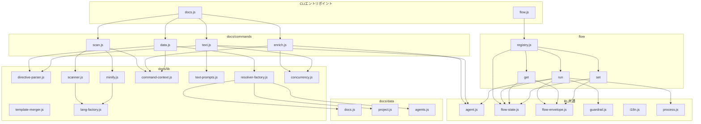

<!-- {{data("base.docs.langSwitcher", {labels: "relative"})}} -->
[English](../internal_design.md) | **日本語**
<!-- {{/data}} -->

# 内部設計

## 説明

<!-- {{text({prompt: "この章の概要を1〜2文で記述してください。プロジェクト構成・モジュール依存の方向・主要な処理フローを踏まえること。"})}} -->

`src/` は `docs/`・`flow/`・`lib/` の3層構造を持ち、CLI コマンドからライブラリへの単方向依存でモジュール結合が管理されています。主要な処理フローは `scan → enrich → data → text` のドキュメント生成パイプラインと、`flow prepare → gate → implement → finalize` の SDD フロー進行の2系統で構成されます。
<!-- {{/text}} -->

## 内容

### プロジェクト構成

<!-- {{text({prompt: "このプロジェクトのディレクトリ構成を tree 形式のコードブロックで記述してください。主要ディレクトリ・ファイルの役割コメントを含めること。ソースコードの実際の構成から生成すること。", mode: "deep"})}} -->

```
src/
├── docs/
│   ├── commands/              # ドキュメント生成 CLI サブコマンド
│   │   ├── scan.js            # ソース解析・analysis.json 生成
│   │   ├── enrich.js          # AI によるエントリへのメタデータ付与
│   │   ├── data.js            # {{data}} ディレクティブ解決・章ファイル更新
│   │   └── text.js            # {{text}} ディレクティブ解決・AI 本文生成
│   ├── data/                  # DataSource 実装（ディレクティブ解決用）
│   │   ├── agents.js          # AGENTS.md 向けエージェントメタデータ
│   │   ├── docs.js            # 章一覧・ナビ・言語切替
│   │   ├── lang.js            # 言語ナビリンク生成
│   │   ├── project.js         # package.json プロジェクトメタデータ
│   │   └── text.js            # テキストデータスタブ
│   └── lib/                   # ドキュメント生成ライブラリ
│       ├── directive-parser.js    # {{data}}/{{text}} 解析・in-place 置換
│       ├── scanner.js             # ファイル収集・ハッシュ計算
│       ├── template-merger.js     # プリセットチェーンテンプレート合成
│       ├── resolver-factory.js    # DataSource インスタンス生成・メソッド解決
│       ├── command-context.js     # コマンド共通コンテキスト生成・章ファイル列挙
│       ├── text-prompts.js        # text コマンド用 AI プロンプトビルダー
│       ├── forge-prompts.js       # forge コマンド用 AI プロンプトビルダー
│       ├── minify.js              # 言語別コード圧縮ディスパッチャ
│       ├── concurrency.js         # 並行 AI 呼び出しユーティリティ
│       ├── chapter-resolver.js    # カテゴリ→章マッピング
│       ├── analysis-entry.js      # AnalysisEntry 基底クラス・集計ユーティリティ
│       ├── analysis-filter.js     # docs.exclude フィルタ
│       ├── lang-factory.js        # 拡張子→言語ハンドラ解決
│       └── lang/                  # 言語別パーサ実装
│           ├── js.js              # JS/TS パーサ・必須行抽出
│           ├── php.js             # PHP パーサ・必須行抽出
│           ├── py.js              # Python 最小化
│           └── yaml.js            # YAML 最小化
├── flow/
│   ├── registry.js            # フローコマンドディスパッチテーブル
│   ├── commands/              # サブプロセス起動型コマンド実装
│   │   ├── report.js          # 完了レポート生成・保存
│   │   └── review.js          # AI コードレビュー実行
│   ├── get/                   # 状態参照系サブコマンド
│   │   ├── check.js           # 前提条件チェック
│   │   ├── context.js         # analysis.json 検索・ファイル読み込み
│   │   ├── guardrail.js       # ガードレール取得
│   │   ├── qa-count.js        # QA 質問数取得
│   │   └── resolve-context.js # フルコンテキスト解決
│   ├── run/                   # 実行系サブコマンド
│   │   ├── prepare-spec.js    # スペック・ブランチ初期化
│   │   ├── gate.js            # スペックゲート・ガードレールチェック
│   │   ├── impl-confirm.js    # 実装完了確認
│   │   ├── lint.js            # リントガードレールチェック
│   │   ├── finalize.js        # commit→merge→retro→sync→cleanup 実行
│   │   ├── retro.js           # AI レトロスペクティブ
│   │   └── review.js          # コードレビュー委譲
│   └── set/                   # 状態更新系サブコマンド
│       ├── step.js            # ステップ状態更新
│       ├── req.js             # 要件ステータス更新
│       ├── metric.js          # メトリクスカウンタ増分
│       ├── note.js            # ノート追記
│       ├── redo.js            # リドーログ管理
│       ├── request.js         # リクエストテキスト保存
│       └── summary.js         # 要件一覧初期化
└── lib/                       # コア共通ライブラリ
    ├── agent.js               # AI エージェント呼び出し（同期・非同期・再試行）
    ├── flow-state.js          # flow.json 読み書き・ミューテーション
    ├── flow-envelope.js       # フロー出力 JSON エンベロープ
    ├── guardrail.js           # ガードレール定義ロード・マージ・フィルタ
    ├── i18n.js                # 多言語化・ロケール JSON 読み込み
    ├── lint.js                # リントガードレール検証・差分ファイル取得
    ├── git-state.js           # Git 状態取得ユーティリティ
    ├── json-parse.js          # AI 出力向け JSON 修復パーサ
    ├── process.js             # spawnSync ラッパー
    ├── progress.js            # TTY プログレスバー・スピナー
    ├── skills.js              # スキルファイルデプロイ
    ├── include.js             # テンプレートインクルード解決
    ├── multi-select.js        # インタラクティブ選択 UI
    └── agents-md.js           # AGENTS.md テンプレート読み込み
```
<!-- {{/text}} -->

### モジュール構成

<!-- {{text({prompt: "主要モジュールの一覧を表形式で記述してください。モジュール名・ファイルパス・責務を含めること。ソースコードの import/require 関係と各ファイルのエクスポートから抽出すること。", mode: "deep"})}} -->

| モジュール名 | ファイルパス | 責務 |
| --- | --- | --- |
| scan | src/docs/commands/scan.js | プリセット DataSource でソースを解析し analysis.json を生成・更新する |
| enrich | src/docs/commands/enrich.js | AI で analysis.json エントリに summary/detail/chapter/keywords を付与する |
| data | src/docs/commands/data.js | analysis.json を基に章ファイルの `{{data}}` ディレクティブを解決・置換する |
| text | src/docs/commands/text.js | AI エージェントを呼び出して章ファイルの `{{text}}` ディレクティブを本文で埋める |
| directive-parser | src/docs/lib/directive-parser.js | `{{data}}`/`{{text}}`/`` ディレクティブの解析と in-place 置換を担う |
| resolver-factory | src/docs/lib/resolver-factory.js | プリセットチェーンの DataSource を初期化し preset.source.method 形式の呼び出しを解決する |
| template-merger | src/docs/lib/template-merger.js | プリセット継承チェーンのテンプレートを合成し最終的な章 Markdown を生成する |
| command-context | src/docs/lib/command-context.js | root・docsDir・config・agent・lang を収集した共通コンテキストオブジェクトを生成する |
| scanner | src/docs/lib/scanner.js | glob パターンでファイルを収集し MD5 ハッシュ・行数・mtime を取得する |
| lang-factory | src/docs/lib/lang-factory.js | 拡張子から JS/PHP/Python/YAML 言語ハンドラモジュールを解決する |
| registry | src/flow/registry.js | FLOW_COMMANDS ディスパッチテーブルで get/set/run サブコマンドとミドルウェアを管理する |
| prepare-spec | src/flow/run/prepare-spec.js | スペックディレクトリ・spec.md・qa.md を作成し flow.json を初期化する |
| gate | src/flow/run/gate.js | スペックの構造チェックとガードレール AI 検証を実行してゲート合否を返す |
| finalize | src/flow/run/finalize.js | commit→merge→retro→sync→cleanup→report の完了シーケンスを順次実行する |
| agent | src/lib/agent.js | execFileSync/spawn で AI エージェントを呼び出し stdin 経由プロンプトと再試行を処理する |
| flow-state | src/lib/flow-state.js | flow.json と .active-flow の読み書き・ステップ/メトリクス/要件の原子的ミューテーションを提供する |
| flow-envelope | src/lib/flow-envelope.js | ok/fail/warn エンベロープを構築し stdout に JSON 出力して exitCode を設定する |
| guardrail | src/lib/guardrail.js | プリセットチェーンとプロジェクト定義のガードレールをロード・マージ・フィルタする |
| i18n | src/lib/i18n.js | パッケージ・プリセット・プロジェクトのロケール JSON を deep-merge し名前空間キーで翻訳を返す |
<!-- {{/text}} -->

### モジュール依存関係

<!-- {{text({prompt: "モジュール間の依存関係を mermaid graph で生成してください。ソースコードの import/require を解析し、レイヤー構造と依存方向を示すこと。出力は mermaid コードブロックのみ。", mode: "deep"})}} -->


<!-- {{/text}} -->

### 主要な処理フロー

<!-- {{text({prompt: "代表的なコマンドを実行した際のモジュール間のデータ・制御フローを番号付きステップで説明してください。エントリポイントから最終出力までの流れを含めること。", mode: "deep"})}} -->

以下は `sdd-forge build`（scan → enrich → data → text の順次実行）における処理フローです。

1. **エントリポイント（docs.js）**: `build` サブコマンドを受け取り、`scan` → `enrich` → `data` → `text` の各サブコマンドを順次起動します。
2. **scan（scan.js）**: `resolveCommandContext()` で root・type・config を確定し、プリセットチェーンから DataSource モジュールを `loadDataSources()` で動的ロードします。`collectFiles()` でソースファイルを glob 収集し、言語ハンドラ（`lang-factory.js`）でファイルを解析してエントリを生成します。既存 `analysis.json` との MD5 ハッシュ比較で差分のみ再解析し、`.sdd-forge/output/analysis.json` に書き出します。
3. **enrich（enrich.js）**: `analysis.json` の全エントリを収集し、`splitIntoBatches()` でトークン上限ごとにバッチ分割します。各バッチを `callAgentAsync()` で AI エージェントへ送信し、返却 JSON を `repairJson()` で修復後 `mergeEnrichment()` で analysis.json へマージして逐次保存します。
4. **data（data.js）**: `createResolver()` でプリセットチェーンの DataSource を初期化します。各章ファイルを読み込み `resolveDataDirectives()` で `{{data(...)}}` ブロックをメソッド呼び出し結果で in-place 置換し、変更のあったファイルを書き戻します。
5. **text（text.js）**: 各章ファイルを `parseDirectives()` でスキャンして `{{text(...)}}` ディレクティブを抽出します。`getEnrichedContext()` で対象章の enriched エントリをアセンブルし、`buildBatchPrompt()` で一括プロンプトを生成して `callAgentAsync()` へ送信します。受け取った JSON レスポンスを `applyBatchJsonToFile()` で各ディレクティブ位置へ挿入し章ファイルを更新します。
<!-- {{/text}} -->

### 拡張ポイント

<!-- {{text({prompt: "新しいコマンドや機能を追加する際に変更が必要な箇所と、拡張パターンを説明してください。ソースコードのプラグインポイントやディスパッチ登録パターンから導出すること。", mode: "deep"})}} -->

**新しいドキュメント生成コマンドの追加**: `src/docs/commands/` にスクリプトファイルを作成し、`docs.js` のサブコマンドディスパッチに登録します。

**新しい DataSource の追加**: `src/docs/lib/data-source.js` の `DataSource` クラスを継承したクラスを作成し、`src/docs/data/` またはプリセットの `data/` ディレクトリに配置します。`resolver-factory.js` の `loadChainDataSources()` が起動時に自動検出して登録するため、個別の登録処理は不要です。

**新しいプリセットの追加**: `src/presets/` 下に `preset.json`（`parent` チェーン定義）・`templates/`（章テンプレート）・`data/`（DataSource）を含むディレクトリを作成します。`src/lib/presets.js` の `PRESETS_MAP` にエントリを追加すると `resolveChainSafe()` で親チェーンが解決されます。

**新しいフローコマンドの追加**: `src/flow/get/`・`src/flow/set/`・`src/flow/run/` のいずれかに `async function execute(ctx)` をエクスポートするファイルを作成し、`src/flow/registry.js` の `FLOW_COMMANDS` オブジェクトに `execute: () => import(...)` エントリを追加します。`pre`・`post` フックを設定することでステップステータスの自動更新やメトリクス増分も追加できます。
<!-- {{/text}} -->

---

<!-- {{data("base.docs.nav")}} -->
[← 設定とカスタマイズ](configuration.md)
<!-- {{/data}} -->
