# 04. 内部設計

## 説明

<!-- {{text: この章の概要を1〜2文で記述してください。プロジェクト構成・モジュール依存の方向・主要な処理フローを踏まえること。}} -->

sdd-forge は 3 層ディスパッチ（CLI エントリ → ドメインルーター → コマンド実装）を基本構造とし、プリセット継承によるプロジェクトタイプ別の解析・テンプレート処理を実現しています。共有ユーティリティ層（`src/lib/`）が全コマンドに横断的な機能を提供し、依存は常に上位レイヤーから下位レイヤーへ一方向に流れます。

<!-- {{/text}} -->

## 内容

### プロジェクト構成

<!-- {{text[mode=deep]: このプロジェクトのディレクトリ構成を tree 形式のコードブロックで記述してください。主要ディレクトリ・ファイルの役割コメントを含めること。ソースコードの実際の構成から生成すること。}} -->

```
sdd-forge/
├── package.json
└── src/
    ├── sdd-forge.js              # CLI エントリポイント・トップレベルルーター
    ├── docs.js                   # docs サブコマンドディスパッチャー
    ├── spec.js                   # spec サブコマンドディスパッチャー
    ├── flow.js                   # flow サブコマンドディスパッチャー
    ├── setup.js                  # setup コマンド（初期設定）
    ├── upgrade.js                # upgrade コマンド
    ├── presets-cmd.js            # presets コマンド
    ├── help.js                   # ヘルプ表示
    ├── docs/
    │   ├── commands/             # docs サブコマンド実装
    │   │   ├── scan.js           #   ソースコード解析 → analysis.json 生成
    │   │   ├── enrich.js         #   AI による analysis エントリの要約・分類
    │   │   ├── init.js           #   テンプレートから docs/ 初期化
    │   │   ├── data.js           #   {{data}} ディレクティブ解決
    │   │   ├── text.js           #   {{text}} ディレクティブ AI 生成
    │   │   ├── readme.js         #   README.md 生成
    │   │   ├── forge.js          #   AI ドキュメント一括生成
    │   │   ├── review.js         #   生成ドキュメントの品質レビュー
    │   │   ├── changelog.js      #   変更履歴生成
    │   │   ├── agents.js         #   AGENTS.md 生成
    │   │   ├── translate.js      #   多言語翻訳
    │   │   └── snapshot.js       #   スナップショット
    │   ├── data/                 # 共通 DataSource 実装
    │   │   ├── agents.js         #   AGENTS.md セクション生成
    │   │   ├── docs.js           #   章ファイル一覧・言語切替リンク
    │   │   ├── lang.js           #   言語切替リンク
    │   │   └── project.js        #   package.json メタデータ提供
    │   └── lib/                  # ドキュメント生成ライブラリ
    │       ├── scanner.js        #   ファイル探索・言語別パーサー
    │       ├── directive-parser.js #  {{data}}/{{text}} ディレクティブ解析
    │       ├── template-merger.js  #  プリセット階層テンプレートマージ
    │       ├── data-source.js    #   DataSource 基底クラス
    │       ├── data-source-loader.js # DataSource 動的ローダー
    │       ├── scan-source.js    #   Scannable ミックスイン
    │       ├── resolver-factory.js #  リゾルバファクトリ
    │       ├── command-context.js #   コマンド共通コンテキスト
    │       ├── concurrency.js    #   並列実行キュー
    │       ├── forge-prompts.js  #   forge 用プロンプト構築
    │       ├── text-prompts.js   #   {{text}} 用プロンプト構築
    │       ├── review-parser.js  #   レビュー結果パーサー
    │       ├── php-array-parser.js #  PHP 配列構文パーサー
    │       └── test-env-detection.js # テスト環境検出
    ├── flow/
    │   └── commands/             # SDD フローコマンド
    │       ├── start.js          #   フロー開始・ブランチ作成
    │       ├── status.js         #   フロー状態表示
    │       ├── review.js         #   フローレビュー
    │       ├── merge.js          #   フローマージ
    │       └── cleanup.js        #   フロークリーンアップ
    ├── spec/
    │   └── commands/             # spec サブコマンド
    │       ├── init.js           #   仕様書テンプレート生成
    │       ├── gate.js           #   仕様書品質ゲート
    │       └── guardrail.js      #   ガードレールチェック
    ├── lib/                      # 全レイヤー共有ユーティリティ
    │   ├── agent.js              #   AI エージェント呼び出し
    │   ├── cli.js                #   repoRoot, parseArgs, PKG_DIR
    │   ├── config.js             #   .sdd-forge/config.json ローダー
    │   ├── presets.js            #   preset.json 自動探索
    │   ├── flow-state.js         #   SDD フロー状態永続化
    │   ├── i18n.js               #   3 層マージ i18n
    │   ├── types.js              #   型エイリアス解決・バリデーション
    │   ├── agents-md.js          #   AGENTS.md テンプレート読み込み
    │   ├── entrypoint.js         #   直接実行判定ユーティリティ
    │   ├── process.js            #   spawnSync ラッパー
    │   └── progress.js           #   プログレスバー・ロギング
    ├── presets/                   # プリセット定義
    │   ├── base/                 #   全プリセット共通（package DataSource）
    │   ├── cli/                  #   CLI プリセット共通
    │   ├── node-cli/             #   Node.js CLI 向け
    │   ├── webapp/               #   Web アプリ共通基底
    │   ├── cakephp2/             #   CakePHP 2.x 向け
    │   ├── laravel/              #   Laravel 向け
    │   ├── symfony/              #   Symfony 向け
    │   └── library/              #   ライブラリ向け
    ├── locale/                   # 国際化メッセージ
    │   ├── en/                   #   英語
    │   └── ja/                   #   日本語
    └── templates/                # 設定テンプレート・スキル定義
```

<!-- {{/text}} -->

### モジュール構成

<!-- {{text[mode=deep]: 主要モジュールの一覧を表形式で記述してください。モジュール名・ファイルパス・責務を含めること。ソースコードの import/require 関係と各ファイルのエクスポートから抽出すること。}} -->

| モジュール名 | ファイルパス | 責務 |
| --- | --- | --- |
| CLI エントリ | `src/sdd-forge.js` | トップレベルルーター。`docs` / `spec` / `flow` / `setup` 等のサブコマンドを振り分けます |
| docs ディスパッチャー | `src/docs.js` | `docs` サブコマンドの第2レベルルーティングを担います。`build` はパイプライン実行です |
| spec ディスパッチャー | `src/spec.js` | `spec init` / `spec gate` / `spec guardrail` のルーティングを担います |
| flow ディスパッチャー | `src/flow.js` | SDD フローの `start` / `status` / `review` / `merge` / `cleanup` を振り分けます |
| scan コマンド | `src/docs/commands/scan.js` | glob パターンでファイル収集し、DataSource の `match()` / `scan()` で analysis.json を生成します |
| data コマンド | `src/docs/commands/data.js` | `{{data}}` ディレクティブを analysis.json のデータで置換します |
| directive-parser | `src/docs/lib/directive-parser.js` | `{{data}}` / `{{text}}` ディレクティブおよびブロック継承構文を解析・操作します |
| template-merger | `src/docs/lib/template-merger.js` | プリセット階層（base → arch → leaf → project-local）のテンプレートをマージします |
| DataSource 基底 | `src/docs/lib/data-source.js` | `{{data}}` ディレクティブリゾルバの基底クラス。`toMarkdownTable()` 等の共通メソッドを提供します |
| Scannable ミックスイン | `src/docs/lib/scan-source.js` | DataSource に `match()` / `scan()` 能力を付加するミックスインです |
| DataSource ローダー | `src/docs/lib/data-source-loader.js` | `data/` ディレクトリから DataSource クラスを動的 import し、インスタンス化します |
| resolver-factory | `src/docs/lib/resolver-factory.js` | プリセット継承順で DataSource をロードし、ディレクティブ解決用リゾルバを生成します |
| command-context | `src/docs/lib/command-context.js` | 全 docs コマンド共通のコンテキスト（root / config / type / agent / i18n）を構築します |
| scanner | `src/docs/lib/scanner.js` | ファイル探索・glob 変換・言語別ソースコードパーサー（PHP / JS）を提供します |
| concurrency | `src/docs/lib/concurrency.js` | 最大同時実行数制限付きの並列処理キューを提供します |
| agent | `src/lib/agent.js` | AI エージェントの同期・非同期呼び出し、コンテキストファイル管理を提供します |
| cli | `src/lib/cli.js` | `repoRoot()` / `sourceRoot()` / `parseArgs()` 等の CLI 共通ユーティリティです |
| config | `src/lib/config.js` | `.sdd-forge/config.json` の読み込み・パス解決を提供します |
| presets | `src/lib/presets.js` | `src/presets/` 配下のプリセットディレクトリと `preset.json` を自動探索します |
| flow-state | `src/lib/flow-state.js` | `.sdd-forge/flow.json` の読み書きによるフロー状態永続化を管理します |
| i18n | `src/lib/i18n.js` | 3 層マージ対応（デフォルト → プリセット → プロジェクト）の国際化モジュールです |
| progress | `src/lib/progress.js` | TTY 環境でのプログレスバー表示とスコープ付きロガーを提供します |
| entrypoint | `src/lib/entrypoint.js` | ES Modules 環境での直接実行判定と安全な `main()` 起動を提供します |

<!-- {{/text}} -->

### モジュール依存関係

```mermaid
graph TD
    subgraph "CLI エントリ層"
        ENTRY["sdd-forge.js"]
    end

    subgraph "ディスパッチャー層"
        DOCS["docs.js"]
        SPEC["spec.js"]
        FLOW["flow.js"]
        SETUP["setup.js"]
    end

    subgraph "docs コマンド層"
        SCAN["commands/scan.js"]
        DATA["commands/data.js"]
        TEXT["commands/text.js"]
        INIT["commands/init.js"]
        FORGE["commands/forge.js"]
        REVIEW["commands/review.js"]
        README["commands/readme.js"]
        AGENTS_CMD["commands/agents.js"]
    end

    subgraph "docs ライブラリ層"
        SCANNER["lib/scanner.js"]
        DIRECTIVE["lib/directive-parser.js"]
        MERGER["lib/template-merger.js"]
        DS_BASE["lib/data-source.js"]
        DS_LOADER["lib/data-source-loader.js"]
        RESOLVER["lib/resolver-factory.js"]
        CMD_CTX["lib/command-context.js"]
        CONCURRENCY["lib/concurrency.js"]
        FORGE_PROMPT["lib/forge-prompts.js"]
        TEXT_PROMPT["lib/text-prompts.js"]
        SCAN_SRC["lib/scan-source.js"]
    end

    subgraph "共有ユーティリティ層"
        CLI["lib/cli.js"]
        CONFIG["lib/config.js"]
        AGENT["lib/agent.js"]
        PRESETS["lib/presets.js"]
        I18N["lib/i18n.js"]
        FLOW_STATE["lib/flow-state.js"]
        PROGRESS["lib/progress.js"]
        ENTRYPOINT["lib/entrypoint.js"]
        TYPES["lib/types.js"]
    end

    subgraph "プリセット DataSource 層"
        DS_COMMON["docs/data/*"]
        DS_BASE_P["presets/base/data/*"]
        DS_WEBAPP["presets/webapp/data/*"]
        DS_CAKE["presets/cakephp2/data/*"]
        DS_LARAVEL["presets/laravel/data/*"]
        DS_SYMFONY["presets/symfony/data/*"]
        DS_CLI_P["presets/cli/data/*"]
    end

    ENTRY --> DOCS
    ENTRY --> SPEC
    ENTRY --> FLOW
    ENTRY --> SETUP

    DOCS --> SCAN
    DOCS --> DATA
    DOCS --> TEXT
    DOCS --> INIT
    DOCS --> FORGE
    DOCS --> REVIEW
    DOCS --> README
    DOCS --> AGENTS_CMD

    SCAN --> SCANNER
    SCAN --> DS_LOADER
    SCAN --> CMD_CTX
    DATA --> DIRECTIVE
    DATA --> RESOLVER
    DATA --> CMD_CTX
    TEXT --> DIRECTIVE
    TEXT --> TEXT_PROMPT
    TEXT --> CONCURRENCY
    TEXT --> CMD_CTX
    FORGE --> FORGE_PROMPT
    FORGE --> CONCURRENCY
    INIT --> MERGER
    INIT --> CMD_CTX

    RESOLVER --> DS_LOADER
    RESOLVER --> PRESETS
    DS_LOADER --> DS_BASE
    CMD_CTX --> CLI
    CMD_CTX --> CONFIG
    CMD_CTX --> TYPES
    CMD_CTX --> AGENT
    CMD_CTX --> I18N
    CMD_CTX --> MERGER

    DS_WEBAPP --> DS_BASE
    DS_WEBAPP --> SCAN_SRC
    DS_CAKE --> DS_WEBAPP
    DS_LARAVEL --> DS_WEBAPP
    DS_SYMFONY --> DS_WEBAPP
    DS_CLI_P --> DS_BASE
    DS_CLI_P --> SCAN_SRC
    DS_COMMON --> DS_BASE

    FORGE_PROMPT --> I18N
    TEXT_PROMPT --> I18N
    FLOW_STATE --> CONFIG
    I18N --> CONFIG
    I18N --> CLI
    I18N --> PRESETS
```

<!-- {{text[mode=deep]: モジュール間の依存関係を mermaid graph で生成してください。ソースコードの import/require を解析し、レイヤー構造と依存方向を示すこと。出力は mermaid コードブロックのみ。}} -->



<!-- {{/text}} -->

### 主要な処理フロー

<!-- {{text[mode=deep]: 代表的なコマンドを実行した際のモジュール間のデータ・制御フローを番号付きステップで説明してください。エントリポイントから最終出力までの流れを含めること。}} -->

**`sdd-forge docs build` パイプライン実行時のフロー:**

1. `sdd-forge.js` が `process.argv` を解析し、`docs.js` ディスパッチャーに `build` サブコマンドを渡します
2. `docs.js` は `build` を認識すると、`scan → enrich → init → data → text → readme → agents → [translate]` のパイプラインを順次実行します。`progress.js` がプログレスバーを初期化します
3. **scan**: `scanner.js` の `collectFiles()` が preset の include/exclude glob パターンに基づきソースファイルを収集します。`data-source-loader.js` が base → 親プリセット → 子プリセット → プロジェクトローカルの順に DataSource をロードし、各ファイルを `match()` で振り分けて `scan()` を実行します。結果は `.sdd-forge/output/analysis.json` に書き出されます
4. **enrich**: analysis.json の全エントリを AI エージェントに渡し、各エントリに `summary` / `detail` / `chapter` / `role` を一括付与します
5. **init**: `template-merger.js` がプリセット階層（base → arch → leaf → project-local）のテンプレートを `@extends` / `@block` 構文に従ってマージし、`docs/` ディレクトリに章ファイルを展開します
6. **data**: `resolver-factory.js` がプリセット継承順で DataSource をロードしてリゾルバを構築します。`directive-parser.js` が各章ファイル内の `{{data}}` ディレクティブを抽出し、リゾルバの `resolve(source, method, analysis, labels)` で Markdown テーブル等に置換します
7. **text**: `directive-parser.js` が `{{text}}` ディレクティブを抽出し、`text-prompts.js` がディレクティブ周辺コンテキストと enriched analysis からプロンプトを構築します。`agent.js` の `callAgentAsync()` で AI エージェントを呼び出し、`concurrency.js` で並列実行制御しながら結果をディレクティブ内に挿入します
8. **readme**: README.md テンプレートの `{{data}}` ディレクティブを解決し、章一覧テーブル等を生成します
9. **agents**: AGENTS.md の SDD セクションテンプレートと PROJECT セクション（analysis データからの自動生成）を出力します

**`sdd-forge flow start` 実行時のフロー:**

1. `sdd-forge.js` → `flow.js` → `flow/commands/start.js` にルーティングされます
2. `flow-state.js` の `buildInitialSteps()` で全ワークフローステップを `pending` 状態で初期化します
3. feature ブランチを作成し、`saveFlowState()` で `.sdd-forge/flow.json` に状態を永続化します
4. 以降の `flow review` / `flow merge` が `loadFlowState()` で状態を読み込み、`updateStepStatus()` でステップを進行させます

<!-- {{/text}} -->

### 拡張ポイント

<!-- {{text[mode=deep]: 新しいコマンドや機能を追加する際に変更が必要な箇所と、拡張パターンを説明してください。ソースコードのプラグインポイントやディスパッチ登録パターンから導出すること。}} -->

**新しい DataSource の追加（プリセット拡張）:**

- `src/presets/{preset}/data/` にクラスファイルを配置します。`DataSource` または `Scannable(DataSource)` を継承し、`match()` / `scan()` でファイル解析、任意のメソッドで `{{data}}` ディレクティブの解決を実装します
- `data-source-loader.js` がディレクトリ内の `.js` ファイルを自動的に動的 import するため、ファイル配置のみで登録が完了します。ファイル名（拡張子なし）が DataSource 名となり、`{{data: name.method()}}` 形式で参照されます
- プリセット継承により、base → 親プリセット → 子プリセット → プロジェクトローカル（`.sdd-forge/data/`）の順でロードされ、同名の DataSource は後勝ちで上書きされます

**新しい docs サブコマンドの追加:**

- `src/docs/commands/` にコマンドファイルを作成し、`main(ctx)` 関数をエクスポートします
- `src/docs.js` のディスパッチテーブルにサブコマンド名とファイルパスのマッピングを追加します
- `resolveCommandContext()` が root / config / type / agent / i18n を含む共通コンテキストを自動構築するため、コマンド実装はビジネスロジックに集中できます

**新しいプリセットの追加:**

- `src/presets/` 配下に新しいディレクトリを作成し、`preset.json`（`parent` / `chapters` / `scan` 設定）を配置します
- `templates/{lang}/` にテンプレート章ファイル（`@extends` によるブロック継承が可能）を配置します
- `data/` に DataSource クラスを配置します。親プリセットの DataSource を `import` して継承することで、差分のみの実装が可能です
- `presets.js` の `presetByLeaf()` がディレクトリ名で自動探索するため、新規ディレクトリの配置のみで利用可能になります

**新しい flow サブコマンドの追加:**

- `src/flow/commands/` にコマンドファイルを作成します
- `src/flow.js` のディスパッチテーブルにマッピングを追加します
- `FLOW_STEPS` 定数（`flow-state.js`）に新しいステップ ID を追加することで、フロー状態の追跡に組み込まれます

**プロジェクト固有のカスタマイズ:**

- `.sdd-forge/data/` にプロジェクト固有の DataSource を配置すると、プリセットの DataSource を上書きまたは追加できます
- `.sdd-forge/locale/{lang}/` にメッセージファイルを配置すると、`i18n.js` の 3 層マージにより UI テキストやプロンプトをプロジェクト単位でカスタマイズできます
- `.sdd-forge/config.json` の `chapters` 配列でプリセットの章順序を上書きできます

<!-- {{/text}} -->
