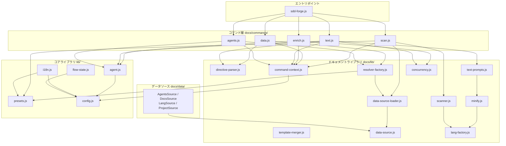

<!-- {{data("base.docs.langSwitcher", {labels: "relative"})}} -->
[English](../internal_design.md) | **日本語**
<!-- {{/data}} -->

# 内部設計

## 説明

<!-- {{text({prompt: "この章の概要を1〜2文で記述してください。プロジェクト構成・モジュール依存の方向・主要な処理フローを踏まえること。"})}} -->

本章では sdd-forge の `src/` ディレクトリを中心としたモジュール構成と依存関係を解説します。コマンド層（`docs/commands/`）からライブラリ層（`docs/lib/`・`lib/`）へという単方向の依存構造を持ち、`scan → enrich → data → text` を基本パイプラインとして各サブコマンドが連携します。
<!-- {{/text}} -->

## 内容

### プロジェクト構成

<!-- {{text({prompt: "このプロジェクトのディレクトリ構成を tree 形式のコードブロックで記述してください。主要ディレクトリ・ファイルの役割コメントを含めること。ソースコードの実際の構成から生成すること。", mode: "deep"})}} -->

```
src/
├── sdd-forge.js              # CLI エントリポイント・サブコマンドディスパッチ
├── docs/
│   ├── commands/
│   │   ├── agents.js         # sdd-forge agents: AGENTS.md 生成・AI 精査
│   │   ├── data.js           # sdd-forge data: {{data}} ディレクティブ解決
│   │   ├── enrich.js         # sdd-forge enrich: AI による analysis エンリッチ
│   │   ├── scan.js           # sdd-forge scan: ソース解析・analysis.json 生成
│   │   └── text.js           # sdd-forge text: {{text}} ディレクティブ AI 生成
│   ├── data/
│   │   ├── agents.js         # AGENTS.md 用 DataSource
│   │   ├── docs.js           # ドキュメント構造メタデータ DataSource
│   │   ├── lang.js           # 多言語ナビゲーションリンク DataSource
│   │   ├── project.js        # package.json プロジェクトメタデータ DataSource
│   │   └── text.js           # テキストカテゴリスタブ DataSource
│   └── lib/
│       ├── analysis-entry.js       # AnalysisEntry 基底クラス・ユーティリティ
│       ├── analysis-filter.js      # docs.exclude によるフィルタリング
│       ├── chapter-resolver.js     # チャプター順序・カテゴリマップ解決
│       ├── command-context.js      # コマンド共通コンテキスト解決
│       ├── concurrency.js          # 並行処理ユーティリティ
│       ├── data-source-loader.js   # DataSource プラグイン動的ロード
│       ├── data-source.js          # DataSource 基底クラス
│       ├── directive-parser.js     # {{data}}/{{text}} ディレクティブパーサー
│       ├── forge-prompts.js        # forge コマンド用プロンプト生成
│       ├── lang-factory.js         # 言語別ハンドラーファクトリー
│       ├── lang/
│       │   ├── js.js               # JavaScript/TypeScript ハンドラー
│       │   ├── php.js              # PHP ハンドラー
│       │   ├── py.js               # Python ハンドラー
│       │   └── yaml.js             # YAML ハンドラー
│       ├── minify.js               # コードミニファイ・エッセンシャル抽出
│       ├── php-array-parser.js     # PHP 配列パーサーユーティリティ
│       ├── resolver-factory.js     # データソースリゾルバーファクトリー
│       ├── review-parser.js        # AI レビュー結果パーサー
│       ├── scan-source.js          # Scannable ミックスイン
│       ├── scanner.js              # ファイルスキャン・パースユーティリティ
│       ├── template-merger.js      # テンプレートマージエンジン
│       ├── test-env-detection.js   # テスト環境検出
│       ├── text-prompts.js         # テキスト生成プロンプト構築
│       └── toml-parser.js          # TOML パーサー
├── lib/
│   ├── agent.js              # AI エージェント呼び出しライブラリ
│   ├── agents-md.js          # AGENTS.md SDD テンプレートロード
│   ├── cli.js                # CLI パース・パス解決
│   ├── config.js             # 設定ファイルロード・パス解決
│   ├── entrypoint.js         # スクリプト直接実行ガード
│   ├── exit-codes.js         # 終了コード定数
│   ├── flow-envelope.js      # フローコマンド JSON レスポンスプロトコル
│   ├── flow-state.js         # SDD フロー状態管理
│   ├── git-state.js          # Git リポジトリ状態取得
│   ├── guardrail.js          # ガードレールルール管理
│   ├── i18n.js               # 多言語メッセージ翻訳
│   ├── include.js            # テンプレートインクルード解決
│   ├── json-parse.js         # 不完全 JSON 修復パーサー
│   ├── lint.js               # リントガードレール実行
│   ├── multi-select.js       # インタラクティブ端末 UI
│   ├── presets.js            # プリセット解決・継承チェーン構築
│   ├── process.js            # 同期プロセス実行ラッパー
│   ├── progress.js           # 端末プログレスバー・ロガー
│   ├── skills.js             # スキルファイルデプロイ
│   └── types.js              # 設定型バリデーション
├── presets/                  # プリセット定義（base, php, node, cli 等）
│   └── base/
│       ├── preset.json       # プリセット設定・チャプター定義
│       ├── data/             # プリセット固有 DataSource
│       └── templates/        # ドキュメントテンプレート（言語別）
└── locale/                   # i18n メッセージファイル（en/, ja/ 等）
```
<!-- {{/text}} -->

### モジュール構成

<!-- {{text({prompt: "主要モジュールの一覧を表形式で記述してください。モジュール名・ファイルパス・責務を含めること。ソースコードの import/require 関係と各ファイルのエクスポートから抽出すること。", mode: "deep"})}} -->

| モジュール名 | ファイルパス | 責務 |
| --- | --- | --- |
| scan | src/docs/commands/scan.js | ソースコード解析・DataSource プラグイン呼び出し・analysis.json 生成 |
| data | src/docs/commands/data.js | `{{data}}` ディレクティブを analysis.json の値で解決・章ファイル更新 |
| enrich | src/docs/commands/enrich.js | AI バッチ処理で各 analysis エントリに summary/detail/chapter/role を付与 |
| text | src/docs/commands/text.js | `{{text}}` ディレクティブへ AI 生成テキストを一括注入 |
| agents | src/docs/commands/agents.js | AGENTS.md の `{{data}}` 解決と AI による PROJECT セクション精査 |
| AgentsSource | src/docs/data/agents.js | SDD テンプレート・設定・package.json スクリプトを AGENTS.md 生成用に提供 |
| DocsSource | src/docs/data/docs.js | チャプター一覧・前後ナビリンク・言語スイッチャーを生成 |
| LangSource | src/docs/data/lang.js | 多言語間の相対パスリンクを生成 |
| ProjectSource | src/docs/data/project.js | package.json からプロジェクト名・説明・バージョン・スクリプトを提供 |
| DataSource | src/docs/lib/data-source.js | DataSource 基底クラス・メソッドディスパッチ・Markdown テーブル生成ヘルパー |
| directive-parser | src/docs/lib/directive-parser.js | `{{data}}`・`{{text}}` ディレクティブのパース・ブロック/インライン置換 |
| resolver-factory | src/docs/lib/resolver-factory.js | プリセット継承チェーンから DataSource リゾルバーオブジェクトを構築 |
| data-source-loader | src/docs/lib/data-source-loader.js | ディレクトリ内の .js ファイルを DataSource として動的インポート・登録 |
| scanner | src/docs/lib/scanner.js | glob マッチング・ファイル収集・MD5 ハッシュ計算・言語別パース |
| template-merger | src/docs/lib/template-merger.js | プリセット継承チェーンのテンプレートをブロック単位でマージ |
| text-prompts | src/docs/lib/text-prompts.js | テキスト生成用 AI プロンプト構築・enriched context 注入 |
| command-context | src/docs/lib/command-context.js | 全コマンド共通の設定・パス・エージェント情報を一元解決 |
| agent | src/lib/agent.js | AI エージェントの同期・非同期呼び出し・stdin 大容量プロンプト対応・リトライ |
| i18n | src/lib/i18n.js | パッケージ/プリセット/プロジェクトレイヤーを統合した多言語翻訳 |
| flow-state | src/lib/flow-state.js | SDD フロー状態（flow.json）の永続化・ステップ管理・マルチワークツリー対応 |
| presets | src/lib/presets.js | プリセット継承チェーン解決・マルチタイプ対応 |
| config | src/lib/config.js | .sdd-forge/config.json ロード・各種ディレクトリパス解決 |
<!-- {{/text}} -->

### モジュール依存関係

<!-- {{text({prompt: "モジュール間の依存関係を mermaid graph で生成してください。ソースコードの import/require を解析し、レイヤー構造と依存方向を示すこと。出力は mermaid コードブロックのみ。", mode: "deep"})}} -->


<!-- {{/text}} -->

### 主要な処理フロー

<!-- {{text({prompt: "代表的なコマンドを実行した際のモジュール間のデータ・制御フローを番号付きステップで説明してください。エントリポイントから最終出力までの流れを含めること。", mode: "deep"})}} -->

`sdd-forge build`（`scan → enrich → data → text` パイプライン）実行時のフローを以下に示します。

1. **エントリポイント**: `sdd-forge.js` が CLI 引数をパースし、`docs.js` へディスパッチします。
2. **scan フェーズ**: `scan.js` が `resolveCommandContext()` でプロジェクト設定を読み込み、`collectFiles()` でソースファイルを収集します。`loadDataSources()` により各プリセットの `data/` ディレクトリから DataSource プラグインを動的ロードし、ファイルごとに `parse()` を呼び出して解析結果を集約します。既存 `analysis.json` との MD5 ハッシュ比較で変更ファイルのみ再解析し、`.sdd-forge/output/analysis.json` へ書き出します。
3. **enrich フェーズ**: `enrich.js` が `analysis.json` を読み込み、`collectEntries()` で全エントリを列挙します。`splitIntoBatches()` でトークン数上限（デフォルト 10,000）ごとにバッチ分割し、`mapWithConcurrency()` で並行制御しながら `callAgentAsync()` で AI に送信します。返却 JSON は `mergeEnrichment()` で `analysis.json` へマージされ、`summary`・`detail`・`chapter`・`role` フィールドが付与されます。
4. **data フェーズ**: `data.js` が `createResolver()` でプリセット継承チェーンを解決して DataSource リゾルバーを構築します。各チャプターファイルの `{{data(...)}}` ディレクティブを `resolveDataDirectives()` で走査し、リゾルバー経由で該当 DataSource メソッドを呼び出してファイルを上書き更新します。
5. **text フェーズ**: `text.js` が未入力の `{{text(...)}}` ディレクティブを収集します。`getEnrichedContext()` で chapter に対応する enrich 済みエントリを抽出し、`buildBatchPrompt()` で 1 ファイル 1 呼び出しのバッチプロンプトを生成します。`callAgentAsync()` で AI に送信し、返却 JSON を `applyBatchJsonToFile()` で各ディレクティブ内へ書き戻して完了です。
<!-- {{/text}} -->

### 拡張ポイント

<!-- {{text({prompt: "新しいコマンドや機能を追加する際に変更が必要な箇所と、拡張パターンを説明してください。ソースコードのプラグインポイントやディスパッチ登録パターンから導出すること。", mode: "deep"})}} -->

**新しいコマンドの追加**

`src/docs/commands/<name>.js` にコマンド実装を作成し、`main()` 関数をエクスポートします。ドキュメント系は `src/docs.js` のサブコマンドディスパッチテーブルへ、フロー系は `src/flow.js` へコマンド名とモジュールパスを追加します。ヘルプテキストは `src/locale/<lang>/ui.json` の `help.cmdHelp` セクションに追記します。

**新しい DataSource の追加**

`src/presets/<preset>/data/<name>.js` に `DataSource` を継承したクラスを `default export` で作成します。`data-source-loader.js` がディレクトリ内の `.js` ファイルを起動時に動的インポートするため、ファイルを配置するだけで自動認識されます。テンプレート側は `{{data("<preset>.<name>.<method>")}}` の形式で呼び出せます。プロジェクト固有の DataSource は `.sdd-forge/data/` に配置することで、プリセット定義を変更せずに追加できます。

**新しい言語ハンドラーの追加**

`src/docs/lib/lang/<ext>.js` に `minify()`・`parse()`・`extractEssential()` を実装します。`src/docs/lib/lang-factory.js` の `EXT_MAP` に拡張子文字列とハンドラーモジュールのマッピングを追加することで、スキャンおよびミニファイパイプラインへ自動的に組み込まれます。

**新しいプリセットの追加**

`src/presets/<name>/` ディレクトリを作成し、`preset.json`（`key`・`parent`・`label`・`chapters`・`scan` 等）と `templates/<lang>/` 配下のチャプターテンプレートを配置します。`parent` フィールドで既存プリセットを継承でき、上位プリセットのテンプレートを `` / `` ディレクティブでオーバーライドできます。
<!-- {{/text}} -->

---

<!-- {{data("base.docs.nav")}} -->
[← 設定とカスタマイズ](configuration.md)
<!-- {{/data}} -->
