# 04. 内部設計

## 説明

<!-- {{text: Describe the overview of this chapter in 1–2 sentences. Cover the project structure, direction of module dependencies, and key processing flows.}} -->
この章では sdd-forge の内部アーキテクチャを説明します。CLI コマンドをディスパッチャー → コマンド → ライブラリの各レイヤーにルーティングする3層ディスパッチ構造と、ドキュメント生成・AI 呼び出し・スペック駆動開発ワークフローに関わる主要な処理フローを取り上げます。
<!-- {{/text}} -->

## 内容

### プロジェクト構造

<!-- {{text[mode=deep]: Describe the directory structure of this project in a tree-format code block. Include role comments for major directories and files. Cover the dispatchers directly under src/ (sdd-forge.js, docs.js, spec.js, flow.js), docs/commands/ (subcommand implementations), docs/lib/ (document generation libraries), lib/ (shared utilities), presets/ (preset definitions), and templates/ (bundled templates).}} -->
```
sdd-forge/
├── package.json                        ← パッケージマニフェスト。bin エントリは src/sdd-forge.js を指す
└── src/
    ├── sdd-forge.js                    ← トップレベル CLI エントリポイント。docs.js / spec.js / flow.js にルーティング
    ├── docs.js                         ← docs 関連サブコマンド（build, scan, forge, …）のディスパッチャー
    ├── spec.js                         ← spec/gate サブコマンドのディスパッチャー
    ├── flow.js                         ← SDD フロー自動実行（DIRECT_COMMAND、サブルーティングなし）
    ├── presets-cmd.js                  ← プリセット一覧表示コマンド（DIRECT_COMMAND）
    ├── help.js                         ← ヘルプテキストレンダラー
    ├── docs/
    │   ├── commands/                   ← docs サブコマンドごとに1ファイル
    │   │   ├── scan.js                 ← ソースコードスキャン → analysis.json
    │   │   ├── enrich.js               ← analysis.json エントリの AI エンリッチメント
    │   │   ├── init.js                 ← テンプレート継承解決 → docs/
    │   │   ├── data.js                 ← {{data}} ディレクティブ解決
    │   │   ├── text.js                 ← AI による {{text}} ディレクティブ解決
    │   │   ├── forge.js                ← ドキュメント反復改善ループ
    │   │   ├── review.js               ← ドキュメント品質チェッカー
    │   │   ├── readme.js               ← README.md ジェネレーター
    │   │   ├── agents.js               ← AGENTS.md アップデーター
    │   │   ├── changelog.js            ← specs/ からの変更ログ生成
    │   │   ├── translate.js            ← 多言語翻訳
    │   │   ├── snapshot.js             ← スナップショットの保存 / チェック / 更新
    │   │   └── …                       ← setup, upgrade, default-project, enrich
    │   ├── lib/                        ← ドキュメント生成ライブラリ層
    │   │   ├── scanner.js              ← ファイル探索と PHP/JS パースユーティリティ
    │   │   ├── directive-parser.js     ← {{data}} / {{text}} / @block ディレクティブパーサー
    │   │   ├── template-merger.js      ← テンプレート継承チェーン解決
    │   │   ├── data-source.js          ← DataSource 基底クラス
    │   │   ├── data-source-loader.js   ← DataSource 動的ローダー
    │   │   ├── resolver-factory.js     ← createResolver() ファクトリー
    │   │   ├── forge-prompts.js        ← forge コマンド向けプロンプトビルダー
    │   │   ├── text-prompts.js         ← text コマンド向けプロンプトビルダー
    │   │   ├── review-parser.js        ← レビュー出力パーサーとパッチャー
    │   │   ├── command-context.js      ← 全コマンド共通コンテキストリゾルバー
    │   │   ├── concurrency.js          ← mapWithConcurrency() ユーティリティ
    │   │   └── …                       ← scan-source.js, php-array-parser.js, test-env-detection.js
    │   └── data/                       ← 共通 DataSource 実装
    │       ├── project.js              ← パッケージメタデータ DataSource
    │       ├── docs.js                 ← 章一覧 / 言語切り替え DataSource
    │       ├── agents.js               ← AGENTS.md セクション DataSource
    │       └── lang.js                 ← 言語切り替えリンク DataSource
    ├── specs/
    │   └── commands/
    │       ├── init.js                 ← spec 初期化（ブランチ + spec.md）
    │       └── gate.js                 ← 実装前後のゲートチェック
    ├── lib/                            ← 全レイヤーで共用するユーティリティ
    │   ├── agent.js                    ← AI エージェント呼び出し（同期 + 非同期）
    │   ├── cli.js                      ← repoRoot(), parseArgs(), PKG_DIR, …
    │   ├── config.js                   ← .sdd-forge/config.json ローダーとパスヘルパー
    │   ├── flow-state.js               ← SDD フロー状態の永続化
    │   ├── presets.js                  ← preset.json ファイルの自動探索
    │   ├── i18n.js                     ← ドメイン名前空間付き3層 i18n
    │   ├── types.js                    ← 型エイリアス解決
    │   ├── progress.js                 ← プログレスバーとスコープロガー
    │   ├── entrypoint.js               ← runIfDirect() ガードユーティリティ
    │   └── …                           ← agents-md.js, process.js, projects.js
    ├── presets/                        ← プリセット定義（preset.json で自動探索）
    │   ├── base/                       ← 基本テンプレートと AGENTS.sdd.md
    │   ├── webapp/                     ← 汎用 webapp DataSource
    │   ├── cli/                        ← CLI タイプ DataSource（ModulesSource）
    │   ├── library/                    ← ライブラリタイプのプリセット
    │   ├── cakephp2/                   ← CakePHP 2.x 固有スキャン + DataSource
    │   ├── laravel/                    ← Laravel 固有スキャン + DataSource
    │   ├── symfony/                    ← Symfony 固有スキャン + DataSource
    │   └── node-cli/                   ← Node CLI プリセット（cli/ を継承）
    ├── locale/
    │   ├── en/                         ← 英語メッセージ（ui.json, messages.json, prompts.json）
    │   └── ja/                         ← 日本語メッセージ
    └── templates/                      ← バンドル済みファイルテンプレート
        ├── config.example.json
        ├── review-checklist.md
        └── skills/                     ← Claude スキル定義（sdd-flow-start/close/status）
```
<!-- {{/text}} -->

### モジュール概要

<!-- {{text[mode=deep]: Describe the major modules in a table format. Include module name, file path, responsibility. Cover the dispatcher layer (sdd-forge.js, docs.js, spec.js), command layer (docs/commands/*.js, specs/commands/*.js), library layer (lib/agent.js, lib/cli.js, lib/config.js, lib/flow-state.js, lib/presets.js, lib/i18n.js), and document generation layer (docs/lib/scanner.js, directive-parser.js, template-merger.js, forge-prompts.js, text-prompts.js, review-parser.js, data-source.js, resolver-factory.js).}} -->
**ディスパッチャー層**

| モジュール | パス | 責務 |
| --- | --- | --- |
| CLI エントリポイント | `src/sdd-forge.js` | トップレベルのサブコマンドを解析し、env vars（`SDD_WORK_ROOT` / `SDD_SOURCE_ROOT`）からプロジェクトコンテキストを解決した後、適切なディスパッチャーに委譲するか組み込みフラグ（`--version`）を処理する。 |
| Docs ディスパッチャー | `src/docs.js` | ドキュメント関連のサブコマンド（`build`, `scan`, `enrich`, `init`, `data`, `text`, `forge`, `review`, `readme`, `agents`, `changelog`, `snapshot`, `translate`, `setup`, `default`）を `docs/commands/` 配下のコマンドファイルにルーティングする。 |
| Spec ディスパッチャー | `src/spec.js` | `spec` と `gate` を `specs/commands/` 配下の実装にルーティングする。 |
| Flow コマンド | `src/flow.js` | サブルーティングのないダイレクトコマンド。spec 作成からゲートチェック・実装までの SDD フロー全体を自動化する。 |

**コマンド層**

| モジュール | パス | 責務 |
| --- | --- | --- |
| scan | `src/docs/commands/scan.js` | プリセット層ごとに DataSource の `scan()` メソッドを実行し、`analysis.json` を書き出す。ハッシュ比較により未変更エントリのエンリッチメントデータを保持する。 |
| enrich | `src/docs/commands/enrich.js` | `analysis.json` を読み込み、AI エージェントをバッチ呼び出しして各エントリに `summary`, `detail`, `chapter`, `role` フィールドを付与する。中断後の再開をサポートする。 |
| init | `src/docs/commands/init.js` | テンプレート継承チェーン（プロジェクトローカル → リーフプリセット → arch → base）を解決し、オプションで AI による章フィルタリングを実行してテンプレートファイルを `docs/` に書き出す。 |
| data | `src/docs/commands/data.js` | 章ファイルを順に処理し、`createResolver()` 経由で適切な DataSource メソッドを呼び出して `{{data}}` ディレクティブをすべて解決する。 |
| text | `src/docs/commands/text.js` | 章ファイルの `{{text}}` ディレクティブを解析し、設定された AI エージェントを呼び出して解決する。バッチモード（ファイルごとに1回呼び出し）とディレクティブごとのモードを並列実行制御付きでサポートする。 |
| forge | `src/docs/commands/forge.js` | `{{data}}` 充填 → `{{text}}` 充填 → AI エージェント呼び出し → レビュー実行 → 確定的パッチ適用 → 繰り返し（`maxRuns` 回まで）という反復改善ループを実行する。 |
| review | `src/docs/commands/review.js` | 各章ファイルの最小行数・H1 見出し・未充填ディレクティブ・整合性問題（露出したディレクティブ・壊れたコメント）・スナップショットのずれを検証する。 |
| spec init | `src/specs/commands/init.js` | フィーチャーブランチ（または worktree）を作成し、テンプレートから連番付きの `specs/NNN-xxx/spec.md` を生成してフロー状態を保存する。 |
| gate | `src/specs/commands/gate.js` | `spec.md` を読み込み、実装前後のチェックを実行して未解決事項を報告し、spec が承認されるまで実装をブロックする。 |

**共有ライブラリ層**

| モジュール | パス | 責務 |
| --- | --- | --- |
| agent | `src/lib/agent.js` | AI エージェント呼び出しのための `callAgent()`（同期）と `callAgentAsync()`（非同期 / ストリーミング）を提供する。`{{PROMPT}}` 置換・システムプロンプト注入・`ARG_MAX` stdin フォールバック・Claude CLI ハング防止を処理する。 |
| cli | `src/lib/cli.js` | `PKG_DIR`, `repoRoot()`, `sourceRoot()`, `parseArgs()`, `isInsideWorktree()`, `getMainRepoPath()`, `formatUTCTimestamp()` をエクスポートする。 |
| config | `src/lib/config.js` | `.sdd-forge/config.json` を読み込みバリデーションする。`.sdd-forge/` 配下の全パスヘルパー（`sddDir`, `sddOutputDir`, `sddDataDir` 等）を提供する。 |
| flow-state | `src/lib/flow-state.js` | SDD フロー状態（`spec`, `baseBranch`, `featureBranch`, `worktree*`）を `.sdd-forge/current-spec` に JSON で永続化する。 |
| presets | `src/lib/presets.js` | `src/presets/` 配下の全 `preset.json` ファイルを自動探索し、`PRESETS`, `presetByLeaf()`, `presetsForArch()` を公開する。 |
| i18n | `src/lib/i18n.js` | ドメイン名前空間（`ui:`, `messages:`, `prompts:`）・`{{placeholder}}` 補間・`t.raw()` によるロー値取得を備えた3層ロケールマージ（パッケージ → プリセット → プロジェクト）を提供する。 |

**ドキュメント生成層**

| モジュール | パス | 責務 |
| --- | --- | --- |
| scanner | `src/docs/lib/scanner.js` | ファイル探索（`findFiles()`）・PHP/JS ソース解析（`parsePHPFile()`, `parseJSFile()`）・ファイル統計（`getFileStats()`）・追加情報抽出（`analyzeExtras()`）を担う。 |
| directive-parser | `src/docs/lib/directive-parser.js` | `{{data}}`, `{{text}}`, `@block`/`@endblock`/`@extends` ディレクティブを解析する。`resolveDataDirectives()` でインプレース置換を提供する。 |
| template-merger | `src/docs/lib/template-merger.js` | テンプレート継承チェーンをボトムアップで解決し `@block` オーバーライドをマージする。章の順序解決のための `resolveChaptersOrder()` を提供する。 |
| forge-prompts | `src/docs/lib/forge-prompts.js` | forge コマンド向けのシステムプロンプト・ファイルレベルプロンプト・結合プロンプトを構築する。`summaryToText()` でエンリッチ済み解析をサマリーテキストに変換する。 |
| text-prompts | `src/docs/lib/text-prompts.js` | text コマンド向けのシステムプロンプトとディレクティブごとのプロンプトを構築する。AI 呼び出し用のエンリッチ済みコンテキスト（`getEnrichedContext()`）と解析コンテキスト（`getAnalysisContext()`）を抽出する。 |
| review-parser | `src/docs/lib/review-parser.js` | review コマンド出力を解析して `[FAIL]`/`[MISS]` シグナルを抽出する。`patchGeneratedForMisses()` で一般的な問題に確定的なローカルパッチを適用する。 |
| data-source | `src/docs/lib/data-source.js` | 全 `{{data}}` リゾルバーの基底クラス。`init()`, `desc()`, `toRows()`, `toMarkdownTable()` を提供する。 |
| resolver-factory | `src/docs/lib/resolver-factory.js` | DataSource を（共通 → arch プリセット → リーフプリセット → プロジェクトローカルの順に）レイヤリングし、統一された `resolve(source, method, analysis, labels)` インターフェースを公開する `createResolver()` ファクトリー。 |
<!-- {{/text}} -->

### モジュール依存関係

```mermaid
graph TD
    CLI["sdd-forge.js\n(エントリポイント)"]

    CLI --> DOCS["docs.js\n(Docs ディスパッチャー)"]
    CLI --> SPEC["spec.js\n(Spec ディスパッチャー)"]
    CLI --> FLOW["flow.js\n(Flow コマンド)"]
    CLI --> HELP["help.js"]

    DOCS --> SCAN["docs/commands/scan.js"]
    DOCS --> ENRICH["docs/commands/enrich.js"]
    DOCS --> INIT["docs/commands/init.js"]
    DOCS --> DATA["docs/commands/data.js"]
    DOCS --> TEXT["docs/commands/text.js"]
    DOCS --> FORGE["docs/commands/forge.js"]
    DOCS --> REVIEW["docs/commands/review.js"]
    DOCS --> AGENTS["docs/commands/agents.js"]
    DOCS --> README["docs/commands/readme.js"]

    SPEC --> SPEC_INIT["specs/commands/init.js"]
    SPEC --> GATE["specs/commands/gate.js"]

    SCAN --> DSL["docs/lib/data-source-loader.js"]
    SCAN --> SCANNER["docs/lib/scanner.js"]
    ENRICH --> AGENT["lib/agent.js"]
    INIT --> TMPL["docs/lib/template-merger.js"]
    INIT --> AGENT
    DATA --> RESOLVER["docs/lib/resolver-factory.js"]
    DATA --> DPARSER["docs/lib/directive-parser.js"]
    DATA --> CMDCTX["docs/lib/command-context.js"]
    TEXT --> AGENT
    TEXT --> TPROMPTS["docs/lib/text-prompts.js"]
    TEXT --> DPARSER
    FORGE --> AGENT
    FORGE --> FPROMPTS["docs/lib/forge-prompts.js"]
    FORGE --> RPARSER["docs/lib/review-parser.js"]
    FORGE --> DATA
    FORGE --> TEXT
    REVIEW --> DPARSER
    AGENTS --> AGENT
    AGENTS --> RESOLVER
    AGENTS --> DPARSER

    RESOLVER --> DSL
    RESOLVER --> DS["docs/lib/data-source.js"]
    DSL --> DS

    SPEC_INIT --> FLOWSTATE["lib/flow-state.js"]
    GATE --> FLOWSTATE
    FLOW --> FLOWSTATE

    SCAN --> CONFIG["lib/config.js"]
    DATA --> CONFIG
    TEXT --> CONFIG
    FORGE --> CONFIG
    FORGE --> CLI_LIB["lib/cli.js"]
    AGENT --> CLI_LIB
    CONFIG --> CLI_LIB

    INIT --> PRESETS["lib/presets.js"]
    RESOLVER --> PRESETS
    SCAN --> PRESETS

    DATA --> I18N["lib/i18n.js"]
    TEXT --> I18N
    FORGE --> I18N
    AGENTS --> I18N
```

<!-- {{text[mode=deep]: Generate a mermaid graph showing the dependencies between modules. Reflect the three-level dispatch structure and show the dependency direction from dispatcher → command → library. Output only the mermaid code block.}} -->

<!-- {{/text}} -->

### 主要な処理フロー

<!-- {{text[mode=deep]: Explain the data and control flow between modules when a representative command (build or forge) is executed, using numbered steps. Include the flow from entry point → dispatch → config loading → analysis data preparation → AI invocation → file writing.}} -->
**`sdd-forge build` パイプライン**

1. **エントリポイント** — `sdd-forge.js` がサブコマンドとして `build` を受け取る。`SDD_WORK_ROOT`/`SDD_SOURCE_ROOT` 環境変数（または `git rev-parse`）から `root` と `srcRoot` を解決し、`lib/config.js` 経由で `.sdd-forge/config.json` を読み込んだ後、`docs.js` に委譲する。
2. **ディスパッチ** — `docs.js` が `build` をビルドパイプラインにマップし、`scan → enrich → init → data → text → readme → agents → [translate]` の順序で各ステップを実行する。各ステップは対応する `docs/commands/*.js` ファイルを呼び出す。`lib/progress.js` の `createProgress()` インスタンスがステップをまたいで進捗を追跡する。
3. **scan** — `docs/commands/scan.js` がプリセット層（arch → リーフ → プロジェクトローカル）ごとに `docs/lib/data-source-loader.js` の `loadScanSources()` を呼び出す。各 DataSource の `scan()` メソッドが `srcRoot` と `preset.json` の `scanCfg` を引数に実行される。結果はフラットな `analysis` オブジェクトにマージされ `.sdd-forge/output/analysis.json` に書き出される。前回実行のエンリッチメントフィールドはハッシュ比較で保持される。
4. **enrich** — `docs/commands/enrich.js` が `analysis.json` を読み込み、`collectEntries()` で未エンリッチエントリを収集し、行数ベースのバッチに分割して各バッチごとに `lib/agent.js` の `callAgentAsync()` を呼び出す。AI レスポンスは `parseEnrichResponse()` で解析され、`analysis.json` に逐次マージされる（再開セーフ）。
5. **init** — `docs/commands/init.js` が `docs/lib/template-merger.js` の `resolveTemplates()` を呼び出し、対象言語のテンプレート継承チェーン（プロジェクトローカル → リーフプリセット → arch → base）を構築する。`mergeResolved()` が `@block`/`@endblock` オーバーライドを適用する。`config.chapters` が未設定かつ AI エージェントが設定されている場合、`aiFilterChapters()` がエージェントを呼び出して適切な章を選択する。テンプレートファイルは `docs/` に書き出される。
6. **data** — `docs/commands/data.js` が `docs/lib/resolver-factory.js` の `createResolver()` を呼び出してレイヤー化された DataSource マップを構築する。各章ファイルについて `docs/lib/directive-parser.js` の `resolveDataDirectives()` がディレクティブを反復処理し、`resolver.resolve(source, method, analysis, labels)` を呼び出して `{{data}}` ブロックをインプレース置換する。更新後のファイルは `docs/` に書き戻される。
7. **text** — `docs/commands/text.js` が各章ファイルを読み込み、`parseDirectives()` で `{{text}}` ディレクティブを特定し、`docs/lib/text-prompts.js` の `buildBatchPrompt()` / `buildTextSystemPrompt()` を使ってプロンプトを構築する。`lib/agent.js` の `callAgentAsync()` が設定されたプロバイダーを呼び出す。AI レスポンスは `validateBatchResult()` で検証され、章ファイルに書き戻される。
8. **readme / agents** — `docs/commands/readme.js` と `agents.js` も同様に `createResolver()` と `callAgent()` を使って `README.md` を生成し `AGENTS.md` を更新する。

**`sdd-forge forge` フロー**

1. `sdd-forge.js` → `docs.js` → `docs/commands/forge.js`。CLI オプション（mode, prompt, spec, max-runs）は `lib/cli.js#parseArgs()` で解析される。
2. `lib/config.js` の `loadConfig()` がプロジェクト設定を読み込み、`lib/agent.js` の `resolveAgent()` がアクティブなプロバイダーを解決する。
3. `docs/lib/command-context.js` の `loadFullAnalysis()` が `analysis.json` を読み込む。`createResolver()` が DataSource マップを構築し、`populateFromAnalysis()`（`data.js` から再エクスポート）が `{{data}}` ディレクティブを充填する。
4. エージェントが設定されている場合、`text.js` の `textFillFromAnalysis()` が残りの `{{text}}` ディレクティブを充填する。
5. 各ラウンド（`maxRuns` 回まで）で `docs/lib/forge-prompts.js` の `buildForgeSystemPrompt()` がユーザーリクエスト・spec 内容・エンリッチ済み解析サマリーを含む AI プロンプトを組み立てる。`invokeAgent()`（`callAgentAsync()` のラッパー）がプログレスティッカー付きで呼び出しをディスパッチする。
6. `runCommand()` が `sdd-forge review` を実行し、`docs/lib/review-parser.js` の `summarizeReview()` と `parseReviewMisses()` が失敗を抽出する。`patchGeneratedForMisses()` が確定的なローカル修正を適用する。
7. レビューがパスした場合、`docs/commands/readme.js` が再生成され、多言語設定の場合は `translate.js --force` が呼び出される。ループを終了する。
<!-- {{/text}} -->

### 拡張ポイント

<!-- {{text[mode=deep]: Explain where changes are needed and the extension patterns when adding new commands or features. Provide steps for each of the following: (1) adding a new docs subcommand, (2) adding a new spec subcommand, (3) adding a new preset, (4) adding a new DataSource ({{data}} resolver), and (5) adding a new AI prompt.}} -->
**(1) 新しい docs サブコマンドの追加**

1. `src/docs/commands/<name>.js` を作成する。非同期の `main(ctx)` 関数をエクスポートし、ファイル末尾で `runIfDirect(import.meta.url, main)` を呼び出す。
2. プログラムから呼び出す場合は `docs/lib/command-context.js` の `resolveCommandContext()` で構築した `ctx` オブジェクトを受け取り、直接実行する場合は `parseArgs()` からコンテキストを構築する。
3. `src/docs.js` を開き、dispatch switch に `case "<name>":` エントリを追加して新しいファイルを動的インポートし `main()` を呼び出す。
4. コマンドを `build` パイプラインに含める場合は、`src/docs.js` の `build` ケースの順序付きステップリストに追加し、`createProgress()` の呼び出しにステップを登録する。
5. `src/locale/en/ui.json` と `src/locale/ja/ui.json` の `help.cmdHelp.<name>` にヘルプテキストエントリを追加する。

**(2) 新しい spec サブコマンドの追加**

1. エクスポートされた `main()` 関数と `runIfDirect` ガードを備えた `src/specs/commands/<name>.js` を作成する。
2. `src/spec.js` を開き、新しいサブコマンド名のルーティングエントリを追加する。
3. コマンドが SDD フロー状態と連携する場合は、`src/lib/flow-state.js` の `saveFlowState()` / `loadFlowState()` / `clearFlowState()` を使用する。
4. `src/locale/{en,ja}/ui.json` にロケール文字列を追加する。

**(3) 新しいプリセットの追加**

1. `src/presets/<key>/` 配下にディレクトリを作成し、最低限 `name`, `arch`, `scan`, `chapters` フィールドを持つ `preset.json` を追加する。このファイルは `src/lib/presets.js` により自動探索される。
2. `chapters` 配列のファイル名に対応した Markdown テンプレートファイルを含む `templates/<lang>/` ディレクトリを追加する。
3. プリセット独自のスキャンロジックが必要な場合は、`Scannable(DataSource)` を継承した `src/presets/<key>/data/<category>.js` を作成し `scan(sourceRoot, scanCfg)` を実装する。
4. プリセットの arch 層（`webapp`, `cli` 等）がすでに存在する場合は、ロジックを複製せずその DataSource クラスを継承する。
5. 短い名前をプリセットのフルパスに解決できるよう、必要に応じて `src/lib/types.js` の `TYPE_ALIASES` マップに型エイリアスを追加する。

**(4) 新しい DataSource（`{{data}}` リゾルバー）の追加**

1. 適切な `data/` ディレクトリ（共通の場合は `src/docs/data/`、プリセット固有の場合は `src/presets/<key>/data/`）に新しいファイルを作成する。
2. `DataSource` を継承するデフォルトクラスをエクスポートする（スキャンも行う場合は `Scannable(DataSource)` を継承する）。
3. `init(ctx)` で `super.init(ctx)` を呼び出し、必要なコンテキストフィールドを保持する。
4. `methodName(analysis, labels)` というシグネチャで Markdown 文字列または `null` を返すリゾルバーメソッドを1つ以上実装する。テーブル出力には `this.toMarkdownTable()`、説明文の上書きには `this.desc(section, key)` を使用する。
5. DataSource がソースコードもスキャンする場合は `scan(sourceRoot, scanCfg)` を実装し、主要カテゴリには `summary` フィールドを持つオブジェクト、`extras` にはフラットなオブジェクトを返す。
6. テンプレートから `{{data: <拡張子なしファイル名>.<methodName>("Label1|Label2")}}` の形式でメソッドを参照する。

**(5) 新しい AI プロンプトの追加**

1. 実行時に使用するプロンプトについては、適切なロケール JSON ファイル（`src/locale/{en,ja}/prompts.json`）の分かりやすいキーの下に静的テキストを追加する。配列の取得には `t.raw("prompts:<key>")`、文字列には `t("prompts:<key>", params)` を使用する。
2. 複雑な複数パートのプロンプトについては、適切なプロンプトモジュール（forge 関連は `src/docs/lib/forge-prompts.js`、テキスト充填関連は `src/docs/lib/text-prompts.js`）にビルダー関数を追加する。parts 配列を組み立てて `\n` で結合する既存パターンに従う。
3. 新しいプロンプトがユーザープロンプトとは別にシステムプロンプトを必要とする場合は、エージェント設定に `systemPromptFlag`（例: `"--system-prompt"`）が `.sdd-forge/config.json` で設定されていることを確認する。未設定の場合、システムプロンプトは `lib/agent.js#resolveEffectivePrompt()` によって自動的にユーザープロンプトの先頭に結合される。
4. `ARGV_SIZE_THRESHOLD`（100,000 バイト）を超える可能性があるプロンプトについては特別な対応は不要で、`lib/agent.js` の `buildAgentInvocation()` が自動的に stdin 経由の配信に切り替える。
<!-- {{/text}} -->
