# 内部設計

## 説明

<!-- {{text({prompt: "この章の概要を1〜2文で記述してください。プロジェクト構成・モジュール依存の方向・主要な処理フローを踏まえること。"})}} -->

sdd-forge の内部アーキテクチャについて、3層ディスパッチ構造（`sdd-forge.js` → サブコマンドルーター → 個別コマンド）、プリセット継承チェーンに基づく DataSource/テンプレート解決メカニズム、および `scan → enrich → init → data → text → readme` のドキュメント生成パイプラインを解説します。モジュール依存は `lib/`（共通ユーティリティ）→ `docs/lib/`（ドキュメント生成基盤）→ `docs/commands/`（CLI コマンド）→ `presets/`（プリセット固有ロジック）の方向で流れます。
<!-- {{/text}} -->

## 内容

### プロジェクト構成

<!-- {{text({prompt: "このプロジェクトのディレクトリ構成を tree 形式のコードブロックで記述してください。主要ディレクトリ・ファイルの役割コメントを含めること。ソースコードの実際の構成から生成すること。", mode: "deep"})}} -->

```
src/
├── sdd-forge.js              # メインエントリポイント（3層ディスパッチの起点）
├── docs.js                   # docs サブコマンドルーター
├── spec.js                   # spec サブコマンドルーター
├── flow.js                   # SDD フローの DIRECT_COMMAND
├── lib/                      # 全コマンド共通ユーティリティ
│   ├── cli.js                #   リポジトリルート解決・引数パース
│   ├── agent.js              #   AI エージェント呼び出し（同期・非同期）
│   ├── config.js             #   設定ファイル読み込み・パス解決
│   ├── presets.js             #   プリセット継承チェーン解決
│   ├── i18n.js               #   国際化（3層マージ）
│   ├── flow-state.js         #   SDD フロー状態の永続化
│   ├── progress.js           #   プログレスバー・ロギング
│   ├── entrypoint.js         #   直接実行判定ガード
│   ├── skills.js             #   スキルファイルデプロイ
│   ├── agents-md.js          #   AGENTS.md テンプレート読み込み
│   ├── multi-select.js       #   ターミナル選択ウィジェット
│   ├── process.js            #   spawnSync ラッパー
│   └── types.js              #   設定バリデーション
├── docs/
│   ├── commands/             # ドキュメント生成 CLI コマンド群
│   │   ├── scan.js           #   DataSource ベースのソーススキャン
│   │   ├── enrich.js         #   AI による analysis メタデータ付与
│   │   ├── data.js           #   {{data}} ディレクティブ解決
│   │   ├── text.js           #   {{text}} ディレクティブの LLM 処理
│   │   ├── init.js           #   テンプレート初期化
│   │   ├── forge.js          #   AI ドキュメント一括生成
│   │   ├── review.js         #   ドキュメント品質レビュー
│   │   ├── readme.js         #   README.md 生成
│   │   └── changelog.js      #   変更履歴生成
│   ├── lib/                  # ドキュメント生成基盤ライブラリ
│   │   ├── data-source.js    #   DataSource 基底クラス
│   │   ├── scan-source.js    #   Scannable ミックスイン
│   │   ├── data-source-loader.js  # DataSource 動的ローダー
│   │   ├── resolver-factory.js    # {{data}} リゾルバファクトリ
│   │   ├── directive-parser.js    # ディレクティブパーサー
│   │   ├── template-merger.js     # テンプレート継承・マージエンジン
│   │   ├── text-prompts.js        # {{text}} プロンプト構築
│   │   ├── forge-prompts.js       # forge プロンプト構築
│   │   ├── command-context.js     # コマンド共通コンテキスト
│   │   ├── concurrency.js        # 並列実行キュー
│   │   ├── scanner.js            # ファイル収集・言語別パーサー
│   │   ├── review-parser.js      # レビュー出力パーサー
│   │   ├── test-env-detection.js # テスト環境検出
│   │   ├── toml-parser.js        # TOML パーサー
│   │   └── php-array-parser.js   # PHP 配列パーサー
│   └── data/                 # 共通 DataSource（全プリセットで利用可能）
│       ├── project.js        #   package.json メタデータ
│       ├── docs.js           #   章一覧・ナビゲーション
│       ├── agents.js         #   AGENTS.md セクション生成
│       ├── lang.js           #   言語切り替えリンク
│       └── text.js           #   AI テキスト生成プレースホルダ
├── presets/                  # プリセット定義（継承チェーン構造）
│   ├── base/                 #   全プリセットの基底
│   │   └── data/             #     package.js, structure.js
│   ├── webapp/               #   Web アプリ共通基底
│   │   └── data/             #     controllers, models, routes, tables, commands
│   ├── cli/                  #   CLI アプリ基底
│   │   └── data/             #     modules.js
│   ├── cakephp2/             #   CakePHP 2.x（webapp 継承）
│   ├── laravel/              #   Laravel（webapp 継承）
│   ├── symfony/              #   Symfony（webapp 継承）
│   ├── nextjs/               #   Next.js
│   ├── hono/                 #   Hono
│   ├── workers/              #   Cloudflare Workers
│   ├── drizzle/              #   Drizzle ORM
│   ├── graphql/              #   GraphQL
│   ├── postgres/             #   PostgreSQL
│   ├── r2/                   #   Cloudflare R2
│   ├── storage/              #   汎用ストレージ
│   ├── database/             #   汎用データベース
│   ├── monorepo/             #   モノレポ対応
│   └── lib/                  #   プリセット間共有ユーティリティ
├── locale/                   # i18n メッセージファイル
├── templates/                # スキル・設定テンプレート
└── specs/                    # spec コマンド関連
```
<!-- {{/text}} -->

### モジュール構成

<!-- {{text({prompt: "主要モジュールの一覧を表形式で記述してください。モジュール名・ファイルパス・責務を含めること。ソースコードの import/require 関係と各ファイルのエクスポートから抽出すること。", mode: "deep"})}} -->

| モジュール | ファイルパス | 責務 |
| --- | --- | --- |
| CLI ユーティリティ | `src/lib/cli.js` | リポジトリルート解決（`repoRoot`/`sourceRoot`）、汎用引数パーサー（`parseArgs`）、worktree 判定、バージョン取得 |
| エージェント | `src/lib/agent.js` | AI CLI の同期・非同期呼び出し、systemPrompt 注入、stdin フォールバック、per-command エージェント解決 |
| 設定管理 | `src/lib/config.js` | `.sdd-forge/config.json` の読み込み・パス解決、`sddDir`/`sddOutputDir`/`sddDataDir` 等のパスヘルパー |
| プリセット解決 | `src/lib/presets.js` | プリセット継承チェーンの解決（`resolveChainSafe`/`resolveMultiChains`）、`PRESETS_DIR` 定数の提供 |
| 国際化 | `src/lib/i18n.js` | 3層マージ（パッケージ→プリセット→プロジェクト）によるメッセージ解決、`translate()`/`createI18n()` |
| フロー状態 | `src/lib/flow-state.js` | `.active-flow` ポインタと `specs/NNN/flow.json` による SDD フロー状態の永続化・参照 |
| DataSource 基底 | `src/docs/lib/data-source.js` | `{{data}}` ディレクティブリゾルバの基底クラス、`desc()`/`mergeDesc()`/`toMarkdownTable()` |
| Scannable ミックスイン | `src/docs/lib/scan-source.js` | DataSource に `match()`/`scan()` メソッドを付与するミックスインファクトリ |
| DataSource ローダー | `src/docs/lib/data-source-loader.js` | 指定ディレクトリの `.js` ファイルから DataSource を動的にインポート・インスタンス化 |
| リゾルバファクトリ | `src/docs/lib/resolver-factory.js` | type に応じてプリセット継承チェーンに沿った DataSource マップを構築し `resolve()` メソッドを提供 |
| ディレクティブパーサー | `src/docs/lib/directive-parser.js` | テンプレート内の `{{data}}`/`{{text}}`/``/`` を解析 |
| テンプレートマージャー | `src/docs/lib/template-merger.js` | プリセット継承チェーンに基づくボトムアップ方式のレイヤー構築とブロック単位マージ |
| コマンドコンテキスト | `src/docs/lib/command-context.js` | 全コマンド共通の `root`/`config`/`agent`/`docsDir` 等を `resolveCommandContext()` で一括解決 |
| スキャンコマンド | `src/docs/commands/scan.js` | DataSource ベースのスキャンパイプライン、差分スキャン、enrichment 保持 |
| enrich コマンド | `src/docs/commands/enrich.js` | AI で analysis.json の各エントリに `summary`/`detail`/`chapter`/`role` を付与 |
| text コマンド | `src/docs/commands/text.js` | `{{text}}` ディレクティブの LLM 処理（バッチモード/per-directive モード） |
| ファイル収集 | `src/docs/lib/scanner.js` | glob パターンでのファイル収集（`collectFiles`）、PHP/JS 言語別パーサー |
| プログレス | `src/lib/progress.js` | スピナー付きプログレスバーとスコープ付きロガー |
<!-- {{/text}} -->

### モジュール依存関係

```mermaid
graph TD
    subgraph "CLI Commands"
        scan["scan.js"]
        enrich["enrich.js"]
        text["text.js"]
        data["data.js"]
        init["init.js"]
        forge["forge.js"]
        review["review.js"]
        readme["readme.js"]
    end

    subgraph "Docs Library"
        cmdctx["command-context.js"]
        dirparser["directive-parser.js"]
        resolver["resolver-factory.js"]
        tmmerger["template-merger.js"]
        dsloader["data-source-loader.js"]
        textprompts["text-prompts.js"]
        forgeprompts["forge-prompts.js"]
        scanner["scanner.js"]
        concurrency["concurrency.js"]
        datasource["data-source.js"]
        scansource["scan-source.js"]
    end

    subgraph "Core Library"
        cli["cli.js"]
        agent["agent.js"]
        config["config.js"]
        presets["presets.js"]
        i18n["i18n.js"]
        flowstate["flow-state.js"]
        progress["progress.js"]
        entrypoint["entrypoint.js"]
    end

    subgraph "Presets"
        base["base/data/*"]
        webapp["webapp/data/*"]
        cakephp["cakephp2/data/*"]
        laravel["laravel/data/*"]
        symfony["symfony/data/*"]
        nextjs["nextjs/data/*"]
        workers["workers/data/*"]
    end

    scan --> cmdctx
    scan --> dsloader
    scan --> scanner
    scan --> presets
    enrich --> cmdctx
    enrich --> agent
    text --> cmdctx
    text --> dirparser
    text --> textprompts
    text --> agent
    text --> concurrency
    data --> cmdctx
    data --> resolver
    data --> dirparser
    forge --> cmdctx
    forge --> forgeprompts
    forge --> agent
    init --> cmdctx
    init --> tmmerger
    readme --> cmdctx
    review --> cmdctx
    review --> agent

    cmdctx --> cli
    cmdctx --> config
    cmdctx --> agent
    cmdctx --> i18n
    cmdctx --> tmmerger

    resolver --> dsloader
    resolver --> presets
    dsloader --> datasource
    tmmerger --> dirparser
    tmmerger --> presets
    textprompts --> i18n
    forgeprompts --> i18n

    webapp --> datasource
    webapp --> scansource
    cakephp --> webapp
    laravel --> webapp
    symfony --> webapp
    base --> datasource
    nextjs --> datasource
    nextjs --> scansource
    workers --> datasource
    workers --> scansource

    i18n --> config
    i18n --> presets
    flowstate --> config
    flowstate --> cli
    agent --> cli
```

<!-- {{text({prompt: "モジュール間の依存関係を mermaid graph で生成してください。ソースコードの import/require を解析し、レイヤー構造と依存方向を示すこと。出力は mermaid コードブロックのみ。", mode: "deep"})}} -->


<!-- {{/text}} -->

### 主要な処理フロー

<!-- {{text({prompt: "代表的なコマンドを実行した際のモジュール間のデータ・制御フローを番号付きステップで説明してください。エントリポイントから最終出力までの流れを含めること。", mode: "deep"})}} -->

#### `sdd-forge build` パイプライン（scan → enrich → init → data → text → readme）

1. **エントリポイント解決**: `sdd-forge.js` が `process.argv` からサブコマンドを判定し、`docs.js` へディスパッチします。`docs.js` は `build` コマンドを認識し、パイプライン全体を順次実行します。
2. **コンテキスト構築**: `resolveCommandContext()` が `repoRoot()`/`sourceRoot()` でプロジェクトルートを解決し、`.sdd-forge/config.json` を `validateConfig()` で検証し、`resolveAgent()` で AI エージェント設定を解決します。
3. **scan**: `scan.js` が `collectFiles()` でプリセットの include/exclude glob パターンに基づきファイルを一括収集します。`resolveMultiChains()` で type のプリセット継承チェーンを解決し、各プリセットの `data/` ディレクトリから `loadScanSources()` で `scan()` メソッドを持つ DataSource をロードします。各 DataSource の `match()` でファイルを振り分け、`scan()` を実行して `analysis.json` を生成します。既存 analysis がある場合は `analyzeCategoryDelta()` で差分スキャンを行い、`preserveEnrichment()` でハッシュが一致するエントリの enriched フィールドを引き継ぎます。
4. **enrich**: `enrich.js` が `collectEntries()` で analysis.json の全エントリを収集し、未処理のものを `splitIntoBatches()` でバッチ分割します。`buildEnrichPrompt()` でプロンプトを生成し、`callAgentAsync()` で AI を呼び出します。`parseEnrichResponse()` でレスポンスを解析し、`mergeEnrichment()` で `summary`/`detail`/`chapter`/`role` を analysis にマージします。各バッチ完了後に中間保存します。
5. **init**: `template-merger.js` の `resolveTemplates()` がプリセット継承チェーンに沿ってテンプレートファイルを解決し、`mergeResolved()` でブロック単位マージを適用して `docs/` にテンプレートを配置します。
6. **data**: `resolver-factory.js` の `createResolver()` が DataSource マップを構築し、`directive-parser.js` がテンプレート内の `{{data}}` ディレクティブを解析します。`resolveDataDirectives()` が各ディレクティブに対して `resolver.resolve(preset, source, method, analysis, labels)` を呼び出し、マークダウンテーブル等の結果をテンプレートに挿入します。
7. **text**: `text.js` がテンプレート内の `{{text}}` ディレクティブを解析し、`getEnrichedContext()` で enriched analysis から該当章のコンテキストを構築します。バッチモードでは `processTemplateFileBatch()` がファイル単位で1回の LLM 呼び出しを行い、`validateBatchResult()` で品質検証します。
8. **readme**: `readme.js` が `README.md` テンプレートの `{{data}}` ディレクティブを解決し、章一覧テーブルやプロジェクトメタデータを含む README を生成します。

#### `sdd-forge scan`（差分スキャン）

1. `resolveCommandContext()` でコンテキストを構築します。
2. 既存 `analysis.json` がある場合、`buildExistingFileIndex()` でファイルパス→ハッシュのルックアップを構築します。
3. `collectFiles()` でファイルを収集し、各 DataSource の `match()` で振り分けます。
4. `analyzeCategoryDelta()` でカテゴリごとに変更・追加・削除を判定し、変更がないカテゴリはスキップして既存データを再利用します。
5. 変更があったカテゴリのみ `scan()` を実行し、`_incrementalMeta` に変更ファイルと影響章を記録します。
6. `preserveEnrichment()` でハッシュが一致するエントリの enriched フィールドを新結果に引き継ぎます。
<!-- {{/text}} -->

### 拡張ポイント

<!-- {{text({prompt: "新しいコマンドや機能を追加する際に変更が必要な箇所と、拡張パターンを説明してください。ソースコードのプラグインポイントやディスパッチ登録パターンから導出すること。", mode: "deep"})}} -->

#### 新しいプリセットの追加

`src/presets/` 配下に新しいディレクトリを作成し、`preset.json` で `parent` を指定して継承チェーンを構築します。`data/` ディレクトリに DataSource クラスを配置すると、`data-source-loader.js` が自動的にロードします。DataSource は `DataSource` を直接継承（data-only）するか、`Scannable(DataSource)` ミックスインで `match()`/`scan()` メソッドを追加できます。`templates/{lang}/` にテンプレートファイルを配置すると、`template-merger.js` が継承チェーンに沿ってマージします。

#### 新しい DataSource の追加

1. `src/presets/{preset}/data/` に `.js` ファイルを作成し、`DataSource` または `Scannable(DataSource)` を継承するクラスを `export default` します。
2. スキャン機能が必要な場合は `match(file)` と `scan(files)` を実装します。`match()` は `relPath`/`fileName` でファイルを判定し、`scan()` は解析結果オブジェクトを返します。
3. データ出力メソッド（例: `list(analysis, labels)`）を実装します。テンプレートから `{{data("preset.source.method", {labels: "A|B"})}}` の形式で呼び出されます。
4. `toMarkdownTable(rows, labels)` や `mergeDesc(items, section, keyField)` など、基底クラスのユーティリティを利用してマークダウン出力を生成します。

#### プロジェクト固有の DataSource

プリセットを変更せずに、`.sdd-forge/data/` ディレクトリに DataSource ファイルを配置することで、プロジェクト固有のスキャン・データ出力を追加できます。同名のファイルがプリセットチェーンに存在する場合は上書きされます。

#### 新しい CLI コマンドの追加

1. `src/docs/commands/` にコマンドファイルを作成します。
2. `runIfDirect(import.meta.url, main)` でエントリポイントガードを設定します。
3. `resolveCommandContext(cli)` でコンテキストを取得します。
4. `docs.js` のサブコマンドディスパッチテーブルにエントリを追加します。

#### テンプレートディレクティブの拡張

`{{data}}` ディレクティブは `directive-parser.js` の `parseDataCall()` でパースされ、`resolver-factory.js` の `resolve()` で解決されます。新しいディレクティブタイプを追加する場合は、`directive-parser.js` にパターンを追加し、対応する処理ロジックを実装します。`{{text}}` ディレクティブのパラメータ（`mode`、`maxLines`、`maxChars`、`id`）は `parseOptions()` で解析され、`text.js` で処理されます。
<!-- {{/text}} -->

---

<!-- {{data("base.docs.nav")}} -->
[← 設定とカスタマイズ](configuration.md) | [開発・テスト・配布 →](development_testing.md)
<!-- {{/data}} -->
