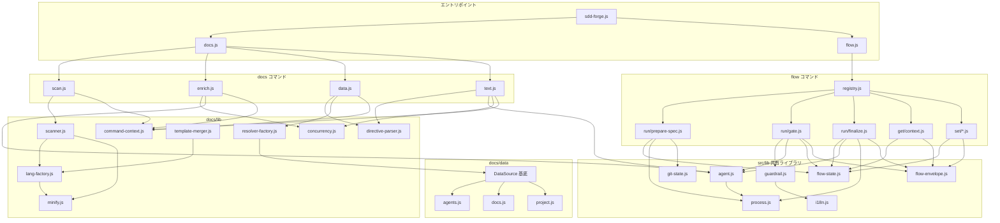

<!-- {{data("base.docs.langSwitcher", {labels: "relative"})}} -->
[English](../internal_design.md) | **日本語**
<!-- {{/data}} -->

# 内部設計

## 説明

<!-- {{text({prompt: "この章の概要を1〜2文で記述してください。プロジェクト構成・モジュール依存の方向・主要な処理フローを踏まえること。"})}} -->

sdd-forge は CLI エントリポイントから docs コマンド群・flow コマンド群・共有ライブラリという三層構造を持ち、上位層が下位ライブラリを単方向に参照する依存方向を維持しています。主要な処理フローはドキュメント生成パイプライン（scan → enrich → data → text）と SDD フローパイプライン（prepare-spec → gate → implement → finalize）の二系統で構成されます。
<!-- {{/text}} -->

## 内容

### プロジェクト構成

<!-- {{text({prompt: "このプロジェクトのディレクトリ構成を tree 形式のコードブロックで記述してください。主要ディレクトリ・ファイルの役割コメントを含めること。ソースコードの実際の構成から生成すること。", mode: "deep"})}} -->

```
src/
├── sdd-forge.js          # メインエントリポイント（サブコマンドディスパッチ）
├── docs.js               # docs サブコマンドのエントリポイント
├── flow.js               # flow サブコマンドのエントリポイント
├── docs/
│   ├── commands/         # docs サブコマンド実装
│   │   ├── scan.js       # ソーススキャン・analysis.json 生成
│   │   ├── enrich.js     # AI エンリッチメント（summary/chapter 付与）
│   │   ├── data.js       # {{data}} ディレクティブ解決
│   │   └── text.js       # {{text}} ディレクティブ AI 生成
│   ├── data/             # DataSource モジュール群（{{data}} の実装）
│   │   ├── agents.js     # AGENTS.md 用データソース
│   │   ├── docs.js       # 章一覧・ナビゲーション・言語切替
│   │   ├── lang.js       # 言語スイッチャーリンク生成
│   │   ├── project.js    # package.json からプロジェクト基本情報
│   │   └── text.js       # テキスト関連データソース（スタブ）
│   └── lib/              # docs 処理ライブラリ
│       ├── analysis-entry.js      # 解析エントリ基底クラスと集計関数
│       ├── analysis-filter.js     # docs.exclude グロブパターンによるフィルタ
│       ├── chapter-resolver.js    # カテゴリ→章マッピング解決
│       ├── command-context.js     # コマンド共通コンテキスト解決・章ファイル一覧
│       ├── concurrency.js         # 並行数制限付き非同期マップ処理
│       ├── data-source-loader.js  # DataSource 動的ロード
│       ├── data-source.js         # DataSource 基底クラス
│       ├── directive-parser.js    # {{data}}/{{text}}/ パーサーと置換
│       ├── forge-prompts.js       # forge コマンド用プロンプト生成
│       ├── lang-factory.js        # 拡張子→言語ハンドラマッピング
│       ├── lang/                  # 言語別パーサー
│       │   ├── js.js              # JS/TS: minify・parse・extractEssential
│       │   ├── php.js             # PHP: minify・parse・extractEssential
│       │   ├── py.js              # Python: minify・extractEssential
│       │   └── yaml.js            # YAML: minify
│       ├── minify.js              # 言語別ミニファイのエントリポイント
│       ├── php-array-parser.js    # PHP 配列構文パーサー・命名変換
│       ├── resolver-factory.js    # プリセットチェーン別リゾルバー生成
│       ├── review-parser.js       # AI レビュー出力の構造化パース
│       ├── scan-source.js         # Scannable ミックスイン
│       ├── scanner.js             # ファイルツリー走査・ハッシュ計算
│       ├── template-merger.js     # プリセット継承チェーンのテンプレートマージ
│       ├── test-env-detection.js  # テスト環境・フレームワーク検出
│       ├── text-prompts.js        # text コマンド用プロンプト組み立て
│       └── toml-parser.js         # 最小 TOML パーサー
├── flow/
│   ├── registry.js       # flow コマンドディスパッチテーブルと前後フック
│   ├── commands/         # フロー高レベルコマンド（複数ステップ統括）
│   │   ├── report.js     # ファイナライズレポート生成
│   │   └── review.js     # AI コードレビューオーケストレーション
│   ├── get/              # フロー状態取得ハンドラ
│   │   ├── check.js      # 前提条件チェック（impl/finalize/dirty/gh）
│   │   ├── context.js    # analysis.json キーワード検索・ファイル読み込み
│   │   ├── guardrail.js  # フェーズ別ガードレール取得
│   │   ├── qa-count.js   # QA 質問カウント取得
│   │   └── resolve-context.js  # フルフローコンテキスト解決
│   ├── run/              # フロー実行ハンドラ
│   │   ├── prepare-spec.js  # スペックディレクトリ・ブランチ初期化
│   │   ├── gate.js          # スペックゲートチェック（構造+ガードレール）
│   │   ├── impl-confirm.js  # 実装前要件確認
│   │   ├── lint.js          # 変更ファイルのリントチェック
│   │   ├── finalize.js      # コミット→マージ→振り返り→クリーンアップ
│   │   ├── retro.js         # 実装差分と要件の AI 比較評価
│   │   └── review.js        # コードレビュー実行（サブプロセス委譲）
│   └── set/              # フロー状態更新ハンドラ
│       ├── metric.js     # メトリクスカウンタ増分
│       ├── note.js       # タイムスタンプ付きノート追記
│       ├── redo.js       # リドゥログ（redolog.json）管理
│       ├── req.js        # 要件ステータス更新
│       ├── request.js    # ユーザーリクエストテキスト保存
│       ├── step.js       # ステップステータス更新
│       └── summary.js    # 要件配列の初期設定
└── lib/                  # 全コマンド共有ライブラリ
    ├── agent.js          # AI エージェント同期・非同期呼び出しラッパー
    ├── agents-md.js      # AGENTS.sdd.md テンプレートロード
    ├── flow-envelope.js  # ok/fail/warn エンベロープと JSON 出力
    ├── flow-state.js     # flow.json・.active-flow の CRUD と状態変更
    ├── git-state.js      # Git ワークツリー状態・ブランチ情報取得
    ├── guardrail.js      # ガードレール定義のロード・フィルタ・マージ
    ├── i18n.js           # ロケールファイルのロードと翻訳関数生成
    ├── include.js        # テンプレートインクルードディレクティブ処理
    ├── json-parse.js     # AI 出力対応の寛容な JSON 修復パーサー
    ├── lint.js           # 変更ファイルのガードレールリントチェック
    ├── multi-select.js   # インタラクティブ多項目選択 UI
    ├── process.js        # spawnSync ラッパー（統一返却形式）
    ├── progress.js       # ANSI プログレスバーとロガー
    └── skills.js         # スキルファイルのデプロイ
```
<!-- {{/text}} -->

### モジュール構成

<!-- {{text({prompt: "主要モジュールの一覧を表形式で記述してください。モジュール名・ファイルパス・責務を含めること。ソースコードの import/require 関係と各ファイルのエクスポートから抽出すること。", mode: "deep"})}} -->

| モジュール名 | ファイルパス | 責務 |
| --- | --- | --- |
| scan | src/docs/commands/scan.js | DataSource 経由でソースを走査し analysis.json を生成・更新 |
| enrich | src/docs/commands/enrich.js | AI バッチ呼び出しで各エントリに summary/detail/chapter/role を付与 |
| data | src/docs/commands/data.js | 章ファイルの `{{data}}` ディレクティブを DataSource メソッドで解決 |
| text | src/docs/commands/text.js | 章ファイルの `{{text}}` ディレクティブを AI バッチで生成・挿入 |
| AgentsSource | src/docs/data/agents.js | SDD テンプレートとプロジェクト概要を AGENTS.md 向けに提供 |
| DocsSource | src/docs/data/docs.js | 章一覧テーブル・prev/next ナビ・言語スイッチャーを提供 |
| LangSource | src/docs/data/lang.js | 多言語ドキュメント間の相対パスリンクを提供 |
| ProjectSource | src/docs/data/project.js | package.json から name/description/version/scripts を提供 |
| DataSource | src/docs/lib/data-source.js | 全 DataSource の基底クラス（説明取得・テーブル生成ヘルパー） |
| directive-parser | src/docs/lib/directive-parser.js | `{{data}}`・`{{text}}`・`` の解析と文字列置換 |
| resolver-factory | src/docs/lib/resolver-factory.js | プリセットチェーン別に DataSource を生成し resolve() インターフェースを提供 |
| template-merger | src/docs/lib/template-merger.js | プリセット継承チェーンのテンプレートを block 単位でマージ |
| scanner | src/docs/lib/scanner.js | ファイルツリー走査・MD5 ハッシュ計算・言語ハンドラディスパッチ |
| minify | src/docs/lib/minify.js | 言語別コードミニファイと extractEssential の統一エントリポイント |
| command-context | src/docs/lib/command-context.js | docs コマンド共通の root/config/agent/docsDir コンテキスト解決 |
| concurrency | src/docs/lib/concurrency.js | 並行数上限付きで非同期ワーカーを実行する mapWithConcurrency |
| lang/js | src/docs/lib/lang/js.js | JS/TS ファイルの minify・parse・extractImports・extractEssential |
| lang/php | src/docs/lib/lang/php.js | PHP ファイルの minify・parse・extractImports・extractEssential |
| lang/py | src/docs/lib/lang/py.js | Python ファイルの minify・extractEssential |
| flow registry | src/flow/registry.js | flow コマンドのディスパッチテーブル・pre/post フック定義 |
| prepare-spec | src/flow/run/prepare-spec.js | スペックディレクトリ・ブランチ・worktree の初期化と flow.json 生成 |
| gate | src/flow/run/gate.js | スペックの構造検証とガードレール AI チェック |
| finalize | src/flow/run/finalize.js | commit→merge→retro→sync→cleanup→report の逐次パイプライン |
| retro | src/flow/run/retro.js | git diff と要件を AI で比較し retro.json に評価結果を保存 |
| flow-state | src/lib/flow-state.js | flow.json/.active-flow の CRUD とステップ・メトリクス・要件の原子的更新 |
| flow-envelope | src/lib/flow-envelope.js | ok/fail/warn エンベロープの生成と JSON 標準出力への書き出し |
| agent | src/lib/agent.js | Claude CLI の同期・非同期呼び出しとリトライ・stdin フォールバック |
| guardrail | src/lib/guardrail.js | ガードレール JSON のロード・フェーズフィルタ・プロジェクトオーバーライドマージ |
| i18n | src/lib/i18n.js | ロケールファイルの三層マージと名前空間付き翻訳関数生成 |
| lint | src/lib/lint.js | 変更ファイルへのガードレールリントパターン検査 |
| git-state | src/lib/git-state.js | ワークツリー汚染検出・ブランチ名・先行コミット数・gh 有無の確認 |
| progress | src/lib/progress.js | ANSI プログレスバーとプレフィックス付きロガーの生成 |
<!-- {{/text}} -->

### モジュール依存関係

<!-- {{text({prompt: "モジュール間の依存関係を mermaid graph で生成してください。ソースコードの import/require を解析し、レイヤー構造と依存方向を示すこと。出力は mermaid コードブロックのみ。", mode: "deep"})}} -->


<!-- {{/text}} -->

### 主要な処理フロー

<!-- {{text({prompt: "代表的なコマンドを実行した際のモジュール間のデータ・制御フローを番号付きステップで説明してください。エントリポイントから最終出力までの流れを含めること。", mode: "deep"})}} -->

`sdd-forge build`（scan → enrich → data → text の全パイプライン）を実行した場合の流れを示します。

1. `sdd-forge.js` がサブコマンド `build` を受け取り、`docs.js` に処理を委譲する。
2. `docs.js` は `command-context.js` の `resolveCommandContext()` を呼び出し、プロジェクトルート・`.sdd-forge/config.json`・AI エージェント設定を含む共通コンテキストを生成する。
3. **scan フェーズ**: `scan.js` が起動し、`resolveMultiChains()` でプリセット継承チェーンを解決する。各プリセットの `data/` ディレクトリから `loadDataSources()` で DataSource インスタンスを動的ロードする。`collectFiles()` がインクルード/エクスクルードグロブパターンに従いソースファイルを列挙し、`lang-factory.js` 経由で言語ハンドラを選択して各ファイルのハッシュ・構造情報を抽出する。既存エントリのハッシュと一致する場合はスキップし、結果を `.sdd-forge/output/analysis.json` に書き込む。
4. **enrich フェーズ**: `enrich.js` が `analysis.json` を読み込み、`collectEntries()` で未エンリッチのエントリを収集する。`splitIntoBatches()` でトークン上限に合わせてバッチ分割し、`mapWithConcurrency()` で並行的に `callAgentAsync()` を呼び出す。AI レスポンスを `repairJson()` でパースし、`mergeEnrichment()` で各エントリに `summary`・`detail`・`chapter`・`role`・`keywords` を付与して `analysis.json` を上書き保存する。
5. **data フェーズ**: `data.js` が `analysis.json` を読み込み、`createResolver()` でプリセットチェーン分の DataSource をインスタンス化してリゾルバーを生成する。`getChapterFiles()` で章ファイル一覧を取得し、各ファイルに対して `resolveDataDirectives()` を実行する。`{{data("preset.source.method")}}` ディレクティブごとに対応する DataSource メソッドを呼び出し、返却された Markdown 文字列をブロックに埋め込み、変更があったファイルのみ書き戻す。
6. **text フェーズ**: `text.js` が各章ファイルの `{{text(...)}}` ディレクティブを `parseDirectives()` で抽出する。`getEnrichedContext()` が enrich 済み analysis から当該章に分類されたエントリを取得してプロンプトコンテキストに付加する。バッチモードでは全ディレクティブを 1 リクエストにまとめ `callAgentAsync()` に渡し、返答の JSON を `applyBatchJsonToFile()` で各ディレクティブ位置に挿入して章ファイルを更新する。
<!-- {{/text}} -->

### 拡張ポイント

<!-- {{text({prompt: "新しいコマンドや機能を追加する際に変更が必要な箇所と、拡張パターンを説明してください。ソースコードのプラグインポイントやディスパッチ登録パターンから導出すること。", mode: "deep"})}} -->

**docs コマンドの追加**
`src/docs/commands/` に新しいコマンドファイルを作成し、`main(ctx)` 関数をエクスポートします。`runIfDirect()` パターンでエントリポイントとしても動作させ、`docs.js` のディスパッチテーブルにサブコマンド名と対応するインポートを追加するだけで登録完了です。

**DataSource の追加**
`DataSource` 基底クラスを継承したクラスを `src/docs/data/` または各プリセットの `data/` ディレクトリに配置します。`data-source-loader.js` がファイル名を元に自動検出してインスタンス化するため、手動登録は不要です。クラスに定義したメソッド名がそのまま `{{data("preset.source.method")}}` ディレクティブのキーになります。

**プリセットの追加**
`src/presets/` 以下に新ディレクトリを作成し、`preset.json`（`parent` で継承元を指定）と `data/`・`templates/<lang>/` を配置します。`resolveChainSafe()` が親チェーンを自動解決するため、DataSource の継承とテンプレートのブロックオーバーライドが既存コードの変更なしに機能します。

**flow サブコマンドの追加**
`src/flow/get/`・`src/flow/set/`・`src/flow/run/` のいずれかに `execute(ctx)` をエクスポートするモジュールを作成します。`src/flow/registry.js` の `FLOW_COMMANDS` オブジェクトに `execute: () => import("./path/to/module.js")` 形式で登録し、必要に応じて `pre`・`post` フックと `helpKey` を追加します。出力は必ず `flow-envelope.js` の `ok()`・`fail()`・`output()` を使い、呼び出し元のスキルが JSON をパースできる形式に揃えます。

**ガードレールの追加**
`.sdd-forge/guardrail.json` にエントリを追記するだけでプロジェクト固有のルールを追加できます。`loadMergedGuardrails()` がプリセット定義とプロジェクト定義を `id` 基準でマージするため、プリセット定義の上書きも同じファイルで行えます。
<!-- {{/text}} -->

---

<!-- {{data("base.docs.nav")}} -->
[← 設定とカスタマイズ](configuration.md)
<!-- {{/data}} -->
