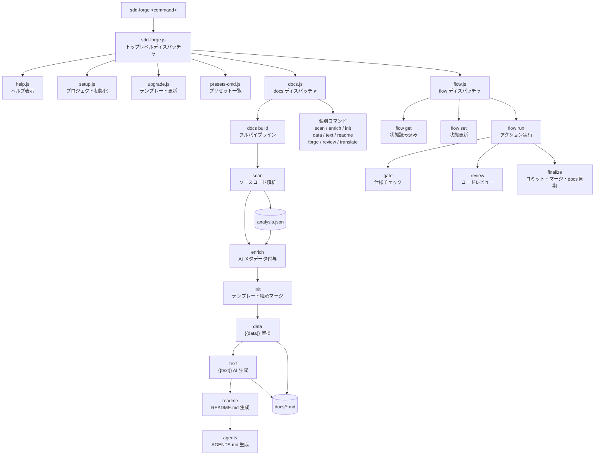

<!-- {{data("base.docs.langSwitcher", {labels: "relative"})}} -->
**日本語** | [English](../overview.md)
<!-- {{/data}} -->

# ツール概要とアーキテクチャ

## 説明

<!-- {{text({prompt: "この章の概要を1〜2文で記述してください。ツールの目的・解決する課題・主要なユースケースを踏まえること。"})}} -->

sdd-forge は、ソースコードの静的解析と AI を組み合わせてドキュメントを自動生成する CLI ツールです。ドキュメントの腐朽化防止と Spec-Driven Development ワークフローによる AI エージェントの行動統制という 2 つの課題を同時に解決します。
<!-- {{/text}} -->

## 内容

### ツールの目的

<!-- {{text({prompt: "このCLIツールが解決する課題と、ターゲットユーザーを説明してください。ソースコードの package.json や README から目的を読み取ること。"})}} -->

従来の開発プロセスでは、ドキュメントが実装と乖離しやすく、AI コーディングエージェントがコンテキスト不足で迷走するという課題がありました。sdd-forge はソースコードを直接解析して常に最新のドキュメントを生成し、仕様書（spec）と機械的な gate チェックによって AI エージェントの実装範囲を統制します。

主なターゲットユーザーは、Claude Code や Codex CLI などの AI コーディングエージェントを活用している開発者・開発チームです。また、レガシーコードベースのドキュメント整備が急務なチームや、Laravel・Next.js・Hono などのフレームワークを使ったプロジェクトで仕様駆動開発を導入したいチームも対象としています。
<!-- {{/text}} -->

### アーキテクチャ概要

<!-- {{text({prompt: "ツール全体のアーキテクチャを mermaid flowchart で図示してください。エントリポイントからサブコマンドへのディスパッチ構造、主要な処理フロー（入力→処理→出力）を含めること。出力は mermaid コードブロックのみ。", mode: "deep"})}} -->


<!-- {{/text}} -->

### 主要コンセプト

<!-- {{text({prompt: "このツールを理解するうえで重要なコンセプト・用語を表形式で説明してください。ソースコードから主要な概念を抽出すること。"})}} -->

| 用語 | 説明 |
|------|------|
| **SDD（Spec-Driven Development）** | 仕様書駆動の開発フロー。spec 作成 → gate チェック → 実装 → レビュー → マージの順で進み、AI の無制限な実装を防止します |
| **preset** | フレームワーク固有のスキャン設定・DataSource・テンプレートをまとめたパッケージ。`parent` チェーンで継承します（例: `base → webapp → php-webapp → laravel`）|
| **directive** | テンプレートファイル内に記述する `{{data}}` および `{{text}}` タグ。それぞれデータ埋め込みと AI テキスト生成の指示を表します |
| **analysis** | `sdd-forge scan` が生成する `analysis.json`。ソースコードのファイル構造・クラス・メソッドを構造化した解析結果です |
| **enrich** | analysis の各エントリーに AI が summary・chapter・role メタデータを付与するフェーズ。全体像を把握した上で個々の要素を分類します |
| **DataSource** | テンプレートの `{{data}}` ディレクティブへデータを提供するクラス。プリセットごとに定義され、analysis から必要な情報を抽出します |
| **flow state** | `.sdd-forge/flow.json` に永続化される SDD フローの進捗・要件・メトリクス。コンテキスト圧縮後の再開にも対応します |
| **gate** | spec の仕様を機械的にチェックするフェーズ。未解決項目や設計原則違反を検出し、PASS / FAIL を判定します |
| **guardrails** | プロジェクトの設計原則を自動検証するルールセット。gate フェーズで確認されます |
| **chapter** | `docs/` 配下の各ドキュメントファイル（例: `overview.md`, `stack_and_ops.md`）。`preset.json` の `chapters` 配列で順序を定義します |
| **docs build** | scan から agents まで全ステップを順に実行するフルパイプラインコマンドです |
<!-- {{/text}} -->

### 典型的な利用フロー

<!-- {{text({prompt: "ユーザーがインストールしてから最初の成果物を得るまでの典型的な手順をステップ形式で説明してください。ソースコードのヘルプ出力やコマンド定義から手順を導出すること。"})}} -->

**ステップ 1: インストール**

```bash
npm install -g sdd-forge
```

**ステップ 2: プロジェクトのセットアップ**

対象プロジェクトのルートディレクトリで `setup` コマンドを実行します。インタラクティブウィザードが起動し、プリセット選択・ドキュメント言語・AI エージェント設定などを入力します。

```bash
cd /path/to/your-project
sdd-forge setup
```

ウィザードが完了すると `.sdd-forge/config.json` と `AGENTS.md`（または `CLAUDE.md`）が生成されます。

**ステップ 3: ドキュメントの生成**

フルパイプラインを実行して `docs/` 配下にドキュメントを生成します。

```bash
sdd-forge docs build
```

内部では scan → enrich → init → data → text → readme → agents の順でステップが実行されます。

**ステップ 4: 成果物の確認**

生成されたドキュメントは `docs/` ディレクトリに配置されます。`README.md` が更新され、`docs/overview.md` などの章ファイルが参照可能になります。

その後、機能追加・修正が必要になったときは SDD フロー（`/sdd-forge.flow-plan`）を使用して仕様書駆動で開発を進めます。
<!-- {{/text}} -->

---

<!-- {{data("base.docs.nav")}} -->
[技術スタックと運用 →](stack_and_ops.md)
<!-- {{/data}} -->
