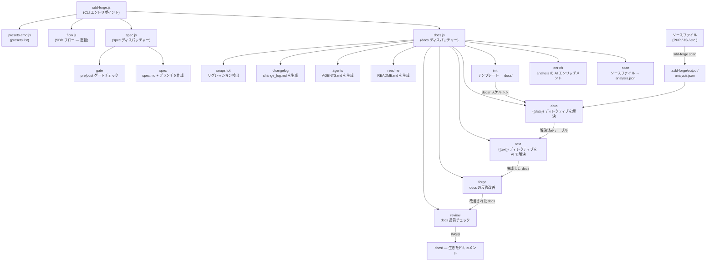

# 01. ツール概要とアーキテクチャ

## 説明

<!-- {{text: Write a 1-2 sentence overview of this chapter. Include the tool's purpose, the problem it solves, and its primary use cases.}} -->

この章では、ソースコード解析からドキュメントを自動生成し、Spec-Driven Development（SDD）ワークフローを提供する CLI ツール `sdd-forge` を紹介します。ツールの核心的な目的、3層ディスパッチアーキテクチャ、基本概念、そしてインストールから実際にドキュメントを生成するまでの典型的な手順を解説します。
<!-- {{/text}} -->

## 内容

### 目的

<!-- {{text: Describe the problem this CLI tool solves and its target users. Derive the purpose from package.json and README.}} -->

ソフトウェアプロジェクトでは、ドキュメントがコードベースと乖離してしまうことが多くあります。一度書かれたドキュメントは、コードが進化するにつれてすぐに忘れ去られてしまいます。`sdd-forge` はこの問題を、ソースファイルの静的解析から直接構造化ドキュメントを生成することで解決します。これにより、ドキュメントは記憶や推測ではなく、実際の実装に基づいた内容を維持できます。

このツールは、非自明なコードベース——特に CakePHP、Laravel、Symfony などのフレームワーク上に構築された PHP Web アプリケーション——を保守する開発者やチームを対象としています。手動でアーキテクチャドキュメントを最新に保つことは多大な労力を要しますが、`sdd-forge` はコントローラ、モデル、エンティティ、マイグレション、その他のソース成果物をスキャンし、開発者が既存のコードを改めて説明することなく、正確な Markdown ドキュメントを生成します。

ドキュメント生成に加えて、`sdd-forge` は Spec-Driven Development の規律を強制します。新しい機能や修正はすべて、実装開始前にゲートチェックを通過しなければならない機械的に検証可能な仕様から始まります。これにより、要件からマージ済みコードまでのトレーサブルなパスが作成され、曖昧さや計画外のスコープ変更を削減します。
<!-- {{/text}} -->

### アーキテクチャ概要

<!-- {{text[mode=deep]: Generate a mermaid flowchart showing the tool's overall architecture. Include the dispatch structure from entry point to subcommands and the main processing flow (input → processing → output). Output only the mermaid code block.}} -->


<!-- {{/text}} -->

### 主要概念

<!-- {{text: Explain the key concepts and terminology needed to understand this tool in table format. Extract the main concepts from source code.}} -->

| 概念 | 説明 |
|---|---|
| `analysis.json` | `sdd-forge scan` が生成する中心的な成果物。ソースファイルから抽出された構造化データ（クラス、メソッド、リレーション、カラム、ファイルメタデータ）を含み、すべての下流コマンドで利用される。 |
| `{{data}}` ディレクティブ | `sdd-forge data` によって解決されるテンプレートプレースホルダー。名前付き DataSource メソッド（例: `controllers.list(...)`）を呼び出し、`analysis.json` から生成された Markdown テーブルでディレクティブブロックを置き換える。 |
| `{{text}}` ディレクティブ | `sdd-forge text` によって解決されるテンプレートプレースホルダー。AI エージェントが周辺のコンテキストと解析データを読み込み、説明的な散文でブロックを埋める。ディレクティブの枠組みは再生成を通じて保持され、本文コンテンツのみが置き換えられる。 |
| DataSource | `scan()` メソッド（ソースファイルから構造化データを抽出）と、そのデータを Markdown 出力としてフォーマットする解決メソッドを組み合わせたクラス。各プリセットは、対象フレームワークの規約に合わせた DataSource を提供する。 |
| プリセット | DataSource、ドキュメント章テンプレート、および特定のフレームワークやプロジェクトタイプ（例: `node-cli`、`symfony`、`cakephp2`）を対象とした `preset.json` マニフェストから構成される自己完結型バンドル。プリセットは実行時に自動的に探索される。 |
| `docs/` | 生成されたドキュメントディレクトリ。章構造はプリセットの `chapters` 配列で定義され、`data` と `text` の解決パスを通じて内容が埋められる。 |
| `spec.md` | `sdd-forge spec --title` で作成される構造化仕様ファイル。SDD ワークフローを駆動し、実装開始前と完了後の両方で `sdd-forge gate` によって検証される。 |
| ゲートチェック | 仕様が完全であること、すべての未解決事項が解消されていること、そして実装後モードでは実際の変更が記述された要件と一致していることを確認する検証ステップ（`sdd-forge gate`）。事前ゲートを通過するまで実装はブロックされる。 |
| Forge | 反復的なドキュメント改善ループ（`sdd-forge forge`）。AI エージェントが現在の `docs/` の内容とソースを比較し、正確性・完全性・一貫性を向上させるためにセクションを書き直す。 |
| SDD フロー | このツールが強制するエンドツーエンドの Spec-Driven Development プロセス: `spec → gate → implement → forge → review`。ガイド付き実行のために `/sdd-flow-start` および `/sdd-flow-close` スキルによってサポートされる。 |
<!-- {{/text}} -->

### 典型的な使用フロー

<!-- {{text: Describe the typical steps from installation to first output in step format. Derive the steps from help output and command definitions in the source code.}} -->

**ステップ 1 — パッケージをインストールする**

```bash
npm install -g sdd-forge
```

**ステップ 2 — プロジェクトを登録する**

プロジェクトルートから `sdd-forge setup` を実行します。これにより `.sdd-forge/config.json` が作成され、フレームワークに適切なプリセットが選択され、AI エージェントにプロジェクトコンテキストを提供する初期 `AGENTS.md` が生成されます。

**ステップ 3 — 完全なビルドパイプラインを実行する**

```bash
sdd-forge build
```

`scan → enrich → init → data → text → readme → agents` という完全なパイプラインを順番に実行し、初回実行で完全に内容が埋まった `docs/` ディレクトリを生成します。

**ステップ 4 — 生成されたドキュメントをレビューする**

`docs/` ディレクトリを開いて生成された Markdown の章を確認します。`sdd-forge review` を実行して自動品質チェックを行い、改善が必要なセクションを特定します。

**ステップ 5 — forge で改善する**

```bash
sdd-forge forge --prompt "Improve the database schema overview"
```

`sdd-forge forge` を使用して特定のセクションを反復的に改善し、すべてのチェックが通過するまで `sdd-forge review` を再実行します。

**ステップ 6 — SDD ワークフローで新機能を開始する**

```bash
sdd-forge spec --title "add-export-command"
sdd-forge gate --spec specs/NNN-add-export-command/spec.md
```

コードを書く前に仕様を作成し、事前ゲートチェックを通過してから機能を実装し、`sdd-forge forge` と `sdd-forge review` でサイクルを締めくくってドキュメントを最新に保ちます。
<!-- {{/text}} -->
