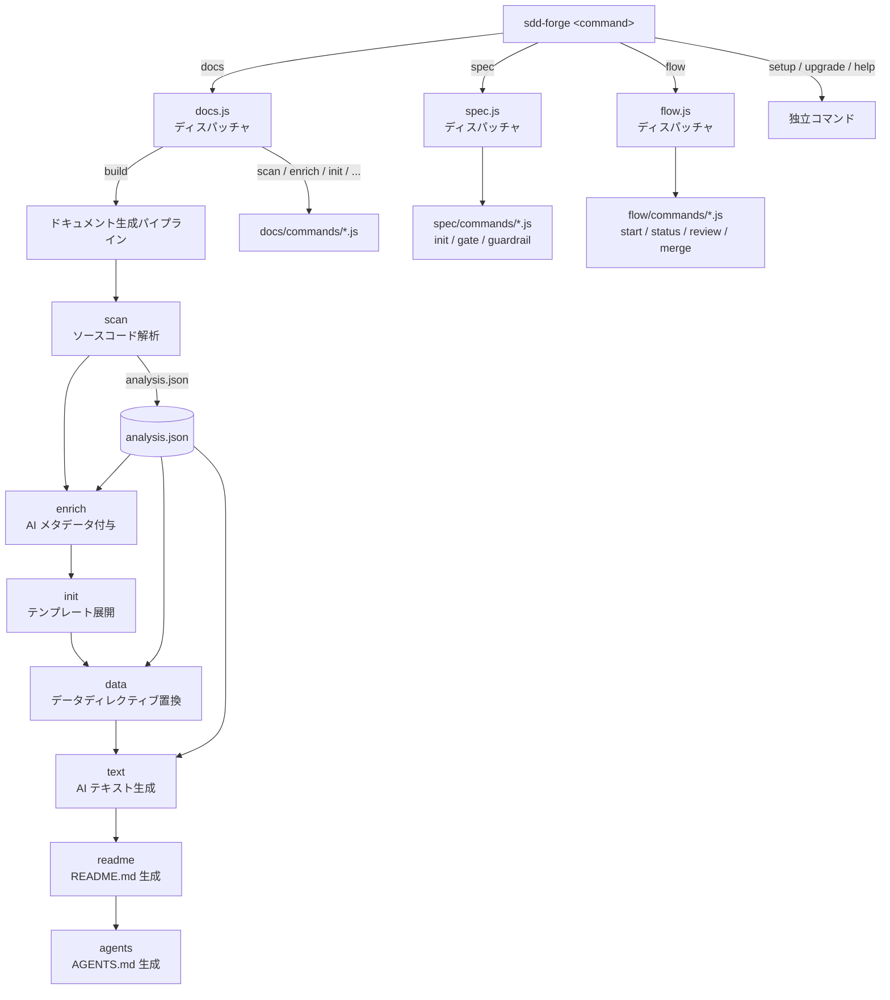

<!-- {{data("base.docs.langSwitcher", {labels: "relative"})}} -->
[English](../overview.md) | **日本語**
<!-- {{/data}} -->

# ツール概要とアーキテクチャ

## 説明

<!-- {{text({prompt: "この章の概要を1〜2文で記述してください。ツールの目的・解決する課題・主要なユースケースを踏まえること。"})}} -->

sdd-forge は、ソースコード解析に基づく技術ドキュメントの自動生成と、仕様駆動開発（Spec-Driven Development）ワークフローを提供する CLI ツールです。ドキュメントとコードの乖離、仕様なき実装、AI エージェントへの文脈共有といった課題を解決し、設計から実装・ドキュメント更新までを一貫したフローで管理します。
<!-- {{/text}} -->

## 内容

### ツールの目的

<!-- {{text({prompt: "このCLIツールが解決する課題と、ターゲットユーザーを説明してください。ソースコードの package.json や README から目的を読み取ること。"})}} -->

ソフトウェアプロジェクトでは、ドキュメントがコードの変更に追従できず陳腐化する問題が頻繁に発生します。また、AI コーディングエージェントを活用する際にプロジェクトの全体像を正確に伝える手段が不足しています。sdd-forge はこれらの課題を解決するために、ソースコードの静的解析からファイル構造・クラス・メソッド・設定・依存関係を自動抽出し、テンプレートに注入して構造化されたドキュメント（`docs/` および `README.md`）を生成します。

さらに、Spec-Driven Development（SDD）フローにより、仕様作成 → ゲートチェック → 実装 → レビュー → ドキュメント更新 → マージという一連の開発サイクルを管理します。仕様のゲートチェックやガードレールといった決定論的な検証を組み込むことで、AI が制御されたスコープ内でのみ作業するように設計されています。

ターゲットユーザーは、AI コーディングエージェント（Claude Code、Codex CLI 等）と協働して開発を行うソフトウェアエンジニアです。特に、レガシーコードベースのオンボーディングや、チーム内でのプロジェクト知識の共有に有効です。
<!-- {{/text}} -->

### アーキテクチャ概要

<!-- {{text({prompt: "ツール全体のアーキテクチャを mermaid flowchart で図示してください。エントリポイントからサブコマンドへのディスパッチ構造、主要な処理フロー（入力→処理→出力）を含めること。出力は mermaid コードブロックのみ。", mode: "deep"})}} -->


<!-- {{/text}} -->

### 主要コンセプト

<!-- {{text({prompt: "このツールを理解するうえで重要なコンセプト・用語を表形式で説明してください。ソースコードから主要な概念を抽出すること。"})}} -->

| 用語 | 説明 |
|---|---|
| **SDD フロー** | Spec-Driven Development の開発フロー。plan（仕様作成）→ implement（実装）→ merge（統合）の3フェーズで構成されます。 |
| **プリセット** | フレームワーク固有のスキャン設定・DataSource・テンプレートをパッケージ化したもの。`parent` フィールドによる単一継承チェーンで構成されます（例: `base → webapp → php-webapp → laravel`）。 |
| **analysis.json** | `sdd-forge docs scan` が生成するソースコード解析結果ファイル。ファイル構造・クラス・メソッド・設定等の情報を保持し、後続のパイプラインステップで参照されます。 |
| **`{{data}}` ディレクティブ** | テンプレート内で analysis データを参照し、テーブル等の構造化データを出力する記法です。scan で機械的に収集できるデータに使用します。 |
| **`{{text}}` ディレクティブ** | テンプレート内で AI にテキスト生成を依頼する記法です。scan で構造的に収集できない情報の説明に使用します。 |
| **スペックゲート** | 仕様書の未解決事項や承認漏れをプログラム的に検証する仕組み。ゲートを通過しなければ実装フェーズに進めません。 |
| **ガードレール** | プロジェクト固有の設計原則を仕様に対してチェックする仕組みです。 |
| **enrich** | scan が収集した analysis エントリーに対し、AI が summary・chapter 分類・role などのメタデータを一括付与するステップです。 |
<!-- {{/text}} -->

### 典型的な利用フロー

<!-- {{text({prompt: "ユーザーがインストールしてから最初の成果物を得るまでの典型的な手順をステップ形式で説明してください。ソースコードのヘルプ出力やコマンド定義から手順を導出すること。"})}} -->

1. **インストール**

   ```
   npm install -g sdd-forge
   ```

   Node.js 18.0.0 以上が必要です。外部依存はありません。

2. **プロジェクトのセットアップ**

   ```
   sdd-forge setup
   ```

   対話形式のウィザードが起動し、プロジェクトタイプ（プリセット）と AI エージェントを設定します。`.sdd-forge/config.json` が生成されます。

3. **ドキュメントの生成**

   ```
   sdd-forge docs build
   ```

   ソースコードのスキャンから README.md の生成まで、パイプライン全体（scan → enrich → init → data → text → readme → agents）を一括実行します。完了すると `docs/` ディレクトリに章ごとの技術ドキュメント、プロジェクトルートに `README.md` が出力されます。

4. **SDD フローで機能を開発する（任意）**

   新機能の開発には SDD フローを使用できます。Claude Code の場合はスキル `/sdd-forge.flow-plan` で仕様作成を開始し、`/sdd-forge.flow-impl` で実装、`/sdd-forge.flow-merge` で統合します。CLI から直接実行する場合は `sdd-forge flow start --request "要望"` を使用します。
<!-- {{/text}} -->

---

<!-- {{data("base.docs.nav")}} -->
[技術スタックと運用 →](stack_and_ops.md)
<!-- {{/data}} -->
