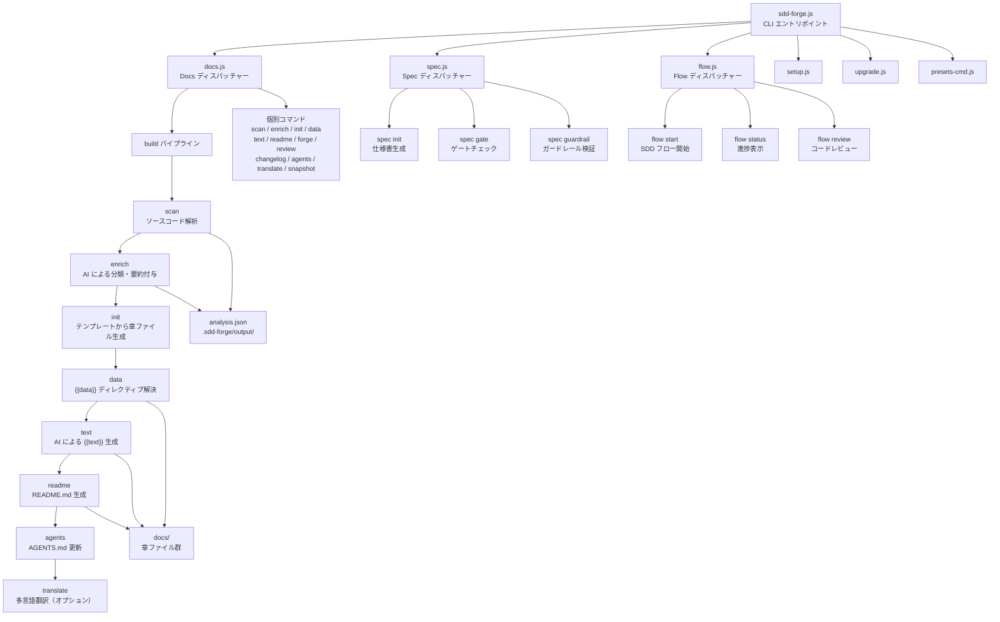

# 01. ツール概要とアーキテクチャ

## 説明

<!-- {{text: この章の概要を1〜2文で記述してください。ツールの目的・解決する課題・主要なユースケースを踏まえること。}} -->

sdd-forge は、ソースコードの静的解析と AI を組み合わせて技術ドキュメントを自動生成する CLI ツールです。プロジェクトの構造変更に追従するドキュメント維持の負担を軽減し、Spec-Driven Development ワークフローによる仕様駆動の開発プロセスを提供します。

<!-- {{/text}} -->

## 内容

### ツールの目的

<!-- {{text: このCLIツールが解決する課題と、ターゲットユーザーを説明してください。ソースコードの package.json や README から目的を読み取ること。}} -->

ソフトウェアプロジェクトでは、コードの成長に伴い技術ドキュメントが実装と乖離する問題が頻繁に発生します。sdd-forge はソースコードを解析し、その結果を元に AI がドキュメントを生成・更新することで、この問題を解決します。

ターゲットユーザーは、Web アプリケーション（CakePHP・Laravel・Symfony）や CLI ツール、ライブラリを開発するエンジニアです。プリセットシステムにより、各フレームワーク固有の構造（コントローラ・モデル・エンティティ・マイグレーション等）を自動認識し、プロジェクトに適したドキュメントを生成します。

外部依存を持たず Node.js 組み込みモジュールのみで動作するため、追加のランタイムやパッケージを必要とせずに導入できます。

<!-- {{/text}} -->

### アーキテクチャ概要

<!-- {{text[mode=deep]: ツール全体のアーキテクチャを mermaid flowchart で図示してください。エントリポイントからサブコマンドへのディスパッチ構造、主要な処理フロー（入力→処理→出力）を含めること。出力は mermaid コードブロックのみ。}} -->



<!-- {{/text}} -->

### 主要コンセプト

<!-- {{text: このツールを理解するうえで重要なコンセプト・用語を表形式で説明してください。ソースコードから主要な概念を抽出すること。}} -->

| コンセプト | 説明 |
|---|---|
| プリセット | プロジェクトの種別（webapp, cli, library）やフレームワーク（CakePHP, Laravel, Symfony）に応じた解析ルールとテンプレートのセット。`src/presets/` に定義される |
| DataSource | ソースコードの解析結果を構造化データとして提供するクラス。`match()` でファイルを選別し、`scan()` で解析、各メソッドで `{{data}}` ディレクティブに応答する |
| ディレクティブ | ドキュメントテンプレート内の `{{data: ...}}` や `{{text: ...}}` タグ。data はデータソースから値を取得し、text は AI がコンテンツを生成する枠を定義する |
| build パイプライン | `scan → enrich → init → data → text → readme → agents → translate` の順に実行される一連のドキュメント生成プロセス |
| enriched analysis | scan で得た解析結果に AI が役割・概要・章分類を付与したもの。`.sdd-forge/output/analysis.json` に保存される |
| SDD フロー | Spec-Driven Development のワークフロー。仕様書の作成（spec init）→ ゲートチェック（spec gate）→ 実装 → レビュー（flow review）の順で進行する |
| 章ファイル | `docs/` 配下のマークダウンファイル。`preset.json` の `chapters` 配列で順序が定義され、ディレクティブを含むテンプレートから生成される |
| i18n | 3 層の国際化機構。UI メッセージ・テンプレート・出力ドキュメントの多言語対応を提供する |

<!-- {{/text}} -->

### 典型的な利用フロー

<!-- {{text: ユーザーがインストールしてから最初の成果物を得るまでの典型的な手順をステップ形式で説明してください。ソースコードのヘルプ出力やコマンド定義から手順を導出すること。}} -->

1. **インストール**: npm から sdd-forge をグローバルまたはプロジェクトローカルにインストールします。
   ```
   npm install -g sdd-forge
   ```

2. **セットアップ**: 対象プロジェクトのルートディレクトリで `sdd-forge setup` を実行します。対話形式でプロジェクト名・種別・ドキュメントの目的・トーン・使用する AI エージェントなどを設定します。`.sdd-forge/config.json` と `AGENTS.md`、`CLAUDE.md` が生成されます。
   ```
   sdd-forge setup
   ```

3. **ドキュメント一括生成**: `sdd-forge docs build` を実行すると、build パイプライン（scan → enrich → init → data → text → readme → agents）が順に実行され、`docs/` ディレクトリに技術ドキュメントが生成されます。
   ```
   sdd-forge docs build
   ```

4. **個別ステップの実行**: 必要に応じて `sdd-forge docs scan` や `sdd-forge docs text` など個別のコマンドを実行し、特定のステップだけを再実行できます。

5. **SDD フローの利用**: 機能追加や修正の際は `sdd-forge flow start --request "要望"` で SDD ワークフローを開始し、仕様書の作成からゲートチェック、実装、レビューまでを体系的に進められます。

<!-- {{/text}} -->
