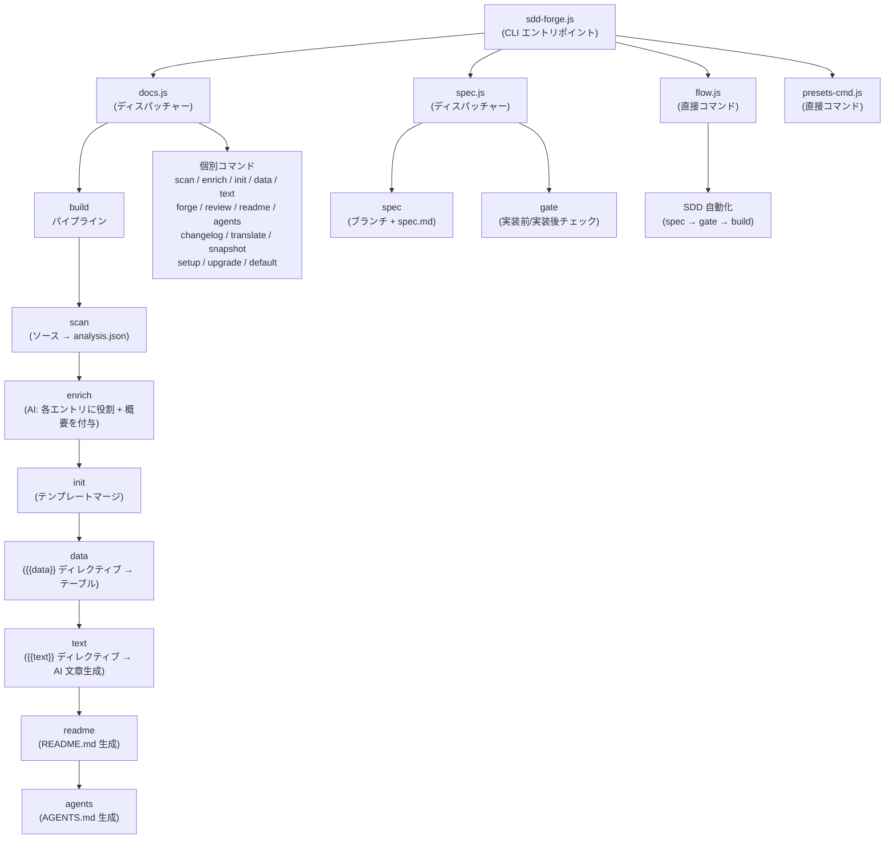

# 01. ツール概要とアーキテクチャ

## 説明

<!-- {{text: Write a 1-2 sentence overview of this chapter. Include the tool's purpose, the problem it solves, and its primary use cases.}} -->

本章では、ソースコードを解析しテンプレート・ディレクティブシステムを通じて構造化されたマークダウンを生成することでプロジェクトドキュメントを自動化する CLI ツール `sdd-forge` について説明します。また、実装を仕様書と整合させるために本ツールが提供する Spec-Driven Development（SDD）ワークフローについても取り上げます。

<!-- {{/text}} -->

## 内容

### 目的

<!-- {{text: Describe the problem this CLI tool solves and its target users. Derive the purpose from package.json and README.}} -->

進化し続けるコードベースに対して正確な技術ドキュメントを維持し続けることは、開発チームにとって絶えず発生するオーバーヘッドです。手動で書かれたドキュメントは実際のソースからすぐに乖離し、新しいコントリビューターのオンボーディングにはプロジェクトのコンテキストを再構築する手作業が繰り返し必要になります。

`sdd-forge` はドキュメントを生成物として扱うことでこの問題を解決します。プロジェクトのソースファイル（コントローラー、モデル、エンティティ、マイグレーションなど）をスキャンし、構造化されたメタデータを抽出し、テンプレート・ディレクティブパイプラインを通じて事前定義されたマークダウンの章にレンダリングします。開発者は各情報がどこに表示されるかを一度定義するだけで、ツールが毎回の実行時に自動的に内容を埋めます。

本ツールは、PHP ウェブアプリケーション（Symfony、CakePHP、Laravel）や Node.js CLI プロジェクトに取り組むバックエンド開発者やテクニカルリードで、手動メンテナンスなしに常に最新のドキュメントを維持したい方を対象としています。SDD ワークフローレイヤーは、実装開始前にスペックレビューゲートを適用したいチームをさらにサポートします。

<!-- {{/text}} -->

### アーキテクチャ概要

<!-- {{text[mode=deep]: Generate a mermaid flowchart showing the tool's overall architecture. Include the dispatch structure from entry point to subcommands and the main processing flow (input → processing → output). Output only the mermaid code block.}} -->



<!-- {{/text}} -->

### 主要コンセプト

<!-- {{text: Explain the key concepts and terminology needed to understand this tool in table format. Extract the main concepts from source code.}} -->

以下のテーブルは、本ツールおよびそのドキュメント全体で使用される中核的なコンセプトを定義しています。

| コンセプト | 説明 |
|---|---|
| **ディレクティブ** | マークダウンテンプレートに埋め込まれたマーカーで、`{{data: source.method("Labels")}}` または `{{text: instruction}}` の形式をとります。ビルドパイプラインは各ディレクティブの内容を生成された出力で置換し、マーカー行自体はそのまま残します。 |
| **DataSource** | 特定カテゴリのソースファイル（コントローラー、エンティティなど）をスキャンし、`{{data}}` ディレクティブ用のマークダウンテーブルを返す resolve メソッドを公開する JavaScript クラスです。 |
| **プリセット** | 特定のプロジェクトタイプに対応する DataSource 定義、章テンプレート、スキャンルールをまとめた名前付き設定バンドル（例: `symfony`、`node-cli`、`cakephp2`）です。プリセットは `preset.json` を通じて自動検出されます。 |
| **analysis.json** | `sdd-forge scan` によって生成される中間 JSON ファイルです。抽出されたすべてのソースメタデータを保存し、後続のすべてのパイプラインステージへの単一の入力として機能します。 |
| **enrich** | AI を活用したパイプラインステージで、`analysis.json` の各エントリに役割、概要、章分類を付与します。これにより、下流の `{{text}}` 生成がよりスマートになります。 |
| **章** | `docs/` 内の単一のマークダウンファイルで、ドキュメントの1セクションに対応します。章の順序は `preset.json` の `chapters` 配列で定義され、`config.json` でプロジェクトごとにオーバーライドできます。 |
| **SDD (Spec-Driven Development)** | 実装開始*前*にフィーチャースペックを作成しゲートチェックでレビューする組み込みワークフローで、コードが仕様書と整合していることを保証します。 |
| **flow-state** | 現在の SDD ワークフローステップを追跡する永続的な状態ファイル（`.sdd-forge/flow-state.json`）で、`flow` コマンドがシェルセッションをまたいで再開できるようにします。 |

<!-- {{/text}} -->

### 典型的な使用フロー

<!-- {{text: Describe the typical steps from installation to first output in step format. Derive the steps from help output and command definitions in the source code.}} -->

以下の手順は、インストールからドキュメント一式の完全な生成までの流れを説明しています。

1. **パッケージをグローバルにインストールします。**
   ```
   npm install -g sdd-forge
   ```

2. **プロジェクトルートで setup を実行します。** `.sdd-forge/config.json` の初期化、プロジェクトタイプに適したプリセットの選択、`docs/` テンプレート構造と `AGENTS.md` の作成が行われます。
   ```
   sdd-forge setup
   ```

3. **ソースコードをスキャンします。** スキャナーがプロジェクトファイルを走査し、メタデータ（クラス、ルート、カラム、リレーションなど）を抽出し、結果を `.sdd-forge/output/analysis.json` に書き出します。
   ```
   sdd-forge scan
   ```

4. **フルビルドパイプラインを実行します。** `scan → enrich → init → data → text → readme → agents` が順に実行され、すべての章ファイルにわたってすべての `{{data}}` および `{{text}}` ディレクティブが埋められます。
   ```
   sdd-forge build
   ```

5. **生成されたドキュメントをレビューします。** マークダウンファイルは `docs/` ディレクトリに書き出されます。ディレクティブブロック内のコンテンツはビルドごとに置換されますが、ディレクティブブロックの*外*に記述したテキストは保持されます。

6. *(オプション)* **ドキュメントを翻訳します。** 多言語出力が設定されている場合、以下を実行します:
   ```
   sdd-forge translate
   ```

7. *(オプション)* **新機能に SDD ワークフローを使用します。** 機能追加や修正を開始する際は、`sdd-forge flow --request "<説明>"` を使用してスペックブランチの作成、仕様書の執筆、ゲートチェックの通過、実装、クロージングゲートによる完了を行います。

<!-- {{/text}} -->
