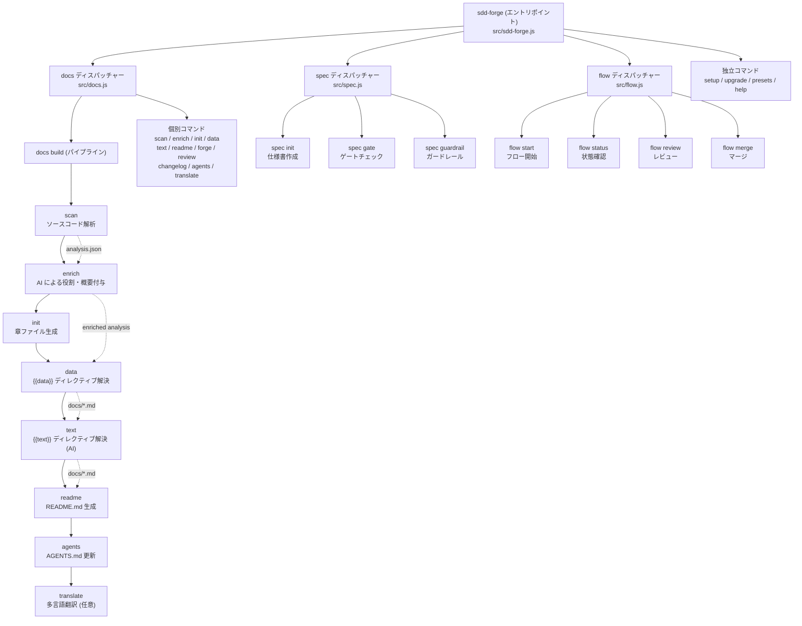

# 01. ツール概要とアーキテクチャ

## 説明

<!-- {{text: この章の概要を1〜2文で記述してください。ツールの目的・解決する課題・主要なユースケースを踏まえること。}} -->

sdd-forge は、ソースコード解析に基づくドキュメント自動生成と Spec-Driven Development（SDD）ワークフローを提供する CLI ツールです。本章では、ツールの目的・アーキテクチャ・主要コンセプト・典型的な利用フローについて説明します。

<!-- {{/text}} -->

## 内容

### ツールの目的

<!-- {{text: このCLIツールが解決する課題と、ターゲットユーザーを説明してください。ソースコードの package.json や README から目的を読み取ること。}} -->

sdd-forge は、ソースコードの静的解析結果と AI を組み合わせて、プロジェクトの設計ドキュメントを自動生成します。手動でのドキュメント作成・維持にかかるコストを削減し、コードと乖離しない最新のドキュメントを維持することを目的としています。

対象ユーザーは、Web アプリケーション（CakePHP 2、Laravel、Symfony）、Node.js CLI / ライブラリ、その他のソフトウェアプロジェクトを開発するエンジニアです。プリセットシステムにより、フレームワーク固有の構造（コントローラ、エンティティ、マイグレーション等）を自動認識し、適切な粒度でドキュメント化します。

また、SDD フロー機能により、仕様書の作成からゲートチェック・実装・レビュー・マージまでの開発ワークフロー全体を一貫して管理できます。

<!-- {{/text}} -->

### アーキテクチャ概要

<!-- {{text[mode=deep]: ツール全体のアーキテクチャを mermaid flowchart で図示してください。エントリポイントからサブコマンドへのディスパッチ構造、主要な処理フロー（入力→処理→出力）を含めること。出力は mermaid コードブロックのみ。}} -->



<!-- {{/text}} -->

### 主要コンセプト

<!-- {{text: このツールを理解するうえで重要なコンセプト・用語を表形式で説明してください。ソースコードから主要な概念を抽出すること。}} -->

| コンセプト | 説明 |
|---|---|
| プリセット | フレームワーク固有のスキャン・データ解決ロジックを提供する設定セット。`base`、`webapp`、`node-cli`、`symfony`、`laravel` 等があり、`parent` チェーンで継承します。 |
| DataSource | `{{data}}` ディレクティブを解決するクラス。`match()` でファイルを選別し、`scan()` で解析、各メソッドでマークダウンテーブル等を出力します。 |
| ディレクティブ | ドキュメントテンプレート内の `{{data: ...}}` および `{{text: ...}}` タグ。`data` は解析結果からの動的データ挿入、`text` は AI による文章生成を行います。 |
| enrich | scan で得た解析結果に対し、AI が役割（role）・概要（summary）・章分類を一括付与するステップです。 |
| SDD フロー | Spec-Driven Development のワークフロー。仕様書作成（spec init）→ ゲートチェック（spec gate）→ 実装 → レビュー → マージの一連の開発プロセスを管理します。 |
| 章（Chapter） | ドキュメントの構成単位。`preset.json` の `chapters` 配列で順序を定義し、各章は独立したマークダウンファイルとして生成されます。 |
| analysis.json | `scan` コマンドが出力するソースコード解析結果ファイル。`.sdd-forge/output/` に保存され、後続のパイプラインステップで参照されます。 |

<!-- {{/text}} -->

### 典型的な利用フロー

<!-- {{text: ユーザーがインストールしてから最初の成果物を得るまでの典型的な手順をステップ形式で説明してください。ソースコードのヘルプ出力やコマンド定義から手順を導出すること。}} -->

1. **インストール**: npm からグローバルインストールします。
   ```
   npm install -g sdd-forge
   ```

2. **プロジェクトセットアップ**: 対象プロジェクトのルートで `setup` を実行します。対話形式で言語・プロジェクト種別・フレームワーク・AI エージェント等を設定し、`.sdd-forge/config.json` が生成されます。
   ```
   sdd-forge setup
   ```

3. **ドキュメント一括生成**: `docs build` を実行すると、scan → enrich → init → data → text → readme → agents の順でパイプラインが自動実行され、`docs/` ディレクトリにドキュメントが生成されます。
   ```
   sdd-forge docs build
   ```

4. **生成結果の確認**: `docs/` 配下に章ごとのマークダウンファイルと `README.md`（目次）が出力されます。

5. **差分更新**: ソースコードの変更後に `docs build` を再実行すると、変更箇所に対応するドキュメントが更新されます。

6. **SDD フローの利用**（任意）: 新機能の追加・修正時に `sdd-forge flow start --request "要望"` で仕様駆動の開発ワークフローを開始できます。

<!-- {{/text}} -->
