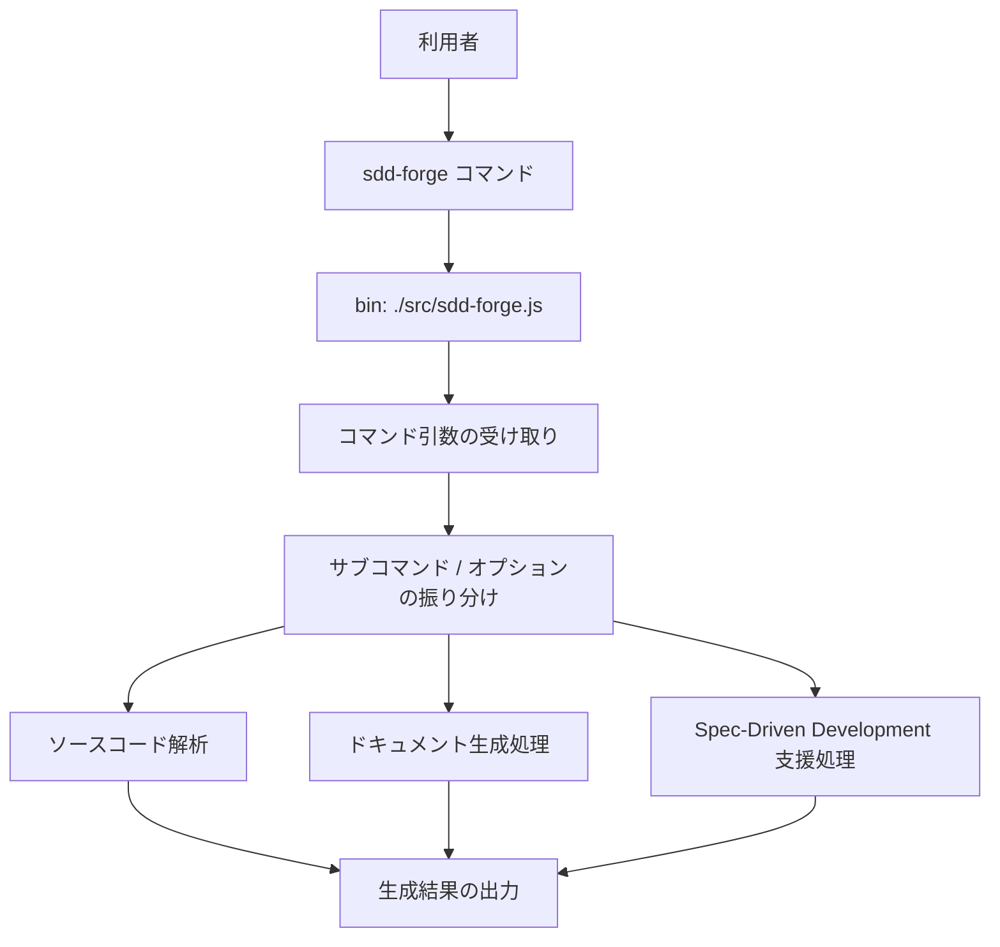

<!-- {{data("base.docs.langSwitcher", {labels: "relative"})}} -->
[English](../overview.md) | **日本語**
<!-- {{/data}} -->

# ツール概要とアーキテクチャ

## 説明

<!-- {{text({prompt: "この章の概要を1〜2文で記述してください。ツールの目的・解決する課題・主要なユースケースを踏まえること。"})}} -->

sdd-forge は、ソースコード解析にもとづくドキュメント自動生成と Spec-Driven Development を支援する CLI ツールです。技術ドキュメント整備や SDD ワークフローをコマンドラインで実行したい利用者に向けて提供されています。
<!-- {{/text}} -->

## 内容

### ツールの目的

<!-- {{text({prompt: "このCLIツールが解決する課題と、ターゲットユーザーを説明してください。ソースコードの package.json や README から目的を読み取ること。"})}} -->

このツールは、ソースコードから技術ドキュメントを生成したい場面と、Spec-Driven Development の作業を CLI で進めたい場面を対象にしています。

`package.json` では説明文に「automated documentation generation」と「Spec-Driven Development tooling」が明記されており、キーワードにも `documentation`、`spec-driven-development`、`source-analysis`、`technical-docs` が設定されています。

そのため、主なターゲットユーザーは、ソースコードをもとにドキュメントを整備したい開発者や、SDD ベースの開発フローを運用したいプロジェクト利用者です。

配布形態は npm パッケージで、CLI として `sdd-forge` コマンドを実行でき、Node.js 18 以上の環境で利用します。
<!-- {{/text}} -->

### アーキテクチャ概要

<!-- {{text({prompt: "ツール全体のアーキテクチャを mermaid flowchart で図示してください。エントリポイントからサブコマンドへのディスパッチ構造、主要な処理フロー（入力→処理→出力）を含めること。出力は mermaid コードブロックのみ。", mode: "deep"})}} -->

<!-- {{/text}} -->

### 主要コンセプト

<!-- {{text({prompt: "このツールを理解するうえで重要なコンセプト・用語を表形式で説明してください。ソースコードから主要な概念を抽出すること。"})}} -->

| 用語 | 説明 |
|---|---|
| `sdd-forge` | npm パッケージ名であり、CLI として実行するコマンド名です。 |
| CLI エントリポイント | `bin` フィールドで `./src/sdd-forge.js` が設定されており、ここからツールが起動します。 |
| Spec-Driven Development | パッケージ説明文とキーワードで示されている主要な用途のひとつです。 |
| ドキュメント自動生成 | パッケージ説明文にある主要機能で、ソースコード解析にもとづく技術ドキュメント生成を指します。 |
| ソースコード解析 | キーワード `source-analysis` に対応する概念で、ドキュメント生成の前提となる処理領域です。 |
| ES Modules | `type: module` により、このパッケージが ES Modules 形式で構成されていることを示します。 |
| Node.js 18 以上 | `engines.node` に `>=18.0.0` が設定されており、実行環境の要件です。 |
| 公開対象ファイル | `files` フィールドでは `src/` のみを公開し、プリセット配下の `tests/` は除外します。 |
<!-- {{/text}} -->

### 典型的な利用フロー

<!-- {{text({prompt: "ユーザーがインストールしてから最初の成果物を得るまでの典型的な手順をステップ形式で説明してください。ソースコードのヘルプ出力やコマンド定義から手順を導出すること。"})}} -->

1. Node.js 18 以上を用意します。`engines` に `>=18.0.0` が設定されています。
2. npm パッケージ `sdd-forge` をインストールします。CLI コマンド名は `sdd-forge` です。
3. インストール後、`sdd-forge` を実行すると、`./src/sdd-forge.js` がエントリポイントとして起動します。
4. 利用者はコマンドラインから入力を与え、ツールはソースコード解析、ドキュメント生成、または Spec-Driven Development 支援の処理を実行します。
5. 最初の成果物として、技術ドキュメントの生成結果、または SDD に関する処理結果を受け取ります。
6. 動作確認や検証が必要な場合は、パッケージに定義された `test`、`test:unit`、`test:e2e`、`test:acceptance` の各スクリプトを利用できます。
<!-- {{/text}} -->

---

<!-- {{data("base.docs.nav")}} -->
[技術スタックと運用 →](stack_and_ops.md)
<!-- {{/data}} -->
