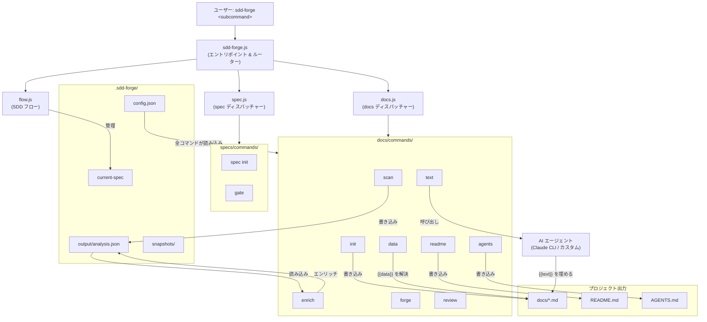

# 01. システム概要

## 説明

<!-- {{text: Write a 1-2 sentence overview of this chapter. Include the project's architecture and whether it integrates with external systems.}} -->

本章では、Spec-Driven Development を通じてドキュメント生成を自動化する Node.js CLI ツール「sdd-forge」のハイレベルアーキテクチャについて説明します。3 層コマンドディスパッチシステムによるビルドパイプラインの制御、コンポーネントとローカルファイルシステムとの連携、および Claude CLI などの外部 AI エージェントとの統合について解説します。
<!-- {{/text}} -->

## 内容

### アーキテクチャ図

<!-- {{text: Generate a mermaid flowchart showing the project architecture. Include data flows between major components. Output only the mermaid code block.}} -->

<!-- {{/text}} -->

### コンポーネントの責務

<!-- {{text[mode=deep]: Describe the major components with their location, responsibilities, and I/O in table format.}} -->

| コンポーネント | 場所 | 責務 | 入力 | 出力 |
|---|---|---|---|---|
| **エントリポイント** | `src/sdd-forge.js` | CLI 引数のパース、プロジェクトコンテキストの解決、ディスパッチャーへのサブコマンドルーティング | 生の `process.argv`、`.sdd-forge/projects.json` | `SDD_SOURCE_ROOT` / `SDD_WORK_ROOT` 環境変数を設定してディスパッチャーに委譲 |
| **docs ディスパッチャー** | `src/docs.js` | docs サブコマンドのルーティング、進捗トラッキングを伴うビルドパイプライン全体のオーケストレーション | サブコマンド名 + 引数 | 個別の `docs/commands/*.js` スクリプトに委譲 |
| **spec ディスパッチャー** | `src/spec.js` | `spec` および `gate` サブコマンドのルーティング | サブコマンド名 + 引数 | `specs/commands/init.js` または `gate.js` に委譲 |
| **フローランナー** | `src/flow.js` | SDD ワークフローのエンドツーエンド自動実行（spec → gate → 実装 → forge → review） | `--request` フラグおよびフロー状態 | `.sdd-forge/current-spec` 状態ファイル、AI エージェント呼び出し |
| **スキャナー** | `src/docs/commands/scan.js` | プリセット設定に従いソースファイルを再帰的にスキャンして構造メタデータを抽出 | `srcRoot` 配下のソースファイル | `.sdd-forge/output/analysis.json` |
| **エンリッチ** | `src/docs/commands/enrich.js` | AI エージェントを呼び出して各 analysis エントリに `summary`、`detail`、`chapter`、`role` フィールドを付与。バッチ再開に対応 | `analysis.json` | エンリッチフィールドをインプレースで追加した更新済み `analysis.json` |
| **Init** | `src/docs/commands/init.js` | プリセットテンプレートを `docs/` にコピーして初期章ファイル構造を作成 | `src/presets/{key}/templates/{lang}/` のプリセットテンプレート | `docs/*.md` 章ファイル |
| **データリゾルバー** | `src/docs/commands/data.js` | `analysis.json` の構造化データを使用して章ファイル内の `{{data}}` ディレクティブを解決 | `docs/*.md`、`analysis.json` | データテーブルを注入した更新済み `docs/*.md` |
| **テキストジェネレーター** | `src/docs/commands/text.js` | ソースコンテキストを渡して AI エージェントを呼び出し `{{text}}` ディレクティブを解決。light モードと deep モードに対応 | `docs/*.md`、ソースファイル、`analysis.json` | AI 生成の本文を挿入した更新済み `docs/*.md` |
| **README ジェネレーター** | `src/docs/commands/readme.js` | 生成済みの章ファイルから `README.md` を組み立て | `docs/*.md` | `README.md` |
| **agents アップデーター** | `src/docs/commands/agents.js` | プリセットテンプレートと `analysis.json` から `AGENTS.md` の SDD セクションおよび PROJECT セクションを再生成 | プリセット AGENTS テンプレート、`analysis.json` | `AGENTS.md`、`CLAUDE.md` シンボリックリンクを作成 |
| **Forge** | `src/docs/commands/forge.js` | AI フィードバックループを使用して既存の `docs/*.md` ファイルを反復改善 | `docs/*.md`、変更概要プロンプト | 更新済み `docs/*.md` |
| **Review** | `src/docs/commands/review.js` | チェックリストに基づいてドキュメント品質を評価し、合否を報告 | `docs/*.md`、レビューチェックリスト | コンソールレポート、構造化された合否結果 |
| **Gate** | `src/specs/commands/gate.js` | 実装前（pre）または実装後（post）に spec ファイルの完全性を検証 | `specs/NNN-xxx/spec.md` | PASS/FAIL コンソールレポート、FAIL 時はフローをブロック |
| **エージェント呼び出し** | `src/lib/agent.js` | 外部 AI CLI 呼び出しをラップ。同期・非同期モード、大容量プロンプト向け stdin フォールバック、タイムアウト管理を処理 | プロンプト文字列、`config.json` からのエージェント設定 | 文字列として返される AI 生成テキスト |
| **設定ローダー** | `src/lib/config.js` | `.sdd-forge/config.json` を読み込んで検証し、sdd-forge が管理する全ファイルのパスを解決 | `.sdd-forge/config.json` | 検証済み設定オブジェクト、解決済みファイルパス |
| **コマンドコンテキスト** | `src/docs/lib/command-context.js` | パイプラインの全コマンドが利用する共有 `CommandContext` オブジェクトを構築 | CLI 引数、環境変数、`config.json` | `root`、`srcRoot`、`config`、`lang`、`agent`、`t()` などを含む `CommandContext` |
| **プリセットシステム** | `src/lib/presets.js` + `src/presets/` | `preset.json` ファイルを自動探索し、プロジェクトタイプをスキャン対象およびテンプレートセットにマッピング | `src/presets/**/preset.json` | `PRESETS` 定数、型エイリアスマップ |
<!-- {{/text}} -->

### 外部連携

<!-- {{text: If there are external system integrations, describe their purpose and connection method in table format.}} -->

| 外部システム | 目的 | 接続方法 | 設定 |
|---|---|---|---|
| **Claude CLI** | `{{text}}` ディレクティブの AI テキスト生成、enrich アノテーション、forge による改善、AGENTS.md の生成 | `execFileSync`（同期）または `spawn`（非同期）で子プロセスとして起動 | `.sdd-forge/config.json` の `providers.claude`：`command`、`args`、オプションの `timeoutMs`、`systemPromptFlag` |
| **カスタム AI エージェント** | Claude の代替として任意の AI CLI ツール（ローカルモデルラッパーなど）を使用可能 | 同じ子プロセス方式。コマンドと引数は完全に設定可能 | `config.json` の `providers.<name>` エントリ。`defaultAgent` でアクティブなプロバイダーを選択 |
| **npm レジストリ** | パッケージ配布。sdd-forge は npmjs.com に `sdd-forge` として公開 | `npm publish` CLI、タグ管理には `npm dist-tag` | `package.json` の `files`、`bin`、`version` フィールド |
| **Git** | SDD フロー中のブランチおよび worktree 管理、コミットおよびマージ操作 | システムの `git` バイナリへの `child_process` 呼び出し | `config.json` の `flow.merge` で設定（`squash` / `ff-only` / `merge`） |

外部連携はすべてオペレーティングシステムのプロセスモデルを通じて実行されます。sdd-forge 自体は **npm の実行時依存関係を持たず**、Node.js の組み込みモジュールのみを使用します。
<!-- {{/text}} -->

### 環境の違い

<!-- {{text: Describe the configuration differences across environments (local/staging/production).}} -->

sdd-forge はローカル開発者向けの CLI ツールであり、従来のステージングやプロダクションのサーバー環境は持ちません。「環境」はプロジェクトのセットアップやオペレーターのコンテキストに対応します。

| コンテキスト | 説明 | 主要設定 |
|---|---|---|
| **シングルプロジェクト（ローカル）** | 開発者がプロジェクトリポジトリ内で直接 sdd-forge を実行する | プロジェクトルートに `.sdd-forge/config.json` が存在。`projects.json` は不要 |
| **マルチプロジェクト（グローバル）** | `--project <name>` を使用して一箇所から複数プロジェクトを管理する | `.sdd-forge/projects.json` に各プロジェクトの `path` と `workRoot` をリスト化。`SDD_WORK_ROOT` / `SDD_SOURCE_ROOT` 環境変数がプロジェクトごとに自動設定される |
| **worktree モード** | 独立した機能開発のために Git worktree 内で SDD フローを実行する | フロー状態は `.sdd-forge/current-spec` に保存。`isInsideWorktree()` による検出でブランチ処理を自動調整 |
| **CI / 非インタラクティブ** | インタラクティブなプロンプトが不要な自動実行（パイプラインなど） | エージェントタイムアウトが適用される（`DEFAULT_AGENT_TIMEOUT_MS` = 120 秒、最大 `LONG_AGENT_TIMEOUT_MS` = 300 秒）。CLI ハング防止のため `CLAUDECODE` 環境変数をクリア |
| **多言語出力** | 複数の出力言語（例：`["en", "ja"]`）で設定されたプロジェクト | `config.json` の `output.languages`、`output.default`、`output.mode`。ビルドパイプラインには `translate` ステップが自動追加される |

`config.json` の `lang` フィールドは、CLI の対話言語および生成される AGENTS.md とスキルファイルの言語を制御します。これはドキュメント出力を管理する `output.languages` とは独立しています。
<!-- {{/text}} -->
