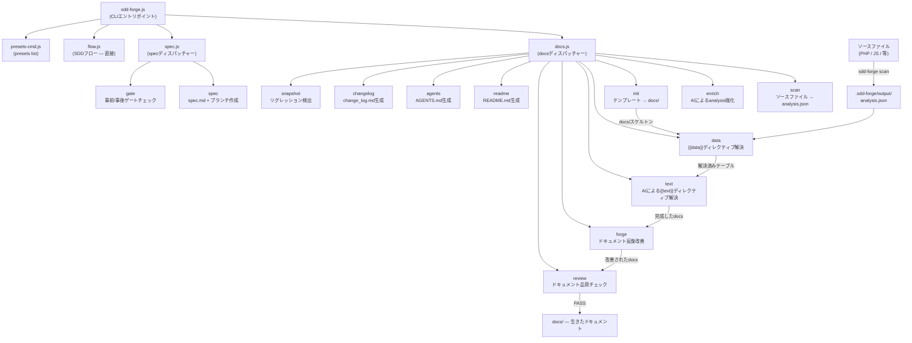

# 01. ツール概要とアーキテクチャ

## 説明

<!-- {{text: Write a 1-2 sentence overview of this chapter. Include the tool's purpose, the problem it solves, and its primary use cases.}} -->

本章では、ソースコード解析からドキュメント生成を自動化し、Spec-Driven Development（SDD）ワークフローを提供するCLIツール `sdd-forge` を紹介します。ツールのコアとなる目的、3層ディスパッチアーキテクチャ、基本概念、およびインストールから動作するドキュメントを得るまでの典型的な手順を説明します。
<!-- {{/text}} -->

## 内容

### 目的

<!-- {{text: Describe the problem this CLI tool solves and its target users. Derive the purpose from package.json and README.}} -->

ソフトウェアプロジェクトでは、コードベースと同期が取れなくなったドキュメントが頻繁に問題となります。一度書かれたドキュメントは、コードが進化するにつれてすぐに忘れ去られてしまいます。`sdd-forge` は、ソースファイルの静的解析から直接構造化されたドキュメントを生成することでこの問題に対処し、記憶や推測ではなく実際の実装に基づいたドキュメントを維持します。

このツールは、CakePHP・Laravel・Symfonyなどのフレームワーク上に構築されたPHP Webアプリケーションを中心とした、非自明なコードベースを管理する開発者やチームを対象としています。アーキテクチャドキュメントを最新に保つには多大な手動作業が必要となる環境で特に効果を発揮します。コントローラー、モデル、エンティティ、マイグレーションなどのソースアーティファクトをスキャンすることで、`sdd-forge` は開発者がコードに既に存在する内容を改めて説明しなくても、正確なMarkdownドキュメントを生成します。

ドキュメント生成を超えて、`sdd-forge` はSpec-Driven Developmentの規律を強制します。新機能や修正はすべて、実装開始前にゲートチェックを通過しなければならない機械検証可能な仕様から始まります。これにより、要件からマージされたコードまでのトレーサブルなパスが生まれ、曖昧さや計画外のスコープ変更が減少します。
<!-- {{/text}} -->

### アーキテクチャ概要

<!-- {{text[mode=deep]: Generate a mermaid flowchart showing the tool's overall architecture. Include the dispatch structure from entry point to subcommands and the main processing flow (input → processing → output). Output only the mermaid code block.}} -->


<!-- {{/text}} -->

### 主要概念

<!-- {{text: Explain the key concepts and terminology needed to understand this tool in table format. Extract the main concepts from source code.}} -->

| 概念 | 説明 |
|---|---|
| `analysis.json` | `sdd-forge scan` が生成する中核アーティファクト。ソースファイルから抽出されたクラス、メソッド、リレーション、カラム、ファイルメタデータなどの構造化データを含み、下流のすべてのコマンドが利用する。 |
| `{{data}}` ディレクティブ | `sdd-forge data` によって解決されるテンプレートプレースホルダー。名前付きDataSourceメソッド（例：`controllers.list(...)`）を呼び出し、`analysis.json` から生成されたMarkdownテーブルでディレクティブブロックを置き換える。 |
| `{{text}}` ディレクティブ | `sdd-forge text` によって解決されるテンプレートプレースホルダー。AIエージェントが周囲のコンテキストと解析データを読み取り、ブロックを説明的な散文で埋める。ディレクティブのフレームは再生成を通じて保持され、本文コンテンツのみが置き換えられる。 |
| DataSource | `scan()` メソッド（ソースファイルから構造化データを抽出）と、そのデータをMarkdown出力としてフォーマットするresolveメソッドをペアで持つクラス。各プリセットはそのフレームワークの規約に合わせたDataSourceを提供する。 |
| プリセット | DataSource、ドキュメントチャプターテンプレート、および特定のフレームワークやプロジェクトタイプ（例：`node-cli`、`symfony`、`cakephp2`）を対象とした `preset.json` マニフェストで構成される自己完結型バンドル。プリセットは実行時に自動探索される。 |
| `docs/` | 生成されたドキュメントディレクトリ。チャプター構造はプリセットの `chapters` 配列で定義され、`data` と `text` の解決パスを通じて内容が埋められる。 |
| `spec.md` | `sdd-forge spec --title` で作成される構造化された仕様ファイル。SDDワークフローを駆動し、実装開始前と完了後の両方で `sdd-forge gate` によって検証される。 |
| ゲートチェック | 仕様が完全であること、すべての未解決の質問が解決されていること、そして事後実装モードでは実際の変更が記述された要件と一致していることを確認する検証ステップ（`sdd-forge gate`）。事前ゲートを通過するまで実装はブロックされる。 |
| Forge | 反復的なドキュメント改善ループ（`sdd-forge forge`）。AIエージェントが現在の `docs/` の内容をソースと比較し、精度・完全性・一貫性を向上させるためにセクションを書き直す。 |
| SDDフロー | このツールが強制するエンドツーエンドのSpec-Driven Developmentプロセス：`spec → gate → implement → forge → review`。ガイド付き実行のための `/sdd-flow-start` と `/sdd-flow-close` スキルによってサポートされる。 |
<!-- {{/text}} -->

### 典型的な使用フロー

<!-- {{text: Describe the typical steps from installation to first output in step format. Derive the steps from help output and command definitions in the source code.}} -->

**ステップ 1 — パッケージをインストールする**

```bash
npm install -g sdd-forge
```

**ステップ 2 — プロジェクトを登録する**

プロジェクトルートから `sdd-forge setup` を実行します。これにより `.sdd-forge/config.json` が作成され、フレームワークに適したプリセットが選択され、AIエージェントにプロジェクトコンテキストを提供する初期 `AGENTS.md` が生成されます。

**ステップ 3 — フルビルドパイプラインを実行する**

```bash
sdd-forge build
```

これにより、`scan → enrich → init → data → text → readme → agents` という完全なパイプラインが順番に実行され、初回実行で完全に内容が埋められた `docs/` ディレクトリが生成されます。

**ステップ 4 — 生成されたドキュメントをレビューする**

`docs/` ディレクトリを開き、生成されたMarkdownチャプターを確認します。`sdd-forge review` を実行して自動品質チェックを行い、改善が必要なセクションを特定します。

**ステップ 5 — forgeで洗練させる**

```bash
sdd-forge forge --prompt "Improve the database schema overview"
```

`sdd-forge forge` を使って特定のセクションを反復的に改善し、すべてのチェックが通過するまで `sdd-forge review` を再実行します。

**ステップ 6 — SDDワークフローで新機能を開始する**

```bash
sdd-forge spec --title "add-export-command"
sdd-forge gate --spec specs/NNN-add-export-command/spec.md
```

コードを書く前に仕様を作成し、事前ゲートチェックを通過させ、機能を実装してから、`sdd-forge forge` と `sdd-forge review` でサイクルを締めくくり、ドキュメントを最新の状態に保ちます。
<!-- {{/text}} -->
