# 01. ツール概要とアーキテクチャ

## Description

<!-- {{text: Write a 1-2 sentence overview of this chapter. Include the tool's purpose, the problem it solves, and its primary use cases.}} -->
この章では、ソースコードを解析して技術ドキュメントの生成を自動化し、Spec-Driven Development（SDD）ワークフローを推進する CLI ツール `sdd-forge` を紹介する。ツールの目的、3層ディスパッチアーキテクチャ、利用前に理解すべきコアコンセプト、およびスタートアップガイドを解説する。
<!-- {{/text}} -->

## Content

### Purpose

<!-- {{text: Describe the problem this CLI tool solves and its target users. Derive the purpose from package.json and README.}} -->
エンジニアリングチームは、コードベースの進化に伴って技術ドキュメントを正確に維持することにしばしば苦労する。手作業で書かれたドキュメントはソースコードから乖離し、陳腐化し、開発者に継続的なメンテナンス負担を課す。

`sdd-forge` は、ソースコード自体をドキュメントの権威ある入力として扱うことでこの問題を解決する。プロジェクトを静的解析し、AI が生成した説明でその結果データを補完し、Markdown テンプレート内の構造化ディレクティブを解決することで、最新の `docs/` コンテンツを自動的に生成する。

ドキュメント生成にとどまらず、このツールは **Spec-Driven Development** の規律を強制する。すべての機能追加・修正はマシン検証済みの仕様書（`spec` / `gate`）から始まり、定義された実装フローを経て、ドキュメントの更新（`forge` / `review`）で終わる。これにより、設計意図・実装・文書の間のサイクルが閉じられる。

主なユーザーは、手動でドキュメントを書いて更新するオーバーヘッドを省きながら、信頼性が高くメンテナンス可能なプロジェクトドキュメントを求めるソフトウェア開発者やチームリードである。このツールは Node.js ≥ 18.0.0 を必要とし、外部ランタイム依存はない。
<!-- {{/text}} -->

### Architecture Overview

```mermaid
flowchart TD
    CLI["sdd-forge (エントリポイント)\nsrc/sdd-forge.js"]

    CLI -->|"build / scan / init / data\ntext / forge / review / readme\nagents / changelog / translate\nsnapshot / setup / upgrade"| DOCS["docs ディスパッチャー\nsrc/docs.js"]
    CLI -->|"spec / gate"| SPEC["spec ディスパッチャー\nsrc/spec.js"]
    CLI -->|"flow"| FLOW["flow\nsrc/flow.js"]
    CLI -->|"help / -h"| HELP["help\nsrc/help.js"]
    CLI -->|"presets"| PRESETS["presets-cmd\nsrc/presets-cmd.js"]

    DOCS -->|"build"| PIPELINE["ビルドパイプライン"]
    DOCS -->|"個別コマンド"| CMD["docs/commands/*.js"]

    PIPELINE --> S1["scan\n(ソース → analysis.json)"]
    S1 --> S2["enrich\n(AI: 役割・概要付与)"]
    S2 --> S3["init\n(テンプレート → docs/)"]
    S3 --> S4["data\n(&#123;&#123;data&#125;&#125; ディレクティブ解決)"]
    S4 --> S5["text\n(AI による &#123;&#123;text&#125;&#125; ディレクティブ解決)"]
    S5 --> S6["readme\n(README.md 生成)"]
    S6 --> S7["agents\n(AGENTS.md 更新)"]
    S7 -->|"多言語設定"| S8["translate\n(言語バリアント生成)"]

    SPEC --> INIT["specs/commands/init.js\n(spec + ブランチ作成)"]
    SPEC --> GATE["specs/commands/gate.js\n(pre / post ゲートチェック)"]

    SRC["ソースコード"] --> S1
    S5 --> Out["docs/ (Markdown 出力)"]
```

<!-- {{text[mode=deep]: Generate a mermaid flowchart showing the tool's overall architecture. Include the dispatch structure from entry point to subcommands and the main processing flow (input → processing → output). Output only the mermaid code block.}} -->

<!-- {{/text}} -->

### Key Concepts

<!-- {{text: Explain the key concepts and terminology needed to understand this tool in table format. Extract the main concepts from source code.}} -->
| コンセプト | 説明 |
|---|---|
| **analysis.json** | `sdd-forge scan` が生成する構造化 JSON。プロジェクトのファイル一覧、モジュールの役割、コード間の関係を記録し、以降のすべてのドキュメント生成ステップへの唯一の入力となる。 |
| **`{{data}}` ディレクティブ** | `sdd-forge data` によって解決される Markdown プレースホルダー。`analysis.json` から直接抽出した構造化データ（コマンド一覧表、ファイルリストなど）で置換される。 |
| **`{{text}}` ディレクティブ** | `sdd-forge text` によって解決される Markdown プレースホルダー。AI エージェントが実行する自然言語指示を含み、テンプレートが定義した固定の構造的境界内で AI が文章を生成する。 |
| **Preset** | 特定のプロジェクトタイプ（例: `cli/node-cli`、`webapp/laravel`）向けのドキュメント構造を定義する、章テンプレートと `preset.json` マニフェストのバンドル。自動探索される。 |
| **CommandContext** | すべてのコマンドが受け取る共有コンテキストオブジェクト（`resolveCommandContext()`）。作業ルート、ソースルート、解析済み設定、解決済み言語、docs ディレクトリ、AI エージェント設定を保持する。 |
| **SDD フロー** | ツールが強制する Spec-Driven Development サイクル: `spec → gate (pre) → 実装 → gate (post) → forge → review`。ゲート PASS の前に実装は開始できない。 |
| **spec / gate** | `sdd-forge spec` はフィーチャーブランチと `spec.md` ファイルを初期化する。`sdd-forge gate` は実装前（pre フェーズ）と実装後（post フェーズ）にチェックリストに対して仕様を検証する。 |
| **forge** | `sdd-forge forge` は実装変更後に現在のソースコードとドキュメントを整合させるため、`docs/` に対して AI による反復改善ループを実行する。 |
| **enrich** | `sdd-forge enrich` は `analysis.json` 全体を AI エージェントに送信し、AI が各エントリーに役割概要と章分類を付与する。これにより後続の `text` 生成により豊富なコンテキストが提供される。 |
| **Agent** | `.sdd-forge/config.json` 内の AI バックエンド設定エントリー。`resolveAgent()` 関数が `text`、`enrich`、`forge`、`review` コマンドに適切なモデルとエンドポイントを選択する。 |
<!-- {{/text}} -->

### Typical Usage Flow

<!-- {{text: Describe the typical steps from installation to first output in step format. Derive the steps from help output and command definitions in the source code.}} -->
**Step 1 — パッケージのインストール**

`sdd-forge` バイナリを `PATH` 上で利用できるよう、npm からグローバルにインストールする:

```bash
npm install -g sdd-forge
```

**Step 2 — プロジェクトの登録**

プロジェクトのリポジトリルートで `setup` を実行する。`.sdd-forge/config.json` ファイルを作成し、プロジェクトを CLI に登録する:

```bash
sdd-forge setup
```

**Step 3 — AI エージェントの設定**

`.sdd-forge/config.json` を開き、`defaultAgent` に定義済みのエージェントエントリー名（例: Claude または互換モデル）を設定する。`text` と `enrich` ステップにはエージェントの設定が必要である。

**Step 4 — ドキュメントのフルビルドを実行**

`scan → enrich → init → data → text → readme → agents` をシーケンシャルに実行するワンコマンドのビルドパイプラインを実行する:

```bash
sdd-forge build --agent <agent-name>
```

生成されたドキュメントはプロジェクトルートの `docs/` ディレクトリに書き出される。

**Step 5 — レビューと改善**

ビルド後、`review` を実行してドキュメントの品質をチェックする。問題が見つかった場合は、直近の変更内容を記述して `forge` を実行し、反復改善を行う:

```bash
sdd-forge review
sdd-forge forge --prompt "Added authentication module"
```

**Step 6 — SDD フローで機能開発を開始**

新機能やバグ修正では、コードを書く前に spec を初期化する:

```bash
sdd-forge spec --title "Add export command"
sdd-forge gate --spec specs/001-add-export-command/spec.md
```

ゲートが PASS を報告した後にのみ実装を行い、`forge` と `review` でサイクルを締めくくる。
<!-- {{/text}} -->
