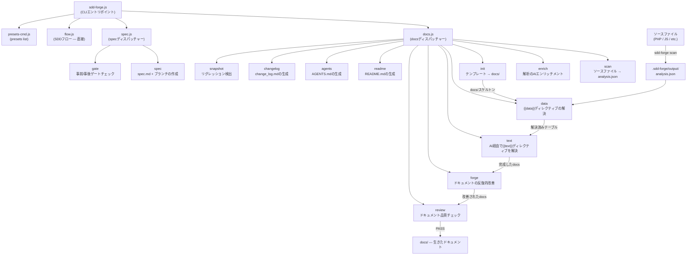

# 01. ツール概要とアーキテクチャ

## 説明

<!-- {{text: Write a 1-2 sentence overview of this chapter. Include the tool's purpose, the problem it solves, and its primary use cases.}} -->

この章では、ソースコード解析からドキュメントを自動生成し、Spec-Driven Development（SDD）ワークフローを提供するCLIツール `sdd-forge` を紹介します。ツールの中心的な目的、3層ディスパッチアーキテクチャ、基本概念、そしてインストールから実際のドキュメント生成までの一般的な手順を説明します。
<!-- {{/text}} -->

## 内容

### 目的

<!-- {{text: Describe the problem this CLI tool solves and its target users. Derive the purpose from package.json and README.}} -->

ソフトウェアプロジェクトでは、コードベースとドキュメントが乖離していく問題が頻繁に発生します — 最初は書かれても、コードの進化とともに忘れられていきます。`sdd-forge` はこの問題を、ソースファイルの静的解析から直接構造化されたドキュメントを生成することで解決し、ドキュメントが記憶や推測ではなく実際の実装に基づいたものであり続けることを保証します。

このツールは、非自明なコードベースを保守する開発者やチームを対象としています — 特にCakePHP、Laravel、Symfonyなどのフレームワーク上に構築されたPHPウェブアプリケーションにおいて、アーキテクチャドキュメントを最新の状態に保つには多大な手作業が必要となるプロジェクトです。コントローラー、モデル、エンティティ、マイグレーション、その他のソース成果物をスキャンすることで、`sdd-forge` は開発者が既存のコードを説明しなくても正確なMarkdownドキュメントを生成します。

ドキュメント生成にとどまらず、`sdd-forge` はSpec-Driven Developmentの規律を強制します：すべての新機能や修正は、実装開始前にゲートチェックを通過する必要がある機械的に検証可能な仕様書から始まります。これにより、要件からマージされたコードまでのトレーサブルなパスが生まれ、曖昧さや計画外のスコープ変更を削減します。
<!-- {{/text}} -->

### アーキテクチャ概要

<!-- {{text[mode=deep]: Generate a mermaid flowchart showing the tool's overall architecture. Include the dispatch structure from entry point to subcommands and the main processing flow (input → processing → output). Output only the mermaid code block.}} -->


<!-- {{/text}} -->

### 主要概念

<!-- {{text: Explain the key concepts and terminology needed to understand this tool in table format. Extract the main concepts from source code.}} -->

| 概念 | 説明 |
|---|---|
| `analysis.json` | `sdd-forge scan` が生成する中心的な成果物。ソースファイルから抽出した構造化データ（クラス、メソッド、リレーション、カラム、ファイルメタデータなど）を含み、すべての下流コマンドから参照される。 |
| `{{data}}` ディレクティブ | `sdd-forge data` によって解決されるテンプレートプレースホルダー。名前付きDataSourceメソッド（例：`controllers.list(...)`）を呼び出し、`analysis.json` から生成されたMarkdownテーブルでディレクティブブロックを置き換える。 |
| `{{text}}` ディレクティブ | `sdd-forge text` によって解決されるテンプレートプレースホルダー。AIエージェントが周辺コンテキストと解析データを読み込み、説明的な文章でブロックを埋める。ディレクティブの枠は再生成の際も保持され、ボディの内容だけが置き換えられる。 |
| DataSource | `scan()` メソッド（ソースファイルから構造化データを抽出）と、そのデータをMarkdown出力としてフォーマットするresolveメソッドをペアで持つクラス。各プリセットはそのフレームワーク固有の規約に合わせたDataSourceを提供する。 |
| プリセット | DataSource、ドキュメント章テンプレート、`preset.json` マニフェストから構成される自己完結型のバンドル。特定のフレームワークやプロジェクトタイプ（例：`node-cli`、`symfony`、`cakephp2`）を対象とし、実行時に自動的に探索される。 |
| `docs/` | 生成されたドキュメントのディレクトリ。章構成はプリセットの `chapters` 配列で定義され、`data` と `text` の解決パスを通じて内容が充填される。 |
| `spec.md` | `sdd-forge spec --title` で作成される構造化仕様書ファイル。SDDワークフローを駆動し、実装開始前と完了後の両方で `sdd-forge gate` によって検証される。 |
| ゲートチェック | 仕様が完成していること、未解決の疑問点がすべて解消されていること、そして（事後実装モードでは）実際の変更が要件に合致していることを確認する検証ステップ（`sdd-forge gate`）。事前ゲートが通過するまで実装はブロックされる。 |
| Forge | 反復的なドキュメント改善ループ（`sdd-forge forge`）。AIエージェントが現在の `docs/` の内容とソースを比較し、精度・完全性・一貫性を向上させるためにセクションを書き直す。 |
| SDDフロー | このツールが強制するエンドツーエンドのSpec-Driven Developmentプロセス：`spec → gate → implement → forge → review`。ガイド付き実行のために `/sdd-flow-start` と `/sdd-flow-close` スキルによってサポートされる。 |
<!-- {{/text}} -->

### 典型的な使用フロー

<!-- {{text: Describe the typical steps from installation to first output in step format. Derive the steps from help output and command definitions in the source code.}} -->

**ステップ 1 — パッケージのインストール**

```bash
npm install -g sdd-forge
```

**ステップ 2 — プロジェクトの登録**

プロジェクトルートから `sdd-forge setup` を実行します。これにより `.sdd-forge/config.json` が作成され、フレームワークに適したプリセットが選択され、AIエージェントにプロジェクトコンテキストを提供する `AGENTS.md` が初期生成されます。

**ステップ 3 — フルビルドパイプラインの実行**

```bash
sdd-forge build
```

`scan → enrich → init → data → text → readme → agents` の完全なパイプラインを順番に実行し、初回実行で内容が充填された `docs/` ディレクトリを生成します。

**ステップ 4 — 生成されたドキュメントのレビュー**

`docs/` ディレクトリを開いて生成されたMarkdown章を確認します。`sdd-forge review` を実行して自動品質チェックを行い、改善が必要なセクションを特定します。

**ステップ 5 — forgeによる改善**

```bash
sdd-forge forge --prompt "Improve the database schema overview"
```

`sdd-forge forge` を使って特定のセクションを反復的に改善し、すべてのチェックが通過するまで `sdd-forge review` を再実行します。

**ステップ 6 — SDDワークフローで新機能を開始**

```bash
sdd-forge spec --title "add-export-command"
sdd-forge gate --spec specs/NNN-add-export-command/spec.md
```

コードを書く前に仕様書を作成し、事前ゲートチェックを通過させ、機能を実装してから、`sdd-forge forge` と `sdd-forge review` でサイクルを閉じてドキュメントを最新の状態に保ちます。
<!-- {{/text}} -->
