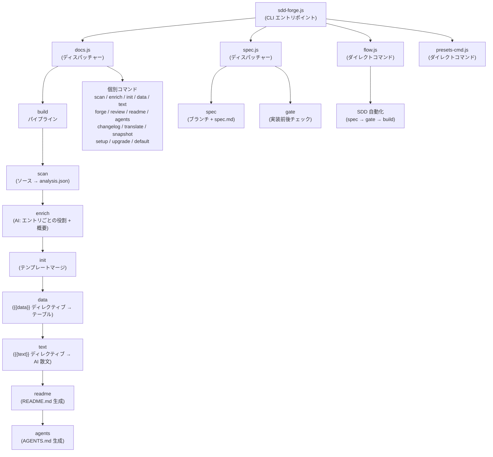

# 01. ツール概要とアーキテクチャ

## 説明

<!-- {{text: Write a 1-2 sentence overview of this chapter. Include the tool's purpose, the problem it solves, and its primary use cases.}} -->

本章では、ソースコードを解析してテンプレートディレクティブシステムを通じた構造化マークダウンを生成することでプロジェクトドキュメントを自動化する CLI ツール `sdd-forge` について説明します。また、実装を記述仕様に沿わせるためのツールが提供する Spec-Driven Development（SDD）ワークフローについても扱います。

<!-- {{/text}} -->

## 内容

### 目的

<!-- {{text: Describe the problem this CLI tool solves and its target users. Derive the purpose from package.json and README.}} -->

進化するコードベースに合わせて正確な技術ドキュメントを維持することは、開発チームにとって継続的なオーバーヘッドです。手作業で書かれたドキュメントは実際のソースコードとすぐに乖離し、新しいコントリビューターのオンボーディングにはプロジェクトコンテキストを再構築するための繰り返しの手作業が必要です。

`sdd-forge` はドキュメントを生成された成果物として扱うことでこの問題を解決します。プロジェクトのソースファイル（コントローラー、モデル、エンティティ、マイグレーションなど）をスキャンして構造化メタデータを抽出し、テンプレートディレクティブパイプラインを通じてそのメタデータをあらかじめ定義されたマークダウン章にレンダリングします。開発者は各情報がどこに現れるかを一度定義するだけで、ツールが実行ごとに内容を自動的に埋めます。

このツールは、PHP ウェブアプリケーション（Symfony、CakePHP、Laravel）および Node.js CLI プロジェクトで作業するバックエンド開発者やテクニカルリードを対象としており、手動メンテナンスなしに生きたドキュメントを実現したい方に向けています。SDD ワークフロー層は、実装開始前に仕様レビューゲートを強制したいチームをさらに支援します。

<!-- {{/text}} -->

### アーキテクチャ概要

<!-- {{text[mode=deep]: Generate a mermaid flowchart showing the tool's overall architecture. Include the dispatch structure from entry point to subcommands and the main processing flow (input → processing → output). Output only the mermaid code block.}} -->



<!-- {{/text}} -->

### 主要概念

<!-- {{text: Explain the key concepts and terminology needed to understand this tool in table format. Extract the main concepts from source code.}} -->

以下の表は、このツールおよびそのドキュメント全体で使用されるコアコンセプトを定義します。

| 概念 | 説明 |
|---|---|
| **ディレクティブ** | マークダウンテンプレートに埋め込まれたマーカーで、`{{data: source.method("Labels")}}` または `{{text: instruction}}` のいずれかです。ビルドパイプラインはマーカー行自体はそのままにしながら、各ディレクティブの内容を生成された出力に置き換えます。 |
| **DataSource** | 特定カテゴリのソースファイル（コントローラー、エンティティなど）をスキャンし、`{{data}}` ディレクティブ用にマークダウンテーブルを返す resolve メソッドを公開する JavaScript クラスです。 |
| **プリセット** | 特定のプロジェクトタイプ向けに DataSource 定義、章テンプレート、スキャンルールをグループ化した名前付き設定バンドル（例: `symfony`、`node-cli`、`cakephp2`）です。プリセットは `preset.json` を通じて自動探索されます。 |
| **analysis.json** | `sdd-forge scan` によって生成される中間 JSON ファイルです。抽出されたすべてのソースメタデータを格納し、以降のすべてのパイプラインステージへの単一入力として機能します。 |
| **enrich** | `analysis.json` の各エントリに役割、概要、および章分類を付与する AI 支援パイプラインステージで、下流での `{{text}}` 生成をより賢くします。 |
| **章** | `docs/` 内の1つのドキュメントセクションに対応する単一のマークダウンファイルです。章の順序は `preset.json` の `chapters` 配列で定義され、`config.json` でプロジェクトごとに上書き可能です。 |
| **SDD（Spec-Driven Development）** | 実装開始前に機能仕様を作成してゲートチェックでレビューする組み込みワークフローで、コードが記述仕様に沿っていることを保証します。 |
| **flow-state** | 現在の SDD ワークフローのステップを追跡する永続化状態ファイル（`.sdd-forge/flow-state.json`）で、`flow` コマンドがシェルセッションをまたいで再開できるようにします。 |

<!-- {{/text}} -->

### 典型的な使用フロー

<!-- {{text: Describe the typical steps from installation to first output in step format. Derive the steps from help output and command definitions in the source code.}} -->

以下のステップは、インストールから完全に生成されたドキュメントセットまでの手順を説明します。

1. **パッケージをグローバルにインストールします。**
   ```
   npm install -g sdd-forge
   ```

2. **プロジェクトルートでセットアップを実行します。** これにより `.sdd-forge/config.json` が初期化され、プロジェクトタイプに適したプリセットが選択され、`docs/` テンプレート構造と `AGENTS.md` が作成されます。
   ```
   sdd-forge setup
   ```

3. **ソースコードをスキャンします。** スキャナーはプロジェクトファイルを走査し、メタデータ（クラス、ルート、カラム、リレーションなど）を抽出して、結果を `.sdd-forge/output/analysis.json` に書き込みます。
   ```
   sdd-forge scan
   ```

4. **完全なビルドパイプラインを実行します。** `scan → enrich → init → data → text → readme → agents` を順番に実行し、すべての章ファイルにわたるすべての `{{data}}` および `{{text}}` ディレクティブを埋めます。
   ```
   sdd-forge build
   ```

5. **生成されたドキュメントを確認します。** マークダウンファイルは `docs/` ディレクトリに書き込まれます。ディレクティブブロック内のコンテンツはビルドごとに置き換えられますが、ディレクティブブロックの*外側*に記述したテキストは保持されます。

6. *（任意）* **ドキュメントを翻訳します。** 多言語出力が設定されている場合は、次を実行します：
   ```
   sdd-forge translate
   ```

7. *（任意）* **新機能に SDD ワークフローを使用します。** 機能や修正を開始する際は、`sdd-forge flow --request "<説明>"` を使用して仕様ブランチを作成し、仕様を記述して、ゲートチェックを通過し、実装してクロージングゲートで完了します。

<!-- {{/text}} -->
