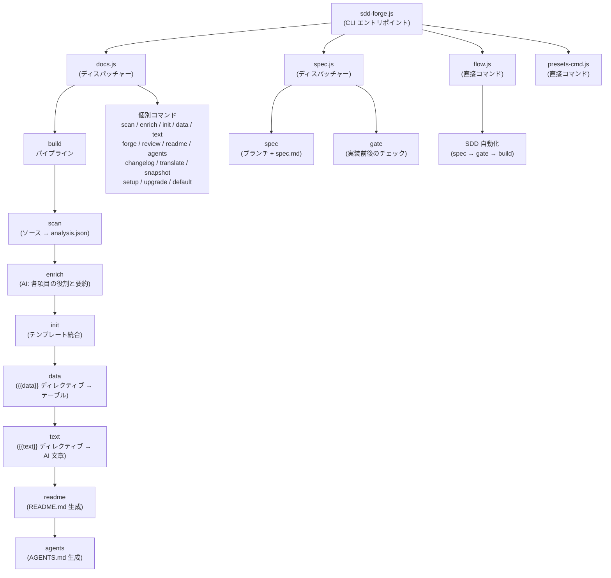

# 01. ツール概要とアーキテクチャ

## 説明

<!-- {{text: Write a 1-2 sentence overview of this chapter. Include the tool's purpose, the problem it solves, and its primary use cases.}} -->

この章では、ソースコードを解析し、テンプレートディレクティブ方式で構造化された Markdown を生成することで、プロジェクト文書を自動化する CLI ツール `sdd-forge` について説明します。あわせて、実装と文書化された仕様の整合を保つためにこのツールが提供する Spec-Driven Development（SDD）ワークフローも扱います。

<!-- {{/text}} -->

## 内容

### 目的

<!-- {{text: Describe the problem this CLI tool solves and its target users. Derive the purpose from package.json and README.}} -->

変化し続けるコードベースに合わせて技術文書を正確に保つことは、開発チームにとって継続的な負担です。手作業で書かれた文書は実際のソースとすぐにずれ、プロジェクトの全体像を新しい参加者に伝えるたびに、同じ説明を繰り返す必要が生じます。

`sdd-forge` は、文書を生成物として扱うことでこの課題に対応します。コントローラー、モデル、エンティティ、マイグレーションなどのソースファイルを走査し、構造化されたメタデータを抽出して、あらかじめ定義された Markdown の各章へテンプレートディレクティブのパイプラインを通じて反映します。開発者は、各情報をどこに出すかを一度定義するだけでよく、実行のたびにツールが内容を自動で埋めます。

このツールは、PHP の Web アプリケーション（Symfony、CakePHP、Laravel）や Node.js の CLI プロジェクトに取り組むバックエンド開発者や技術リードを主な対象としており、手作業で保守しなくても常に最新の文書を保ちたい場合に適しています。さらに SDD ワークフロー層により、実装に着手する前に仕様レビューの関門を設けたいチームも支援します。

<!-- {{/text}} -->

### アーキテクチャ概要

<!-- {{text[mode=deep]: Generate a mermaid flowchart showing the tool's overall architecture. Include the dispatch structure from entry point to subcommands and the main processing flow (input → processing → output). Output only the mermaid code block.}} -->



<!-- {{/text}} -->

### 主要概念

<!-- {{text: Explain the key concepts and terminology needed to understand this tool in table format. Extract the main concepts from source code.}} -->

次の表は、このツールおよびその文書全体で使われる中核概念を定義したものです。

| 概念 | 説明 |
|---|---|
| **Directive** | Markdown テンプレートに埋め込まれるマーカーで、`{{data: source.method("Labels")}}` または `{{text: instruction}}` の形式を取ります。ビルドパイプラインは各ディレクティブの内容を生成結果で置き換えますが、マーカー行自体はそのまま残します。 |
| **DataSource** | 特定の種類のソースファイル（例: controllers、entities）を走査し、`{{data}}` ディレクティブ向けに Markdown テーブルを返す resolve メソッドを提供する JavaScript クラスです。 |
| **Preset** | `symfony`、`node-cli`、`cakephp2` のような名前付き設定セットです。特定のプロジェクト種別に合わせて、DataSource 定義、章テンプレート、走査ルールをまとめたもので、`preset.json` を通じて自動検出されます。 |
| **analysis.json** | `sdd-forge scan` が生成する中間 JSON ファイルです。抽出したすべてのソースメタデータを保持し、以降のすべてのパイプライン段階で唯一の入力となります。 |
| **enrich** | `analysis.json` の各項目に対して、役割、要約、章分類を AI 補助で付与するパイプライン段階です。これにより、後続の `{{text}}` 生成をより適切に行えます。 |
| **Chapter** | `docs/` 内に置かれる 1 つの Markdown ファイルで、文書の 1 セクションに対応します。章の並び順は `preset.json` の `chapters` 配列で定義され、プロジェクトごとに `config.json` で上書きできます。 |
| **SDD (Spec-Driven Development)** | 機能仕様を実装開始前に作成し、ゲートチェックでレビューする組み込みワークフローです。これにより、コードが文書化された仕様から逸れないようにします。 |
| **flow-state** | 現在の SDD ワークフロー段階を追跡する永続状態ファイル（`.sdd-forge/flow-state.json`）です。これにより、`flow` コマンドはシェルセッションをまたいで処理を再開できます。 |

<!-- {{/text}} -->

### 典型的な利用の流れ

<!-- {{text: Describe the typical steps from installation to first output in step format. Derive the steps from help output and command definitions in the source code.}} -->

次の手順は、インストールから文書一式の初回生成までの流れを示しています。

1. **パッケージをグローバルにインストールします。**
   ```
   npm install -g sdd-forge
   ```

2. **プロジェクトルートで setup を実行します。** これにより `.sdd-forge/config.json` が初期化され、プロジェクト種別に適した preset が選ばれ、`docs/` のテンプレート構成と `AGENTS.md` が作成されます。
   ```
   sdd-forge setup
   ```

3. **ソースコードを走査します。** スキャナーがプロジェクト内のファイルをたどり、メタデータ（クラス、ルート、カラム、リレーションなど）を抽出して、その結果を `.sdd-forge/output/analysis.json` に書き出します。
   ```
   sdd-forge scan
   ```

4. **完全な build パイプラインを実行します。** これにより `scan → enrich → init → data → text → readme → agents` が順に実行され、各章ファイル内のすべての `{{data}}` と `{{text}}` ディレクティブが埋められます。
   ```
   sdd-forge build
   ```

5. **生成された文書を確認します。** Markdown ファイルは `docs/` ディレクトリに出力されます。ディレクティブブロック内の内容は build のたびに置き換えられますが、ディレクティブブロックの外側に書いた文章は保持されます。

6. *(任意)* **文書を翻訳します。** 多言語出力が設定されている場合は、次を実行します。
   ```
   sdd-forge translate
   ```

7. *(任意)* **新機能では SDD ワークフローを使います。** 機能追加や修正を始める際は、`sdd-forge flow --request "<description>"` を使って仕様用ブランチを作成し、仕様を書き、ゲートチェックを通過し、実装し、最後に終了ゲートで締めます。

<!-- {{/text}} -->
