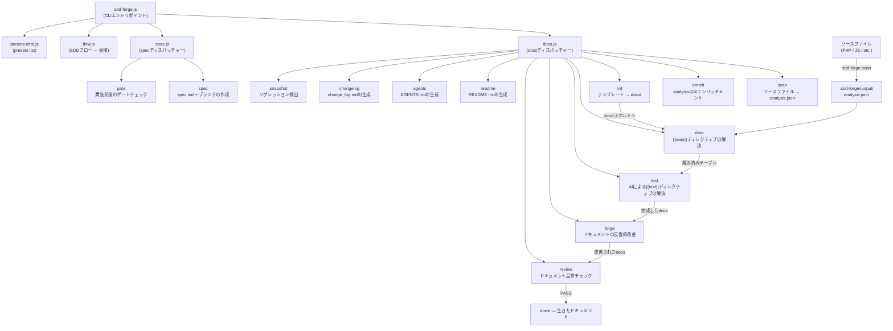

# 01. ツール概要とアーキテクチャ

## 概要

<!-- {{text: Write a 1-2 sentence overview of this chapter. Include the tool's purpose, the problem it solves, and its primary use cases.}} -->

この章では、ソースコード解析からドキュメント生成を自動化し、Spec-Driven Development（SDD）ワークフローを提供するCLIツール `sdd-forge` を紹介します。ツールのコアとなる目的、3層ディスパッチアーキテクチャ、基本的なコンセプト、およびインストールから実際にドキュメントを生成するまでの典型的な手順を説明します。
<!-- {{/text}} -->

## 内容

### 目的

<!-- {{text: Describe the problem this CLI tool solves and its target users. Derive the purpose from package.json and README.}} -->

ソフトウェアプロジェクトでは、コードベースと乖離したドキュメントが問題になりがちです。一度書かれたドキュメントは、コードが進化するにつれてすぐに忘れ去られてしまいます。`sdd-forge` はこの問題に対処するため、ソースファイルの静的解析から構造化されたドキュメントを直接生成し、ドキュメントが記憶や推測ではなく実際の実装に基づき続けることを保証します。

このツールは、非自明なコードベース—特に CakePHP、Laravel、Symfony などのフレームワークで構築された PHP ウェブアプリケーション—を管理する開発者やチームを対象としています。このようなプロジェクトでは、アーキテクチャドキュメントを最新の状態に保つために多大な手動作業が必要になります。コントローラー、モデル、エンティティ、マイグレーション、その他のソース成果物をスキャンすることで、`sdd-forge` は開発者が既存のコードを言葉で説明しなくても、正確な Markdown ドキュメントを生成します。

ドキュメント生成にとどまらず、`sdd-forge` は Spec-Driven Development の規律を強制します。新しい機能や修正はすべて、実装が始まる前にゲートチェックをパスしなければならない機械検証可能な仕様書から始まります。これにより、要件からマージされたコードまでの追跡可能なパスが生まれ、曖昧さや計画外のスコープ変更を減らします。
<!-- {{/text}} -->

### アーキテクチャ概要

<!-- {{text[mode=deep]: Generate a mermaid flowchart showing the tool's overall architecture. Include the dispatch structure from entry point to subcommands and the main processing flow (input → processing → output). Output only the mermaid code block.}} -->


<!-- {{/text}} -->

### 主要コンセプト

<!-- {{text: Explain the key concepts and terminology needed to understand this tool in table format. Extract the main concepts from source code.}} -->

| コンセプト | 説明 |
|---|---|
| `analysis.json` | `sdd-forge scan` によって生成される中心的な成果物。ソースファイルから抽出された構造化データ（クラス、メソッド、リレーション、カラム、ファイルメタデータ）を含み、すべての下流コマンドに利用されます。 |
| `{{data}}` ディレクティブ | `sdd-forge data` によって解決されるテンプレートプレースホルダー。名前付き DataSource メソッド（例: `controllers.list(...)`）を呼び出し、`analysis.json` から生成された Markdown テーブルでディレクティブブロックを置き換えます。 |
| `{{text}}` ディレクティブ | `sdd-forge text` によって解決されるテンプレートプレースホルダー。AI エージェントが周囲のコンテキストと解析データを読み取り、説明的な文章でブロックを埋めます。ディレクティブの枠は再生成をまたいで保持され、本文の内容のみが置き換えられます。 |
| DataSource | `scan()` メソッド（ソースファイルから構造化データを抽出する）と、そのデータを Markdown 出力としてフォーマットする解決メソッドを組み合わせたクラス。各プリセットは対象フレームワークの規約に合わせた DataSource を提供します。 |
| プリセット | DataSource、ドキュメント章テンプレート、および `preset.json` マニフェストで構成される自己完結型のバンドル。特定のフレームワークやプロジェクトタイプ（例: `node-cli`、`symfony`、`cakephp2`）を対象とし、実行時に自動的に探索されます。 |
| `docs/` | 生成されたドキュメントディレクトリ。章構造はプリセットの `chapters` 配列によって定義され、`data` と `text` の解決パスを通じて内容が埋められます。 |
| `spec.md` | `sdd-forge spec --title` によって作成される構造化された仕様書ファイル。SDD ワークフローを推進し、実装開始前と完了後の両方で `sdd-forge gate` によって検証されます。 |
| ゲートチェック | 仕様書が完成しており、すべての未解決の疑問点が解消されていることを確認する検証ステップ（`sdd-forge gate`）。実装後モードでは、実際の変更が記述された要件と整合していることも確認します。プリゲートをパスするまで実装はブロックされます。 |
| Forge | 反復的なドキュメント改善ループ（`sdd-forge forge`）。AI エージェントが現在の `docs/` の内容をソースと比較し、正確性・完全性・一貫性を向上させるためにセクションを書き直します。 |
| SDD フロー | このツールが強制するエンドツーエンドの Spec-Driven Development プロセス: `spec → gate → implement → forge → review`。ガイド付き実行のための `/sdd-flow-start` および `/sdd-flow-close` スキルでサポートされています。 |
<!-- {{/text}} -->

### 典型的な使用フロー

<!-- {{text: Describe the typical steps from installation to first output in step format. Derive the steps from help output and command definitions in the source code.}} -->

**ステップ 1 — パッケージのインストール**

```bash
npm install -g sdd-forge
```

**ステップ 2 — プロジェクトの登録**

プロジェクトルートから `sdd-forge setup` を実行します。これにより `.sdd-forge/config.json` が作成され、フレームワークに適したプリセットが選択され、AI エージェントにプロジェクトのコンテキストを提供する初期 `AGENTS.md` が生成されます。

**ステップ 3 — フルビルドパイプラインの実行**

```bash
sdd-forge build
```

`scan → enrich → init → data → text → readme → agents` の完全なパイプラインを順番に実行し、初回実行時に内容が充実した `docs/` ディレクトリを生成します。

**ステップ 4 — 生成されたドキュメントのレビュー**

`docs/` ディレクトリを開き、生成された Markdown の章を確認します。`sdd-forge review` を実行して自動品質チェックを行い、改善が必要なセクションを特定します。

**ステップ 5 — forge による改善**

```bash
sdd-forge forge --prompt "Improve the database schema overview"
```

`sdd-forge forge` を使って特定のセクションを反復的に改善し、すべてのチェックがパスするまで `sdd-forge review` を再実行します。

**ステップ 6 — SDD ワークフローによる新機能の開始**

```bash
sdd-forge spec --title "add-export-command"
sdd-forge gate --spec specs/NNN-add-export-command/spec.md
```

コードを書く前に仕様書を作成し、プリゲートチェックをパスして機能を実装し、その後 `sdd-forge forge` と `sdd-forge review` でサイクルを完結させてドキュメントを最新の状態に保ちます。
<!-- {{/text}} -->
