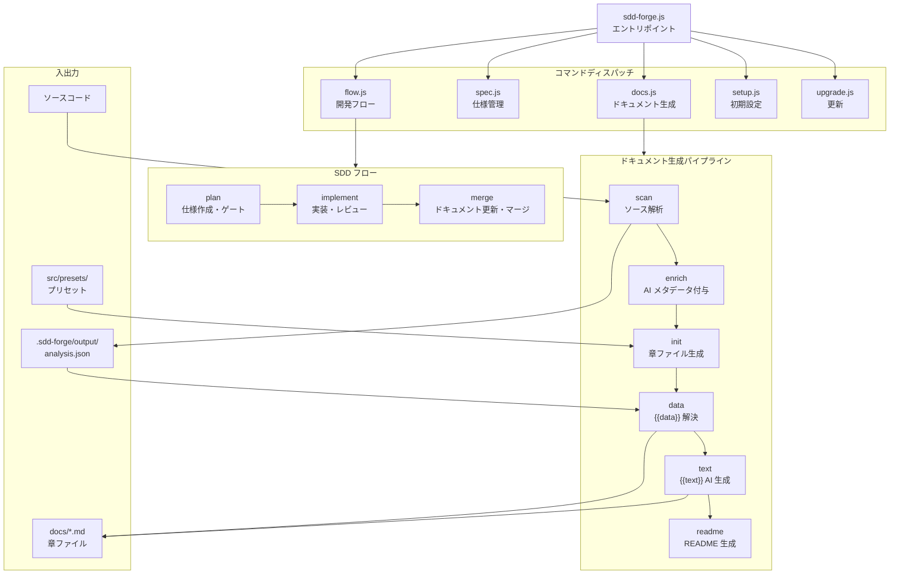

# ツール概要とアーキテクチャ

## 説明

<!-- {{text({prompt: "この章の概要を1〜2文で記述してください。ツールの目的・解決する課題・主要なユースケースを踏まえること。"})}} -->

sdd-forge は、ソースコードの静的解析に基づいて技術ドキュメントを自動生成し、Spec-Driven Development（SDD）ワークフローによって機能開発を構造化する CLI ツールです。ドキュメントとコードの乖離、AI エージェントを用いた開発でのスコープ逸脱といった課題を解決します。

<!-- {{/text}} -->

## 内容

### ツールの目的

<!-- {{text({prompt: "このCLIツールが解決する課題と、ターゲットユーザーを説明してください。ソースコードの package.json や README から目的を読み取ること。"})}} -->

sdd-forge は以下の課題を解決するために設計されています。

**ドキュメントの陳腐化** — 手動で書かれた技術ドキュメントはコードの変更に追従できず、すぐに実態と乖離します。sdd-forge はソースコードを解析し、構造化されたデータをテンプレートに注入することで、常にコードと一致したドキュメントを生成します。

**AI 支援開発の構造化** — AI コーディングエージェントを活用した開発では、仕様の曖昧さによるスコープ逸脱や手戻りが発生しがちです。SDD フローは「計画 → 実装 → マージ」の 3 フェーズで開発を進め、プログラム的なゲートチェックによって品質を担保します。

**ターゲットユーザー** は、Claude Code や Codex CLI などの AI コーディングエージェントを活用する開発チーム、レガシーコードベースのオンボーディングに即座にドキュメントが必要なチーム、そして正確な技術ドキュメントを継続的に維持したいプロジェクトです。

<!-- {{/text}} -->

### アーキテクチャ概要

<!-- {{text({prompt: "ツール全体のアーキテクチャを mermaid flowchart で図示してください。エントリポイントからサブコマンドへのディスパッチ構造、主要な処理フロー（入力→処理→出力）を含めること。出力は mermaid コードブロックのみ。", mode: "deep"})}} -->



<!-- {{/text}} -->

### 主要コンセプト

<!-- {{text({prompt: "このツールを理解するうえで重要なコンセプト・用語を表形式で説明してください。ソースコードから主要な概念を抽出すること。"})}} -->

| コンセプト | 説明 |
|---|---|
| **プリセット** | フレームワーク固有のスキャン設定・データソース・テンプレートをパッケージ化したもの。`parent` フィールドによる単一継承チェーンで構成される（例: `base` → `webapp` → `laravel`）。 |
| **analysis.json** | `scan` コマンドが生成するソースコード解析結果。ファイル、クラス、ルート、設定など構造化されたデータを格納し、後続の全ステージで参照される唯一の情報源。 |
| **`{{data}}` ディレクティブ** | 章ファイル内に記述するマーカー。DataSource クラスが analysis.json から読み取ったデータをマークダウン表として挿入する。 |
| **`{{text}}` ディレクティブ** | 章ファイル内に記述するマーカー。AI がプロンプトに従って散文テキストを生成し挿入する。段落構成の安定性を保つための仕組み。 |
| **DataSource** | `{{data}}` ディレクティブを解決するクラス。`Scannable` ミックスインを適用するとスキャン機能も持つ。プリセット継承チェーンに沿って動的にロードされる。 |
| **SDD フロー** | Spec-Driven Development の 3 フェーズワークフロー（計画・実装・マージ）。仕様書の作成からゲートチェック、コードレビュー、ドキュメント自動更新までを一貫して管理する。 |
| **ゲートチェック** | 仕様書がプログラム的な基準を満たしているか検証するステップ。ゲートを通過しないと実装フェーズに進めない。 |
| **章（Chapter）** | ドキュメントの構成単位。`preset.json` の `chapters` 配列で順序が定義され、`init` コマンドでテンプレートから生成される。 |

<!-- {{/text}} -->

### 典型的な利用フロー

<!-- {{text({prompt: "ユーザーがインストールしてから最初の成果物を得るまでの典型的な手順をステップ形式で説明してください。ソースコードのヘルプ出力やコマンド定義から手順を導出すること。"})}} -->

1. **インストール** — npm からグローバルにインストールします。
   ```
   npm install -g sdd-forge
   ```

2. **プロジェクトの初期設定** — 対象プロジェクトのルートディレクトリで `setup` を実行します。対話形式でプリセット（フレームワーク種別）、言語、AI エージェントの設定を行い、`.sdd-forge/config.json` が生成されます。
   ```
   sdd-forge setup
   ```

3. **ドキュメントの一括生成** — `build` コマンドでソース解析からドキュメント出力までのパイプライン全体を実行します。
   ```
   sdd-forge build
   ```
   内部では `scan` → `enrich` → `init` → `data` → `text` → `readme` → `agents` が順に実行されます。

4. **成果物の確認** — `docs/` ディレクトリに章ファイル群が、プロジェクトルートに `README.md` と `AGENTS.md`（AI エージェント向けコンテキスト）が生成されます。

5. **機能開発（SDD フロー）** — 新機能の開発には SDD フローを使用します。
   ```
   sdd-forge flow --request "機能の説明"
   ```
   仕様作成 → ゲートチェック → 実装 → レビュー → ドキュメント更新 → マージの順で進行します。

<!-- {{/text}} -->

---

<!-- {{data("base.docs.nav")}} -->
[技術スタックと運用 →](stack_and_ops.md)
<!-- {{/data}} -->
